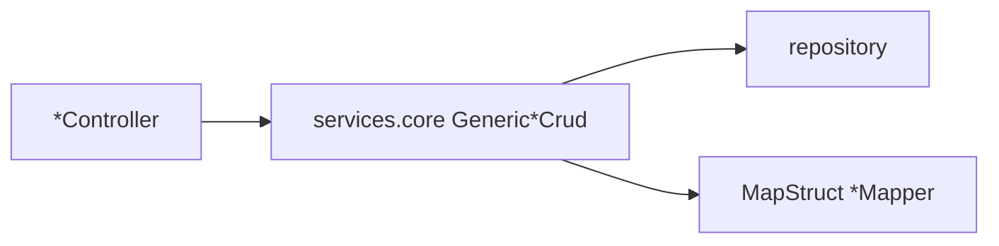
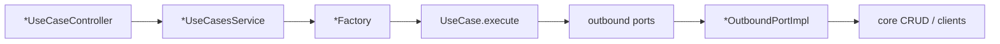

# Architecture

Product-plane DevOps service for the Open Data Mesh Platform. It orchestrates data-product activities and tasks. Java 21, Spring Boot 3.5, one Maven module, base package `org.opendatamesh.platform.pp.devops`.

The intended shape matches [`odm-platform-pp-registry-server`](https://github.com/opendatamesh-initiative/odm-platform-pp-registry-server): anemic CRUD for administration and import, and hexagonal use cases for user stories. This repository currently implements only the first path (the Activity aggregate). Use-case types exist under `utils/usecases/`; no `services/usecases/` slice is in the tree yet.

How to implement either path lives in `spdd/norms/`. This file is the map.

## Two stacks

### Anemic CRUD

Used by admins, or to import values. Endpoints persist and read what they are given. Extra domain checks stay small: field validation and reference reconciliation inside the generic CRUD hooks, not a workflow.

`ActivityController` → `ActivityService` / `ActivityServiceImpl` → `ActivitiesRepository` is the working example. The controller calls `*Resource` methods (`createResource`, `findOneResource`, …) and does not apply business policy.

Service hierarchy (template method). Extend the shallowest type that fits:

| Layer | Interface | Implementation | Adds |
|-------|-----------|----------------|------|
| Entity CRUD | `GenericCrudService` | `GenericCrudServiceImpl` | `validate`, `reconcile`, lifecycle hooks |
| API mapping | `GenericMappedCrudService` | `GenericMappedCrudServiceImpl` | `R` ↔ entity via `toRes` / `toEntity` |
| Filtered list | `GenericMappedAndFilteredCrudService` | `GenericMappedAndFilteredCrudServiceImpl` | filter `F` → JPA `Specification` |

`ActivityService` extends `GenericMappedAndFilteredCrudService<ActivitySearchOptions, ActivityRes, Activity, String>`. Writes run in `TransactionTemplate`. Mapped reads use `TransactionHandler`.

Procedure: [`spdd/norms/GENERIC-CRUD-GUIDELINES.md`](spdd/norms/GENERIC-CRUD-GUIDELINES.md).

### Use cases

Used by users completing a user story. All business logic and domain checks live here: what happens, in which order, and what is forbidden. Persistence, HTTP, and clients stay behind outbound ports.

- The controller maps HTTP onto the use-cases service. No business rules.
- `*UseCasesService` is the only type that converts REST `*Res` to a domain command and maps the presenter result back to a `*ResultRes`.
- The use case is package-private, has no Spring annotations, and implements `UseCase.execute()`.
- The factory is the only `@Component` in that slice. It `new`s plain port implementations. Port classes are not Spring beans.
- The use case does not call `services.core` directly. Port implementations do.

Reference implementation (not in this repo): registry `DataProductUseCaseController`, `DataProductsUseCasesService`, and `dataproduct/services/usecases/init/` (`DataProductInitializer`, command, presenter, factory, ports).

Procedure: [`spdd/norms/USE_CASE_IMPLEMENTATION.md`](spdd/norms/USE_CASE_IMPLEMENTATION.md).

### Choosing

| The change is… | Put it in |
|----------------|-----------|
| Create, read, overwrite, delete, or filtered list with little policy | Anemic CRUD on the aggregate root |
| A user action with rules, ordering, or side effects | A new `services/usecases/<name>/` slice and a `*UseCaseController` |
| Both | Use case for the policy; core CRUD for persistence, reached through a port |

Tasks, logs, and results are parts of the Activity aggregate. They are stored through the activity POST and PUT. They do not have their own controllers.

## Packages

| Path | Role |
|------|------|
| `<aggregate>/entities`, `repositories` | JPA model and Spring Data repositories |
| `<aggregate>/services/core` | Anemic CRUD services |
| `<aggregate>/services/usecases/<name>` | One use case: class, command, presenter, factory, ports (when added) |
| `<aggregate>/services` | `*UseCasesService` for that aggregate (when added) |
| `rest/v2/controllers` | HTTP adapters |
| `rest/v2/resources/<aggregate>` | CRUD DTOs and MapStruct mappers |
| `rest/v2/resources/<aggregate>/usecases/<verb>` | `*CommandRes` / `*ResultRes` (when added) |
| `client/` | Outbound clients. Interfaces are Mockito-mocked in tests (`TestConfig`) |
| `utils/services` | Generic CRUD hierarchy |
| `utils/usecases` | `UseCase`, `TransactionalOutboundPort` |
| `utils/repositories`, `utils/entities`, `utils/client` | Shared repository base, `VersionedEntity`, REST client helpers |
| `exceptions/`, `rest/ResponseExceptionHandler` | `DevOpsApiException` subclasses → HTTP status |
| `configuration/` | Flyway, `RestTemplate` |

First aggregate: **activity**. Do not invent extra sample aggregates.

## Activity today

Root entity `Activity` (`activities`), nested `Task` (`activities_tasks`), `TaskLog`, `TaskResult`. Cascade delete from parent to child. Identifiers are UUID strings. `Activity` extends `VersionedEntity` (`createdAt`, `updatedAt`). Status is `ExecutionStatus` (default `PENDING` when omitted).

HTTP collection: `/api/v2/pp/devops/activities`.

| Method | Behavior |
|--------|----------|
| `POST`, `PUT /{uuid}` | Persist the activity and the nested task graph present in the body. Omitted tasks are not stored. |
| `GET /{uuid}` | Activity plus nested tasks, logs, and results |
| `GET` | Paginated search. The nested graph is not loaded |
| `DELETE /{uuid}` | Delete the activity |

Search filters and sort fields are on `ActivitySearchOptions` and the search operation in `ActivityController`.

Schema: Flyway `src/main/resources/db/migration/postgresql/V1__init_schema.sql`. `hibernate.default_schema` is lowercase only. Later tables go in a new migration; do not extend `V1`.

## Errors and outbound calls

Throw `BadRequestException`, `NotFoundException`, `ResourceConflictException`, `InternalException`, or `NotImplemented`. `ResponseExceptionHandler` maps them to `ErrorRes`.

`NotificationClient` is the outbound notification port. Use-case notification adapters should follow the registry shape when a story needs events. Anemic Activity CRUD does not emit notifications.

## Tests

Failsafe ITs live under `src/test/java/.../rest/v2/`. `DevOpsApplicationIT` and `TestContainerConfig` boot Postgres via Testcontainers. `ActivityControllerIT` covers the activity collection. New use-case routes get a `*UseCaseControllerIT` on the same stack.
