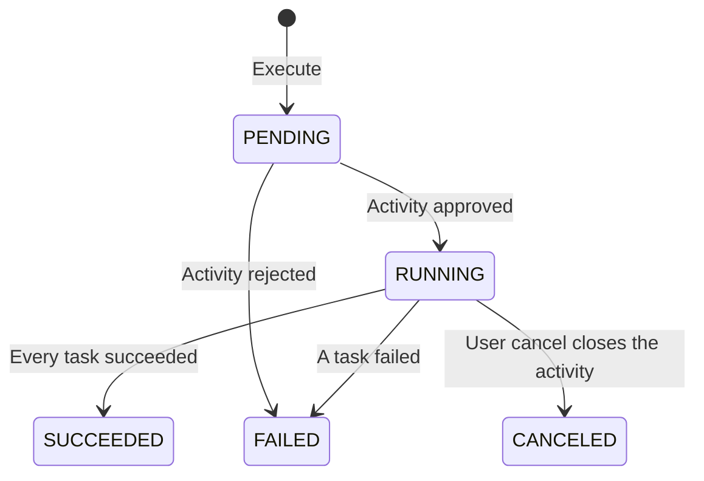

# Activity lifecycle

High-level view of how activities and their tasks are created, approved, and run in DevOps.

Related:

- [Events](events.md) — messages that move an execution along
- [Policy service](policy-service.md) — approval vs auto-approve
- [Configuration](../setup/configuration.md) — Notification, Policy, and executors

## What is an Activity?

An **Activity** is one named step of a data product version. It is the aggregate DevOps stores and runs.

In practice it holds:

- **Identity**: UUID, plus the natural key of data product FQN, version tag, and activity name
- **Place in the version**: `sortOrder` among that version's activities
- **Tasks**: the ordered work of the activity, each with its own logs and results
- **Execution state**: `PENDING`, `RUNNING`, `SUCCEEDED`, `FAILED`, or `CANCELED`

Execute creates the activity and its tasks together. Later calls read it by UUID, or, for the instrumented path, by the natural key while it is still open (`PENDING` or `RUNNING`).

## What is a Task?

A **Task** is one unit of work inside an activity. Tasks run one after another, in `sortOrder`.

It holds:

- **Name** and **sort order** within the activity
- **Executor name**: which configured executor runs it
- **Provider run id**: the pipeline id on that executor, once a run exists
- **Logs and results** collected while the task is running
- **Execution state**: the same five states as an activity

The executor's mode decides who drives the task. **Full control** means DevOps calls the executor. **Instrumented** means the caller drives the task and DevOps records what the caller sends. One activity may contain both.

```text
Activity  (one step of a data product version)
    └── Task 1  (full control or instrumented)
    └── Task 2
    └── …
```

## Execution states

Activities and tasks share the same states:

| State | Meaning |
|-------|---------|
| `PENDING` | Stored, waiting to start. An instrumented task stays here until its execution request is approved. |
| `RUNNING` | In progress. A full-control task is on its executor. An instrumented task is open for logs, results, and a terminal status. |
| `SUCCEEDED` | Finished successfully. |
| `FAILED` | Finished unsuccessfully. For an activity, remaining tasks that had not started are `CANCELED`. |
| `CANCELED` | Stopped before completion. A user cancel sets every task that has not started to `CANCELED`. |

## Lifecycle overview

DevOps treats execution as an **async approval flow**. The execute call stores the activity and asks for approval. It does not wait for the tasks to finish.

1. A caller **executes** an activity → the activity and its tasks are stored as `PENDING`, and DevOps emits activity execution requested.
2. Policy, or DevOps auto-approve while Policy is inactive, responds with approved or rejected.
3. Approval starts the activity (`RUNNING`). Rejection fails it (`FAILED`). A refusal is a failed execution, and it is separate from a user cancel.
4. Tasks then run in order. DevOps asks for the next task when that task is **full control**. The caller asks for the next task when it is **instrumented**.
5. When every task succeeds, the activity succeeds. The first task that fails fails the activity.

```text
Execute
   │
   ▼
PENDING  +  activity execution requested
   │
   ▼
Policy or auto-approve
   │
   ├──► RUNNING, then tasks in sort order
   │         ├── every task succeeded  →  SUCCEEDED
   │         ├── a task failed         →  FAILED
   │         └── user cancel           →  CANCELED (or the outcome the running task already reached)
   └──► FAILED
```

While Notification is inactive, that loop does not close and the activity stays `PENDING`. Details: [Events](events.md), [Policy service](policy-service.md).

## Full control

The user interface (or any caller) asks DevOps to execute a named activity. DevOps creates that activity and its tasks as `PENDING`, then asks for the activity to be approved. After the activity is `RUNNING`, DevOps asks for each full-control task to be approved, one at a time, in `sortOrder`.

For each approved full-control task, DevOps:

1. Starts the run on the executor named for that task
2. Follows the run until it ends
3. Keeps the log

DevOps polls a running full-control task until it ends. It moves on to the next task only after the current one has finished.



## Instrumented

The caller sends the activity and its tasks through the same execute call. DevOps stores them and asks for the activity to be approved. It does not call an executor for an instrumented task.

The caller then:

1. Polls the activity until it is `RUNNING` or `FAILED`
2. Asks to run an instrumented task only when it is the next `PENDING` task and no other task is `RUNNING`, and sends the provider run id of that pipeline
3. Polls that task by name until it is `RUNNING` or `FAILED`
4. Sends logs and results while it is `RUNNING`
5. Sends a terminal status (`SUCCEEDED`, `FAILED`, or `CANCELED`)

Those later calls address the open activity by **data product FQN**, **version tag**, and **activity name**. DevOps looks up the single activity in `PENDING` or `RUNNING` with that key.

Task execution requested is the same message for both modes. DevOps emits it when the next task is full control, and when the caller asks to run an instrumented task.

## Mixed activities

An activity may contain both kinds of task. After a task finishes, DevOps advances:

| Next pending task | Who asks for it |
|-------------------|-----------------|
| Full control | DevOps, as soon as the previous task has finished |
| Instrumented | The caller, when it is ready to run that pipeline |

DevOps leaves an instrumented task `PENDING` until the caller requests it. The caller leaves a full-control task to DevOps.

## Task order

DevOps runs tasks strictly in `sortOrder`. A request to run a task is accepted only when that task is the first `PENDING` task and no other task is `RUNNING`.

Policy enforces order for **activities**. It does not enforce order for **tasks**. Task order is a DevOps rule, and the error names the task that is in the way so the caller can report it.

## How callers identify an activity

| Call | Identity |
|------|----------|
| Execute | The body creates the activity |
| Cancel | Activity UUID |
| Request task execution, record logs, record terminal status | Data product FQN, version tag, activity name, and task name |
| Record results | Activity UUID, or the natural key above |

Record results accepts either identity because both full-control and instrumented tasks store results. The natural-key lookup is limited to the open activity (`PENDING` or `RUNNING`).

Read and search by UUID remain available for any stored activity. Exact paths live under `/api/v2/pp/devops/activities` (see Swagger UI).

## Cancel

A user can cancel an activity that is still `PENDING` or `RUNNING`. The call returns when the activity itself is `SUCCEEDED`, `FAILED`, or `CANCELED`.

| Situation | What happens |
|-----------|----------------|
| Task has not started | Set to `CANCELED` |
| Running full-control task | DevOps asks the executor to stop. If the provider run id is not known yet, the call waits up to five minutes for it. When the id is still missing after that wait, cancel fails and the activity can stay `RUNNING`. A pipeline that has already finished keeps that result. |
| Running instrumented task | Left `RUNNING`. The caller records the terminal status, and that status closes the task. Cancel returns after the activity reaches a terminal state. |
| Policy refusal | The activity `FAILED`. This path is separate from a user cancel. |

When a running task is instrumented, the terminal status is the single writer of that task. Cancel waits and reads.

## Key rules

- Execute stores the activity and its tasks as `PENDING` and requests approval. It does not run the tasks inline.
- Approval starts the activity. Rejection fails it.
- Tasks run in `sortOrder`. Only the first `PENDING` task can be requested, and only while no other task is `RUNNING`.
- DevOps requests the next task only when it is full control.
- The caller requests an instrumented task, then sends logs, results, and a terminal status.
- The first failed task fails the activity and cancels every task that has not started.
- A user cancel closes tasks that have not started, asks a running full-control task to stop, and waits for a running instrumented task's terminal status.
- Secrets never appear in stored results or in events. Executor parameters and pipeline parameters do.

Messages: [Events](events.md). Who approves: [Policy service](policy-service.md). Executor addresses, polling, and secrets: [Configuration](../setup/configuration.md).
