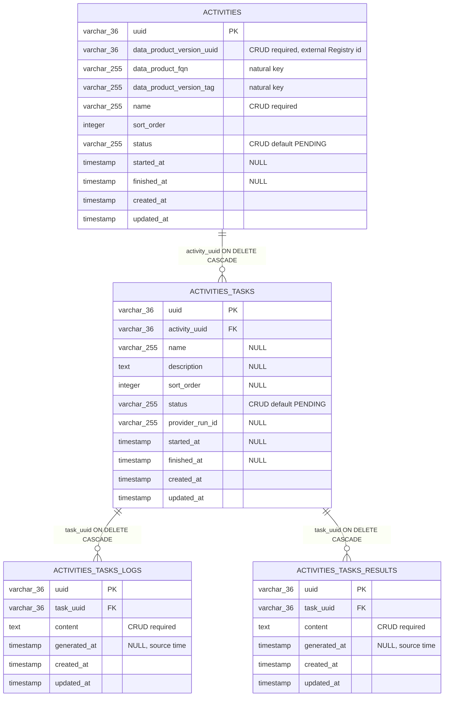

# SPDD Analysis: Anemic CRUD for Activity and Task

Story **BDMD-5436** (epic **BDMD-5097**). This increment adds the Activity aggregate: domain model, invariants, Flyway, and CRUD HTTP. Process, orchestration, and use cases are later stories.

The service is a greenfield v2 Spring Boot application. This is the first domain feature. The model follows the DevOps 2.0 design and this repository’s stack (generic filtered CRUD, nested owned entities, UUID identity, paginated resources, no Lombok).

## Original Business Requirement

**Ticket:** BDMD-5436 — *[DevOps 2.0] Anemic CRUD for Activity and Task*
**Epic:** BDMD-5097

Implement the **anemic** persistence and HTTP layer for Activity and Task: the domain model, its invariants, Flyway migrations, and CRUD endpoints. Do **not** add use cases, and do **not** analyse or implement the execution process (start/stop, executors, notifications, descriptor-driven planning).

**Design (this story):** Activity is the **root aggregate** and the only HTTP resource. It belongs to a Data Product Version (identifiers only; Registry is not called). Inside the aggregate: Task is owned by Activity; Logs and Results are owned by Task. There is no Task controller and no task collection. Creating, changing, or removing a task is done by POST or PUT of the activity, and that body is stored as received. Outside the aggregate: an external Pipeline (defined in a YAML workflow, referenced from the data-product descriptor as a task definition) and an external Pipeline Run, which a Task may point at by `provider_run_id`.

**Statuses:** Activity and Task use the same closed set: `PENDING` → `RUNNING` → `SUCCEEDED` | `FAILED` | `CANCELLED`. Default on create is `PENDING`. Task outcomes later inform Activity outcomes (process); this story only stores the vocabulary, it does not run that state machine. `SKIPPED` and `TIMEOUT` are still under evaluation and are **not** in the closed set until decided.

The descriptor defines activities and tasks as JSON objects. Definition order must be preserved in the database so the first defined item stays on top in the UI. A later execute use case creates tasks (not a plan step) and, on re-run, creates a new task with the same descriptive data and a new provider run, status, logs, and results. Past runs stay inspectable by task UUID inside the activity. Log and result order comes from the source timestamp. This story does not poll providers. A later use case may fetch a task log once, when the task has reached a terminal status. Uniqueness and “delete only in a terminal status” are use-case rules, not anemic CRUD.

---

## Domain Concept Identification

### Existing Concepts (from codebase)

- **DevOps server (this repository):** Greenfield v2 Spring Boot service. Shared infrastructure only: generic CRUD template-method services, hexagonal use-case ports (unused here), exception hierarchy (`BadRequestException`, `NotFoundException`, `ResourceConflictException`, `InternalException`), Flyway schema `odm_devops`, Testcontainers ITs. No Activity, Task, log, or result types, tables, or REST resources. Flyway `V1` is a placeholder.
- **Generic filtered CRUD:** HTTP adapters call mapped resource methods; services extend the filtered+mapped generic CRUD layer; repositories expose specification helpers; lists are paginated. Norm: `spdd/norms/GENERIC-CRUD-GUIDELINES.md`.
- **Nested owned entities (product-plane pattern):** A root owns nested records with cascade and orphan removal. Nested parts are not their own roots. This is the pattern for Task, Logs, and Results under Activity.
- **Audit timestamps (`VersionedEntity` / `VersionedRes`):** Shared created/updated timestamps. Distinct from execution timestamps (`startedAt`, `finishedAt`) and from source timestamps (`generatedAt` on logs and results).
- **Notification client:** Present; unused in this story.
- **Registry Data Product Version (external):** Registry owns DPV identity. The version’s technical identity is a generated UUID. Its natural key on the version lifecycle event is the data product **FQN** plus the version **tag**. Those coordinates are unique only while that row exists; delete and recreate mints a new UUID and can reuse the FQN and tag. DevOps stores a reference. There is no foreign key into Registry and no existence check in this story.

### New Concepts Required

- **Activity (root aggregate):** Consistency boundary for one execution of a named descriptor activity on a data product version. Owns Tasks and, through them, Logs and Results. Identity is a generated UUID exposed on the API. This is the only root. REST collection: activities. The activity’s label is **`name`**. Numeric **`sort_order`** stores descriptor definition order among activities of the same version.
- **Task (nested entity, historical runs):** A unit of work inside an Activity. It cannot exist outside an Activity and cannot move to another Activity. Technical identity is a generated UUID, exposed on the activity so a past run can be read after a re-run. Natural identity of a run is **`name` + `provider_run_id`**: the same descriptor task name may appear many times; `provider_run_id` distinguishes runs. Anemic CRUD does not enforce uniqueness of that natural key. Tasks are not a resource: they are created, updated, and deleted only as part of the activity body. Numeric **`sort_order`** stores descriptor definition order among tasks of the activity. Optional `provider_run_id` points at an external Pipeline Run.
- **Logs (nested, owned by Task):** Execution log records. Not a root. Each record has **`generated_at`**, the timestamp at the source, used to order logs.
- **Results (nested, owned by Task):** Execution result records. Same ownership and **`generated_at`** rule as Logs. Activity does not store its own results.
- **Activity/Task status:** Closed enumeration **`PENDING`**, **`RUNNING`**, **`SUCCEEDED`**, **`FAILED`**, **`CANCELLED`**. Same set on Activity and Task. Stored attribute, not a transition API. Default: `PENDING`. Persisted as `varchar(255)`. Later process: Activity status reflects the latest Task by `started_at`. This story stores the vocabulary and does not compute that rollup.
- **External Pipeline / Pipeline Run:** Pipeline lives in the descriptor / workflow YAML. Pipeline Run is the provider’s execution. Task may store `provider_run_id` as an opaque string. Neither is a table in this service.
- **Data Product Version reference:** Activity records which Registry version it belongs to, using the same three fields as the Registry version event: **`dataProductVersionUuid`**, **`dataProductFqn`**, and **`dataProductVersionTag`**. The UUID is the stable identity. FQN and tag are the natural key, kept so a label does not need a Registry call. The UI filters by the UUID. See Strategic Approach.

### Conceptual relationships

- **Data Product 1 — Data Product Version N** lives in Registry. This service stores the version UUID plus the event natural key (FQN and version tag). It does not own the version.
- **Data Product Version 1 — Activity N:** many activities may exist for one version. Descriptor order is `sort_order` on Activity.
- **Activity 1 — Task N:** composition, including history. A re-run adds another Task. Previous Tasks stay. Deleting the Activity deletes Tasks, Logs, and Results.
- **Task 1 — Logs N, Task 1 — Results N:** composition. Deleting the Task deletes its logs and results.
- **Task 0..1 — Pipeline Run (external):** optional `provider_run_id`. With `name`, this is the natural key of a run.
- **Ownership:** Create Activity with zero tasks is valid. Create, update, and delete Tasks only by writing that Activity. Removing a task from the activity body deletes the task and does not delete the Activity or recompute Activity status.

### Key Business Rules

- **Anemic CRUD, fewest checks:** model, persistence, and REST create/read/update/delete/search of Activity. Required coordinates, closed status set, cascade delete, and the three timestamp meanings. The activity body is stored as received, including its tasks, logs, and results. No uniqueness. No “delete only when terminal”. Those belong to later use cases.
- Activity is the only root and the only controller. Task, Logs, and Results are owned parts of that resource.
- Activity requires the DPV UUID and a name. `dataProductFqn` and `dataProductVersionTag` are stored with it and stay optional at this layer (a version tag can be absent in Registry).
- Omitted status on create is `PENDING`. Any value in the closed set may be stored. This story does not reject transitions and does not derive Activity status from Tasks.
- `SKIPPED` and `TIMEOUT` are omitted until that vocabulary is decided.
- A task exists only inside its activity. The parent is the activity being written and does not change afterward.
- Task UUID is exposed on the activity. A re-run is a new Task with a new UUID. That creation belongs to a later execute use case; this story only persists the tasks sent on the activity.
- `name` + `provider_run_id` identifies a run conceptually. It is not a unique constraint. Both fields stay optional at this layer (a planned task may have a name and no run yet).
- Logs and Results are optional and are not interpreted. `generated_at` preserves source order when rows arrive late or out of order.
- `sort_order` on Activity and on Task is the descriptor position. This story persists the number and does not validate gaps or uniqueness.
- Audit timestamps are not client-writable. `startedAt` and `finishedAt` are client-writable and are not auto-stamped on status change. `generatedAt` is client-writable source time and is not filled from `createdAt` when omitted.
- Identity is a server-generated UUID. On update, the path id wins over the body id.
- Search is paginated over activities. Filters: DPV UUID, FQN, version tag, name, status. There is no task search. Descriptor sequence sorts by `sort_order`. The UI filters activities by DPV UUID. Reading one activity returns its tasks, logs, and results.
- Delete Activity is allowed in any status and cascades the nested graph. A task is deleted by leaving it out of the activity PUT, in any status.
- HTTP follows this service: paginated JSON, 201/200/204, 400/404/409 via the existing exception types.

### Target entity-relationship model

Physical model for Flyway schema `odm_devops`. Activity is the only root. Task, Logs, and Results cascade on delete. There is no unique constraint on DPV + name, on task natural key, or on `sort_order`. There is no foreign key to Registry and no Pipeline / Pipeline Run table.

Indexes (plain btree, same migration): `activities (data_product_version_uuid, name, status)`; `activities_tasks (activity_uuid, status)`; `activities_tasks (provider_run_id)` nullable. `status` is an unconstrained `varchar(255)`; the Java enum is the closed set.

---

## Strategic Approach

### Solution Direction

Introduce one domain aggregate, Activity, persisted in `odm_devops`, with Task, Logs, and Results as cascaded nested entities. Expose one v2 Activity collection. The activity representation carries the task graph. POST and PUT store that graph as received: tasks in the body are created or updated, tasks missing from the body are deleted, and the same rule applies to logs and results under each task. No task controller, no use case, no outbound calls, no status-transition endpoints, no uniqueness or terminal-delete rules.

Flow: Activity REST adapter → generic CRUD service (light validation, reconcile the nested graph from the body, persist) → JPA. Deleting the activity removes the nested graph by cascade.

Leverage the generic filtered+mapped CRUD layer, repository specifications, MapStruct, `VersionedEntity`, the existing exceptions and response handler, Flyway (replace the placeholder `V1` with this schema), and controller integration tests.

### Key Design Decisions

- **One root aggregate, one controller.** Activity owns Task, Logs, and Results. Writes that create, change, or remove a task are POST and PUT of the activity, stored as received. A task controller or a nested `/tasks` collection would make Task a second resource and would duplicate the aggregate write. Later, execute creates tasks through the activity use case, still without a general task CRUD API. → **Activity is the only root and the only HTTP adapter for this graph.**
- **DPV reference by Registry UUID, plus the event natural key.** Microservice practice is to reference another bounded context by the owning service’s identity, not by a shared table and not by a natural key that can be reused (Vernon: reference other aggregates by identity; the downstream service stores the upstream id). Registry’s DPV UUID survives as a stable correlation value: delete and recreate of a version mints a new UUID, so old activities stay on the old id and DevOps does not have to delete them. FQN and tag alone would attach that history to the new version. The same three fields Registry puts on the version event are stored here. → **Required `data_product_version_uuid`. `data_product_fqn` and `data_product_version_tag` keep the natural key for labels. UI filters by UUID.** No Registry call and no foreign key in this story.
- **Descriptor order.** Activities and tasks are JSON objects; the first defined must stay on top. → **Nullable integer `sort_order` on Activity and on Task.** Persist only.
- **Activity label is `name`.** The descriptor names the activity. → **`name` is the required label and a search field.**
- **Status storage width.** Align the column with other string vocabularies in the product plane. → **`varchar(255)` on Activity and Task.**
- **Task history and exposed UUID.** A descriptor task can be re-run. Overwriting one row would drop previous logs and results. Execute (later) creates a new task with the same name, description, and order, and new provider run id, status, logs, and results. Re-executing an activity creates a new activity rather than mutating the previous one. → **Each run is a Task row. UUID is exposed on the activity so an old run can be read. Natural key is `name` + `provider_run_id`, not a unique index.** This story does not implement execute; it persists the tasks the client sends.
- **Activity status vs latest Task.** Activity status should follow the latest Task by `started_at`. That is process. → **Store both statuses independently. Do not roll up and do not enforce transitions.**
- **`SKIPPED` / `TIMEOUT`.** Still under evaluation. → **Omit them.**
- **Fewest anemic checks.** Uniqueness and terminal-only delete are use-case rules. → **Do not enforce them here.**
- **Logs and Results as collections, with source time.** A single text column cannot keep several records in source order. GitHub Actions’ public API returns one full job-log snapshot, and a re-run is a new attempt with its own log. GitLab’s public job trace is also a full snapshot; its “incremental logging” is an internal chunk pipeline, and a retry is a new job. → **1:N log rows and 1:N result rows, each with nullable `generated_at`.** This story stores the logs and results sent on the activity, in one write. A later use case polls once, when the task is in a terminal status, and stores that log; the CLI also delivers logs in one shot. The collection still allows a future incremental append sorted by `generated_at`. A re-run is a new Task, not an append onto the previous Task.
- **External Pipeline Run.** → **`provider_run_id` only. No Pipeline or Pipeline Run entity.**
- **Three timestamp meanings.** → **Audit timestamps on every row; `started_at` / `finished_at` on Activity and Task; `generated_at` on Logs and Results.**
- **HTTP shape.** One activity collection: paginated search, get-by-id with the nested graph, POST and PUT of the whole aggregate, delete of the activity. This service’s 400/404/409 errors. No task routes.
- **Schema.** Placeholder Flyway `V1` is not a product schema. → **Replace it with the diagram above.** Later tables use new versions.
- **Resources live in this repository.** No separate API module.

### Alternatives Considered

- **Use cases in this increment (start/stop, status rollup, uniqueness, terminal-only delete, descriptor materialization):** Rejected. Later stories.
- **A Task controller, or nested `/activities/{id}/tasks` CRUD:** Rejected. Tasks are written only through the activity POST and PUT. Execute, later, still goes through the activity use case.
- **Hide the Task UUID and overwrite the same row on re-run:** Rejected. Past runs must stay readable.
- **Enforce the status diagram or roll Activity status up from Tasks in CRUD:** Rejected. Process.
- **Include `SKIPPED` and `TIMEOUT` now:** Rejected until the vocabulary is decided.
- **Persist Pipeline and Pipeline Run locally:** Rejected. External.
- **Results or errors stored on Activity:** Rejected. Logs and Results belong to Task.
- **One text column for logs or for results:** Rejected. Blocks multiple records, source ordering, and later incremental append.
- **DPV reference by natural keys only (FQN + version tag, no Registry UUID):** Rejected. Delete and recreate in Registry can reuse those keys and alias old runs onto the new version.
- **DPV UUID with no FQN or tag:** Acceptable if every label comes from Registry. Rejected as the default because the UI should filter by UUID and still show the product FQN and version tag without a Registry call.
- **Cascade-delete activities when Registry deletes the DPV:** Rejected. Execution history stays; the UUID already separates the old version from a recreated one.

---

## Risk & Gap Analysis

### Requirement Ambiguities

- **Natural-key columns.** The canonical reference is the DPV UUID. `data_product_fqn` and `data_product_version_tag` are the natural key, the same fields as the Registry version event. Both stay nullable here: Registry does not always set a version tag.
- **`generated_at` required or optional.** The field exists so source order is available. It is nullable here so a row can be stored when the producer has no timestamp. CRUD must not substitute `created_at`, or arrival order would be stored as source order.
- **Task `name` required.** The natural key uses `name`, but this layer leaves `name` optional. A later use case can require it when tasks are created from the descriptor.
- **`sort_order` on Activity.** Tasks need it because descriptor tasks are an ordered object. Activities are ordered the same way in the descriptor, so Activity has `sort_order` too.
- **Logs and Results in this increment.** They are part of the task inside the activity body. No log or result controller. Polling once at a terminal task status is a later use case.
- **Status diagram and rollup.** Vocabulary only. The later execute flow sets `PENDING` when it creates the task, moves to `RUNNING` after policy approval, then to a terminal status. Rollup of Activity status from the latest task by `started_at` is that same later process.
- **`SKIPPED` / `TIMEOUT`.** Omitted.
- **This story does not spawn tasks from the descriptor.** Tasks are whatever the activity body contains. Execute-time creation is later.
- **Registry availability.** The DPV UUID is opaque. No existence check.
- **Payload size for logs and results.** Column limits belong in REASONS Canvas.

### Edge Cases

- **Activity with zero tasks:** Valid.
- **Re-run:** A second Task on the activity body, same `name`, new UUID, new `provider_run_id`. The previous Task remains on that activity and stays readable. Two tasks with the same name and a null `provider_run_id` are allowed. Creating that second task is a later use case; this story accepts it when the client sends it.
- **Delete Activity:** Nested tasks, logs, and results are removed. Deleting the DPV in Registry does not delete activities.
- **Delete Task:** Omit it from the activity PUT. The task and its logs and results are removed. The activity remains. An empty task list clears every task. There is no separate task delete.
- **Move a Task to another Activity:** Forbidden. A task UUID belongs to the activity that stored it.
- **Omitted status:** `PENDING`.
- **Unknown status string:** Client error.
- **Update or delete an unknown uuid:** Not found.
- **Empty search:** Empty page.
- **Invalid sort property:** Client error.
- **Several activities for the same DPV and name, including several `PENDING`:** Allowed.
- **Delete a `RUNNING` or `SUCCEEDED` Activity, or omit such a Task from PUT:** Allowed here. A later use case may refuse non-terminal deletes.
- **Task without `provider_run_id`, logs, or results:** Valid.
- **`generated_at` out of arrival order:** Display order is `generated_at`.
- **PUT whose task or log list is partial:** The body replaces that collection. A client that wants to keep history must send the tasks and logs it wants to keep. Incremental append is a later operation.
- **Large log or result payloads:** Nested records; size policy in REASONS Canvas.

### Technical Risks

- **Process leaking into CRUD** (rollup, uniqueness, terminal-only delete, descriptor planning). Mitigation: generic CRUD only; no clients, no use cases, no status actions.
- **Task modelled as a second HTTP resource.** Mitigation: one activity controller; tasks exist only in the activity aggregate.
- **Client-supplied UUID on create merging an existing row.** A re-run could then attach new logs to an old run. Mitigation: the server assigns a task UUID when the activity body does not identify an existing task of that activity.
- **PUT omitting tasks deletes them.** That is the delete operation for this story, including an accidental empty list. Mitigation: document that the body is the desired graph; guards belong to later use cases.
- **PUT replacing logs.** Correct for anemic replace. The later terminal-status poll stores the log it fetched; it does not merge a partial list into an overwrite.
- **Filtering activities by FQN and tag instead of the UUID.** Mitigation: the UI and the primary index use `data_product_version_uuid`.
- **Search returning the full task/log/result graph.** Mitigation: list/search returns the Activity without the full graph; get-by-id returns the nested parts, which is how tasks are read.
- **Placeholder Flyway `V1`.** Replace it with this schema before any product database applies the placeholder. Do not edit `V1` again after that.
- **H2 vs PostgreSQL types.** Keep portable types; details in REASONS Canvas.

### Acceptance Criteria Coverage

The ticket has no numbered acceptance-criteria list. Coverage below is the stated scope.

| AC# | Description | Addressable? | Gaps/Notes |
|-----|-------------|--------------|------------|
| 1 | Model and invariants only — no use case | Yes | One Activity root; nested Task, Logs, and Results; fewest checks. |
| 2 | No process (no orchestration, executor, events, or rollup) | Yes | Status names are stored. Transitions and Task-to-Activity rollup are not. `SKIPPED` / `TIMEOUT` omitted. |
| 3 | Persistence and migrations | Yes | Replace placeholder Flyway `V1` with the ER above. |
| 4 | CRUD for Activity and Task | Yes | Activity collection only. Tasks, logs, and results are created, updated, and deleted through activity POST and PUT, stored as received. Task UUID is exposed on the activity. |
| 5 | Descriptor order preserved | Yes | `sort_order` on Activity and Task. No uniqueness in CRUD. |
| 6 | Task run history | Yes | Multiple Tasks per Activity. Natural key is conceptual. Inspect by UUID. |
| 7 | Source ordering of logs and results | Yes | `generated_at`. The 1:N collections also allow a later incremental append. |
| 8 | External DPV reference | Yes | Required Registry DPV UUID plus `dataProductFqn` and `dataProductVersionTag`; UI filters by UUID; no Registry call. |
