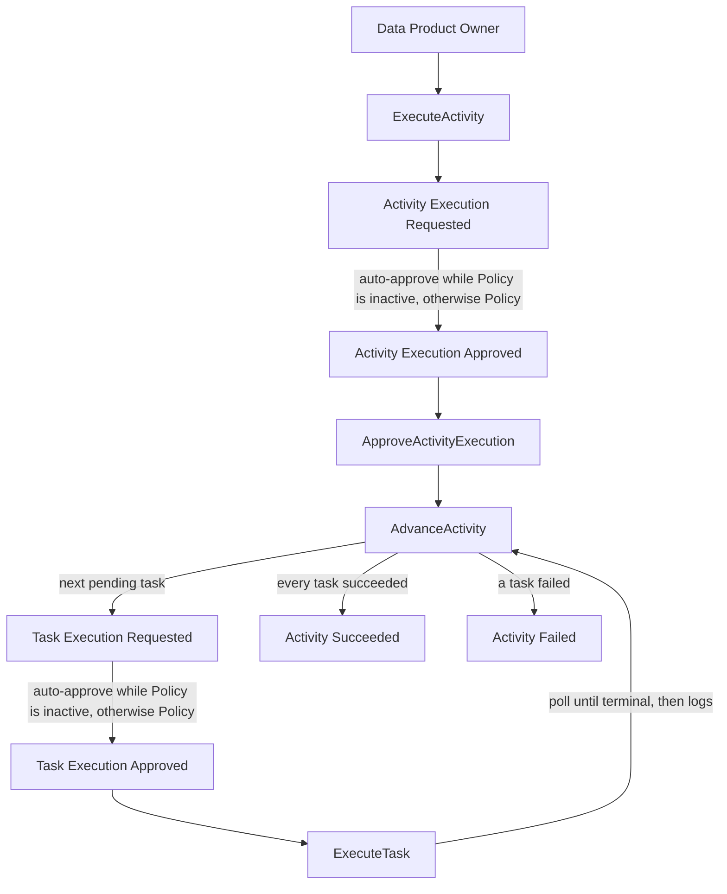
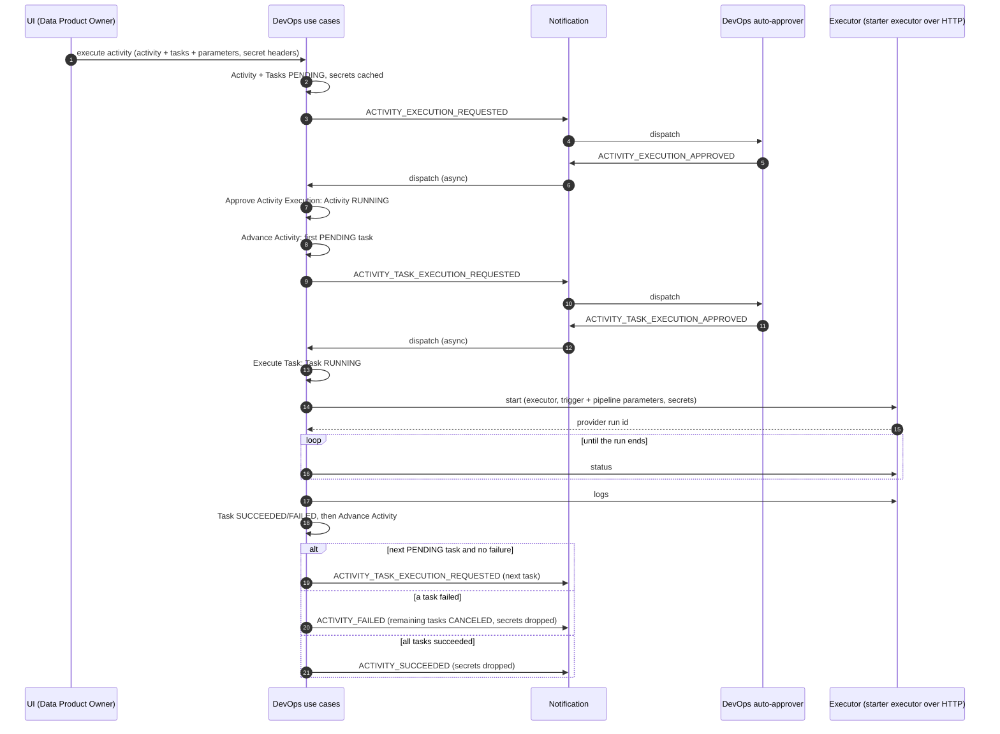
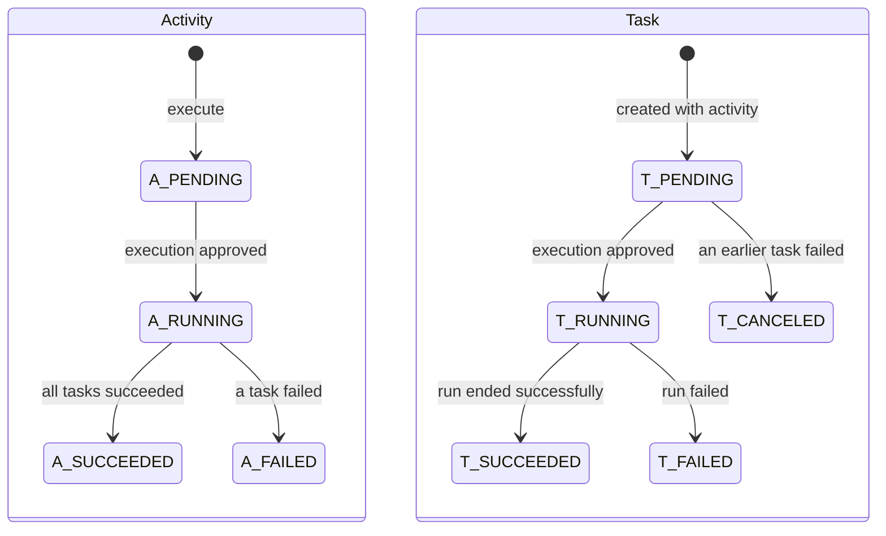

# SPDD Analysis: Full Control Happy Path (auto-approval, starter executor)

Story **BDMD-5437** (epic **BDMD-5097**). It depends on **BDMD-5436** (anemic CRUD for Activity and Task).

**Revision 3 (2026-09-25, after the design checkpoint).** The design is confirmed. This revision records:

- the checkpoint decisions: use-case renames, secrets, specification-agnostic input, parameter groups, and simpler polling;
- the answers to the remaining questions R1–R4.

**Revision 4 (2026-09-28).** This revision:

- closes O1–O3;
- restores the implementation details of revision 2 that survived revision 3, in a separate section: [Implementation Details](#implementation-details-carried-forward-to-the-reasons-canvas). Details made obsolete by revision 3 are dropped.

**Revision 5 (2026-09-28, after the final design review `DevOps-design-review-final.md`).** This revision:

- renames trigger parameters to **executor parameters** and makes them typed (DD-10);
- brings back placeholder resolution, the one place where DevOps loosely follows the DPDS (DD-21, DD-29);
- makes the activity `sortOrder` part of the request and of the events (DD-08, DD-24);
- removes the executor `active` flag (DD-03);
- removes platform identifiers from the executor start request (DD-05);
- replaces the no-op executor with a real HTTP client plus an updated starter executor (DD-06);
- identifies the latest task by `createdAt` (DD-31);
- adds Gherkin test scenarios (DD-32).

**Revision 6 (2026-09-29, final).** Closes the last interface questions I-17 to I-23 with their proposals unchanged. This revision:

- makes the provider run id opaque and owned by the executor (DD-33);
- fixes the executor parameters type and the validation at execute (DD-34);
- details placeholder resolution (DD-21);
- maps provider statuses to the three executor API statuses (DD-35);
- fixes the starter executor's scope (DD-36);
- defers the status of the version's other activities in events to the Policy stories (DD-37).

**Revision 7 (2026-09-30).** The task execution columns are part of Flyway `V1__init_schema.sql`. There is no `V2__task_execution_data.sql`. The schema has not been deployed, so a second migration is unnecessary.

**Revision 8 (2026-09-30).** After the live run:

- `pipeline_parameters` stays `text`, and `Task` stores it as a `String`. `TaskMapper` writes that JSON when the resource becomes an entity and parses it when an entity becomes a resource, the same way Notification stores `Event.eventContent`. There is no `AttributeConverter`. A read returns the stored characters and does not flush the task.
- `executor_parameters` is `jsonb`. `Task` stores it as a `JsonNode` with `@JdbcTypeCode(SqlTypes.JSON)`, the same way Registry stores `DataProductVersion.content` and Blueprint stores `BlueprintVersion.content` (revision 9).
- A missing pipeline-parameter map stays null. Execute does not replace it with an empty map (DD-34).
- The starter refuses `POST /api/v2/up/executor/tasks/start` without `executorParameters` in the controller. The 400 body names that field. Bean validation is not used. `server.error.include-message` is `always`, as on the other product-plane services (DD-36).

**Revision 9 (2026-09-30).** `executor_parameters` is `jsonb` on `Task` as `JsonNode` plus `@JdbcTypeCode(SqlTypes.JSON)`, following `DataProductVersion.content` and `BlueprintVersion.content`. `pipeline_parameters` stays `text` stored as `String`. `TaskMapper` converts `ExecutorParametersRes` to and from that `JsonNode`. There is no `AttributeConverter` on either column.

**Revision 10 (2026-09-30).** Task results are available to the next task without a separate wait (DD-20, DD-21). The CLI uploads them from inside that task's pipeline while the pipeline is running, and Execute Task is polling that same run until the executor reports a terminal status.

**Revision 11 (2026-09-30).** The use-case map has a flowchart of the happy path, including the optional auto-approvals. The same chain is the class JavaDoc of `ActivityUseCasesService` and of each use case in the chain.

No design question is open. The analysis is ready for the REASONS Canvas.

The end-to-end flow and the interfaces of every step (endpoint, commands, presenters, ports, events, executor client) are defined in `spdd/analysis/BDMD-5437-202609281148-[Interfaces]-full-control-happy-path.md`.

Each design decision has a stable number (**DD-nn**). Decisions changed in revision 3 or 4 are marked *(revised)*, and new ones *(new)*. [Decision history](#decision-history) maps every question raised so far to its decision.

The sections Domain Concept Identification, Strategic Approach, and Risk & Gap Analysis stay at the strategic level. Implementation Details is a holding area for concrete names and mechanics until the REASONS Canvas takes them over. It is not a design on its own.

**General rule for this service.** Anything not decided here follows the existing pattern in `odm-platform-pp-registry-server` or `odm-platform-pp-blueprint-server`. That covers use cases, events, configuration, clients, and controllers. The reference use-case slice is the Registry publish flow: `DataProductVersionUseCaseController` → `DataProductVersionsUseCasesService` → `DataProductVersionPublisherFactory` → `DataProductVersionPublisher`. A decision that reuses a pattern from another service names it in a **Pattern** line.

## Business Requirement (summary)

DevOps 2.0 runs the deployment pipelines of a data product version in one of two modes.

1. **Full control.** Blindata/ODM triggers the pipelines. DevOps creates the activity, requests approval of the activity and of each task, runs each task on an executor, follows the run until it ends, collects its logs, and moves on to the next task. **This story covers only this mode.**
2. **Instrumented.** An external pipeline runs, and the ODM CLI inside it reports to DevOps. Out of scope.

This story delivers:

- **The happy path of full control.**
- **Auto-approved policies**, the same way the Registry auto-approves when the Policy service is inactive, documented to the same level.
- **A real executor client behind outbound ports**, tested end to end against the updated starter executor (`odm-platform-adapter-devops-executor-starter`). The starter simulates a pipeline run: it returns a provider run id, reports its status, and returns its logs.
- **The chain of use cases:** Execute Activity, then activity approval, then Advance Activity, then task approval, then Execute Task. Execute Task runs the task on the executor, follows it until it ends, collects its logs, and hands back to Advance Activity. Advance Activity then starts the next task or ends the activity.
- **Specification independence.** DevOps receives an activity from the UI, never a descriptor, and stays independent of the DPDS.
- **Executor secrets** handled the same basic way as DevOps v1.

Not in this story:

- cancel, error paths, and re-run;
- recovery after a restart;
- the instrumented path and the CLI;
- storing task results;
- real policies;
- real provider executors (GitHub, GitLab, and others).

Sources:

- the design calls `DevOps-2.0-Full-Control-Use-Case.md` and `DevOps-design-checkpoint.md`;
- the event storm and sequence diagrams;
- the draft endpoints and events;
- the DPDS 1.0.0 specification, used only for context;
- the reports `devops-v1-executor-configuration.md`, `devops-v1-executor-secrets.md`, `registry-policy-auto-approve.md`, and `devops-polling-patterns.md`;
- the design-review answers.

---

## Domain Concept Identification

### Existing Concepts (from codebase)

- **Activity (root aggregate, BDMD-5436):** one execution of a named activity on a data product version. It carries the DPV identity (UUID, FQN, tag), a name, an order, a status, and start and finish times. It owns Tasks. Re-executing an activity creates a new one.
- **Task (nested in Activity):** a unit of work with a name, description, order, status, provider run id, and start and finish times. It owns Logs and Results. It has no execution data yet: no executor and no parameters.
- **Logs / Results:** records owned by a Task, ordered by source time. Logs are read once, when the task ends.
- **Execution status:** one closed set shared by Activity and Task. The BDMD-5436 constant `CANCELLED` is renamed to `CANCELED` (DD-13).
- **Activity CRUD API:** public, with unrestricted writes.
- **Use-case and notification building blocks:** the use-case interface, a transactional port, and the use-case norm exist. A Notification client exists but is not used, and is inactive by default. There is no use case, no observer endpoint, and no event subscription.
- **Registry (reference):** observer stack and event catalogue, conditional auto-approve handlers, approver use cases that require `PENDING`, and the publish use case whose command wraps a resource.
- **Blueprint (reference):**
  - one use case runs another through a port that builds it with its factory;
  - provider clients are resolved by identifier;
  - configuration is typed;
  - CRUD writes are hidden from the API docs;
  - async processing is enabled.
- **DevOps v1 (reference):**
  - executors are declared in Spring YAML, keyed by name;
  - executor secrets arrive as request headers and are held in an in-memory cache per executor and activity;
  - tasks run in order;
  - the first failure fails the activity.

### New Concepts Required

- **Activity execution process:** the state machine the use cases enforce (DD-13).
- **Executor registry:** the executors declared in configuration. Each has a name, an address, and an execution mode (DD-03, DD-04).
- **Executor (outbound):** start a run and receive its provider run id, read the run status, and read the run logs. Reached over HTTP. The starter executor plays that role in this story (DD-05, DD-06).
- **Task execution data** *(revised)*: the executor name plus two parameter groups, received with the activity (DD-10).
  - **Executor parameters** (typed): what the executor needs to find and start the pipeline. That is the repository, the ref (the version tag), and the pipeline identifier.
  - **Pipeline parameters** (free key-value, user-defined): the arguments passed to the pipeline run. Their values may contain placeholders, which DevOps resolves just before the run starts (DD-21).
- **Executor secrets** *(new)*: credentials the caller sends with the execute request. They are held in memory for the life of the activity and attached to that executor's calls. They are never stored in the database (DD-30).
- **DevOps domain events:** the events of the event list, in the Registry envelope (DD-23, DD-24).
- **Policy auto-approval:** approve-only handlers that exist while the Policy service is inactive (DD-25).
- **Observer infrastructure:** the Registry observer stack, ported to DevOps, with asynchronous processing (DD-26).

### Conceptual relationships

- **Data Product Version 1 — Activity N.** At most one activity per DPV and activity name is `PENDING` or `RUNNING` at a time (DD-12).
- **Activity 1 — Task N.** Tasks run strictly one at a time, in their order (DD-12, DD-15).
- **Task N — Executor 1.** A task names an executor declared in configuration. The executor's mode decides whether DevOps drives the run (DD-04).
- **Task 0..1 — Pipeline Run (external).** The run is identified by the provider run id returned when it starts.
- **Activity 1 — Executor secrets N.** Secrets are kept per executor for one activity, and dropped when the activity ends (DD-30).
- **Events → use cases.** Each received event triggers one use case. Use cases decide from the persisted state. Events identify what to load.

### Key Business Rules

- **DevOps is specification-agnostic** (DD-29). It receives an activity with its tasks and parameters, never a descriptor. The one exception is the placeholder syntax in pipeline parameter values, which DevOps resolves from earlier task results (DD-21). Whether the tasks match the descriptor is checked by the Policy service, not by DevOps.
- **Execute creates a new activity every time.** It is refused while an activity with the same DPV and name is `PENDING` or `RUNNING` (DD-12).
- **The request must be executable** (DD-11). The activity needs at least one task. Every task needs a name, an executor that is declared, and executor parameters. In this story, that executor must be in full-control mode. The activity needs its `sortOrder`.
- **Tasks are created with the activity**, in `PENDING`, in the order the caller gives (DD-09).
- **An approval applies only to an item that is `PENDING`.** It moves the item to `RUNNING` (DD-14, DD-16).
- **Advance Activity** decides the next step (DD-15):
  - if a task failed, the activity fails and the remaining tasks are canceled;
  - if every task succeeded, the activity succeeds;
  - if a task is running, it does nothing;
  - otherwise, it requests execution of the first `PENDING` task.
- **Execute Task** starts the run and reads its status until the run ends. It then reads the logs once, records the outcome, and hands over to Advance Activity (DD-16, DD-19, DD-20).
- **Auto-approval always approves.** It makes no checks (DD-25).

### Use-case map *(revised)*

| # | Use case | Trigger | Needs | Precondition | Outcome | Emits |
|---|----------|---------|-------|--------------|---------|-------|
| 1 | **Execute Activity** | REST, called by the UI | An activity: DPV identity, name, ordered tasks with executor name and parameters; executor secrets | Request executable; no `PENDING`/`RUNNING` activity for DPV + name | Activity and tasks `PENDING`; secrets held | Activity execution requested |
| A1 | Auto-approve activity | Activity execution requested (Policy inactive) | Event | None | None | Activity execution approved |
| 2 | **Approve Activity Execution** | Activity execution approved | Activity identity | Activity `PENDING` | Activity `RUNNING`; runs Advance Activity | None |
| 3 | **Advance Activity** (was "Execute Task") | Called by 2 and by 4 | Activity identity | Activity `RUNNING` | Next task requested, or activity closed | Task execution requested, **or** activity succeeded / failed |
| A2 | Auto-approve task | Task execution requested (Policy inactive) | Event | None | None | Task execution approved |
| 4 | **Execute Task** (was "Approve Task Execution"; now includes tracking) | Task execution approved | Activity and task identity | Task `PENDING`, activity `RUNNING` | Task `RUNNING`; run started; status read until the run ends; logs stored; task `SUCCEEDED`/`FAILED`; runs Advance Activity | None directly |

The happy path follows the full-control event storm. Brackets in the chain are the auto-approvals: they run only while the Policy service is inactive. When Policy is active, Policy emits the approved events. `ApproveActivityExecution` and `ExecuteTask` call `AdvanceActivity` in process. Reading the run status and the logs, drawn as separate commands on the event storm, happens inside `ExecuteTask`.







---

## Strategic Approach

### Solution Direction

The process is a chain of atomic use cases, laid out like the Registry use-case slices.

- **Execute Activity** is the only REST entry point. It accepts an activity resource, not a descriptor.
- **The other use cases** react to Notification events delivered to an observer stack ported from the Registry, which processes events asynchronously. They call each other in process where the flow continues without an event.
- **Execute Task** follows its run on the asynchronous thread it already runs on. There is no separate poller.
- **Executors** are declared in configuration, the v1 way. Each use case reaches them through its own port, backed by one shared executor component. That component also attaches the cached secrets, and it calls the executor over HTTP. The starter executor is updated so the whole flow runs end to end.
- **Auto-approval** copies the Registry, including its documentation.

### Key Design Decisions

#### Scope and structure

- **DD-01: Scope** *(revised)*.
  - **In:**
    - the use cases and auto-approvals of the use-case map;
    - executor secrets;
    - the HTTP executor client;
    - placeholder resolution in pipeline parameters;
    - the update of the starter executor (`odm-platform-adapter-devops-executor-starter`) to the v2 executor API;
    - documentation.
  - **Out:**
    - cancel, error paths, and re-run, including running an explicitly chosen task;
    - recovery of in-flight runs after a restart;
    - the instrumented path and the CLI;
    - storing task results;
    - real policies and rejection handling;
    - real provider executors;
    - descriptor and builder changes for reserved workflow keys and multi-repository data;
    - the task execute endpoint.
- **DD-02: One slice per use case, Registry layout.** Each use case has its own command, presenter, factory, use case, and ports. One use-case controller and one use-cases service serve the REST side.
  - **Pattern:** Registry `DataProductVersionUseCaseController` / `DataProductVersionsUseCasesService` / `usecases/publish`, and the norm `USE_CASE_IMPLEMENTATION.md`.
- **DD-29: DevOps is specification-agnostic** *(new)*.
  - DevOps never receives, parses, or stores a descriptor.
  - It uses none of the specification's names or constructs. That means no `template` or `configurations`, no reference objects, and no ordering rules taken from the specification.
  - **The one exception** *(revised)*: the `${…}` placeholder syntax inside pipeline parameter values. DevOps resolves it from earlier task results (DD-21), because only DevOps holds those results at run time. It is used loosely, out of necessity, and nowhere else.
  - The UI translates what it holds (the data product version, including the descriptor it contains) into an activity with tasks and plain parameters.
  - Coherence between the activity and the descriptor is validated by the Policy service. Under auto-approval it is not checked (DD-25).
  - **Why:** parsing the descriptor in DevOps would tie it to one specification and complicate it. The DPV identity is already part of the activity.

#### Executors and secrets

- **DD-03: Executors are declared in Spring configuration, the v1 way.**
  - Each executor has a name, an address, and an execution mode *(revised)*.
  - Dropped from v1:
    - the callback-check flag, because v2 has no callback;
    - the `active` flag (final review). An executor is available when it is declared.
  - **Pattern:** DevOps v1 executor services map (`devops-v1-executor-configuration.md`). Blueprint `BlueprintValidatorProperties` for the typed binding.
- **DD-04: The execution mode comes only from the executor configuration.**
  - The mode is full control or instrumented, and every declared executor must declare one.
  - There is no service-wide default and no override from the descriptor or the request.
  - The mode is resolved at run time and not stored on the task.
- **DD-05: One port per use case, backed by one shared executor component.**
  - Each use case declares only the executor interactions it needs:
    - Execute Activity: is this executor declared, and what is its mode.
    - Execute Task: start the run, read its status, read its logs.
  - The shared component resolves the executor by name and attaches that executor's cached secrets.
  - **The executor receives only what it needs to run the pipeline** *(revised)*: executor parameters, pipeline parameters (resolved), and secrets. There are no activity or task identifiers, so executors do not couple to the platform's internal structure.
  - **Pattern:** Blueprint `GitProviderFactory` (resolve a client by identifier), v1 `DevOpsClients` (clients keyed by executor name), and the port-per-use-case rule of the norm.
- **DD-06: A real HTTP executor client, tested against the updated starter executor** *(revised, final review)*.
  - There is no no-op in DevOps. The executor client calls the executor's v2 API at the address declared in configuration.
  - The starter executor (`odm-platform-adapter-devops-executor-starter`) is updated from its v1 callback behaviour to the v2 API.
    - It returns a provider run id.
    - It reports the run as running, then as ended, with success or failure.
    - It returns the run's logs.
  - This allows end-to-end tests and demos.
  - Integration tests inside DevOps still mock the executor client (`client/**` mocks in `TestConfig`), so they can script success, failure, and several tasks.
  - **Pattern:** `NotificationClientImpl` / `NotificationClientConfig` for an HTTP client built on `RestUtils`.
- **DD-07: A task names its executor by bare name** *(revised, R4)*.
  - The UI sends the executor name exactly as it is declared in configuration.
  - DevOps does no reference or brace resolution.
- **DD-30: Executor secrets follow the v1 pattern** *(new)*.
  - **How secrets arrive.** The caller sends secrets as request headers on the execute request. Each header names the executor it belongs to and the kind of secret. v1's header naming and rewriting are kept.
  - **Where they are kept.**
    - DevOps keeps them in a simple in-memory cache, keyed by executor and activity, with the v1 expiry of one hour after they arrive (O3: v1 kept as is).
    - They are attached to every call to that executor for that activity.
    - They are dropped when the activity ends.
    - They are never stored in the database and never logged.
    - Headers for executors the activity does not use are ignored.
  - **Assumption:** a single DevOps instance, as agreed at the checkpoint.
  - **Pattern:** DevOps v1 `DevOpsClients` / `ExecutorClientWithSecrets` (`devops-v1-executor-secrets.md`).
- **DD-33: The provider run id is opaque and owned by the executor** *(new, I-17)*.
  - Every provider needs more than a run id to read a run's status and logs: owner and repository, project id, organization with project and pipeline id, or workspace with repository.
  - The executor keeps those coordinates from the start call, either stored on its side or encoded in the id. The id must fit in 255 characters.
  - DevOps sends only the `providerRunId` to the status and log reads, and never interprets it. DevOps stays stateless towards the executor.
- **DD-34: The executor parameters type, and what DevOps checks** *(new, I-18, I-21)*.
  - **Shape:** `repository` (the Registry repository fields, with the names of `DataProductRepoRes`), `ref` (`name`, and `type` = `TAG` or `BRANCH`), one provider-neutral `pipelineIdentifier`, and an optional `repositoryKey` so the Policy service can check which repository a task targets.
  - **One neutral pipeline identifier**, not one field per provider. Each executor interprets it: the workflow file or id on GitHub, the pipeline id on Azure, the custom pipeline name on Bitbucket, and nothing on GitLab.
  - **`providerType` and `ownerType` are plain strings** with the Registry's values, not DevOps enums. DevOps never branches on them, so a new provider needs no DevOps change.
  - **Validation at execute:** `repository.providerType`, `ref.name`, and `ref.type` are required, and every other field is optional. A missing pipeline-parameter map stays null. A blank key or a null value is refused.
  - **Provider-specific checks belong to the executor.** For example, a missing workflow id on GitHub is the executor's error, not DevOps'.
  - Deriving provider coordinates, such as the GitHub owner login or the Bitbucket workspace from `remoteUrlHttp`, or the Azure organization from `providerBaseUrl`, is also executor work.
- **DD-35: Provider statuses map to three executor API statuses** *(new, I-23)*.
  - The executor API reports only `RUNNING`, `SUCCEEDED`, or `FAILED`. Each executor maps its provider's statuses.
  - End states that are not a success (cancelled, skipped, timed out, stopped, expired, error, neutral) map to `FAILED`.
  - States that wait for a person or a resource (manual, paused, waiting, action required) map to `RUNNING`, so DevOps keeps polling. A limit on waiting belongs to the errors story.
- **DD-36: The starter executor's scope** *(new, I-22)*.
  - The v1 endpoint and callback are replaced, not kept alongside the v2 API.
  - It is upgraded to the DevOps v2 stack: Spring Boot 3.5 and Java 21.
  - Runs are kept in memory. JPA, H2, and the v1 `TaskRun` class are dropped.
  - The outcome and duration of a simulated run come from configuration defaults, and can be overridden per run with the reserved pipeline parameters `starter.outcome` and `starter.durationSeconds`. The starter plays the pipeline, so reading its own inputs is realistic.
  - It never logs header values. The v1 starter logs every header, including secrets.
  - A start call without `executorParameters` is refused by an explicit check in the controller, with `400` and that field name in the body. The body is Spring's error JSON with `server.error.include-message: always`, the same setting as the other product-plane services. Bean validation is not used.

#### Execute Activity

- **DD-08: The command carries an activity resource** *(revised)*.
  - The request body is the activity: the DPV identity, the activity name, the activity **`sortOrder`**, and its tasks in execution order. Each task has a name, an executor name, and its two parameter groups.
  - **The activity `sortOrder` is required** *(revised)*. It is the activity's position among the DPV's activities. DevOps cannot derive it, so the UI sends it. It is stored and appears in every event, so policies can reason about activity sequence, for example "dev must succeed before prod".
  - The response is the created activity.
  - It is not the descriptor, and not a copy of its lifecycle section.
  - **Pattern:** Registry publish. The command resource wraps the domain resource (`DataProductVersionPublishCommandRes` wraps `DataProductVersionRes`), and the created resource is returned with `201 Created`.
- **DD-09: Tasks are created with the activity, in `PENDING`, in the order given by the caller** *(revised)*.
  - DevOps runs tasks in that order.
  - Turning the descriptor's ordering rules into this order is the UI's job (DD-29).
- **DD-10: Task execution data is an executor name and two parameter groups** *(revised, final review)*.
  - **Executor parameters (typed, renamed from trigger parameters):** everything the executor needs to find and start the pipeline.
    - The repository, shaped after the Registry's `DataProductRepoRes`.
    - The ref: the data product version tag, from `DataProductVersionRes.tag`, or the additional tag for an additional repository.
    - The pipeline identifier: a workflow file or id, a pipeline id, or a custom pipeline name, depending on the provider.
    - They are typed because they serve internal processes, and their shape is known. The type is fixed in DD-34, from the provider research (`agent-reports/devops-executor-parameters-research.md`).
    - The pipeline identifier comes from a reserved key in the descriptor, which the UI reads. Defining those reserved keys, and the builder and descriptor changes for multi-repository, are outside DevOps and outside this story.
  - **Pipeline parameters:** free key-value pairs, defined by the user for their pipeline. Values are strings and may contain placeholders (DD-21).
  - DevOps stores both groups as received. `executor_parameters` is `jsonb`, held on `Task` as a `JsonNode` with `@JdbcTypeCode(SqlTypes.JSON)`, the Registry and Blueprint shape (`DataProductVersion.content`, `BlueprintVersion.content`). `pipeline_parameters` is `text`, held as a `String`, the Notification `Event.eventContent` shape. `TaskMapper` converts each at the REST boundary. There is no `AttributeConverter`: loading a task does not rewrite the row. DevOps passes executor parameters unchanged, and pipeline parameters after resolving placeholders. Placeholder resolution parses a local copy and does not write the stored string back.
  - **Key contract (O2):** which pipeline parameter keys a pipeline expects is agreed between the pipeline author and the UI. How an executor reads the typed executor parameters is part of that executor's contract. Neither is defined in DevOps.
  - **Source:** the UI takes the values from the data product version it already holds. That resource carries the descriptor content, the version tag, the additional Git tags per repository, and the parent data product (Registry `DataProductVersionRes`).
  - **Multi-repository:** each task carries its own executor parameters, so tasks of one activity can target different repositories.
  - **Why pipeline parameters are plain strings:** git-provider pipeline inputs are string key-value pairs (for example workflow dispatch inputs and pipeline variables).
- **DD-11: Execute refuses requests that cannot run.** It answers with a client error when:
  - the DPV identity or the activity name is missing;
  - there are no tasks;
  - a task has no name or no executor;
  - the activity `sortOrder` is missing;
  - a task has no executor parameters, or they lack a required field (DD-34);
  - a pipeline parameter has a blank key or a null value (DD-34);
  - the executor is not declared;
  - in this story, the executor's mode is instrumented.
  - **Pattern:** Registry use cases validate the command first and refuse with a bad-request error (`DataProductVersionPublisher`).
- **DD-12: Concurrency** *(revised, R2)*.
  - **Activities:** execute is refused while an activity with the same DPV and name is `PENDING` or `RUNNING`. Different activity names on the same DPV may run together.
  - **Tasks:** within an activity, tasks are strictly sequential. Advance Activity requests only the first `PENDING` task, and never while a task is `RUNNING`. There is no check across activities.
  - **Pattern:** Registry `DataProductVersionPublisher` / `DataProductInitializer` (an existing `PENDING` item → bad request).

#### Process

- **DD-13: Statuses and transitions** *(revised, R3)*.
  - **Activity:** `PENDING` → `RUNNING` → `SUCCEEDED` or `FAILED`.
  - **Task:** `PENDING` → `RUNNING` → `SUCCEEDED` or `FAILED`. Tasks still `PENDING` when an earlier task fails become `CANCELED`.
  - **Spelling:** `CANCELED` is used everywhere, in statuses and events. The BDMD-5436 status constant is renamed accordingly.
  - **Timestamps:** approval sets the start time, and the end of the run sets the finish time.
- **DD-14: Approve Activity Execution requires `PENDING`.**
  - It moves the activity to `RUNNING`, then runs Advance Activity.
  - A duplicate or late approval is refused, and its notification is marked as failed. Notification can replay it.
  - **Pattern:** Registry `DataProductApprover` and `ObserverService`.
- **DD-15: Advance Activity** *(revised: renamed from "Execute Task"; explicit task removed)*.
  - It reads the activity, which must be `RUNNING`, and takes one of four outcomes:
    1. **A task failed:** it cancels the remaining `PENDING` tasks, fails the activity, drops the secrets, and emits activity failed.
    2. **All tasks succeeded:** it succeeds the activity, drops the secrets, and emits activity succeeded.
    3. **A task is running:** it does nothing.
    4. **Otherwise:** it requests execution of the first `PENDING` task.
  - Running a specific task, which re-run needs, is out of scope. It will probably be a separate use case later.
  - **Known limitation, kept:** a task that has been requested but not yet approved is still `PENDING`. A duplicate trigger can request it twice. That is harmless, because the second approval is refused. A marker can be added later if needed.
- **DD-16: Execute Task** *(revised: renamed from "Approve Task Execution"; now includes tracking)*.
  - It requires the task to be `PENDING` and its activity `RUNNING`. It moves the task to `RUNNING`.
  - If the executor is in full control, it starts the run and records the provider run id. It then follows the run until it ends (DD-19), reads the logs once, and records the task outcome.
  - Finally, it runs Advance Activity.
  - A duplicate or late approval is refused, as in DD-14.
  - **Pattern:** Registry approvers (require `PENDING`).
- **DD-17: Use cases chain in process through a port.** Approve Activity Execution and Execute Task run Advance Activity through a port that builds it with its factory. No extra event types are introduced.
  - **Pattern:** Blueprint `EvaluateProtectedResourcesIntegrityInstantiateOutboundPortImpl` → `InstantiateBlueprintVersionFactory`.
- **DD-18: Event handlers always run their use case, and the use case decides.** "Only in full control" is a business rule, so it lives in the use case.
  - **Pattern:** the use-case norm. Registry `*ApprovedNotificationEventHandler` classes only build the command.
- **DD-19: Polling happens inside Execute Task, on its asynchronous thread** *(revised)*.
  - Events are processed asynchronously (DD-26), so Execute Task never blocks its caller. It can read the run status repeatedly until the run ends.
  - The use case owns "repeat until the run ends". How long to wait between reads belongs to the executor adapter.
  - Nothing is saved for recovery. A restart during a run leaves the task `RUNNING`. That is out of scope, and acceptable because pipelines are expected to be short.
  - A database-driven poller was considered and dropped as overkill for now (`devops-polling-patterns.md`).
  - **Pattern:** asynchronous event processing as in Blueprint and Notification. The wait-and-read loop follows the Blindata observer `AsyncRestUtilsTemplate`, which polls a remote task until it ends.
- **DD-20: End of a task** *(revised, R1; assumption added in revision 10)*.
  - Logs are read once, after the run ends.
  - Task results are not awaited. Storing them, through the CLI, is out of scope.
  - **Assumption:** the CLI uploads a task's results as part of that task's pipeline, while the pipeline is running. Only the pipeline associated with a task, and only while that task is running, updates that task's results. Another pipeline uploading results for a different task is not supported. Execute Task polls the executor until the status is terminal, then reads the logs (DD-19). The upload has finished by then, so the results are already stored when the next task runs and resolves placeholders (DD-21).
- **DD-21: DevOps resolves placeholders in pipeline parameter values before the run starts** *(revised, final review; details closed in revision 6, I-19)*.
  - **Where:** in Execute Task, just before the start call, because that is the only place the values are consumed. Stored values stay as received.
  - **What:** pipeline parameter values only. Executor parameters are typed data from the DPV and are not resolved.
  - **Syntax:** v1's `${<activityName>.results.<taskName>.<path>}`, borrowed loosely from the DPDS / v1 conventions (DD-29 exception).
  - **Sources:** the activities of the same DPV, keeping the latest per name by `createdAt`, in any status and including the current one (DD-31). Within each activity, the latest task per name by `createdAt`.
  - **Reading results:** the chosen task's results are parsed as JSON objects, and results that are not JSON are ignored. They are merged in `generatedAt` order, so a later result wins. The path is navigated through the merged object.
  - **Output:** a scalar becomes its text, and an object or an array becomes its JSON.
  - **Unresolved placeholders are left unchanged**, as in v1. A warning logs the placeholder path, never the values.
  - Results are not stored by this story (DD-20; the CLI stores them later). So in the happy path of this story, placeholders only resolve when results already exist. Tests seed them. Once the CLI stores them, the DD-20 assumption says they are already present when the next task starts: the previous task's pipeline uploaded them while Execute Task was polling that run.
  - **Pattern:** DevOps v1 `VariableTemplateUtils.replaceVariables` and `ActivityService.createContext`.
- **DD-22: No executor call inside a database transaction.** Status changes are committed before and after each executor call. A run that starts but whose provider run id is not saved is left to the errors story.

#### Events and policy

- **DD-23: Event names are the event list, with full names.**
  - **Emitted:**
    - `ACTIVITY_EXECUTION_REQUESTED`
    - `ACTIVITY_TASK_EXECUTION_REQUESTED`
    - `ACTIVITY_SUCCEEDED`
    - `ACTIVITY_FAILED`
    - `ACTIVITY_CANCELED` (later story)
  - **Received:**
    - `ACTIVITY_EXECUTION_APPROVED` / `_REJECTED`
    - `ACTIVITY_TASK_EXECUTION_APPROVED` / `_REJECTED`
    - the two `*_REQUESTED` events, for auto-approval
  - Rejections are not handled in this story. The service subscribes only to the events it has handlers for.
  - **Pattern:** Registry `EventTypeRes` and `NotificationClientEventSubscriber`.
- **DD-24: The event envelope and content are the Registry's** *(revised, O1)*.
  - The resource is the activity, including for task events.
  - **Requested and completion events embed the resource.** The activity execution requested, activity succeeded, and activity failed events embed the activity resource. The task execution requested event also embeds the task being requested. That gives the Policy service the tasks and parameters it must check against the descriptor (DD-29). Secrets are never part of an event (DD-30).
  - **Approved events carry identifiers only**, as the Registry's auto-approve events do. The identifier block of the activity includes its `sortOrder` *(revised)*.
  - **The activity `sortOrder` is in every event's `eventContent.activity`** *(revised, final review)*.
  - **The DPV appears by identity only** (UUID, FQN, tag, already part of the activity). The Policy service enriches it.
  - Events do not carry the status of the DPV's other activities (DD-37).
  - **Pattern:** Registry `EmittedEventDataProductInitializationRequestedRes` and `EmittedEventDataProductInitializedRes` (embed `DataProductRes`), `EmittedEventDataProductInitializationApprovedRes` (identifiers only), and `docs/service/events.md`.
- **DD-25: Auto-approval exactly as in the Registry.**
  - It uses the same Policy-inactive switch.
  - Approve-only handlers turn each `*_REQUESTED` event into the matching `*_APPROVED` event, with no checks. That includes "the DPV is published" and the coherence with the descriptor.
  - Notification must be active for the loop to close.
  - The documentation mirrors the Registry's: policy mode, events, and configuration.
  - **Pattern:** Registry `DataProductInitializationApproverNotificationEventHandler`, `policy-service.md`, `events.md`, and `configuration.md`.
- **DD-26: The observer stack is ported from the Registry, with asynchronous processing actually enabled.**
  - The Registry marks its observer processing asynchronous but never enables it. DevOps enables it, so Notification is answered at once and long-running use cases (DD-19) do not hold Notification's calls.
  - Tests keep it synchronous, as the sibling services do.
  - **Pattern:** Registry `ObserverController` / `ObserverService`. Blueprint and Notification for enabling async. Sibling `TestConfig` for synchronous tests.
- **DD-27: Events are emitted inside the transaction, as its last step.**
  - **Known risk:** DevOps receives its own events, so an approval could arrive before the commit. This is unlikely, because there are two network hops. The fallback is emit-after-commit.
  - **Pattern:** Registry `DataProductInitializer` and `DataProductApprover`.
- **DD-28: Activity CRUD writes are hidden from the public API docs.** Reads stay public.
  - **Pattern:** Blueprint `BlueprintController`.
- **DD-37: The status of the DPV's other activities is deferred to the Policy stories** *(new, I-20)*.
  - The final review asked whether requested events should carry a summary of the other activities of the same DPV, for policies such as "dev must succeed before prod".
  - Auto-approval does not need it, and the Policy service can read `GET /activities?dataProductVersionUuid=…`. So it is not added in this story.
  - If a Policy story adds it, the shape is `eventContent.dataProductVersionActivities[] = { uuid, name, sortOrder, status, createdAt, finishedAt }`, the latest activity per name, without tasks.

#### Display and tests

- **DD-31: The latest task is identified by `createdAt`** *(new, final review)*.
  - A re-run (later story) creates a new task row with the same name. The UI shows the latest row per task name, by creation date. Older rows stay readable as history.
  - The same rule picks the latest activity per name, for example when resolving placeholders (DD-21).
- **DD-32: Test scenarios are written in Gherkin** *(new, final review)*.
  - Scenarios (`Scenario` / `Given` / `When` / `Then`) are written in the SPDD prompt, and quoted in the Javadoc of the unit and integration tests that implement them. There is no Cucumber runtime.
  - **Pattern:** Blueprint `ProtectedResourcesValidatorPolicySubscriberTest` and `ReconstructPublicationRequestedServiceTest`, which trace scenarios to their SPDD prompt.

### Alternatives Considered

- **DevOps reads or parses the descriptor** (from the Registry or from the request). Rejected (DD-29). It would tie DevOps to the specification.
- **Specification names and constructs** (`template`, `configurations`, references). Rejected (DD-10, DD-29). The `${…}` placeholders are the one accepted exception (DD-21).
- **Executor parameters as a free map.** Rejected at the final review (DD-10). Their shape is known and they serve internal processes.
- **A no-op executor inside DevOps.** Replaced at the final review by the HTTP client plus the updated starter executor (DD-06).
- **One undivided parameter map.** Rejected (DD-10). Starting the pipeline and feeding the pipeline are different concerns.
- **Execution mode in the descriptor, in the activity, or as a service-wide default.** Rejected for now (DD-04).
- **A database-driven scheduled poller.** Dropped as overkill for now (DD-19). It remains the path if restart recovery becomes necessary.
- **New events to chain tasks.** Rejected (DD-17).
- **Deciding "full control" in event handlers.** Rejected (DD-18).
- **Persisting secrets.** Rejected (DD-30). They stay in memory only, as in v1.
- **An explicit-task mode in Advance Activity.** Removed (DD-15). Re-run will get its own design.

---

## Implementation Details (carried forward to the REASONS Canvas)

These are the concrete names and mechanics already known for each decision. They were restored from revision 2 where the decision survived. Items marked *To define in the Canvas* are known gaps for the interfaces step, not open design questions.

**Discarded with revision 3, kept here only as history:**

- the DB-driven scheduled poller, its enable and interval properties, and the note about the RestTemplate idle-connection monitor starting with scheduling;
- the DPDS task ordering rule (`order` first, then definition order);
- the `template` / `configurations` mapping, `service.$href` as the executor reference, and brace normalisation;
- the explicit-task mode of Advance Activity;
- the cross-activity task guard.

### Structure (DD-02, DD-17, DD-18)

- **Packages.**
  - Use-case packages live under `activity/services/usecases/<name>/`: `executeactivity`, `approveactivityexecution`, `advanceactivity`, `executetask`. Each holds a command record, a presenter interface, a factory, a package-private use case class, and per-concern `*OutboundPort` / `*OutboundPortImpl`.
  - The factory is the only `@Component` in the package. Port implementations are plain classes created with `new` by the factory.
  - Auto-approve handlers live in their own packages, `approveactivityexecutionrequest` and `approvetaskexecutionrequest`, mirroring Registry `approveinitialization` / `approvepublication`.
- **REST side:** `ActivityUseCaseController` → `ActivityUseCasesService` (maps `*CommandRes` to commands and holds the `*ResultHolder` presenters). REST resources go under `rest/v2/resources/activity/usecases/<verb>/`.
- **Handlers:** each `*ApprovedNotificationEventHandler` converts the dispatch event into a command and runs the factory's use case with a no-op presenter. It contains no business rule.
- **Chaining:** Approve Activity Execution and Execute Task each have a port, for example `...AdvanceActivityOutboundPort`. Its implementation receives the `AdvanceActivityFactory` from its own factory and runs `buildAdvanceActivity(command, presenter).execute()`.
  - **Pattern:** Blueprint `EvaluateProtectedResourcesIntegrityInstantiateOutboundPortImpl`.

### Executors and secrets (DD-03 to DD-07, DD-30)

- **Configuration shape.** v1 used `odm.utilityPlane.executorServices.<name>` with `active`, `address`, and `checkAfterCallback`. v2 keeps the path and the map, written in kebab case like the other v2 properties. It drops `checkAfterCallback` and, since the final review, `active`:

  ```yaml
  odm:
    utility-plane:
      executor-services:
        dummy:
          address: http://localhost:9080
          execution-mode: full-control   # or instrumented
  ```

- **Binding:** a typed `@ConfigurationProperties` class (Blueprint `BlueprintValidatorProperties`).
- **Execution mode:** values are `full-control` and `instrumented`. The mode is required on every declared executor, and the application refuses to start if it is missing. It is not stored on the task.
- **Shared executor component.** It resolves an executor client by name, following Blueprint `GitProviderFactory` and v1 `DevOpsClients.getExecutorClient(name, activityId)`.
  - For a known activity, it returns a client that carries that activity's secret headers.
  - The client calls the executor's v2 API at the declared `address`, built on `RestUtils` like `NotificationClientImpl`.
- **Per-use-case ports.**
  - Execute Activity: "is this executor declared, and what is its mode".
  - Execute Task:
    - "start run" (executor name, executor parameters, resolved pipeline parameters → provider run id);
    - "read status" (provider run id → running, succeeded, or failed);
    - "read logs" (provider run id → log).
- **Starter executor** (`odm-platform-adapter-devops-executor-starter`). It is updated to the v2 executor API and simulates runs for end-to-end tests and demos (DD-36). The contract is in the interfaces file (§9.7).
  - Run ids are `starter-<uuid>`, and runs live in memory.
  - Defaults: `executor.simulation.run-duration` (for example `5s`) and `executor.simulation.outcome` = `SUCCEEDED`.
  - Per-run overrides: the pipeline parameters `starter.outcome` (`SUCCEEDED` | `FAILED`) and `starter.durationSeconds`.
- **Status mapping.** The executor API speaks only `RUNNING`, `SUCCEEDED`, and `FAILED` (DD-35). Each executor maps its provider's statuses. The mapping for real providers belongs to the executor stories.
- **Run lookup.** Status and log reads send only the opaque `providerRunId` (DD-33), stored in `provider_run_id` (`varchar(255)`).
- **Secret headers (v1, unchanged).**
  - Accepted on `POST /api/v2/pp/devops/activities/execute` only, the single REST entry in this story. v1 also accepted them on activity start and task start.
  - Only headers matching `x-odm-<executorName>-executor-secret-<secretType>` are kept. `<executorName>` must be the task's executor name.
  - Each kept header is rewritten to `x-odm-<secretType>` before it is stored, for example `x-odm-gitlab-executor-secret-api-key` → `x-odm-api-key`.
- **Secret cache (v1, unchanged).**
  - It is an in-memory cache with the key `<executorName>-ID-<activityUuid>` and the rewritten header map as the value.
  - Entries expire one hour after they are written.
  - Entries are removed for every executor of the activity when the activity ends, succeeded or failed, which v1 did with `removeAllSecretsForActivity`.
  - It lives in one JVM, and is never persisted or logged.
  - Secrets are stored after the activity is created, as v1 did on create.
- **Cache library.** Caffeine (interfaces I-16). v1 used a Guava cache, and no v2 service (DevOps, Registry, Blueprint) has either today, so a dependency must be added.
- **Secrets in the use case.** The command carries the rewritten secrets as a plain map. The use case stores them through a port. They are never part of an event or a response.

### Execute Activity (DD-08 to DD-12, DD-29)

- **Endpoint:** `POST /api/v2/pp/devops/activities/execute` on `ActivityUseCaseController`, with `@ResponseStatus(HttpStatus.CREATED)`.
- **Resources:** `ActivityExecuteCommandRes` wraps an `ActivityRes`, and `ActivityExecuteResultRes` wraps the created `ActivityRes`.
  - **Pattern:** `DataProductVersionPublishCommandRes` / `DataProductVersionPublishResultRes`, with a result holder in `DataProductVersionsUseCasesService`.
- **Resource reuse:** the command reuses the BDMD-5436 `ActivityRes` / `TaskRes`, extended with the new task fields below. Fields the caller must not set, such as status, timestamps, provider run id, logs, and results, are ignored or reset by the use case.
- **Order:**
  - The activity `sortOrder` is taken from the body and is required (DD-08).
  - A task's `sortOrder` is its list position (interfaces I-05).
- **New task fields:**
  - the executor name;
  - executor parameters, a typed object (DD-34, interfaces §2.5);
  - pipeline parameters, a string-to-string map.
- **Migration:** `executor_name` (`varchar(255)`), `executor_parameters` (`jsonb`), and `pipeline_parameters` (`text`) are columns of `activities_tasks` in Flyway `V1__init_schema.sql`. The schema has not been deployed, so they are not a second migration. No `NOT NULL`. `executor_parameters` is a `JsonNode`. `pipeline_parameters` is a `String`. `TaskMapper` converts both. There is no `AttributeConverter`.
- **Validation errors:** `BadRequestException`, following `DataProductVersionPublisher`, which validates the command first.
- **Concurrency guard:** a lookup for activities with the same `data_product_version_uuid` and `name` in `PENDING` or `RUNNING`, using the existing index on `(data_product_version_uuid, name, status)`. A match gives `BadRequestException`, as Registry `DataProductInitializer` does ("already existent and in PENDING validation state").
- **Concurrent executes:** two executes at the same moment both pass the lookup. Serializable isolation (`DefaultTransactionalOutboundPortImpl`) makes one fail on commit. The existing `ResponseExceptionHandler` already maps `ConcurrencyFailureException` to 409.

### Process (DD-13 to DD-16, DD-19 to DD-22)

- **Status rename:** `ExecutionStatus.CANCELLED` becomes `CANCELED`. The column is a plain `varchar(255)`, and no data depends on it.
- **Timestamps:**
  - approval sets `started_at`, on the activity and on the task;
  - the end of a run sets the task's `finished_at`;
  - closing the activity sets its `finished_at`;
  - a canceled task gets `finished_at` and no `started_at`.
- **Refused approvals.** A duplicate or late approval throws `BadRequestException`.
  - `ObserverService` catches `DevOpsApiException` (warn) or any other exception (error), and calls `processingFailure`. The notification becomes `FAILED_TO_PROCESS`.
  - Notification's replay use case can resend it.
- **Execute Task transactions:**
  1. Commit `RUNNING` with `started_at`.
  2. Call the executor to start the run, outside any transaction.
  3. Save `provider_run_id` in a second transaction.
  4. Read the status repeatedly, outside any transaction.
  5. Read the logs, outside any transaction.
  6. Save the logs and the task outcome in a final transaction, then run Advance Activity.

  A crash between step 2 and step 3 leaves an orphan run. That belongs to the errors story.
- **Wait between status reads:** handled in the executor adapter.
  - **Reference:** Blindata observer `AsyncRestUtilsTemplate`: sleep with exponential backoff from 500 ms up to 60 s, at most 100 attempts.
  - **Decided (interfaces I-13):** configurable exponential back-off from 500 ms to 60 s, and no attempt limit in the happy path.
- **Logs:** the single log read is stored as one log row, with `generated_at` from the source when available (BDMD-5436).
- **Parameter values:**
  - Executor parameters are passed through unchanged.
  - Pipeline parameter values have their `${…}` placeholders resolved just before the start call (DD-21), with a port that loads the earlier results. Stored values stay as received. Those results were uploaded by the earlier task's own pipeline before its run went terminal (DD-20).

### Events, observer, and auto-approve (DD-23 to DD-28)

- **Event catalogue.** An `EventTypeRes` enum holds every type in the table below. `NotificationClientEventSubscriber` (`SmartInitializingSingleton`) subscribes at startup to each type that some mounted handler supports.

  | Event type | Emitted by | Received by (this story) | Content |
  |------------|------------|--------------------------|---------|
  | `ACTIVITY_EXECUTION_REQUESTED` | Execute Activity | Auto-approver (Policy inactive) | Activity resource, with tasks |
  | `ACTIVITY_EXECUTION_APPROVED` | Auto-approver / Policy | Approve Activity Execution | Activity identifiers |
  | `ACTIVITY_EXECUTION_REJECTED` | Policy | Not handled | — |
  | `ACTIVITY_TASK_EXECUTION_REQUESTED` | Advance Activity | Auto-approver (Policy inactive) | Activity resource + the requested task |
  | `ACTIVITY_TASK_EXECUTION_APPROVED` | Auto-approver / Policy | Execute Task | Activity + task identifiers |
  | `ACTIVITY_TASK_EXECUTION_REJECTED` | Policy | Not handled | — |
  | `ACTIVITY_SUCCEEDED` | Advance Activity | External (for example the Blindata observer) | Activity resource |
  | `ACTIVITY_FAILED` | Advance Activity | External | Activity resource |
  | `ACTIVITY_CANCELED` | Cancel (later story) | External | Activity resource |

- **Envelope.** `resourceType` = `ACTIVITY`, `resourceIdentifier` = activity UUID, `type`, `eventTypeVersion` = `V2.0.0`, and `eventContent`.
  - One `Emitted*Res` class per emitted event, and one `Received*Res` class per received event, following Registry `rest/v2/resources/.../events/emitted|received` and `event/autoapprove`.
  - The embedded activity includes the activity `sortOrder`, and includes no task logs or results (interfaces I-08).
- **Observer.**
  - `ObserverController`: `POST /api/v2/up/observer/notifications`.
  - `ObserverService`: `@Async processNotification`. It maps the type with `EventTypeRes.fromString`, logs and ignores unknown types, runs the first handler that supports the type, then calls `processingSuccess` or `processingFailure`.
  - The `NotificationEventHandler` interface.
  - **Pattern:** Registry, same class names.
- **Async.** `@EnableAsync` on `DevOpsApplication`, following Blueprint `BlueprintApplication` and Notification `NotificationApplication`. The Registry lacks it, so its `@Async` has no effect.
  - DevOps' existing `TestConfig` already provides a `SyncTaskExecutor`, so integration tests stay synchronous.
  - *To define in the Canvas:* async pool size.
- **Emission:** inside `doInTransaction`, as the last step, like Registry `DataProductInitializer` and `DataProductApprover`. The fallback is emit-after-commit.
- **Auto-approve.**
  - `@ConditionalOnProperty(name = "odm.product-plane.policy-service.active", havingValue = "false", matchIfMissing = true)` on the two auto-approve handlers.
  - Each handler calls a small `@Service` that builds the `*_APPROVED` event and calls `notificationClient.notifyEvent`, following `DataProductInitializationApproverService`.
  - No use case and no rejection.
- **Configuration needed for the loop:** Notification `active: true`, with its address reachable. `server.baseUrl` reachable by Notification. The observer name and display name come from the existing `devops.observer.*`. `policy-service.active: false` or unset.
- **Documentation**, mirroring Registry `docs/service/policy-service.md`, `docs/service/events.md`, and `docs/setup/configuration.md`:
  - a policy mode page;
  - an events page;
  - executor configuration and secret headers;
  - the requirement that Notification stays active.

  It stays high-level, per `AGENTS.md`.
- **Hidden CRUD writes:** `@Hidden` on POST, PUT, and DELETE of `ActivityController`, following Blueprint `BlueprintController`. GET stays documented.

### Tests

- **Scenarios in Gherkin** (DD-32): defined in the SPDD prompt, and quoted in each test's Javadoc.
- **End to end against the starter executor:** a manual or demo run with DevOps, Notification, and the starter executor, all running.
- **Integration tests post dispatch payloads straight to the observer endpoint.** They stub the Notification client and assert the emitted events. `SyncTaskExecutor` keeps the chain synchronous.
- **Happy-path IT:** execute an activity with two tasks, then feed back each emitted `*_REQUESTED` → `*_APPROVED`. Assert that both tasks are `SUCCEEDED`, that their logs are stored, that the activity is `SUCCEEDED`, that `ACTIVITY_SUCCEEDED` was emitted, and that the secrets were removed.
- **Refusal ITs:**
  - an empty task list;
  - an undeclared executor;
  - a missing activity `sortOrder` or missing executor parameters;
  - an instrumented executor;
  - a concurrent `PENDING` activity;
  - a duplicate approval, which must leave the state unchanged.
- **Failure-branch IT:** the mocked executor client reports a failed run for the first task. Assert the task is `FAILED`, the remaining tasks are `CANCELED`, the activity is `FAILED`, and `ACTIVITY_FAILED` was emitted.
- **Placeholder resolution:** seed a task result on an earlier task. Assert that the start request carries the resolved pipeline parameter value, and that the stored value is unchanged. Also cover an unresolved placeholder (sent unchanged), an object value (sent as JSON), and two results where the later `generatedAt` wins (DD-21).
- **Executor parameters validation:** a missing `repository.providerType`, `ref.name`, or `ref.type`, and a blank pipeline-parameter key, are refused (DD-34).
- **Starter executor** (in its own repository): a run is `RUNNING` until its duration ends, then reports the planned outcome; `starter.outcome` and `starter.durationSeconds` override the defaults; an unknown run id gives 404; header values are never logged (DD-36).

---

## Risk & Gap Analysis

### Decision history

| Question | Answer | Decision |
|----------|--------|----------|
| Q1 Execution mode | Executor configuration in YAML, v1 pattern; no descriptor override | DD-03, DD-04, DD-05 |
| Q2 Instrumented tasks | Refused at execute in this story | DD-11 |
| Q3 Concurrency guard | DPV + name, `PENDING` or `RUNNING` | DD-12 |
| Q4 Source of tasks | The request carries an activity, not the descriptor | DD-08, DD-29 |
| Q5 Pipeline target and input | Two parameter groups, plain strings, specification-agnostic | DD-10 |
| Q6 Executor routing | Bare executor name | DD-03, DD-07 |
| Q7 `PENDING` means two things | Harmless with the approval check; noted | DD-15 |
| Q8 Event names | Event list, full names | DD-23 |
| Q9 Remaining tasks after a failure | `CANCELED` | DD-13 |
| Q10 Tracking in scope | Yes | DD-01, DD-16 |
| Q11 Polling mechanism | Inside Execute Task, on an async thread | DD-19 |
| Q12 Duplicate approvals | Registry pattern | DD-14, DD-16 |
| Q13 / R1 Task results | Not awaited. Revised at the final review: the starter executor reports the run's end | DD-06, DD-20 |
| Q14 Variable resolution | Revised at the final review: DevOps resolves `${…}` in pipeline parameters from earlier results | DD-21 |
| Q15 Task execute endpoint | Later | DD-01 |
| Q16 "DPV published" check | Always approve | DD-25 |
| R2 Task guard | Sequential within the activity; no cross-activity check | DD-12, DD-15 |
| R3 Spelling | `CANCELED` everywhere | DD-13 |
| R4 Executor names | Bare names from the UI | DD-07 |
| Checkpoint | Use-case renames, secrets, specification-agnostic input, parameter groups, simpler polling | DD-15, DD-16, DD-30, DD-29, DD-10, DD-19 |
| O1 Content of requested events | Embed the resource, Registry pattern | DD-24 |
| O2 Executor parameter keys | Part of each executor's contract, not DevOps | DD-10 |
| O3 Secret lifetime | v1 pattern kept: one hour after arrival | DD-30 |
| Final review | Executor parameters typed; placeholders resolved; activity `sortOrder` in the request and the events; no `active` flag; no platform identifiers sent to the executor; starter executor instead of a no-op; latest task by `createdAt`; Gherkin scenarios | DD-10, DD-21, DD-29, DD-08, DD-24, DD-03, DD-05, DD-06, DD-31, DD-32 |
| I-17 Status and log lookup | Opaque `providerRunId`; the executor keeps the coordinates | DD-33 |
| I-18 Validation of both parameter groups | Provider-neutral required fields only; provider checks in the executor | DD-34, DD-11 |
| I-19 Placeholder details | Latest activity and task per name by `createdAt`; JSON results merged by `generatedAt`; unresolved left unchanged | DD-21 |
| I-20 Other activities in events | Deferred to the Policy stories | DD-37 |
| I-21 Executor parameters type | Registry repository fields, typed ref, one neutral pipeline identifier; strings for provider and owner types | DD-34 |
| I-22 Starter executor scope | v1 replaced; Spring Boot 3.5, Java 21; in memory; configured and per-run outcome and duration | DD-36 |
| I-23 Other provider statuses | Unsuccessful end states → `FAILED`; waiting states → `RUNNING` | DD-35 |
| Revision 10 | A task's results are uploaded by that task's pipeline while it runs, and are present when the next task starts | DD-20, DD-21 |
| Revision 11 | Happy-path flowchart, with optional auto-approvals, in the use-case map and in the use-case JavaDoc | DD-15, DD-16, DD-25 |

### Remaining open questions

None. I-17 to I-23 were accepted as proposed on 2026-09-29. Two inputs are defined outside DevOps and do not block this story:

- the reserved descriptor key for the pipeline identifier, read by the UI (descriptor work);
- the storage of task results, done by the CLI in a later story. Until then placeholders only resolve against seeded results (DD-20, DD-21). When the CLI does store them, it does so from inside that task's pipeline, so they are already stored when the next task starts (DD-20).

### Edge Cases

Each case has a decision.

- **Refused at execute (DD-11):**
  - no tasks;
  - a task without a name, an executor, or executor parameters;
  - executor parameters without `repository.providerType`, `ref.name`, or `ref.type` (DD-34);
  - a pipeline parameter with a blank key or a null value (DD-34);
  - an undeclared executor;
  - an instrumented executor;
  - a missing activity `sortOrder`.
- **A second execute for the same DPV and name while one is open:** refused. A different name is allowed (DD-12).
- **Two simultaneous executes:** the database lets only one commit. The other gets a 409 from the existing handler for `ConcurrencyFailureException`.
- **Duplicate or late approval:** refused, with the notification marked failed and no state change (DD-14, DD-16).
- **A duplicate task request:** harmless (DD-15).
- **Approval before commit:** a known risk, with emit-after-commit as the fallback (DD-27).
- **A task fails:** the remaining tasks are canceled and the activity fails (DD-15). It is tested with the mocked executor client, and end to end with the starter executor's failure simulation (DD-06).
- **A restart during a run:** the task stays `RUNNING` and the secrets are lost. Out of scope (DD-19, DD-30).
- **A run starts but its provider run id is not saved:** left to the errors story (DD-22).
- **Secrets missing or expired:** the executor call goes out without them. The starter executor does not require them. What a real executor does about missing credentials belongs to the error-path story. The v1 one-hour expiry is kept (DD-30), so an activity longer than an hour loses its secrets.
- **A placeholder that cannot be resolved** (unknown activity or task, a missing result, or a missing path): left unchanged in the value sent to the executor, as in v1 (DD-21).
- **Results written by a pipeline other than the task's own run:** not supported. A placeholder sees what that task's pipeline uploaded before the executor reported a terminal status (DD-20).
- **A `$` that is not a placeholder** (it does not match `${…}`): passed through unchanged.
- **Provider-specific parameters missing** (for example no workflow id on GitHub): accepted by DevOps; the executor's start call fails, which belongs to the errors story (DD-34).
- **A provider run waiting for a person or a resource:** reported as `RUNNING`, so DevOps keeps polling with no limit in this story (DD-35).
- **A provider run cancelled, skipped, or expired outside DevOps:** reported as `FAILED`, so the activity fails (DD-35).
- **An unknown `providerRunId`** (for example after the starter restarts): the starter answers 404. Handling it belongs to the errors story (DD-33, DD-36).
- **The activity is changed through CRUD while running:** writes are hidden but still possible. A missing activity or task makes the use case fail, and its notification is marked failed.
- **Notification inactive (the default):** the activity stays `PENDING`. This is documented as in the Registry (DD-25).

### Technical Risks

- **New event infrastructure in DevOps.** Mitigation: port the Registry stack as it is, and enable async (DD-26).
- **The self-loop through Notification.** DevOps must be reachable by Notification, and subscribed to both the requested and the approved events. Mitigation: integration tests post notifications to the observer directly and stub the Notification client.
- **Async threads are held for the whole run** (DD-19). Many parallel activities, or long pipelines, can exhaust the async pool and delay other event processing. Mitigation: size the pool in configuration. A database-driven poller is the upgrade path.
- **In-memory state is lost on restart** (in-flight runs and secrets). This was accepted at the checkpoint, on the assumption of a single instance and short pipelines.
- **A trust gap under auto-approval.** With no Policy check, DevOps runs whatever tasks and parameters the UI sends, on any declared executor. That is acceptable for the happy path. It is closed when real policies arrive (DD-25, DD-29).
- **Business rules leaking into adapters.** Mitigation: handlers only build commands, and the rules stay in the use cases (DD-18).
- **Changes to BDMD-5436 code:** the `CANCELED` rename (DD-13), hidden CRUD writes (DD-28), and new task execution data (DD-10). All three are small, and no data depends on them yet.

### Acceptance Criteria Coverage

The ticket has no numbered acceptance criteria. The rows below are the scope agreed in the design calls.

| AC# | Description | Addressable? | Gaps/Notes |
|-----|-------------|--------------|------------|
| 1 | Execute Activity creates the activity and its tasks, and requests execution | Yes | DD-08 to DD-11, DD-29. Event content: DD-24. |
| 2 | No concurrent execution for the same DPV and name; tasks sequential | Yes | DD-12. |
| 3 | Activity execution request auto-approved like the Registry | Yes | DD-25, DD-26. |
| 4 | Approval starts the activity and requests the first task | Yes | DD-14, DD-15, DD-17. |
| 5 | Task execution request auto-approved | Yes | DD-25. |
| 6 | Execute Task runs the task on the executor through a port (HTTP client, starter executor) | Yes | DD-05, DD-06, DD-16, DD-18. |
| 7 | Follow the run until it ends, then read the logs once | Yes | DD-19, DD-20. |
| 8 | Next task, or activity succeeded / failed | Yes | DD-15, DD-13. |
| 9 | Executor secrets handled as in v1 | Yes | DD-30. |
| 10 | DevOps stays specification-agnostic | Yes | DD-29, DD-10, DD-21. |
| 11 | Auto-approve behaviour documented at the Registry's level | Yes | DD-25. |
| 12 | Out of scope respected (cancel, errors, re-run, instrumented, results, real policies and provider executors) | Yes | DD-01. |
| 13 | Starter executor updated to the v2 API, for end-to-end tests | Yes | DD-06, DD-33, DD-35, DD-36. |
| 14 | Placeholders in pipeline parameters resolved before the run starts | Yes | DD-21. |
| 16 | Typed executor parameters, provider-neutral | Yes | DD-10, DD-34. |
| 15 | Test scenarios written in Gherkin | Yes | DD-32. |
