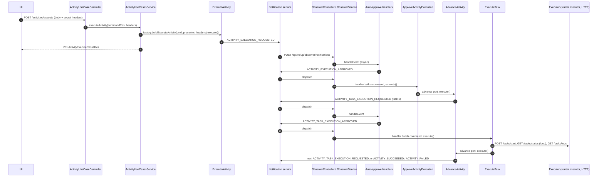

# SPDD Interfaces: Full Control Happy Path — end-to-end flow

Story **BDMD-5437**. Companion to the analysis `spdd/analysis/BDMD-5437-202609231743-[Analysis]-full-control-happy-path.md` (revision 11). References such as **DD-15** point to that file's design decisions.

**Purpose.** This document follows one activity through the whole process, from the REST call to the final event. At each step it defines the interfaces involved:

- the HTTP contract;
- the controller and the use-cases service;
- the command and the presenter;
- the factory and the use case procedure;
- the outbound ports;
- the events, the handlers, and the shared components;
- the executor API and the starter executor.

The goal is to check that every step has the data it needs before the REASONS Canvas.

**Status: final, ready for the REASONS Canvas.**

- Every choice that was an assumption is marked **[I-nn]** and collected in [Interface questions](#12-interface-questions).
- I-01 to I-16 were accepted on 2026-09-28. Some were then updated at the final design review, as noted in §12.
- I-17 to I-23 were accepted on 2026-09-29, as proposed.
- No interface question is open.
- Java signatures are illustrative. They show names, inputs, and outputs, not final code.

**Revision 4 (2026-09-30).** The task execution columns are part of `activities_tasks` in Flyway `V1__init_schema.sql`. There is no `V2` migration. The analysis is at revision 7.

**Revision 5 (2026-09-30).** `Task.pipelineParameters` is a `String` column. `TaskMapper` converts that JSON. I-03 and I-18 are updated. The starter's empty start call names `executorParameters` in the 400 body. The analysis is at revision 8.

**Revision 6 (2026-09-30).** `executor_parameters` is `jsonb`. `Task.executorParameters` is a `JsonNode` with `@JdbcTypeCode(SqlTypes.JSON)`. `pipeline_parameters` stays `text`. The analysis is at revision 9.

**Revision 7 (2026-09-30).** A task's results are uploaded by the CLI from inside that task's pipeline, while Execute Task polls the same run. They are already stored when the next task resolves placeholders (analysis DD-20). The analysis is at revision 10.

**Revision 8 (2026-09-30).** The analysis flowchart of the happy path, including the optional auto-approvals, is revision 11. This document keeps the step table and the sequence diagram.

**Revision 3 (2026-09-29).** Closes I-17 to I-23 with the proposals unchanged. The analysis is at revision 6 to match (DD-33 to DD-37).

**Revision 2 (2026-09-28, after the final design review).**

- Trigger parameters are replaced by typed **executor parameters** (§2.5).
- Placeholders in pipeline parameters are resolved in S7 (§9.3).
- The activity `sortOrder` is in the request and in every event.
- There is no executor `active` flag.
- The executor start request carries no activity or task identifiers.
- The no-op executor is replaced by the HTTP client (§9.5) and the updated starter executor (§9.7).

Executor parameters are based on `agent-reports/devops-executor-parameters-research.md`.

**Conventions.**

- Packages are relative to `org.opendatamesh.platform.pp.devops`.
- Use-case class names follow Blueprint's verb style (`PublishBlueprintVersion`) (I-01).
- REST resources (`*Res`) never enter a use-case package. Commands and presenters use entities, UUIDs, or small records (norm `USE_CASE_IMPLEMENTATION.md`).

---

## 1. Overview

### 1.1 Steps

| Step | Trigger | Component | Result |
|------|---------|-----------|--------|
| S1 | `POST /api/v2/pp/devops/activities/execute` | `ExecuteActivity` use case | Activity + tasks `PENDING`, secrets cached, `ACTIVITY_EXECUTION_REQUESTED` emitted |
| S2 | Notification dispatch (any event) | Observer stack | Event routed to one handler, notification marked processed or failed |
| S3 | `ACTIVITY_EXECUTION_REQUESTED` | Auto-approve handler (Policy inactive) | `ACTIVITY_EXECUTION_APPROVED` emitted |
| S4 | `ACTIVITY_EXECUTION_APPROVED` | `ApproveActivityExecution` use case | Activity `RUNNING`, then S5 in process |
| S5 | Called by S4 and S7 | `AdvanceActivity` use case | `ACTIVITY_TASK_EXECUTION_REQUESTED` for the first `PENDING` task, **or** activity closed with `ACTIVITY_SUCCEEDED` / `ACTIVITY_FAILED` |
| S6 | `ACTIVITY_TASK_EXECUTION_REQUESTED` | Auto-approve handler (Policy inactive) | `ACTIVITY_TASK_EXECUTION_APPROVED` emitted |
| S7 | `ACTIVITY_TASK_EXECUTION_APPROVED` | `ExecuteTask` use case | Task `RUNNING` → pipeline parameters resolved → run started on the executor → status read until the run ends → log stored → task `SUCCEEDED`/`FAILED`, then S5 in process |
| S8 | S5 closes the activity | — | `ACTIVITY_SUCCEEDED` / `ACTIVITY_FAILED` consumed by external observers |

### 1.2 Sequence (component level)



### 1.3 Package map

| Package | Contents |
|---------|----------|
| `rest.v2.controllers` | `ActivityUseCaseController` (new), `ObserverController` (new), `ActivityController` (CRUD, writes `@Hidden`) |
| `rest.v2.resources.activity` | `ActivityRes`, `TaskRes` (extended), `ExecutorParametersRes` and its parts (new), mappers |
| `rest.v2.resources.activity.usecases.execute` | `ActivityExecuteCommandRes`, `ActivityExecuteResultRes` |
| `rest.v2.resources.activity.events.emitted` / `.received` | Event resources emitted and received by DevOps use cases |
| `rest.v2.resources.event` | `EventTypeRes`, `EventTypeVersion`, `ResourceType` |
| `rest.v2.resources.event.autoapprove` | Approved events emitted by the auto-approvers |
| `rest.v2.resources.notification` | `NotificationDispatchRes` |
| `activity.entities` | `Task` (extended), `ExecutorParameters`, `RepositoryCoordinates`, `GitRef`, `GitRefType` (new, stored as JSON) |
| `activity.services` | `ActivityUseCasesService` (new) |
| `activity.services.usecases.execute` | `ExecuteActivity*` |
| `activity.services.usecases.approveexecution` | `ApproveActivityExecution*` + approved-event handler |
| `activity.services.usecases.advance` | `AdvanceActivity*` |
| `activity.services.usecases.executetask` | `ExecuteTask*` + approved-event handler |
| `activity.services.usecases.approveexecutionrequest` | Auto-approve handler + service for activity requests |
| `activity.services.usecases.approvetaskexecutionrequest` | Auto-approve handler + service for task requests |
| `observer` | `ObserverService` |
| `utils.usecases` | `NotificationEventHandler` (new), existing `UseCase`, `TransactionalOutboundPort` |
| `utils.parameters` | `PipelineParameterPlaceholders` (new, placeholder resolution, ported from v1 `VariableTemplateUtils`) **[I-19]** |
| `client.notification` | Existing client + `NotificationClientEventSubscriber` (new) |
| `client.executor` | `ExecutorClientFactory`, `ExecutorClient`, `ExecutorClientConfig`, HTTP implementations, resources |
| `executor` | `ExecutorServicesProperties`, `ExecutionMode`, `ExecutorRunStatus`, `ExecutorInfo`, `ExecutorSecretsStore` (I-02) |

Interfaces under `client/**` are replaced with Mockito mocks in tests by the existing `TestConfig.mockClientsRegistrar`, as in the Registry. `ExecutorClientFactory` lives there, so integration tests can script run outcomes, including failures (§9.5).

---

## 2. Shared model changes

### 2.1 Entities

```java
// activity.entities.ExecutionStatus — CANCELLED renamed (DD-13)
public enum ExecutionStatus { PENDING, RUNNING, SUCCEEDED, FAILED, CANCELED }

// activity.entities.Task — new fields (DD-10)
@Column(name = "executor_name", length = 255)
private String executorName;

@Column(name = "executor_parameters", columnDefinition = "jsonb")
@JdbcTypeCode(SqlTypes.JSON)
private JsonNode executorParameters;                            // I-03

@Column(name = "pipeline_parameters", columnDefinition = "text")
private String pipelineParameters;                              // I-03
```

`ExecutorParameters` and its parts are plain value classes in `activity.entities` (§2.5), not JPA entities. `Task.executorParameters` is the JSON document itself, a `JsonNode`, the same shape as `DataProductVersion.content` and `BlueprintVersion.content`. `TaskMapper` converts that node to and from `ExecutorParametersRes`. `pipeline_parameters` is a `String`, the same shape as Notification `Event.eventContent`. `Activity`, `TaskLog`, and `TaskResult` are unchanged. A missing pipeline-parameter map is a null string.

### 2.2 Flyway `V1__init_schema.sql`

The schema has not been deployed, so the three columns are part of `activities_tasks` in `V1`. There is no `V2` migration and no `NOT NULL`:

```sql
executor_name         varchar(255),
executor_parameters   jsonb,
pipeline_parameters   text,
```

### 2.3 REST resources

```java
// rest.v2.resources.activity.ActivityRes — unchanged fields, now used by execute
private Integer sortOrder;          // the activity's position among the DPV's activities; REQUIRED on execute (DD-08)

// rest.v2.resources.activity.TaskRes — new fields
@Schema(description = "Name of the executor, as declared in DevOps configuration")
private String executorName;

@Schema(description = "What the executor needs to find and start the pipeline. Not secret: stored, returned, and sent in events.")
private ExecutorParametersRes executorParameters;

@Schema(description = "Arguments passed to the pipeline run. Values may contain ${…} placeholders. Not secret.")
private Map<String, String> pipelineParameters;
```

`ExecutorParametersRes`, `RepositoryCoordinatesRes`, and `GitRefRes` mirror the entity value classes of §2.5 field by field.

**CRUD impact (BDMD-5436 code).**

- `TaskMapper` maps the new fields. `executorParameters` is converted between `ExecutorParametersRes` and `JsonNode` (`executorParametersToJsonNode` / `jsonNodeToExecutorParameters`). `pipelineParameters` is converted between the map and the stored string (`pipelineParametersToString` / `stringToPipelineParameters`). A null value stays null.
- `ActivityServiceImpl.copyTaskScalars` copies the `JsonNode` and the pipeline-parameter string on overwrite. Without that, a use-case save through `overwrite` would drop them.
- `validate` enforces the length of `executorName`. It does not replace a null pipeline-parameter string.

### 2.4 Parameter lifecycle

| Stage | Where | Executor parameters | Pipeline parameters |
|-------|-------|---------------------|---------------------|
| In | S1 body (`TaskRes`) | Built by the UI from the DPV and the data product it holds (§2.5) | Built by the UI. Values may contain `${…}` |
| Checked | S1 `validateCommand` | Required. `repository.providerType`, `ref.name`, and `ref.type` are required. Everything else is optional **[I-18]** | Shape only: a missing map stays null, and a blank key or a null value is refused **[I-18]** |
| Stored | S1 → `activities_tasks` | JSON, as received | JSON, **as received** (placeholders kept) |
| Shown | S1 response, `GET /activities/{uuid}` | As stored | As stored |
| Emitted | Requested and completion events (DD-24) | As stored. The Policy service checks them against the descriptor | As stored |
| Resolved | S7, just before start (DD-21) | Not resolved | `${…}` replaced from earlier results. Unresolved placeholders are left unchanged |
| **Used** | **S7 `startRun`** | **Sent unchanged** in `ExecutorTaskStartCommandRes` | **Resolved values sent** in `ExecutorTaskStartCommandRes` |
| Not used | S7 status and log reads | Only `providerRunId` is sent **[I-17]** | — |

**Rules.**

- **Neither group is secret.** Credentials go only in the secret headers (DD-30). This goes in the `TaskRes` schema descriptions and in `docs/`.
- **DevOps never branches on their content.** The executor contract says how each executor reads them.

### 2.5 Executor parameters type

**Shape** (entity value classes. The REST and client resources have the same fields).

```java
public class ExecutorParameters {
    private String repositoryKey;                 // optional; null = the data product's main repository
    private RepositoryCoordinates repository;     // required
    private GitRef ref;                           // required
    private String pipelineIdentifier;            // optional; provider-neutral, interpreted by the executor
}

public class RepositoryCoordinates {              // field names mirror Registry DataProductRepoRes
    private String providerType;                  // AZURE | BITBUCKET | GITHUB | GITLAB (Registry values)   [I-21]
    private String providerBaseUrl;
    private String externalIdentifier;
    private String name;
    private String ownerId;                       // absent for additional repositories
    private String ownerType;                     // ORGANIZATION | ACCOUNT; absent for additional repositories
    private String remoteUrlHttp;
    private String defaultBranch;
}

public class GitRef {
    private String name;                          // bare name, e.g. "v1.2.0" (no refs/tags/ prefix)
    private GitRefType type;                      // a DPV execution always sends TAG
}

public enum GitRefType { TAG, BRANCH }
```

**Where the UI takes each field.** Everything is available in the Registry resources the UI already holds, except the pipeline identifier.

| Field | Main repository | Additional repository |
|-------|-----------------|-----------------------|
| `repositoryKey` | `null` | `DataProductAdditionalRepoRes.repositoryKey` |
| `repository.*` | `DataProductRes.dataProductRepo` (`DataProductRepoRes`) | `DataProductRes.additionalDataProductRepos[repositoryKey]`. There is no `ownerId` or `ownerType` |
| `ref.name` | `DataProductVersionRes.tag` | `DataProductVersionRes.additionalTags[repositoryKey].tag` |
| `ref.type` | `TAG` | `TAG` |
| `pipelineIdentifier` | Reserved key in the descriptor, read by the UI. Defining it belongs to the descriptor and builder work, outside DevOps | Same |

The ref must match its repository. Using the main tag against an additional repository would run the wrong snapshot. The UI picks both from the same `repositoryKey`.

**What each executor reads** (from the research; this belongs to the executor stories, not to DevOps):

| Provider | `pipelineIdentifier` | Repository fields used | Ref |
|----------|----------------------|------------------------|-----|
| GitHub | Workflow file name or numeric id (required) | `name`, and the owner **login** parsed from `remoteUrlHttp` (`ownerId` is numeric). The API host is derived from `providerBaseUrl` | Bare tag |
| GitLab | Not used. There is one CI file per project, and variants are selected through pipeline parameters (inputs or variables plus `rules`) | `externalIdentifier` (numeric project id), `providerBaseUrl` | Bare tag |
| Azure DevOps | Numeric pipeline id (required) | `ownerId` (project GUID). The organization comes from `providerBaseUrl` (`https://dev.azure.com/{org}`) | The executor builds `refs/tags/<name>` from the type |
| Bitbucket | Custom pipeline name (optional; null = the default pipeline for the ref) | Workspace and slug parsed from `remoteUrlHttp` (`ownerId` is not the workspace) | `ref_type` from the type |

**Why this shape.**

- **One provider-neutral `pipelineIdentifier`,** not one field per provider. The research proposed `githubWorkflowId`, `azurePipelineId`, and a Bitbucket selector. With a single string, DevOps stays unaware of providers (DD-29), and the field matches the single reserved descriptor key agreed at the review. Each executor already knows its provider.
- **`repositoryKey`** is not needed to trigger. It is kept so the Policy service can check which repository of the data product a task targets.
- **`GitRef.type`** is needed by Azure and Bitbucket. GitHub and GitLab ignore it.
- **No commit SHA.** GitHub and GitLab do not trigger on a SHA, and the version tag is enough.

---

## 3. S1 — Execute Activity

### 3.1 HTTP contract

```
POST /api/v2/pp/devops/activities/execute
Content-Type: application/json
x-odm-github-executor-secret-token: <secret>          (optional, zero or more, DD-30)
```

```json
{
  "activity": {
    "dataProductVersionUuid": "9b1e…",
    "dataProductFqn": "urn:dpds:acme:dataproducts:sales:1",
    "dataProductVersionTag": "v1.2.0",
    "name": "prod",
    "sortOrder": 2,
    "tasks": [
      {
        "name": "deploy-infrastructure",
        "description": "Terraform apply",
        "executorName": "github",
        "executorParameters": {
          "repositoryKey": "infra-repo",
          "repository": { "providerType": "GITHUB", "providerBaseUrl": "https://api.github.com",
                          "externalIdentifier": "812345", "name": "sales-infra",
                          "remoteUrlHttp": "https://github.com/acme/sales-infra.git", "defaultBranch": "main" },
          "ref": { "name": "infra-v1.2.0", "type": "TAG" },
          "pipelineIdentifier": "deploy.yml"
        },
        "pipelineParameters": { "environment": "prod" }
      },
      {
        "name": "deploy-application",
        "executorName": "github",
        "executorParameters": {
          "repository": { "providerType": "GITHUB", "providerBaseUrl": "https://api.github.com",
                          "externalIdentifier": "812300", "name": "sales-app", "ownerId": "4411", "ownerType": "ORGANIZATION",
                          "remoteUrlHttp": "https://github.com/acme/sales-app.git", "defaultBranch": "main" },
          "ref": { "name": "v1.2.0", "type": "TAG" },
          "pipelineIdentifier": "deploy.yml"
        },
        "pipelineParameters": { "environment": "prod", "infraEndpoint": "${prod.results.deploy-infrastructure.endpoint}" }
      }
    ]
  }
}
```

| Response | When |
|----------|------|
| `201 Created`, body `{ "activity": ActivityRes }`: generated UUIDs; `status: PENDING` on the activity and every task; task `sortOrder` 0..n; activity `sortOrder` as sent | Accepted |
| `400 Bad Request` (`BadRequestException`) | Validation failed, or the concurrency guard refused (§3.6) |
| `409 Conflict` | Two executes collided on commit. `ResponseExceptionHandler` already maps `ConcurrencyFailureException` to 409 |

**Ignored input.** The use case resets these fields:

- on the activity: `uuid`, `status`, `startedAt`, `finishedAt`;
- on each task: `uuid`, `status`, `providerRunId`, `startedAt`, `finishedAt`, `logs`, `results`, and `sortOrder`, which becomes the list position (I-05).

### 3.2 Controller

```java
// rest.v2.controllers.ActivityUseCaseController
@RestController
@RequestMapping(value = "/api/v2/pp/devops/activities", produces = MediaType.APPLICATION_JSON_VALUE)
@Tag(name = "Activities")
public class ActivityUseCaseController {
    @PostMapping("/execute")
    @ResponseStatus(HttpStatus.CREATED)
    public ActivityExecuteResultRes executeActivity(
            @RequestBody ActivityExecuteCommandRes executeCommand,
            @RequestHeader HttpHeaders headers) {
        return useCasesService.executeActivity(executeCommand, headers);
    }
}
```

- **Pattern:** Registry `DataProductVersionUseCaseController.publishDataProductVersion`.
- **Header parameter:** `@RequestHeader HttpHeaders`, as in Registry `DataProductRepositoryController`.

### 3.3 REST resources

```java
// rest.v2.resources.activity.usecases.execute
public class ActivityExecuteCommandRes { private ActivityRes activity; }
public class ActivityExecuteResultRes  { private ActivityRes activity; }
```

**Pattern:** `DataProductVersionPublishCommandRes` / `DataProductVersionPublishResultRes`.

### 3.4 Use-cases service

```java
// activity.services.ActivityUseCasesService
public ActivityExecuteResultRes executeActivity(ActivityExecuteCommandRes commandRes, HttpHeaders headers) {
    if (commandRes == null || commandRes.getActivity() == null) throw new BadRequestException("Activity cannot be null");
    ExecuteActivityCommand command = new ExecuteActivityCommand(activityMapper.toEntity(commandRes.getActivity()));
    ActivityExecuteResultHolder holder = new ActivityExecuteResultHolder();
    executeActivityFactory.buildExecuteActivity(command, holder, headers).execute();
    return new ActivityExecuteResultRes(activityMapper.toRes(holder.getResult()));
}
```

**Pattern:** `DataProductVersionsUseCasesService.publishDataProductVersion`. The headers go to the factory, as in Blueprint `BlueprintVersionUseCasesService.buildInstantiateBlueprintVersion(command, presenter, headers)` (I-06).

### 3.5 Command, presenter, factory

```java
public record ExecuteActivityCommand(Activity activity) {}

public interface ExecuteActivityPresenter {
    void presentActivityExecutionRequested(Activity activity);
}

@Component
public class ExecuteActivityFactory {
    // injects: ActivityService, ActivityMapper, NotificationClient, ExecutorServicesProperties,
    //          ExecutorSecretsStore, TransactionalOutboundPort
    public UseCase buildExecuteActivity(ExecuteActivityCommand command,
                                        ExecuteActivityPresenter presenter,
                                        HttpHeaders headers) { … }
}
```

### 3.6 Use case procedure (`ExecuteActivity.execute()`)

```text
validateCommand
  activity present; dataProductVersionUuid, name, sortOrder present                    (DD-08)
  at least one task
  each task: name, executorName, executorParameters present
             executorParameters.repository.providerType, ref.name, ref.type present   [I-18]
             pipelineParameters: null stays null; blank key or null value -> BadRequest [I-18]
validateExecutors
  for each distinct executorName: executorPort.findExecutor(name)
    missing            -> BadRequest "Executor <name> is not declared"
    mode INSTRUMENTED  -> BadRequest "Executor <name> runs in instrumented mode, not supported yet"   (DD-11)
transactionalPort.doInTransaction:
  refuseIfAnotherExecutionIsOpen
    persistencePort.findActivities(dpvUuid, name, {PENDING, RUNNING}) not empty -> BadRequest   (DD-12)
  prepareForExecution
    activity: uuid=null, status=PENDING, startedAt=null, finishedAt=null (sortOrder kept)
    tasks: uuid=null, status=PENDING, sortOrder=list index, providerRunId=null, timestamps=null, logs=[], results=[]
  activity = persistencePort.create(activity)
  secretsPort.storeExecutorSecrets(activity)
  notificationPort.emitActivityExecutionRequested(activity)      (DD-27: last step in the transaction)
  presenter.presentActivityExecutionRequested(activity)
```

### 3.7 Outbound ports

```java
interface ExecuteActivityPersistenceOutboundPort {
    List<Activity> findActivities(String dataProductVersionUuid, String activityName, Set<ExecutionStatus> statuses); // I-07
    Activity create(Activity activity);                          // activityService.create
}

interface ExecuteActivityExecutorOutboundPort {
    Optional<ExecutorInfo> findExecutor(String executorName);    // from ExecutorServicesProperties
}

interface ExecuteActivitySecretsOutboundPort {
    void storeExecutorSecrets(Activity activity);
    // impl: holds the request HttpHeaders (from the factory). For each distinct task executorName, keeps headers
    // matching x-odm-<executorName>-executor-secret-<type>, rewrites them to x-odm-<type>, and calls
    // ExecutorSecretsStore.store(executorName, activity.getUuid(), rewritten). Nothing is logged.
}

interface ExecuteActivityNotificationOutboundPort {
    void emitActivityExecutionRequested(Activity activity);
    // impl: EmittedEventActivityExecutionRequestedRes with the activity mapped without logs/results (I-08)
}
```

### 3.8 Emitted event

```json
{
  "resourceType": "ACTIVITY",
  "resourceIdentifier": "<activityUuid>",
  "type": "ACTIVITY_EXECUTION_REQUESTED",
  "eventTypeVersion": "V2.0.0",
  "eventContent": {
    "activity": { "uuid": "…", "dataProductVersionUuid": "…", "dataProductFqn": "…", "dataProductVersionTag": "…",
                  "name": "prod", "sortOrder": 2, "status": "PENDING",
                  "tasks": [ { "uuid": "…", "name": "deploy-infrastructure", "sortOrder": 0, "status": "PENDING",
                               "executorName": "github", "executorParameters": {…}, "pipelineParameters": {…} } ] }
  }
}
```

- Resource: `EmittedEventActivityExecutionRequestedRes`.
- **Pattern:** `EmittedEventDataProductInitializationRequestedRes`.
- The event does not carry the other activities of the DPV. That is deferred to the Policy stories **[I-20]**.

---

## 4. S2 — Notification delivery to DevOps (shared by S3, S4, S6, S7)

### 4.1 Startup subscription

`NotificationClientEventSubscriber` implements `SmartInitializingSingleton`. After startup it subscribes to every `EventTypeRes` value that a mounted handler supports. It registers DevOps as an observer with `server.baseUrl` and `devops.observer.name` / `displayName`.

With Policy inactive, the subscribed types are:

- `ACTIVITY_EXECUTION_REQUESTED`
- `ACTIVITY_EXECUTION_APPROVED`
- `ACTIVITY_TASK_EXECUTION_REQUESTED`
- `ACTIVITY_TASK_EXECUTION_APPROVED`

**Pattern:** Registry `NotificationClientEventSubscriber`.

### 4.2 Inbound HTTP contract

```
POST /api/v2/up/observer/notifications      -> 200 (processing continues asynchronously)
```

```json
{
  "sequenceId": 101,
  "event": {
    "sequenceId": 42,
    "resourceType": "ACTIVITY",
    "resourceIdentifier": "<activityUuid>",
    "type": "ACTIVITY_EXECUTION_APPROVED",
    "eventTypeVersion": "V2.0.0",
    "eventContent": { "activity": { "uuid": "…", "name": "prod", "sortOrder": 2, "dataProductVersionUuid": "…" } }
  },
  "subscription": { "name": "devops", "displayName": "DevOps", "observerBaseUrl": "…", "observerApiVersion": "V2" }
}
```

`NotificationDispatchRes` is copied from the Registry.

### 4.3 Components

```java
// rest.v2.controllers.ObserverController
@PostMapping("/notifications") @ResponseStatus(HttpStatus.OK)
public void processNotification(@RequestBody NotificationDispatchRes notification) { observerService.processNotification(notification); }

// observer.ObserverService
@Async
public void processNotification(NotificationDispatchRes notification) {
    // resolve EventTypeRes.fromString(type); unknown type or no handler -> log info, then processingSuccess
    // first handler with supportsEventType(type) -> handleEvent(event)
    // success -> notificationClient.processingSuccess(sequenceId)
    // DevOpsApiException -> warn + processingFailure; other Exception -> error + processingFailure
}

// utils.usecases.NotificationEventHandler
public interface NotificationEventHandler {
    boolean supportsEventType(EventTypeRes eventType);
    void handleEvent(NotificationDispatchEventRes event);
}

// rest.v2.resources.event
public enum EventTypeRes {
    ACTIVITY_EXECUTION_REQUESTED, ACTIVITY_TASK_EXECUTION_REQUESTED,
    ACTIVITY_SUCCEEDED, ACTIVITY_FAILED, ACTIVITY_CANCELED,
    ACTIVITY_EXECUTION_APPROVED, ACTIVITY_EXECUTION_REJECTED,
    ACTIVITY_TASK_EXECUTION_APPROVED, ACTIVITY_TASK_EXECUTION_REJECTED;
    public static EventTypeRes fromString(String value) { … }
}
public enum ResourceType { ACTIVITY }
public enum EventTypeVersion { V2_0_0 }   // serialized "V2.0.0"
```

- `@EnableAsync` goes on `DevOpsApplication` (DD-26). In tests, the existing `SyncTaskExecutor` keeps processing synchronous.
- **Pattern:** Registry `ObserverController`, `ObserverService`, and `NotificationEventHandler`.

---

## 5. S3 — Auto-approve the activity request (Policy inactive)

```java
// activity.services.usecases.approveexecutionrequest
@Component
@ConditionalOnProperty(name = "odm.product-plane.policy-service.active", havingValue = "false", matchIfMissing = true)
public class ActivityExecutionRequestApproverNotificationEventHandler implements NotificationEventHandler {
    supportsEventType: ACTIVITY_EXECUTION_REQUESTED
    handleEvent: convert to ReceivedEventActivityExecutionRequestedRes (BadRequest when content or activity is missing)
                 -> approverService.emitActivityExecutionApprovedEvent(activityRes)
}

@Service
public class ActivityExecutionRequestApproverService {
    public void emitActivityExecutionApprovedEvent(ActivityRes activity);
    // EmittedEventActivityExecutionApprovedRes (resourceIdentifier = activity uuid,
    // content.activity = { uuid, name, sortOrder, dataProductVersionUuid }) -> notificationClient.notifyEvent
}
```

- There is no use case, no check, and no rejection (DD-25).
- **Pattern:** `DataProductInitializationApproverNotificationEventHandler` / `DataProductInitializationApproverService`, and `event.autoapprove.EmittedEventDataProductInitializationApprovedRes`.

```json
{ "resourceType": "ACTIVITY", "resourceIdentifier": "<activityUuid>", "type": "ACTIVITY_EXECUTION_APPROVED",
  "eventTypeVersion": "V2.0.0",
  "eventContent": { "activity": { "uuid": "<activityUuid>", "name": "prod", "sortOrder": 2, "dataProductVersionUuid": "…" } } }
```

---

## 6. S4 — Approve Activity Execution

### 6.1 Handler

```java
// activity.services.usecases.approveexecution
@Component
public class ActivityExecutionApprovedNotificationEventHandler implements NotificationEventHandler {
    supportsEventType: ACTIVITY_EXECUTION_APPROVED
    handleEvent: convert to ReceivedEventActivityExecutionApprovedRes; require content.activity.uuid (BadRequest)
                 -> factory.buildApproveActivityExecution(new ApproveActivityExecutionCommand(uuid), activity -> {}).execute()
}
```

**Pattern:** `DataProductApprovedNotificationEventHandler`. The command takes the UUID directly (I-10).

### 6.2 Command, presenter, factory

```java
public record ApproveActivityExecutionCommand(String activityUuid) {}

public interface ApproveActivityExecutionPresenter {
    void presentActivityExecutionApproved(Activity activity);
}

@Component
public class ApproveActivityExecutionFactory {
    // injects: ActivityService, TransactionalOutboundPort, AdvanceActivityFactory
    public UseCase buildApproveActivityExecution(ApproveActivityExecutionCommand command,
                                                 ApproveActivityExecutionPresenter presenter) { … }
}
```

### 6.3 Use case procedure

```text
validateCommand: activityUuid present
activity = transactionalPort.doInTransactionWithResults:
  activity = persistencePort.findActivity(activityUuid)            (NotFound if missing)
  requirePending: status != PENDING -> BadRequest "Activity <uuid> can be approved only if PENDING"   (DD-14)
  status = RUNNING, startedAt = now
  persistencePort.save(activity)
presenter.presentActivityExecutionApproved(activity)
advancePort.advanceActivity(activity.getUuid())                   (after commit, DD-17)
```

### 6.4 Outbound ports

```java
interface ApproveActivityExecutionPersistenceOutboundPort {
    Activity findActivity(String activityUuid);                   // activityService.findOne
    Activity save(Activity activity);                             // activityService.overwrite(uuid, activity)
}

interface ApproveActivityExecutionAdvanceActivityOutboundPort {
    void advanceActivity(String activityUuid);
    // impl: advanceActivityFactory.buildAdvanceActivity(new AdvanceActivityCommand(uuid), activity -> {}).execute()
}
```

**Pattern:** Blueprint `EvaluateProtectedResourcesIntegrityInstantiateOutboundPortImpl`.

---

## 7. S5 — Advance Activity

### 7.1 Command, presenter, factory

```java
public record AdvanceActivityCommand(String activityUuid) {}

public interface AdvanceActivityPresenter {
    void presentActivityAdvanced(Activity activity);              // I-11
}

@Component
public class AdvanceActivityFactory {
    // injects: ActivityService, ActivityMapper, TaskMapper, NotificationClient, ExecutorSecretsStore,
    //          TransactionalOutboundPort
    public UseCase buildAdvanceActivity(AdvanceActivityCommand command, AdvanceActivityPresenter presenter) { … }
}
```

### 7.2 Use case procedure

```text
validateCommand: activityUuid present
outcome = transactionalPort.doInTransactionWithResults:
  activity = persistencePort.findActivity(activityUuid)
  requireRunning: status != RUNNING -> BadRequest                              (I-12)
  tasks = activity.tasks ordered by sortOrder
  if any task FAILED:                                                          (DD-15.1)
     cancelPendingTasks: each PENDING task -> CANCELED, finishedAt = now
     activity -> FAILED, finishedAt = now; save
     notificationPort.emitActivityFailed(activity)
     -> CLOSED
  else if all tasks SUCCEEDED:                                                 (DD-15.2)
     activity -> SUCCEEDED, finishedAt = now; save
     notificationPort.emitActivitySucceeded(activity)
     -> CLOSED
  else if any task RUNNING:                                                    (DD-15.3)
     -> NOTHING_TO_DO
  else:                                                                        (DD-15.4)
     next = first PENDING task by sortOrder
     notificationPort.emitTaskExecutionRequested(activity, next)
     -> TASK_REQUESTED
if outcome == CLOSED: secretsPort.removeExecutorSecrets(activity)              (after commit, DD-30)
presenter.presentActivityAdvanced(activity)
```

### 7.3 Outbound ports

```java
interface AdvanceActivityPersistenceOutboundPort {
    Activity findActivity(String activityUuid);
    Activity save(Activity activity);
}

interface AdvanceActivityNotificationOutboundPort {
    void emitTaskExecutionRequested(Activity activity, Task task);   // EmittedEventActivityTaskExecutionRequestedRes
    void emitActivitySucceeded(Activity activity);                    // EmittedEventActivitySucceededRes
    void emitActivityFailed(Activity activity);                       // EmittedEventActivityFailedRes
}

interface AdvanceActivitySecretsOutboundPort {
    void removeExecutorSecrets(Activity activity);                    // ExecutorSecretsStore.removeAll(activityUuid)
}
```

### 7.4 Emitted events

```json
{ "resourceType": "ACTIVITY", "resourceIdentifier": "<activityUuid>", "type": "ACTIVITY_TASK_EXECUTION_REQUESTED",
  "eventTypeVersion": "V2.0.0",
  "eventContent": { "activity": { …ActivityRes with sortOrder, tasks without logs/results… },
                    "task": { …TaskRes of the requested task… } } }
```

```json
{ "resourceType": "ACTIVITY", "resourceIdentifier": "<activityUuid>", "type": "ACTIVITY_SUCCEEDED",
  "eventTypeVersion": "V2.0.0", "eventContent": { "activity": { …ActivityRes with sortOrder, status SUCCEEDED… } } }
```

`ACTIVITY_FAILED` has the same shape as `ACTIVITY_SUCCEEDED`, with `status: FAILED`.

---

## 8. S6 — Auto-approve the task request (Policy inactive)

```java
// activity.services.usecases.approvetaskexecutionrequest
@Component @ConditionalOnProperty(…same as S3…)
public class ActivityTaskExecutionRequestApproverNotificationEventHandler implements NotificationEventHandler {
    supportsEventType: ACTIVITY_TASK_EXECUTION_REQUESTED
    handleEvent: convert to ReceivedEventActivityTaskExecutionRequestedRes; require activity and task
                 -> approverService.emitActivityTaskExecutionApprovedEvent(activityRes, taskRes)
}

@Service
public class ActivityTaskExecutionRequestApproverService {
    public void emitActivityTaskExecutionApprovedEvent(ActivityRes activity, TaskRes task);
    // EmittedEventActivityTaskExecutionApprovedRes:
    //   content.activity = { uuid, name, sortOrder, dataProductVersionUuid }, content.task = { uuid, name }
}
```

```json
{ "resourceType": "ACTIVITY", "resourceIdentifier": "<activityUuid>", "type": "ACTIVITY_TASK_EXECUTION_APPROVED",
  "eventTypeVersion": "V2.0.0",
  "eventContent": { "activity": { "uuid": "…", "name": "prod", "sortOrder": 2, "dataProductVersionUuid": "…" },
                    "task": { "uuid": "<taskUuid>", "name": "deploy-infrastructure" } } }
```

---

## 9. S7 — Execute Task

### 9.1 Handler

```java
// activity.services.usecases.executetask
@Component
public class ActivityTaskExecutionApprovedNotificationEventHandler implements NotificationEventHandler {
    supportsEventType: ACTIVITY_TASK_EXECUTION_APPROVED
    handleEvent: convert to ReceivedEventActivityTaskExecutionApprovedRes; require activity.uuid and task.uuid
                 -> factory.buildExecuteTask(new ExecuteTaskCommand(activityUuid, taskUuid), task -> {}).execute()
}
```

The handler runs on the async observer thread, so the whole run is followed there (DD-19, DD-26).

### 9.2 Command, presenter, factory

```java
public record ExecuteTaskCommand(String activityUuid, String taskUuid) {}

public interface ExecuteTaskPresenter {
    void presentTaskExecuted(Task task);
}

@Component
public class ExecuteTaskFactory {
    // injects: ActivityService, ExecutorServicesProperties, ExecutorClientFactory, TransactionalOutboundPort,
    //          AdvanceActivityFactory, executor polling settings (I-13)
    public UseCase buildExecuteTask(ExecuteTaskCommand command, ExecuteTaskPresenter presenter) { … }
}
```

### 9.3 Use case procedure

```text
validateCommand: activityUuid and taskUuid present
task = transactionalPort.doInTransactionWithResults:                          (tx 1)
  activity = persistencePort.findActivity(activityUuid)
  requireRunning(activity)                    -> BadRequest otherwise
  task = activity task with taskUuid          -> NotFound otherwise
  requirePending(task)                        -> BadRequest otherwise (duplicate / late approval, DD-16)
  task -> RUNNING, startedAt = now; save
if executorPort.findExecutionMode(task.executorName) != FULL_CONTROL:
  presenter.presentTaskExecuted(task); return                                  (DD-18; unreachable in this story, DD-11)
pipelineParameters = parametersPort.resolvePipelineParameters(task)           (DD-21; parse the stored string; stored values unchanged)
providerRunId = executorPort.startRun(task, pipelineParameters)               (no transaction, DD-22)
recordProviderRunId(activityUuid, taskUuid, providerRunId)                    (tx 2)
runStatus = followRunUntilItEnds(task):
  attempt = 0
  status = executorPort.readRunStatus(task)
  while status == RUNNING:
     executorPort.waitBeforeNextStatusRead(task, ++attempt)                   (I-13)
     status = executorPort.readRunStatus(task)
log = executorPort.readRunLog(task)                                           (once, DD-20)
// The CLI uploads this task's results from inside its pipeline while the status is polled.
// Only that pipeline writes this task's results, so the rows are stored before the next task starts (DD-20).
recordRunOutcome(activityUuid, taskUuid, runStatus, log):                     (tx 3, reloads the activity)
  task.logs += log (if present)
  task.status = SUCCEEDED | FAILED, finishedAt = now; save
presenter.presentTaskExecuted(task)
advancePort.advanceActivity(activityUuid)                                     (after commit)
```

### 9.4 Outbound ports

```java
interface ExecuteTaskPersistenceOutboundPort {
    Activity findActivity(String activityUuid);
    Activity save(Activity activity);
}

interface ExecuteTaskPipelineParametersOutboundPort {
    Map<String, String> resolvePipelineParameters(Task task);
    // impl: builds the results context of task.activity's DPV (ActivityService, read transaction) and replaces
    // ${<activityName>.results.<taskName>.<path>} in each value with PipelineParameterPlaceholders.
    // Unresolved placeholders are left unchanged. Pattern: v1 VariableTemplateUtils + ActivityService.createContext.  [I-19]
    // Earlier results are already stored: the CLI wrote them inside that task's pipeline before its run went terminal (DD-20).
}

interface ExecuteTaskExecutorOutboundPort {
    ExecutionMode findExecutionMode(String executorName);                      // ExecutorServicesProperties
    String startRun(Task task, Map<String, String> resolvedPipelineParameters); // -> providerRunId
    ExecutorRunStatus readRunStatus(Task task);                                // RUNNING | SUCCEEDED | FAILED
    void waitBeforeNextStatusRead(Task task, int attempt);                     // back-off (I-13)
    Optional<TaskLog> readRunLog(Task task);                                   // one block (I-14)
    // impl: client = executorClientFactory.getExecutorClient(task.getExecutorName(), task.getActivity().getUuid())
    //   startRun      -> client.startTask(new ExecutorTaskStartCommandRes(executorParameters of task, resolved params))
    //   readRunStatus -> client.getTaskStatus(providerRunId), mapped to ExecutorRunStatus
    //   readRunLog    -> client.getTaskLogs(providerRunId), mapped to TaskLog (no row if content is empty)
}

interface ExecuteTaskAdvanceActivityOutboundPort {
    void advanceActivity(String activityUuid);
}
```

### 9.5 Executor client (shared, `client.executor`)

```java
public interface ExecutorClientFactory {
    ExecutorClient getExecutorClient(String executorName, String activityUuid);
    // resolves the executor's address (ExecutorServicesProperties) and attaches the cached secret headers
    // of (executorName, activityUuid) from ExecutorSecretsStore.
    // Pattern: v1 DevOpsClients.getExecutorClient(adapterName, activityId); Blueprint GitProviderFactory.
}

public interface ExecutorClient {
    ExecutorTaskStartResultRes startTask(ExecutorTaskStartCommandRes command);
    ExecutorTaskStatusRes getTaskStatus(String providerRunId);
    ExecutorTaskLogsRes getTaskLogs(String providerRunId);
}

// resources — no activity or task identifiers are sent (DD-05)
public class ExecutorTaskStartCommandRes { ExecutorParametersRes executorParameters; Map<String, String> pipelineParameters; }
public class ExecutorTaskStartResultRes  { String providerRunId; }
public class ExecutorTaskStatusRes       { String providerRunId; String status; }   // RUNNING | SUCCEEDED | FAILED  [I-23]
public class ExecutorTaskLogsRes         { String content; Date generatedAt; }
```

**Implementation.** `ExecutorClientConfig` builds `ExecutorClientFactoryImpl`. For each call, it returns an `ExecutorClientImpl` that holds the executor address and the secret headers, and calls through `RestUtils`.

- **Pattern:** `NotificationClientConfig` / `NotificationClientImpl`.
- There is no dummy fallback. An executor is either declared, with an address, or refused at execute.

**Executor v2 HTTP API** (contract implemented by the starter executor, and later by the provider executors):

| Call | HTTP |
|------|------|
| startTask | `POST {address}/api/v2/up/executor/tasks/start`, body `ExecutorTaskStartCommandRes` → `ExecutorTaskStartResultRes` |
| getTaskStatus | `GET {address}/api/v2/up/executor/tasks/status?providerRunId=…` → `ExecutorTaskStatusRes` |
| getTaskLogs | `GET {address}/api/v2/up/executor/tasks/logs?providerRunId=…` → `ExecutorTaskLogsRes` |
| every call | Headers: the cached secrets, rewritten to `x-odm-<secretType>` |

**Executor obligations** (from the research; to be written into the executor contract):

- **Returning the run id.** Return the run id from `start`. For example, the GitHub executor pins API version `2026-03-10`, or sends `return_run_details: true`. Without that, GitHub's dispatch returns `204` with no run id.
- **Finding the run later.** Keep enough to find the run again from `providerRunId` alone (I-17).
- **One log block.** Aggregate the logs into one block. GitLab logs are per job, Azure per log id, Bitbucket per step.
- **Status mapping.** Map provider statuses to `RUNNING` / `SUCCEEDED` / `FAILED` (I-23).
- **Passing pipeline parameters.** Put them on the right channel for the provider:
  - GitHub: declared `inputs`, at most 25;
  - GitLab: `inputs` (at most 20) or `variables`;
  - Azure: `templateParameters` or `variables`;
  - Bitbucket: `variables`.

**Tests.** `ExecutorClientFactory` lives under `client/**`, so `TestConfig` replaces it with a mock in DevOps integration tests. Each test scripts a mock `ExecutorClient`: running then succeeded, failed, or several tasks. End-to-end runs use the real client against the starter executor (§9.7).

### 9.6 Shared executor components (`executor`)

```java
@ConfigurationProperties(prefix = "odm.utility-plane")
public class ExecutorServicesProperties {
    private Map<String, ExecutorServiceProperties> executorServices = new LinkedHashMap<>();
    public static class ExecutorServiceProperties {
        private String address;                   // required
        private ExecutionMode executionMode;      // required; startup fails otherwise (DD-04)
    }
}

public enum ExecutionMode { FULL_CONTROL, INSTRUMENTED }          // YAML: full-control | instrumented
public enum ExecutorRunStatus { RUNNING, SUCCEEDED, FAILED }
public record ExecutorInfo(String name, ExecutionMode executionMode) {}

public interface ExecutorSecretsStore {
    void store(String executorName, String activityUuid, Map<String, String> secretHeaders);
    Map<String, String> find(String executorName, String activityUuid);   // empty map when absent or expired
    void removeAll(String activityUuid);
    // impl: Caffeine cache, key "<executorName>-ID-<activityUuid>", expireAfterWrite 1h (v1, I-16)
}
```

```yaml
odm:
  utility-plane:
    executor-services:
      starter:
        address: http://localhost:9080
        execution-mode: full-control
```

### 9.7 Starter executor (`odm-platform-adapter-devops-executor-starter`)

**Today.** It is a v1 dummy executor:

- Spring Boot 2.7.5 on Java 11;
- `POST /api/v1/up/executor/tasks`, which sleeps five seconds and then PATCHes the v1 callback;
- it logs every request header value, including secrets;
- a `TaskRun` class that is not a JPA entity, and H2 and JPA dependencies that are unused.

**Target.** A reference implementation of the executor v2 API (§9.5) that simulates pipeline runs, for end-to-end tests and demos.

| Endpoint | Behaviour |
|----------|-----------|
| `POST /api/v2/up/executor/tasks/start` | The controller checks that `executorParameters` is present. A missing value is `400`, and the body names `executorParameters` (`server.error.include-message: always`). No bean validation. Creates an in-memory run: `providerRunId` = `starter-<uuid>`, start time, planned duration, planned outcome, the received parameters, and the **names** of the `x-odm-*` headers received. Returns `{ providerRunId }` |
| `GET /api/v2/up/executor/tasks/status?providerRunId=` | `RUNNING` until the planned duration has passed, then the planned outcome (`SUCCEEDED` or `FAILED`). `404` for an unknown id |
| `GET /api/v2/up/executor/tasks/logs?providerRunId=` | One synthetic block, with `generatedAt`. It lists: run id; repository name and `repositoryKey`; ref; pipeline identifier; the pipeline parameters as received (already resolved by DevOps); the secret header names; start and end times; the outcome. `404` for an unknown id |

**Simulation controls [I-22]:**

- defaults from configuration: `executor.simulation.run-duration`, for example `5s`, and `executor.simulation.outcome` = `SUCCEEDED`;
- per-run overrides through reserved pipeline parameters: `starter.outcome` (`SUCCEEDED` | `FAILED`) and `starter.durationSeconds`. The starter plays the pipeline, so reading its own inputs is realistic.

**Other changes [I-22]:**

- remove the v1 endpoint and the callback;
- never log header values;
- keep runs in memory, and drop JPA, H2, and `TaskRun`;
- upgrade to the DevOps v2 stack (Spring Boot 3.5, Java 21);
- rewrite the README with the v2 DevOps configuration (§9.6);
- add tests with Gherkin scenarios in their Javadoc (DD-32).

---

## 10. S8 — End of the process

Advance Activity closes the activity and emits `ACTIVITY_SUCCEEDED` or `ACTIVITY_FAILED` (§7.4). DevOps does not subscribe to either. External observers consume them, for example the Blindata observer, which updates the data product on success. The activity's secrets are removed.

---

## 11. Data availability check

| Step | Needs | Source | |
|------|-------|--------|---|
| S1 | DPV identity, activity name and `sortOrder`, ordered tasks, executor name, both parameter groups | Request body (the UI builds it from the DPV and data product it holds) | ✓ |
| S1 | Pipeline identifier per task | Reserved descriptor key, read by the UI | ⚠ the reserved key is not defined yet (descriptor work, outside DevOps) |
| S1 | Whether an executor is declared, and its mode | `ExecutorServicesProperties` | ✓ |
| S1 | Open activities for DPV + name | DB via `ActivityService` | ✓ (I-07) |
| S1 | Secrets | Request headers → `ExecutorSecretsStore` | ✓ |
| S3 (future Policy) | Tasks, executor parameters, and pipeline parameters to check against the descriptor | Embedded `ActivityRes` (DD-24) | ✓ |
| S3 (future Policy) | Status of the DPV's other activities | Not carried; deferred to the Policy stories, which can read `GET /activities?dataProductVersionUuid=…` | — out of scope (I-20) |
| S4 | Activity UUID, current status | Approved event, DB | ✓ |
| S5 | All tasks with status and order | DB (activity graph) | ✓ |
| S6 | Activity + task identity | `eventContent` of the task requested event | ✓ |
| S7 | Executor name, executor parameters, stored pipeline parameters | Task row (DB) | ✓ |
| S7 | Earlier results for placeholders | `TaskResult` rows of the DPV's activities (DB) | ⚠ results are not written in this story (DD-20). Tests seed them [I-19]. Once the CLI stores them, the previous task's pipeline has already uploaded them by the time this task starts (DD-20) |
| S7 | Execution mode, executor address | `ExecutorServicesProperties` | ✓ |
| S7 | Secrets | `ExecutorSecretsStore` (executor, activity) | ⚠ lost on restart; expire one hour after S1 (DD-30) |
| S7 | Provider run id | Returned by start; kept locally and saved in tx 2 | ✓ |
| S7 (executor side) | Coordinates to read status and logs later | Kept by the executor at start | ✓ (I-17) |
| S8 | DPV identity, `sortOrder`, and final status for external consumers | Embedded `ActivityRes` | ✓ |

S1 is the only step that takes data from outside DevOps. Later steps read from the database, the configuration, or the in-memory secrets. The pipeline identifier is the one input whose source is still being defined, on the descriptor side.

---

## 12. Interface questions

**Accepted (2026-09-28).** Updates from the final review are noted in the Proposal column.

| # | Question | Proposal |
|---|----------|----------|
| I-01 | Use-case class naming | Verb style, following Blueprint `PublishBlueprintVersion`. The noun style collides with "executor". |
| I-02 | Where executor types and the secrets store live | A top-level `executor` package. The clients go in `client.executor`, so tests mock them. |
| I-03 | Persisting the parameter groups | `executor_parameters` is `jsonb`, a `JsonNode` with `@JdbcTypeCode(SqlTypes.JSON)`, as `DataProductVersion.content` and `BlueprintVersion.content`. `pipeline_parameters` is `text` stored as `String`, as Notification `Event.eventContent`. `TaskMapper` converts both. No `AttributeConverter`: a GET does not rewrite the row. *(updated 2026-09-30, revision 6)* |
| I-04 | Field names | `executorName`, `executorParameters`, `pipelineParameters` *(updated: "trigger" is now "executor", and the type is typed)*. |
| I-05 | Task order | List position. The activity `sortOrder` is taken from the body *(final review)*. |
| I-06 | Secret headers | `HttpHeaders` passed to the factory, as Blueprint does. |
| I-07 | Guard query | A dedicated core method, for example `findByDataProductVersionUuidAndNameAndStatusIn`. |
| I-08 | Logs and results in events | Not included. Tasks are embedded without logs and results. |
| I-09 | Approved-event identifier block | `activity: { uuid, name, sortOrder, dataProductVersionUuid }`, plus `task: { uuid, name }` *(sortOrder added at the final review)*. |
| I-10 | Command identifiers | UUID strings. |
| I-11 | Advance presenter | One method. |
| I-12 | Advance on a non-`RUNNING` activity | Refuse (`BadRequest`). |
| I-13 | Wait between status reads | A port method, with configurable back-off (500 ms to 60 s, as in `AsyncRestUtilsTemplate`). No attempt limit in the happy path. |
| I-14 | Log shape | One block, stored as one `TaskLog`. Empty content stores no row. The no-op line is dropped with the no-op. |
| I-15 | Executor HTTP API | The draft-board paths and the `RUNNING | SUCCEEDED | FAILED` vocabulary. The start body has no UUIDs *(final review)*. |
| I-16 | Cache library | Caffeine. |

**Accepted (2026-09-29).** Accepted as proposed. The analysis records them as DD-33 to DD-37.

| # | Question | Decision |
|---|----------|----------|
| I-17 | Status and log reads send only `providerRunId`. The research confirms that every provider needs more coordinates to read a run: owner and repository, project id, organization + project + pipeline id, or workspace + repository. | `providerRunId` is opaque and owned by the executor. The executor keeps the coordinates it needs from the start call, stored or encoded in the id, which must fit in 255 characters. DevOps stays stateless towards the executor, and the endpoints keep the draft shape. The starter keeps runs in memory. |
| I-18 | Validation at execute | **Executor parameters:** required. `repository.providerType`, `ref.name`, and `ref.type` are required. Other fields are optional, and DevOps does not enforce provider-specific requirements: a missing workflow id is the executor's error. **Pipeline parameters:** a missing map stays null, and a blank key or a null value gives 400. *(updated 2026-09-30, revision 5)* |
| I-19 | Placeholder resolution details | Only **pipeline parameter values**. Syntax `${<activityName>.results.<taskName>.<path>}` (v1). **Context:** the activities of the same DPV, keeping the latest per name by `createdAt` (any status, including the current activity). Within each activity, the latest task per name by `createdAt`. That task's `TaskResult` rows are parsed as JSON objects, non-JSON rows are ignored, and rows are merged in `generatedAt` order, so the later row wins. **Output:** scalars as text, and objects or arrays as JSON. **Unresolved:** left unchanged, with a warning that logs the placeholder path, not the values. **Stored values:** not modified. The resolved values are sent to the executor and shown in the starter's log. **Availability:** the CLI uploads a task's results from inside that task's pipeline while it runs. Only that pipeline writes that task's results. Execute Task polls until the status is terminal and then reads the logs, so the rows are already stored when the next task resolves placeholders (DD-20). |
| I-20 | Status of the DPV's other activities in the requested events, for policies such as "dev succeeded before prod" (to be evaluated, final review) | **Defer to the Policy stories.** Auto-approval does not need it, and the Policy service can read `GET /activities?dataProductVersionUuid=…`. The shape if added later: `eventContent.dataProductVersionActivities[] = { uuid, name, sortOrder, status, createdAt, finishedAt }`, latest per name, without tasks. |
| I-21 | Executor parameters type (§2.5) | The §2.5 shape, with one provider-neutral `pipelineIdentifier` instead of per-provider fields. `providerType` and `ownerType` are strings with the Registry's values, not DevOps enums: DevOps never branches on them, and a new provider needs no DevOps change. `repositoryKey` is kept for Policy checks. |
| I-22 | Starter executor scope | As in §9.7. Replace the v1 endpoint rather than keep both. Upgrade to Spring Boot 3.5 and Java 21. Keep runs in memory. Failure and duration are controlled by configuration defaults plus the reserved pipeline parameters `starter.outcome` and `starter.durationSeconds`. |
| I-23 | Provider statuses that are neither success nor failure (cancelled, skipped, timed out, stopped, expired, error, manual or paused) | Terminal and not successful (cancelled, skipped, timed out, stopped, expired, error, neutral) → `FAILED`. Waiting for a person or a resource (manual, paused, waiting, action required) → `RUNNING`, and DevOps keeps polling. A limit belongs to the errors story. |
