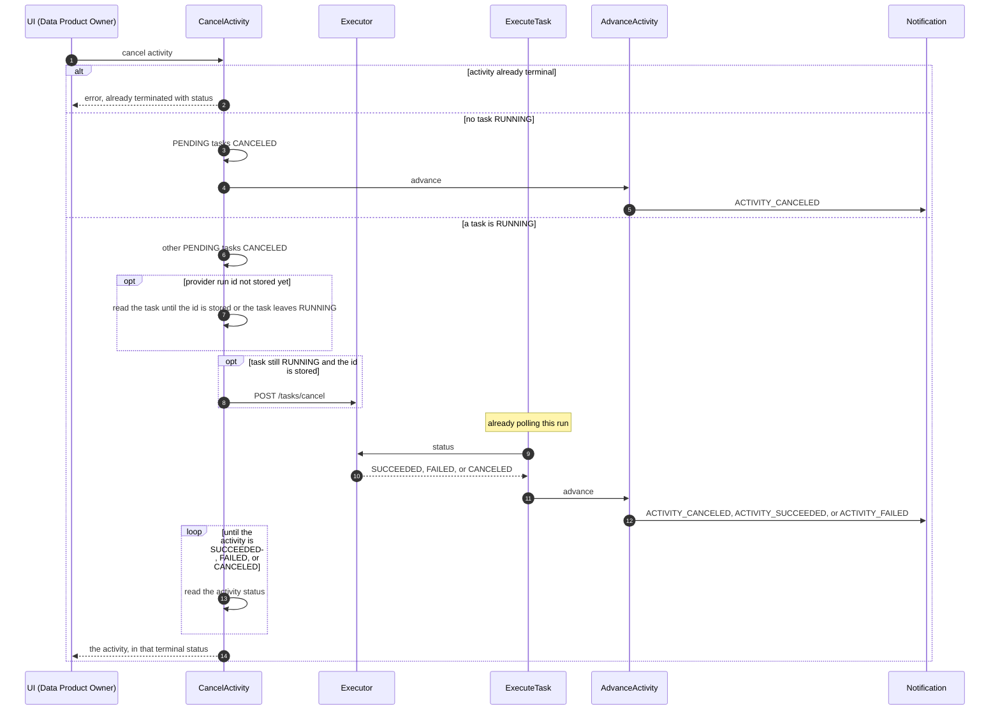

# SPDD Analysis: Full Control cancel and error paths

Story **BDMD-5440** (epic **BDMD-5097**). It depends on **BDMD-5437** (full-control happy path) and on **BDMD-5436** (Activity and Task CRUD).

**Revision 6 (2026-10-06).** A cancel beside an in-flight Execute Task is not an integration test. Both write the activity in serializable transactions, and an overlap is 409 (DD-42). Changing the poll interval does not separate those writes. The outcomes of a cancel that does not collide stay the edge cases below and the worked outcomes of DD-40. The suite still covers a pending activity, an activity that has already succeeded, and a stubbed 409.

**Revision 5 (2026-10-06).** The wait for a missing provider run id is 300 seconds, still about one read a second, and it is still not the executor poll. Each activity load calls `EntityInitAndDetachService.refresh` after `findOne`, and that reload walks the task, log, and result collections. `DefaultTransactionalOutboundPortImpl` stays the serializable port and does not clear the persistence context. Cancel Activity's waits between sleeps use `findDetached`: a new read-only read-committed transaction, then the graph is detached. A serializable read on that path can abort Execute Task's outcome write, and that write is not retried.

**Revision 4 (2026-10-02).** The team approved the design, with two changes. A serialization conflict returns 409. DevOps does not retry the transaction. The executor status poll is a fixed interval, default 30 seconds, and the number of polls is the secrets TTL divided by that interval. The secrets TTL is configuration, default 1 hour. There is no exponential back-off, and there is no separate cap of 100.

**Revision 3 (2026-10-02).** A successful cancel waits until the activity itself is terminal, then returns that activity. Revision 2 returned as soon as the executor cancel had been posted, while the activity could still be `RUNNING`.

**Revision 2 (2026-10-02).** Replaces draft 1. Nothing in the full-control flow has shipped, so decisions in the BDMD-5437 analysis are assumptions we can still change, in the design and in the code. This revision does that where cancel and the error paths need it. The decisions of draft 1 (a cancellation flag, Execute Task sending the executor cancel, a `CANCELING` status) are withdrawn.

The direction is:

- **Cancel Activity** cancels every task that is still `PENDING`, and it is the only use case that calls the executor cancel endpoint. When a task is `RUNNING`, it posts the cancel and then reads the activity until Advance Activity has set `SUCCEEDED`, `FAILED`, or `CANCELED`. A successful response always carries one of those three.
- **Execute Task** keeps polling the executor and records the status it is given, including `CANCELED`. It does not send the cancel. It calls Advance Activity, which is what Cancel Activity is waiting for.
- **Advance Activity** closes the activity. A `CANCELED` task closes it as `CANCELED`, in the same way a `FAILED` task closes it as `FAILED`, with one ordering constraint recorded in DD-40.

**General rule.** Anything not decided here follows the existing pattern in this service, then Registry or Blueprint.

## Business Requirement (summary)

DevOps 2.0 full control already runs an activity to completion: Execute Activity, activity approval, Advance Activity, task approval, Execute Task (start, poll, logs), then Advance Activity again until the activity succeeds or a task failure fails it and cancels the tasks still pending.

This story adds the paths that stop or refuse that run.

**Cancel.** A user cancels an activity. DevOps stops the task that is running on the executor, cancels every task that is still pending, and then cancels the activity. Tasks that already reached a terminal status keep that status. The endpoint draft is `POST /api/v2/pp/devops/activities/cancel`. Stopping a run goes through the executor, `POST /api/v2/up/executor/tasks/cancel`, with the provider run id in the body.

**Rejection.** Policy can refuse an activity execution or a task execution. DevOps handles `ACTIVITY_EXECUTION_REJECTED` and `ACTIVITY_TASK_EXECUTION_REJECTED`. Real policy evaluation stays out of scope. While Policy is inactive, the existing auto-approvers still only approve.

**Executor error paths left by BDMD-5437.** A start call can fail. A status read can fail. A run can sit in a waiting state with no attempt limit. Those cases leave an activity `RUNNING` today.

**Task results.** The CLI uploads them from inside the running pipeline (BDMD-5437 DD-20). The upload API is not implemented. This story says what already-stored results mean. It does not build the upload.

Not in this story:

- re-run of an activity or a task;
- recovery after a process restart;
- the instrumented path and the CLI, including implementing result upload;
- real policies, and real provider executors;
- specification independence (BDMD-5437 DD-29), except the placeholder rule in DD-46.

Sources:

- `spdd/analysis/BDMD-5437-202609231743-[Analysis]-full-control-happy-path.md` and the code it produced;
- the endpoint draft: `POST activities/cancel` on DevOps; `POST /tasks/cancel` on the executor;
- the event list: emitted `Activity_Canceled`; subscribed rejected events for the activity and for the task;
- the event storm: Data Product Owner invokes Cancel Activity, DevOps emits Activity Canceled;
- the abort sequence: DevOps asks the executor to cancel, then a later status read sees the run canceled. This revision does not add a cancelling status. See DD-41.

### Assumptions from BDMD-5437 that this story changes

| Previous assumption | Change |
|---------------------|--------|
| DD-13. Activity is `PENDING` → `RUNNING` → `SUCCEEDED` or `FAILED`. A task becomes `CANCELED` only when an earlier task fails. | A user cancel also sets `PENDING` tasks to `CANCELED`. A task becomes `CANCELED` from `RUNNING` when the executor reports `CANCELED`. The activity can close as `CANCELED` from `PENDING` or from `RUNNING`. |
| DD-14, DD-16. A late approval throws, and the notification fails. | A late approval or rejection completes the notification and writes nothing (DD-47). |
| DD-15. Advance Activity has four outcomes and requires `RUNNING`. | It gains a canceled-task close, it may close an activity that is still `PENDING`, and a terminal activity is a no-op (DD-40). |
| DD-19, interfaces I-13. The status poll has exponential back-off from 500 ms to 60 s, and no attempt limit. | One fixed interval, default 30 seconds. The poll stops after secrets TTL / interval attempts (DD-45). |
| DD-30. Executor secrets expire one hour after they are stored. The hour is hardcoded. | The TTL is configuration, default 1 hour. The status-poll cap is that TTL divided by the poll interval (DD-45). |
| DD-35. The executor API has `RUNNING`, `SUCCEEDED`, `FAILED`. A provider cancellation is `FAILED`. | The executor API also has `CANCELED`. It does not have `CANCELING`. A run canceled through `POST /tasks/cancel` is reported as `CANCELED`. Any other unsuccessful end, including a cancel done on the provider outside that API, stays `FAILED`. |
| DD-21. Placeholder resolution uses the latest task of that name in any status. | It ignores results whose task is not `SUCCEEDED` (DD-46). |
| A serialization failure on a REST call is HTTP 409. Nothing retries it. | Kept. DevOps does not add a retry. The caller cancels again (DD-42). |

---

## Domain Concept Identification

### Existing Concepts (from codebase)

- **Activity / Task / Execution status:** `PENDING`, `RUNNING`, `SUCCEEDED`, `FAILED`, `CANCELED`. There is no `REJECTED` and no `CANCELING`.
- **Happy-path use cases:** Execute Activity (REST), Approve Activity Execution (event), Advance Activity (in process), Execute Task (event, and it polls).
- **Advance Activity today:** a failed task cancels remaining `PENDING` tasks, sets the activity `FAILED`, drops secrets, emits activity failed. All tasks `SUCCEEDED` succeeds the activity. A `RUNNING` task means do nothing. Otherwise it requests the first `PENDING` task. It throws if the activity is not `RUNNING`. If it is `RUNNING`, nothing failed, nothing is running, and nothing is pending, `firstPendingTask` throws. That is the state this story produces when some tasks were canceled and the others succeeded, so the new branch has to exist before that line.
- **Execute Task today:** commit `RUNNING`, start the run, commit the provider run id, poll until the status is not `RUNNING`, read the logs, commit `SUCCEEDED` or `FAILED`. The wait between reads doubles from 500 ms up to 60 s (`ExecutorPollingProperties`), with no attempt limit. Every executor status other than `SUCCEEDED` is stored as `FAILED`, and an unknown status string is mapped to `FAILED` before that. `CANCELED` would therefore fail the activity if we added it only on the executor.
- **Transactions:** each write runs at `ISOLATION_SERIALIZABLE`. There is no retry. A serialization failure on a REST call is HTTP 409 (`ResponseExceptionHandler`). The same failure on the observer thread fails the notification.
- **Secrets:** held in memory and removed when Advance Activity closes the activity. The cache entry expires one hour after it is written (`ExecutorSecretsStoreImpl`). The hour is not configuration.
- **Events named but not handled:** `ACTIVITY_CANCELED`, `ACTIVITY_EXECUTION_REJECTED`, `ACTIVITY_TASK_EXECUTION_REJECTED`.

### New Concepts Required

- **Cancel Activity:** the REST use case. It cancels `PENDING` tasks, asks the executor to cancel a `RUNNING` task, and returns only after the activity is `SUCCEEDED`, `FAILED`, or `CANCELED`. When no task is `RUNNING`, it reaches that by calling Advance Activity. When a task is `RUNNING`, Execute Task calls Advance Activity, and Cancel Activity waits for that write.
- **Executor cancel:** `POST /api/v2/up/executor/tasks/cancel` with the provider run id. Only Cancel Activity calls it.
- **Executor status `CANCELED`:** a terminal status. The run has been canceled through the executor cancel API. There is no non-terminal `CANCELING` value in this story.

### Conceptual relationships

- **One `RUNNING` task per activity.** Advance Activity never requests a task while one is `RUNNING`. Cancel talks to the executor only for that task.
- **Cancel writes `PENDING` tasks only.** It does not write a `RUNNING`, `SUCCEEDED`, or `FAILED` task. The executor's later status is the `RUNNING` task's outcome.
- **Advance Activity is the only closer.** Success, failure, and user cancel all set the activity status, drop secrets, and emit there.
- **A `CANCELED` task does not by itself mean the user won a race against a running executor.** It means that task will not run, or that the executor confirmed a cancel. The activity status is the separate decision in DD-40.

### Key Business Rules

- **An activity that is already `SUCCEEDED`, `FAILED`, or `CANCELED` cannot be canceled.** The call fails and tells the caller the status. See DD-42.
- **Every task still `PENDING` becomes `CANCELED` immediately**, with a finish time and no start time. That stops a later approval from starting it.
- **The `RUNNING` task is left `RUNNING`.** Cancel Activity posts the executor cancel when the provider run id is known. Execute Task records the status the executor returns afterwards.
- **The activity is updated by Advance Activity**, after no task is `RUNNING`. A successful cancel returns that updated activity. It does not return while the activity is still `PENDING` or `RUNNING`.
- **The executor outcome of the running task is not overwritten.** A cancel that arrives too late leaves `SUCCEEDED` or `FAILED` on that task. Advance Activity then applies DD-40.
- **Rejection fails the activity.** It does not emit activity canceled. No rejection reason is stored. See DD-44.
- **Results already stored stay stored.**

### How a cancel moves

| Situation on entry | Cancel Activity | Who closes the activity |
|--------------------|-----------------|-------------------------|
| Already `SUCCEEDED`, `FAILED`, or `CANCELED` | No write. Error: the activity has already terminated with that status. | Nobody |
| `PENDING`, or `RUNNING` with no task `RUNNING` (waiting for approval, or between tasks) | Set every `PENDING` task to `CANCELED`. Call Advance Activity. | Advance Activity, in this request |
| A task is `RUNNING` and the provider run id is stored | Set every other `PENDING` task to `CANCELED`. `POST /tasks/cancel`. Do not change the `RUNNING` task. Then read the activity until it is terminal. | Execute Task, when the run ends, calls Advance Activity. Cancel Activity is waiting on that write. |
| A task is `RUNNING` and the provider run id is not stored yet | Set every `PENDING` task to `CANCELED`. Read the task again until the id is stored or the task is no longer `RUNNING`. Then post the cancel if it is still `RUNNING`, and read the activity until it is terminal. | Same as the row above. If the task left `RUNNING` while we waited for the id, call Advance Activity, which closes it before the response. |

---

## Strategic Approach

### Solution Direction

The proposal is the design. It is simpler than draft 1 because the running task has one writer, Execute Task, and the activity has one closer, Advance Activity. Cancel Activity does not store a second "please cancel" flag, and Execute Task does not branch on one.

These additions make the proposal hold. They are specified in the decisions below.

1. **Advance Activity must not treat "a task is `CANCELED`" as the first check.** We cancel the later `PENDING` tasks while one task is still `RUNNING`. If that check ran first, Advance Activity would close the activity while the executor was still at work. A `RUNNING` task is considered before a `CANCELED` task. A `FAILED` task stays first, which is what makes a too-late failure fail the activity.
2. **Execute Task must store executor `CANCELED` as task `CANCELED`.** Today any status other than `SUCCEEDED` becomes `FAILED`, so a cancel the executor accepted would fail the activity. The control flow (poll, record, call Advance Activity) stays. This is a mapping change, not a second cancel path. The poll itself becomes a fixed interval with a cap derived from the secrets TTL (DD-45).
3. **A serialization conflict is a 409.** The transaction is not retried. The caller sends the cancel again. A task that cancel already moved off `PENDING` makes a later Execute Task return without starting a run and without failing the notification (DD-43, DD-47).
4. **The successful HTTP response is the closed activity.** After the executor cancel is posted, Cancel Activity reads the activity until Advance Activity has set a terminal status. The other tasks are already `CANCELED`, so that close is `FAILED`, `CANCELED`, or `SUCCEEDED` and cannot be "request the next task".

Moving "set the task `RUNNING`" to after the provider run id returns was considered and rejected (DD-41). The current order is what tells Cancel Activity that a start call is in flight.

### Use-case map

Rows 1–4 and A1–A2 are the happy path. Their triggers stay. Execute Task and Advance Activity change as described in DD-40 and DD-43.

| # | Use case | Trigger | Outcome |
|---|----------|---------|---------|
| C | **Cancel Activity** | REST | `PENDING` tasks `CANCELED`. If a task is `RUNNING`, executor cancel once the provider run id is known, then wait until the activity is terminal. If none is `RUNNING`, Advance Activity. A successful return is always `SUCCEEDED`, `FAILED`, or `CANCELED`. Already terminal at the start: error, no write. |
| R1 | **Reject Activity Execution** | Activity execution rejected | Activity was `PENDING`: activity `FAILED`, every task `CANCELED`, secrets dropped, activity failed emitted. Any other status: no-op. |
| R2 | **Reject Task Execution** | Task execution rejected | Task was `PENDING` and activity `RUNNING`: that task `FAILED`, then Advance Activity. Otherwise: no-op. |

### Key Design Decisions

#### DD-38: Scope

- **In:**
  - Cancel Activity, the executor cancel call, and the starter executor's cancel behavior;
  - the Advance Activity close for a `CANCELED` task;
  - the Execute Task mapping of executor `CANCELED`, and the no-op when the task is no longer `PENDING`;
  - Reject Activity Execution and Reject Task Execution;
  - the fixed status-poll interval, and the poll cap derived from the secrets TTL;
  - making the secrets TTL configuration, default 1 hour;
  - executor start and status failures that today leave a task `RUNNING`;
  - results that are already stored.
- **Out:**
  - re-run;
  - resuming a poll after a process restart;
  - the result-upload API and the CLI;
  - the policy engine;
  - a real provider executor. The provider call in the abort sequence is the executor's job;
  - a `CANCELING` status, on the executor or on DevOps (DD-41);
  - retrying a transaction after a serialization conflict (DD-42).

#### DD-39: Three roles

- **Cancel Activity** is the only caller of `POST /tasks/cancel`. It is also the only use case that moves `PENDING` tasks to `CANCELED` because the user asked. The failure path inside Advance Activity still cancels leftover `PENDING` tasks when a task has `FAILED`, as it does today.
- **Execute Task** does not call the executor cancel API. It polls, reads the logs once, records the terminal status, and calls Advance Activity.
- **Advance Activity** sets the activity status, drops secrets, and emits. Cancel Activity calls it when no task is `RUNNING`. When a task is `RUNNING`, Execute Task calls it, and Cancel Activity waits until that write is visible.
- **Why this split:** the executor status of a run that is already being polled has one writer. A second writer in Cancel Activity was the overwrite draft 1 had to defend against. This split removes that writer.

#### DD-40: Advance Activity's decision order

This revises BDMD-5437 DD-13 and DD-15.

Advance Activity loads the activity and applies the first matching row. `SUCCEEDED` tasks are never rewritten. `FAILED` tasks are never rewritten. A task already `CANCELED` is left `CANCELED`.

| Order | Condition | Activity | Also |
|------:|-----------|----------|------|
| 1 | Any task is `FAILED` | `FAILED` | Cancel tasks still `PENDING`. Drop secrets. Emit activity failed. |
| 2 | Any task is `RUNNING` | unchanged | Do nothing. The poll is still the owner of that task. |
| 3 | Any task is `CANCELED` | `CANCELED` | Cancel tasks still `PENDING`. Drop secrets. Emit activity canceled. |
| 4 | Every task is `SUCCEEDED` | `SUCCEEDED` | Drop secrets. Emit activity succeeded. |
| 5 | A task is `PENDING`, and the activity is `RUNNING` | unchanged | Emit task execution requested for the first `PENDING` task. |
| 6 | The activity is already `SUCCEEDED`, `FAILED`, or `CANCELED` | unchanged | No-op. |

Row 6 is also the result when Cancel Activity and Execute Task both call Advance Activity. The second call finds the activity already closed.

Row 2 is why "a `CANCELED` task is handled like a `FAILED` task" is not a copy of the failure check at the top of the method. A failed task and a running task do not occur together: tasks are sequential, and a failure closes the rest. A canceled task and a running task do occur together: Cancel Activity cancels the later tasks while the current one is still on the executor. Closing on row 3 before row 2 would mark the activity `CANCELED` while that run continues, and Execute Task would then be writing a task on an activity that had already emitted activity canceled.

The activity may be `PENDING` when Cancel Activity calls Advance (the user canceled before approval). Rows 1, 3, and 4 still apply. Row 5 does not: a `PENDING` activity never has a task requested. An activity canceled from `PENDING` gets a finish time and no start time. An activity canceled from `RUNNING` keeps its start time and gets a finish time.

Worked outcomes:

| Running task's recorded status | Other tasks | Activity | Why |
|--------------------------------|---------------|----------|-----|
| `CANCELED` | anything except a `FAILED` task | `CANCELED` | The executor accepted the cancel. |
| `SUCCEEDED` | all `SUCCEEDED` | `SUCCEEDED` | The cancel arrived after the last run had already succeeded. Nothing was left `PENDING` to cancel. This is the too-late success case. |
| `SUCCEEDED` | one or more `CANCELED` | `CANCELED` | Later tasks were canceled and will not run. The task that finished stays `SUCCEEDED`. The activity did not complete. |
| `FAILED` | anything, including `CANCELED` | `FAILED` | A real failure wins over the user's cancel of the other tasks. This is the too-late failure case. |

The too-late cases need no special case in Execute Task. The executor returns `SUCCEEDED` or `FAILED` because the cancel did not change the run. Execute Task records that. Advance Activity's table does the rest.

If every task is already `SUCCEEDED` and the activity is still `RUNNING` (Advance Activity has not committed the close), Cancel Activity finds nothing `PENDING` and nothing `RUNNING`, calls Advance Activity, and the activity becomes `SUCCEEDED`. The response is that activity. If the activity was already terminal when the call started, the call is the error in DD-42 instead.

#### DD-41: The running task and the executor cancel

- Cancel Activity, in one transaction, sets each task that is **still** `PENDING` to `CANCELED`. It does not change a task that is `RUNNING`. The check and the write are the same transaction, so a task that Execute Task has already moved to `RUNNING` is not written as `CANCELED`.
- If that transaction commits and a task is `RUNNING` with a provider run id, Cancel Activity calls `POST /tasks/cancel` **outside** the transaction (BDMD-5437 DD-22, kept).
- If it is `RUNNING` without a provider run id, Cancel Activity reads the task in **new** read-committed transactions (`findDetached`) until one of these is true:
  - the provider run id is stored;
  - the task is no longer `RUNNING`;
  - the wait for the id ends (DD-45).
- The wait exists because Execute Task commits `RUNNING` before it calls start, and commits the id after start returns. The gap is the start call. Cancel Activity is waiting for that id, not for the pipeline to finish.
- **The wait must not hold the serializable transaction.** Execute Task saves the provider run id by updating the same activity. A transaction held open across the sleep would block that save, and the id Cancel Activity is waiting for would never commit.
- When the id appears, Cancel Activity posts the cancel. When the task has left `RUNNING` before the post, it does not post, and it calls Advance Activity if the activity is still open.
- **A successful call returns the activity only after it is `SUCCEEDED`, `FAILED`, or `CANCELED`.** After the post, Cancel Activity reads the activity through the same `findDetached` path until that is true. The read is the same kind of loop as the id wait: commit, sleep, read again. Those reads are read-committed, not serializable. A serializable read would share Execute Task's snapshot and could abort the outcome write, which is not retried. The read must not hold the serializable transaction across the sleep, or Execute Task and Advance Activity cannot commit the close the loop is waiting for.
- **Why the activity does become terminal.** The other tasks are already `CANCELED`, so when Execute Task records the running task and calls Advance Activity, row 2 no longer matches. Row 1, 3, or 4 does. The activity is `FAILED`, `CANCELED`, or `SUCCEEDED` as in the worked outcomes of DD-40. Cancel Activity does not write that status itself on this path.
- **If the running task has already left `RUNNING` and the activity is still open,** Cancel Activity calls Advance Activity instead of only waiting. That covers Execute Task having recorded the outcome and not having called Advance yet. If Execute Task calls it as well, the second call is the no-op in row 6.
- The wait uses the same fixed interval and the same cap as the executor status poll (DD-45). Reaching the cap without a terminal activity is a server error. The activity may still be `RUNNING`. A later cancel waits again. This is the limit of the guarantee: a **200** always carries a terminal activity; a **500** means the close did not happen within the cap. A serialization conflict during the cancel write is a **409** and does not start this wait (DD-42).
- **`CANCELING` is not a status** on the executor API or on DevOps. The status poll already treats every non-terminal report as `RUNNING`. After a cancel, the executor keeps reporting `RUNNING` until the run is `CANCELED`, `SUCCEEDED`, or `FAILED`. If we later want the UI to show "canceling", we add `CANCELING` on the executor and on DevOps together. We do not add it on one side only.
- **Spelling** is `CANCELED`, matching DevOps. The abort diagram's `CANCELLED` / `CANCELLING` is not the API.
- **The executor decides which provider outcomes are `CANCELED`.** A run stopped because DevOps called `POST /tasks/cancel` is reported as `CANCELED`. A run that ended unsuccessfully for any other reason, including a cancel performed on the provider outside that API, is reported as `FAILED` (the remainder of BDMD-5437 DD-35). DevOps stores the value. It does not keep a second flag to reinterpret it.
- **A cancel post for a run that has already ended** is a client error from the executor, or a no-op that leaves the terminal status in place. Cancel Activity treats that as "there was nothing left to stop", not as a failed request. Execute Task's next read records `SUCCEEDED` or `FAILED`.
- **A cancel post that fails because the executor cannot be reached** is retried inside the request, a small number of times. The `PENDING` updates stay committed: those tasks must not start. If the post still fails, the call returns a server error that says the running task could not be canceled. The activity stays `RUNNING`. A later cancel call finds the same `RUNNING` task, finds the other tasks already `CANCELED`, and posts again. It does not take the "already terminated" path.
- **The starter executor** accepts cancel for a known run that is still in progress and reports `CANCELED` from then on. A cancel for an unknown id, or for a run that already ended, is a client error and does not change a finished run's status. Header values stay unlogged.

**Rejected alternative: set `RUNNING` only after the provider run id is known.** The task would stay `PENDING` for the whole start call. Cancel Activity would set it to `CANCELED` and would not post to the executor, because it only posts for a `RUNNING` task. The start call would still create a run. That run would have no cancel and, if Execute Task then refused to continue, no poller. Committing `RUNNING` before start is what makes "wait for the id, then post" true.

**Rejected alternative: Execute Task posts the cancel when it sees a flag.** That works, and it was draft 1. It puts the executor cancel in two places whenever the id is already stored, which is the common case. One caller is enough.

#### DD-42: Serialization conflicts and a terminal activity

Serializable isolation stays. Two overlapping transactions that write the same activity still cannot both commit. DevOps does not retry the one that loses.

- A serialization failure on Cancel Activity is HTTP 409, the response `ResponseExceptionHandler` already returns for `ConcurrencyFailureException`. The `PENDING` updates of that attempt are not committed. The caller sends the cancel again.
- The same failure inside an event handler fails that notification, as `ObserverService` already does. DevOps does not catch it and run the use case again. A later delivery of the same event uses DD-47: if the state has already moved, the handler completes and writes nothing.
- **Already terminal at the start of the call:** no write. The error is a bad request whose message is:

  `Activity <uuid> has already terminated with status <status>`

  `<status>` is `SUCCEEDED`, `FAILED`, or `CANCELED`. A second cancel is this error, not a silent success. The caller can show the status. This is a different failure from 409: the activity is finished, it is not busy.
- **Becomes terminal during this call** (the run ended while we waited for the id, or Advance Activity closed it): the call returns the activity. It does not use the sentence above. That sentence means "it was already over when you asked".

#### DD-43: What Execute Task changes

The poll loop, the log read, and the call to Advance Activity stay.

- Executor `SUCCEEDED` → task `SUCCEEDED`.
- Executor `FAILED` → task `FAILED`.
- Executor `CANCELED` → task `CANCELED`.
- Any other value → task `FAILED`, as today, with the same warning.
- The outcome transaction writes that status only when the task is still `RUNNING`. A task that is already terminal is left as it is. Under this design Cancel Activity never writes the `RUNNING` task; the guard is there so a second delivery of the same outcome cannot move it again.
- If the activity is not `RUNNING`, or the task is not `PENDING`, when Execute Task is about to start the run: return, do not call the executor, do not fail the notification.

That last rule is the one moment Execute Task has to notice a cancel. It is the race where the task was still `PENDING`, Cancel Activity committed `CANCELED`, and the approved-event handler then runs. Throwing there fails the notification, and replay throws again. Returning is what makes "cancel the pending task before it starts" complete. Execute Task does not, on this path, look at the other tasks or post a cancel.

Start failures are DD-45. They are a change, and they are the error path rather than the cancel path.

#### DD-44: Rejection

- **No `REJECTED` status.** The activity becomes `FAILED`. `ACTIVITY_CANCELED` stays the user command.
- **No reason is stored.** The rejected events, as drawn, carry no reason. **Assumption, kept for later:** if we need to show why Policy refused, we add a reason on the rejected event and a field on the activity to keep it. Until then, `FAILED` is the whole record.
- **Activity execution rejected, activity `PENDING`:** every task `CANCELED`, activity `FAILED`, finish time set, start time left empty, secrets dropped, activity failed emitted. This close stays in the reject use case. It does not call Advance Activity's row 3, because that row emits activity canceled.
- **Task execution rejected, task `PENDING`, activity `RUNNING`:** that task `FAILED`, then Advance Activity. Row 1 cancels the other `PENDING` tasks and fails the activity. The refused task is `FAILED` so it is distinguishable from a task the user canceled, which is `CANCELED`.
- **Any other state:** no-op, notification successful (DD-47). A rejection that arrives after the user has canceled does not rewrite the activity.

#### DD-45: Fixed polling, the secrets TTL, and executor failures

This revises BDMD-5437 DD-19, DD-30, and interfaces I-13.

- **Status poll (Execute Task).** One fixed interval. No exponential back-off. `odm.utility-plane.executor-polling.initial-delay` and `max-delay` are replaced by `odm.utility-plane.executor-polling.interval`, default **30 seconds**. `followRunUntilItEnds` sleeps that long between status reads.
- **How many polls.** The same idea as the Blindata observer's attempt cap, with the number taken from the secrets lifetime instead of a fixed 100. The secrets TTL is configuration, `odm.utility-plane.executor-secrets.ttl`, default **1 hour**. It replaces the hardcoded hour in `ExecutorSecretsStoreImpl`. Max status reads = TTL / interval, using integer division. With the defaults that is 3600 / 30 = **120** reads. The team treated "about 100" as the right size for a one-hour TTL; 120 is that rule with a 30-second interval, not a second constant.
- The cache still expires one TTL after the secrets were stored at execute. The poll cap is that full TTL expressed as a count of reads. It does not measure how much of the hour is already gone. A task that starts late can be polling after the cache entry has expired; calls then go out without secrets, as they would today.
- When the cap is reached, or a status read still fails on the last attempt, the task is `FAILED` and Advance Activity runs. The activity does not stay `RUNNING`.
- **Start throws, or returns no provider run id:** the task is `FAILED` with a finish time, then Advance Activity. The run that started and whose id was never stored because the process died stays in the restart story. While this process is alive, saving the id is an ordinary transaction. If it conflicts with cancel, that transaction fails (DD-42). The notification fails with it. There is no retry that would save the id on a second pass. The caller can cancel again; the id is then either stored or the task is still `RUNNING` without one.
- **Waiting for the provider run id** is not this poll. It reads the database about once a second and stops at a **300 second** deadline. It does not use the 30-second executor interval. The longer deadline covers a slow start: 30 seconds can expire while Execute Task is still about to save the id, and Cancel Activity would return 500 for a run it can still stop. If the task is still `RUNNING` without an id, the call returns a server error: the running task could not be canceled yet. The `PENDING` tasks are already `CANCELED`. There is no poller to close the activity until the id exists, so this wait does not promise a terminal activity. The user calls cancel again.
- **Waiting for the activity to close** is the long wait, and it does run on the HTTP thread. Same interval, same cap as the executor status poll. It starts after the cancel post, or after the task has left `RUNNING`. Once Execute Task is polling, its own cap will fail the task and Advance Activity will close the activity, so this wait normally ends as soon as that close commits, well inside the cap.
- **Unreachable executor on the cancel post:** a few attempts inside the request (3), then the same server error. The call does not enter the long wait: the run was not asked to stop, and the caller can post again. Execute Task keeps its own status poll. It does not send the cancel post. This is a short repeat of one HTTP call, not a retry of a database transaction.

#### DD-46: Results

- Cancel and the outcome write change status and timestamps. They load the activity in the transaction that saves it, then `EntityInitAndDetachService.refresh` reloads that activity and its task, log, and result collections, so a stale persistence-context copy cannot replace result rows. The shared transaction port does not clear the persistence context.
- The upload API stays out of scope. A pipeline that is still running can still be uploading. Those rows, once stored, remain after the task is `CANCELED` or `FAILED`.
- **Placeholder resolution ignores results whose task is not `SUCCEEDED`.** This revises BDMD-5437 DD-21. A partial upload from a canceled or failed run must not become the value the next activity substitutes. Stored rows are still readable on the task.

#### DD-47: Late events

This revises BDMD-5437 DD-14 and DD-16.

- Approve Activity Execution: activity not `PENDING` → no write, notification successful.
- Execute Task: as in DD-43.
- Both reject use cases: precondition gone → no write, notification successful.
- Advance Activity: row 6.
- A serialization failure still fails that one delivery. DevOps does not retry it. If the notification is delivered again, the no-op above completes it. That is what stops a cancel from turning an in-flight approval into a notification that fails on every later delivery.
- A second Execute Activity for the same data product version and name, while one is `PENDING` or `RUNNING`, is still refused.

#### DD-48: The cancel HTTP call

- `POST /api/v2/pp/devops/activities/cancel`.
- The body is the activity identity, wrapped the same way as execute. No secret headers. Secrets are already cached from execute.
- No new authorization check. Execute does not check the caller either.
- **200** and the activity, only when its status is `SUCCEEDED`, `FAILED`, or `CANCELED`. The body is the activity Advance Activity stored. The caller can show that status. The call may have been waiting since the cancel post.
- **400** with `Activity <uuid> has already terminated with status <status>` when it was already terminal **before** this call wrote anything.
- **500** when the running task could not be canceled (deadline waiting for the id, or the cancel post could not reach the executor), or when the wait for a terminal activity reached its cap. The `PENDING` updates remain. A 500 is the response that does not carry the guarantee.
- **409** when the cancel transaction conflicts with another writer. No retry. The caller sends the cancel again.
- Hidden CRUD writes are unchanged. A direct `PUT` can still set statuses without Cancel Activity.

### Alternatives considered

- **Draft 1: a cancellation flag, Execute Task posts the cancel, the activity stays `RUNNING` until the executor confirms, optional `CANCELING`.** Replaced by this revision. The flag existed so the poller could see the request. With Cancel Activity as the only poster, the poller only has to understand the status `CANCELED`.
- **Mark the `RUNNING` task `CANCELED` inside the HTTP call and post the cancel as a best effort.** The executor's later `SUCCEEDED` or `FAILED` is what we want to keep when the cancel is late. Writing `CANCELED` first would either be overwritten or would require Execute Task to refuse the real status. Both fight the proposal.
- **Set `RUNNING` only after the provider run id is saved.** Leaves a started run with no cancel and no poller. See DD-41.
- **Add `CANCELING` now.** Not required to stop a run or to close an activity. Deferred until a UI needs that intermediate state, and then it is added on both sides.
- **One Advance Activity rule "any `CANCELED` task closes the activity" checked before `RUNNING`.** Closes the activity while the executor is still running. See DD-40.
- **Map rejection and user cancel to the same activity status.** The event list has both activity canceled and activity failed. They stay different.
- **Return from cancel as soon as the executor post is sent, while the activity is still `RUNNING`.** That was revision 2. The caller would have to wait on the activity-canceled event to learn the outcome, including a too-late `SUCCEEDED` or `FAILED`. Waiting in the request returns that outcome directly. The cost is a request thread held until Advance Activity commits.
- **Retry a serialization failure inside the use case.** The lost transaction is a 409, or a failed notification. The caller, or a later delivery, runs the operation again against the committed state.
- **Exponential back-off, and a fixed cap of 100.** The interval is constant. The cap is the secrets TTL divided by that interval.

---

## Risk & Gap Analysis

### Closed questions

Draft 1's Q1–Q14, under this design.

| Id | Resolution |
|----|------------|
| Q1 | A second cancel of a terminal activity, including `CANCELED`, is the 400 in DD-42. Not a silent success. |
| Q2 | The running task keeps the executor status. Nothing overwrites it. The activity follows DD-40. Result rows already stored are kept (DD-46). |
| Q3 | Cancel Activity waits for the provider run id. Execute Task does not post the cancel. |
| Q4 | If every task is already `SUCCEEDED`, Advance Activity succeeds the activity. If it had already closed, the call is the terminal-activity error. |
| Q5 | Confirmed. Refused task `FAILED`, activity `FAILED`, no reason stored. The future reason is an assumption in DD-44. |
| Q6 | A successful cancel returns only after the activity is `SUCCEEDED`, `FAILED`, or `CANCELED`. The event is still emitted by Advance Activity. Revision 2's early return is withdrawn. |
| Q7 | Executor status poll, and Cancel Activity's wait for a terminal activity: fixed interval, default 30 seconds, at most secrets TTL / interval reads (120 with a 1 hour TTL). The wait for a missing provider run id is a separate 300 s deadline and is not that interval. |
| Q8 | Cancel Activity retries the post. It does not leave that retry to Execute Task. The `PENDING` tasks stay `CANCELED`. The user can call cancel again to post again. |
| Q9 | No `CANCELING`. Executor status `CANCELED` only. |
| Q10 | Placeholders ignore results of tasks that are not `SUCCEEDED`. |
| Q11 | Body is the activity uuid, wrapped like execute. No new secrets. |
| Q12 | No authorization check added. |
| Q13 | 200 and the activity, and that activity is terminal. |
| Q14 | CRUD status writes stay as they are. |

### Edge cases the design covers

- **Cancel overlaps Execute Task's move from `PENDING` to `RUNNING`.** One transaction commits. The other fails: 409 on the cancel call, or a failed notification on the event. The caller cancels again and reads the committed status. If the task is already `CANCELED`, a later Execute Task does not start the run. If the task is `RUNNING`, the new cancel waits for the id and posts.
- **Cancel overlaps the save of the provider run id.** Neither side holds a transaction across the wait. If the two writes still conflict, the id save fails with the notification. There is no retry. The next cancel either finds the id or waits for it again.
- **Last task `RUNNING`, cancel posted in time.** Executor later returns `CANCELED`. Execute Task records it. Advance Activity row 3 sets the activity `CANCELED`.
- **Last task `RUNNING`, cancel too late.** Executor returns `SUCCEEDED` or `FAILED`. Execute Task records it. Advance Activity row 4 or row 1 sets the activity accordingly.
- **Earlier tasks `SUCCEEDED`, one `RUNNING`, later tasks `PENDING`.** Later tasks become `CANCELED` immediately. The running task is unchanged. When it later succeeds, row 3 sets the activity `CANCELED` because a task is `CANCELED`, and that succeeded task stays `SUCCEEDED`. When it later fails, row 1 sets the activity `FAILED`.
- **Waiting for task approval.** No task is `RUNNING`. All remaining `PENDING` tasks become `CANCELED`. Advance Activity row 3 closes the activity in the request. A task-approved event that arrives afterwards finds the task no longer `PENDING` and returns.
- **Waiting for activity approval.** Same, from `PENDING`. The activity never goes `RUNNING`. An approval event finds the activity no longer `PENDING` and returns.
- **Two cancels while a task is `RUNNING`.** Both leave that task `RUNNING`. Both may post the cancel. Both then read the activity until it is terminal, and both return that same activity with 200. The executor treats a second cancel of the same run as success or as already canceled, without changing a later `SUCCEEDED` that it has already stored. A call that finds the activity terminal at the start is the 400.
- **Approve and cancel together.** The loser fails with 409 or a failed notification. A later delivery no-ops once the state has moved. The user cancels again if their call was the one that got 409.

### Not an integration test

The edge cases above are the behavior. The integration suite does not stage a cancel while Execute Task is writing the same activity. Those two serializable transactions overlap, PostgreSQL aborts one, and the cancel call is 409. That is DD-42. A longer poll interval, or a pause in the test, only changes how often the writes meet. It does not make the 200 path reliable. The suite therefore covers the cases that do not need that overlap: cancel while the activity is still pending, cancel after the activity has already succeeded, and a stubbed serialization conflict. The starter executor covers cancel of a simulated run on its own.

Checked against a running DevOps, with Notification and the starter executor: a cancel sent once a task was running returned 200. A task that had already succeeded stayed `SUCCEEDED`. The running task became `CANCELED` after the executor was asked to stop. A cancel sent in the same moment as the activity was starting returned 409, and a later cancel of that same activity succeeded.

### Technical risks

- **Advance Activity's order is the easy one to get wrong.** Implementing row 3 as a copy of row 1, above the `RUNNING` check, closes a live run. The order in DD-40 is the rule.
- **A transaction held during the id wait** blocks the id from being saved. The wait is a loop of read transactions and sleeps.
- **The outcome mapping.** Forgetting executor `CANCELED` in Execute Task turns a successful cancel into activity `FAILED`.
- **Partial cancel when the post cannot reach the executor.** Later tasks are already `CANCELED`, the current run is still going, and the HTTP call has failed. The next cancel call is the recovery. There is no automatic post from Execute Task.
- **The poll cap holds a thread for up to the secrets TTL** (default 1 hour, 120 reads at 30 seconds). Execute Task holds an async-pool thread. Cancel Activity holds the HTTP request thread for the same shape of wait. A proxy in front of DevOps has to allow that duration, or it will cut the response off while the activity later closes. The pool stays the one already configured (core 8, max 32).
- **Secret expiry** starts when the secrets are stored at execute, and the poll cap does not shrink to match time already spent. A late task can outlive the cache entry. The TTL is now configuration (DD-45), default 1 hour, which is the same duration BDMD-5437 DD-30 hardcoded.
- **Hidden `PUT`** can still bypass the state machine (DD-48).

### Acceptance criteria coverage

BDMD-5440 has no written acceptance criteria. The scenarios below are the ones this revision covers.

| # | Scenario | Covered? |
|---|----------|----------|
| 0 | Cancel of an activity already `SUCCEEDED`, `FAILED`, or `CANCELED` | Yes. 400 with the status. |
| 1 | Cancel while `PENDING` | Yes. Tasks `CANCELED`, activity `CANCELED`, no executor call. |
| 2 | Cancel while the next task is waiting for approval | Yes. Same close. Late approval no-ops. |
| 3 | Cancel while a task is `RUNNING` | Yes, as behavior (DD-40, DD-41). Not an integration test: the overlap with Execute Task is 409. |
| 3a | `RUNNING` but the provider run id is not stored yet | Yes. DB reads until the id or the 300 s deadline. Not an integration test: the wait is five minutes. |
| 3c | Cancel post arrives after the run ended | Yes. Task keeps `SUCCEEDED` or `FAILED`. Activity follows DD-40. Not an integration test, for the same overlap as row 3. |
| R1, R2 | Rejection | Yes. Activity `FAILED`. No reason stored. |
| E1 | Start failure, status-read failure, poll cap exhausted | Yes. Task `FAILED`, then Advance Activity. |
| Results | Rows already stored | Yes. Kept. Not used as placeholder input unless the task `SUCCEEDED`. |
| Re-run, restart | | No. Out of scope. |

### Decided limits of the guarantee

A 200 always returns a terminal activity. These are the cases where the call does not, and they are decisions rather than open questions.

1. **The activity was already terminal.** 400, with the status in the message. No second write.
2. **The provider run id does not appear within 300 seconds, or the cancel post cannot reach the executor.** 500. `PENDING` tasks are already `CANCELED`. The caller cancels again to post again. The long wait is not started, because nothing is going to close the activity until the run is actually being polled or the post has been sent.
3. **The activity-status wait hits the poll cap** (secrets TTL / interval). 500. Execute Task's own cap should have closed the activity before this. The escape hatch is for a poller that never reached Advance Activity.
4. **A running task that succeeds after later tasks were canceled** still closes the activity as `CANCELED`. The succeeded task stays `SUCCEEDED`. Activity `SUCCEEDED` happens when every task succeeded, which means the cancel was too late and there was nothing `PENDING` left to cancel.
5. **A cancel that conflicts with another transaction is 409.** The caller sends it again. The id wait stays 300 seconds. The poll interval defaults to 30 seconds, and the secrets TTL defaults to 1 hour. Both are configuration.

No further design question is open. The REASONS Canvas can name the cancel command, the Advance Activity branches, the executor client method, and the two reject handlers. This revision does not name classes beyond the use cases that already exist.
