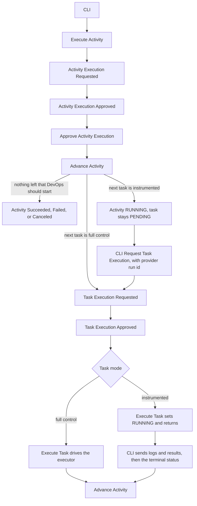
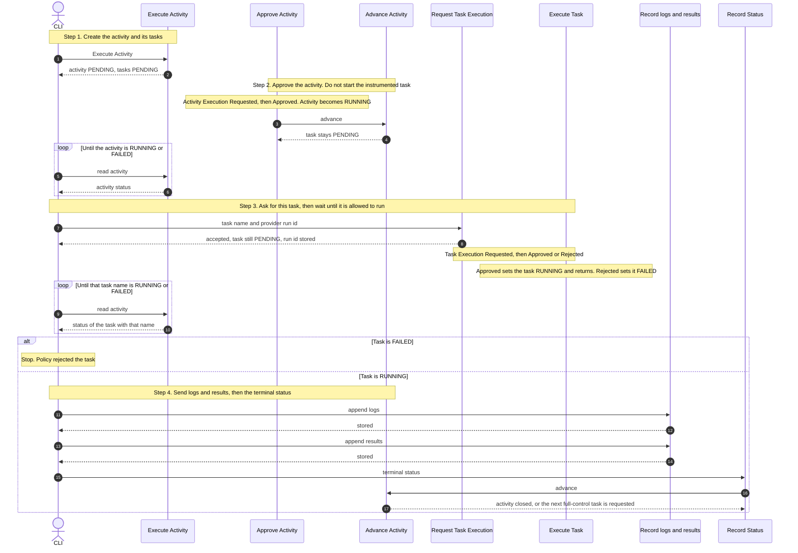
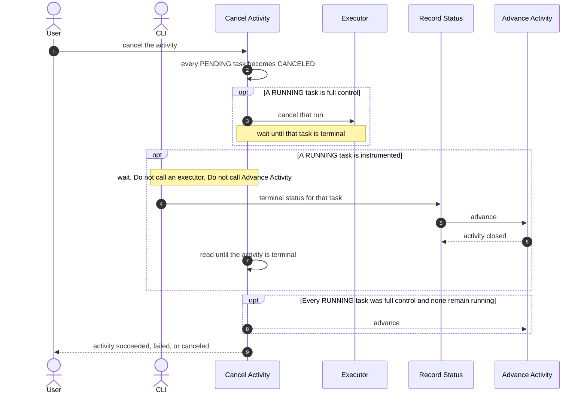

# SPDD Analysis: Instrumented Path

Story **BDMD-5442** (epic **BDMD-5097**). It depends on **BDMD-5436** (Activity and Task CRUD), **BDMD-5437** (full-control happy path), and **BDMD-5440** (full-control cancel and error paths).

**Revision 7 (2026-10-08).** DevOps owns task order. Request Task Execution accepts only the next pending task, and only when no other task is `RUNNING`. Policy still owns activity order and approval. The CLI addresses request, logs, and status by data product FQN, version tag, and activity name. Record Task Results accepts that natural key or an activity uuid. On the instrumented cancel path, Record Task Status calls Advance Activity and Cancel only reads until the activity is terminal. Q21 and Q26 are revised here.

**Revision 6 (2026-10-08).** The sequence diagram drops the background regions. The flowchart keeps activity approval in one column, with the task mode and Advance Activity below it.

**Revision 5 (2026-10-08).** Closes Q25 and Q26. Cancel Activity cancels every `PENDING` task. When a `RUNNING` task is instrumented, the call waits until the CLI records a terminal status for it. Revision 7 withdraws the part of this note that left task order unenforced while Policy is inactive. The happy-path sequence is redrawn in four steps, and cancel has its own sequence.

**Revision 4 (2026-10-08).** Applies the design call in `tmp/context/DevOps-INSTRUMENTED.md`. The CLI calls Execute Activity with the activity and its tasks. It addresses a task by name. Logs and results are accepted only while the task is `RUNNING`, and the terminal status is last. Request Task Execution stores the provider run id. Revision 7 withdraws the part of this note that let the CLI request any pending instrumented task and left sort order to Policy. Cancel Activity changes only full-control tasks. A mode where DevOps polls an instrumented task and writes its logs, status, and results is out of scope. Answers are in [Closed in revision 4](#closed-in-revision-4).

**Revision 3 (2026-10-08).** Adds the sequence diagram below. No decision changes.

**Revision 2 (2026-10-07).** Applies the review of revision 1. An activity may mix full-control and instrumented tasks. Advance Activity requests the next task only when that task is full control. The CLI has a new use case to request execution of an instrumented task. The answers from the review are in [Closed in this revision](#closed-in-this-revision). What is still open is in [Requirement Ambiguities](#requirement-ambiguities).

**Revision 1 (2026-10-07, draft).** First pass. Placed the instrumented path against the existing use cases and listed the gaps. Revision 1 refused a mixed activity and let Advance Activity request every next task. Both are withdrawn here.

Full control is the path already implemented: DevOps creates the activity, approves it, and drives each full-control task through an executor (start, poll, logs, cancel). The instrumented path is the other mode, per task. The client's pipeline runs that task outside DevOps. DevOps stores the metadata a CLI reports. The CLI is usually a Docker image step inside that pipeline. One activity can contain both kinds of task.

The two diagrams in `tmp/context/` are drafts and are older than BDMD-5437 and BDMD-5440. The design call `tmp/context/DevOps-INSTRUMENTED.md` is the source for revision 4.

## Original Business Requirement

We will now work on implementing the "Instrumented Path" for the DevOps server @odm-platform-pp-devops-server BDMD-5442

Context:
- the draft for the event storming for this story @tmp/context/instrumented-event-storming.png
- the sequence diagram draft for this story @tmp/context/instrumented-sequence.png
This two images might not be up to date with the latest decisions.
- analysis on previous stories @odm-platform-pp-devops-server/spdd/analysis/BDMD-5436-202609181557-[Analysis]-activity-task-anemic-crud.md @odm-platform-pp-devops-server/spdd/analysis/BDMD-5437-202609281148-[Interfaces]-full-control-happy-path.md @odm-platform-pp-devops-server/spdd/analysis/BDMD-5440-202610011324-[Analysis]-full-control-cancel-error-paths.md
These three analysis are more recent and up to date, but we can still change some of the design decisions if these stories made assumptions or decisions which are incompatible with this story, and we can also consider revisiting the design decisions if in the analysis of this story we find that changing them makes the overall design better.

The instrumented path is when the pipeline is not managed by the DevOps, this is the Full Control path, already implemented in the previous stories. In the instrumented path we only save the metadata for tasks and activites. Usually a CLI (Docker image) sends this instructions from the client's pipeline.

We will need new use cases, for example to save the task results, and we should consider whether we should reivew the previous use cases and adapt them for the instrumented path, or if we should introduce new use cases for separating the scenarios i.e. for ExecuteActivity, AdvanceActivity, ExecuteTask, etc. we need to think and evaluate whether to reuse the existing use cases or add new ones.

This first step of the analysis will simply be a draft, where we start analyzing the context, start thinking about how to design the requirements and implementation, write down the decisions, and most importantly find possible gaps or ambiguities. We will iterate on this analysis multiple times by solving gaps and ambiguities and noting design decisions.

### Diagram: instrumented event storm

The DevOps service only registers metadata that comes from an external source. An actor triggers an external pipeline. An ODM CLI sits in that pipeline. The CLI knows the data product version (FQN, version, tag) and sends the data product version UUID together with the FQN.

Commands the storm draws, all aimed at the DevOps service:

- **Execute Activity.** DevOps emits Activity Execution Requested. Policy validates. The outcome is Activity Execution Approved or Activity Execution Rejected. On approval, the activity is updated to running. No executor is called. A note says this is managed through the activity configuration. An optional note says the CLI checks whether an activity is already running or pending; if none is present it starts the execution and polls until it is validated.
- **Execute Task.** DevOps emits Task Execution Requested. Policy validates. On approval, the task is updated to running. No executor is called.
- **Update Task logs.**
- **Update Task results.**
- **Update Task status.**

A reminder on the storm: one pipeline execution corresponds to one task.

### Diagram: instrumented happy-path sequence

The executor is not deployed. DevOps does not manage the pipeline. It only stores metadata that comes from the pipeline. The CLI is a Docker image used as a step in the client's pipeline. The sequence is drawn with a context of activity, task, and provider run id. The CLI then calls DevOps four times, in this order: register task execution, register task logs, register task status, register task results. Policy, activity-level execute, and approval are not on this diagram.

### What the previous stories already decided about this path

- **BDMD-5436.** Activity is the only root. Task, logs, and results are nested. Status is `PENDING`, `RUNNING`, `SUCCEEDED`, `FAILED`, `CANCELED`. `provider_run_id` is an opaque string. `name` + `provider_run_id` is the conceptual natural key of a run and is not unique in CRUD. Writes that replace the graph are hidden CRUD. Use cases own transitions, uniqueness, and "who may write".
- **BDMD-5437.** Two modes exist. Full control is in scope there. Instrumented is named and then refused: Execute Activity answers with a client error when the named executor is in instrumented mode. Execution mode lives on the executor declaration (`full-control` or `instrumented`), with a required address. Execute Task, if it ever saw a non-full-control executor, would mark the task running and return without calling the executor and without advancing the activity. That branch is unreachable because Execute Activity already refuses the mode. Task results are not stored by DevOps in that story. The assumption (DD-20) is that a CLI inside the task's own pipeline uploads that task's results while the task is running, and that those rows are already stored when the next task resolves placeholders.
- **BDMD-5440.** Cancel, rejection, executor `CANCELED`, and the fixed poll live on the full-control path. The result-upload API and the CLI are explicitly out of that story. Advance Activity is the only closer. Execute Task is the only writer of a running task's executor outcome. A result row is kept, and placeholders ignore results whose task is not `SUCCEEDED`.

## Domain Concept Identification

### Existing Concepts (from codebase)

- **Activity:** one execution of a named activity on a data product version. Root of the graph. Created by Execute Activity. At most one activity with the same data product version and name may be `PENDING` or `RUNNING`.
- **Task:** a unit of work inside an activity, created with the activity, ordered, and run one at a time. Historical runs are separate task rows. The task names an executor. The executor's declaration says whether that task is full control or instrumented.
- **Logs and results:** rows owned by a task, ordered by source time. The schema and the hidden activity PUT can store them. No use case appends a result. Execute Task appends one log block when a full-control run ends.
- **Execution status:** shared by activity and task. The use cases enforce the transitions. Hidden CRUD can still write any status.
- **Executor declaration:** a name, an address, and a mode (`FULL_CONTROL` or `INSTRUMENTED`). The mode is not copied onto the task. The test configuration already declares an executor named `cli` in instrumented mode. Execute Activity rejects that mode with "not supported yet".
- **Full-control process:** Execute Activity, auto-approve, Approve Activity Execution, Advance Activity, auto-approve the task, Execute Task (start, poll, one log read, outcome), Advance Activity again until the activity succeeds, fails, or is canceled. Cancel Activity is the only caller of the executor cancel. Reject Activity Execution and Reject Task Execution fail the activity without a stored reason.
- **Approve Activity Execution:** requires the activity to be `PENDING`, sets it `RUNNING`, then calls Advance Activity. That call is what requests the first task today, for every task.
- **Advance Activity:** closes the activity, or emits task execution requested for the first `PENDING` task. It does not look at the executor mode. A `RUNNING` task means it does nothing.
- **Domain events:** activity execution requested, approved, and rejected; task execution requested, approved, and rejected; activity succeeded, failed, and canceled. DevOps subscribes to the requested, approved, and rejected events. External observers consume the terminal activity events.
- **Policy auto-approval:** while Policy is inactive, every request is approved. DevOps does not evaluate policies.
- **Executor secrets:** held in memory from the execute call and attached only to outbound executor calls. Dropped when Advance Activity closes the activity.
- **Placeholder resolution:** pipeline-parameter values may contain `${<activityName>.results.<taskName>.<path>}`. DevOps fills them from results of succeeded tasks on the same data product version. This is the one place DevOps reads results at runtime.

### New Concepts Required

- **Request Task Execution (CLI):** the use case that asks DevOps to run the next instrumented task. Advance Activity does not do this. The CLI names that task with the data product FQN, version tag, and activity name, and gives the provider run id. The use case stores that id and emits task execution requested. Approval then moves the task to `RUNNING`.
- **Record Task Results:** appends result rows to a task while it is `RUNNING`. The same use case serves full control and instrumented. Full control already depends on this write (BDMD-5437 DD-20) and left it unimplemented (BDMD-5440).
- **Record Task Logs and Record Task Status:** CLI writes for an instrumented task. Logs append only while the task is `RUNNING`. Status is the last write: any terminal status, only from `RUNNING`, then Advance Activity. Full control does not use them: Execute Task writes that task's log and status.

No new aggregate is required. Activity, Task, logs, results, status, and `provider_run_id` already cover the metadata.

### Conceptual relationships

- **The executor mode is a property of the task's executor, and one activity may contain both.** A full-control task is driven by DevOps. An instrumented task is driven by the CLI. The activity has one status machine either way. DevOps does not take over an instrumented task and poll it.
- **Who requests the next task depends on that task's mode.** Advance Activity requests a full-control task. The CLI requests the next instrumented task, and only when no other task is `RUNNING`. DevOps enforces that task order. Policy owns activity order and approval. Approval is the same event after either request.
- **One external pipeline run is one task.** The CLI creates the whole activity on the first Execute Activity call, then refers to each task by name.
- **Reports follow approval, and status is last.** The CLI polls the activity until it is `RUNNING` or `FAILED`. It requests the task, then polls that task by name until it is `RUNNING` or `FAILED`. Logs and results come while it is `RUNNING`. The terminal status comes after them.
- **The CLI is outside this service.** This story defines the DevOps commands the CLI will call. The CLI image, and any Registry read the CLI does to build the execute body, are out of scope.

### Key Business Rules

- **The CLI calls Execute Activity.** It already has what that call needs: the activity and its tasks. DevOps does not assemble them.
- **DevOps does not call an instrumented executor.** No start, no status poll, no log read, and no cancel post for that task. The address on an instrumented declaration is optional. Executor parameters, pipeline parameters, and secrets are not required on an instrumented task.
- **Advance Activity requests a task only when the next pending task is full control.** After activity approval, and again after a task ends, an instrumented next task stays `PENDING`. The activity stays `RUNNING`.
- **The CLI may request only the next `PENDING` instrumented task, and only when no other task is `RUNNING`.** The request carries the provider run id, which is stored while the task is still `PENDING`. DevOps enforces that order. The task stays `PENDING` until approval. Execute Task then sets it `RUNNING` and returns, without calling an executor and without calling Advance Activity. A repeated request for that same task, while it is still the next `PENDING` task and no other task is `RUNNING`, is accepted.
- **The CLI finds that task by name.** It does not have the activity uuid. Request, logs, and status address the activity by data product FQN, version tag, and activity name. Results may use that natural key or the activity uuid. On the activity it created, the name matches one task. The poll after the request waits until that task is `RUNNING` or `FAILED`.
- **Logs and results require `RUNNING`.** Otherwise the call fails. The terminal status is the last write, and it also requires `RUNNING`. A terminal status is `SUCCEEDED`, `FAILED`, or `CANCELED`. That write calls Advance Activity, which applies the existing close rules and requests the next task only when it is full control.
- **Record Task Results is the same write for both modes, with the same `RUNNING` check.** A full-control pipeline sends results while Execute Task still has the task `RUNNING`, so the next task can resolve placeholders.
- **Cancel Activity cancels every `PENDING` task**, full control and instrumented. A `RUNNING` full-control task is still the executor cancel. A `RUNNING` instrumented task is left `RUNNING`: the call waits, and the CLI closes it with the status use case. DevOps does not post a cancel to an instrumented executor.
- **One open activity per data product version and activity name.** A second Execute Activity is refused while one is `PENDING` or `RUNNING`.
- **Metadata is stored through use cases.** The hidden activity PUT remains the anemic replace of the whole graph. A log or a result is an append. A retried append may store a second row with the same content, while the task is still `RUNNING`.

## Strategic Approach

### Solution Direction

Keep one activity lifecycle. Teach the existing use cases to look at the executor mode. Add the CLI commands that full control does not have.

Execute Activity accepts every declared executor. The caller on this path is the CLI, and the first call already carries the activity and its tasks. A full-control task keeps today's checks, including executor parameters and secrets. An instrumented task needs its name and a declared instrumented executor. It does not need executor parameters, pipeline parameters, or secrets. The activity and every task are created `PENDING`. The concurrency guard still applies. Activity execution requested is still emitted. Secrets are stored for the full-control executors named by the activity, because those are the executors DevOps will call.

Approve Activity Execution stays as it is. It sets the activity `RUNNING` and calls Advance Activity.

Advance Activity keeps the BDMD-5440 close order: a failed task fails the activity, a running task means wait, a canceled task cancels the activity, every task succeeded succeeds the activity. The change is the branch that requests the next task. That branch loads the first pending task and reads its executor mode. Full control: emit task execution requested, as today. Instrumented: do nothing. The activity remains `RUNNING` and that task remains `PENDING` until the CLI requests it.

Request Task Execution is the new use case. The CLI calls it for the next task that is `PENDING` and instrumented, addressed by data product FQN, version tag, and activity name, and it passes the provider run id. DevOps stores the id and emits the same task execution requested event Advance Activity emits for a full-control task. It does not set the task `RUNNING`. It refuses the call when another task is `RUNNING`, and when an earlier task is still `PENDING`. Policy does not own that task order. Auto-approval, while Policy is inactive, approves the request as it does today. Execute Task handles the approved event for both modes. Full control: start, poll, log, outcome, then Advance Activity. Instrumented: set `RUNNING` and return. The CLI reads the activity and matches the task by name until that status is `RUNNING` or `FAILED`. `FAILED` means the request was rejected. `RUNNING` means logs and results may be sent, and the terminal status after them.

Record Task Logs and Record Task Results fail when the task is not `RUNNING`. Record Task Status fails unless the task is `RUNNING`, records `SUCCEEDED`, `FAILED`, or `CANCELED`, and then calls Advance Activity. If the next pending task is full control, Advance Activity requests it. If the next is instrumented, it does not. If the status closes the activity, Advance Activity emits activity succeeded, failed, or canceled, as it already does.

Record Task Results is the same append for both modes. Record Task Logs is the instrumented append. A full-control task's own log is still the block Execute Task reads from the executor.

Cancel Activity first sets every `PENDING` task to `CANCELED`, whichever mode it is. A `RUNNING` full-control task is the existing executor cancel. A `RUNNING` instrumented task is not written and is not sent to an executor. The call waits until the CLI records a terminal status for that task. Record Task Status then calls Advance Activity, which closes the activity. Cancel only reads until the activity is terminal, so a successful cancel still returns a terminal activity. It does not call Advance Activity on that path. DevOps refuses a second instrumented task while another task is `RUNNING`, so two instrumented tasks are not `RUNNING` together.

The happy path below is one instrumented task. The notes mark the four steps. The CLI learns statuses by reading the activity it just created and finding the task by name. Approval may come from auto-approval or from Policy. Logs and results are accepted only while the task is `RUNNING`. The terminal status is the last write. The hand-off table under the diagram is what happens when the activity has another task after this one. The lower Advance Activity in the flowchart is the same use case as the first: both mode paths return to it, and it applies the same three outcomes again.

A following instrumented task is not requested in step 4. The CLI starts it by repeating step 3. A following full-control task is requested by Advance Activity, and Execute Task drives that one on the executor.

Cancel is a separate call. It first cancels every task that is still `PENDING`. Each block after that runs only when a task of that kind is `RUNNING`. The call then waits, and it returns when the activity is terminal.

Worked hand-off for Advance Activity. "Request" means emit task execution requested. The CLI may request only the next pending task, and only when no other task is `RUNNING`. DevOps enforces that order. Policy owns activity order and approval.

| Tasks | After the activity is approved | After the first task is terminal | After the second task is terminal |
|-------|--------------------------------|----------------------------------|------------------------------------|
| Full control, then full control | Advance requests the first | Advance requests the second | Advance closes the activity |
| Full control, then instrumented | Advance requests the first | Advance does not request. The CLI requests the second | Advance closes the activity when the CLI reports a terminal status |
| Instrumented, then full control | Advance does not request. The CLI requests the first | Advance requests the second | Advance closes the activity |
| Instrumented, then instrumented | Advance does not request. The CLI requests the first | Advance does not request. The CLI requests the second | Advance closes the activity when the CLI reports a terminal status |

A failed or canceled task still closes through Advance Activity's existing rows. Later tasks that are still `PENDING` are canceled, including a full-control task that was never requested and an instrumented task the CLI has not requested yet.

### Key Design Decisions

Numbers continue from BDMD-5440 DD-48. Decisions marked *(revised)* replace the revision 1 text.

- **DD-49: Scope** *(revised)*. In: the CLI executes the activity with its tasks; mixed activities; Advance Activity requests only a full-control next task; Request Task Execution, including the provider run id; Execute Task's instrumented return; logs and results only while `RUNNING`; terminal status last; the shared results write; an optional address on an instrumented executor; cancel of every `PENDING` task, and a wait while a `RUNNING` instrumented task is closed by the CLI. Out: the CLI image, any Registry read the CLI does to build the execute body, real policy evaluation, authorization (later, in `blindata-agent`), a timeout for a CLI that never reports, restart recovery, re-run, and a mode where DevOps polls an instrumented task and writes its logs, status, and results.
- **DD-50: An activity may mix modes** *(revised)*. Mode stays on the executor declaration. The task stores the executor name. Each use case that needs the mode reads it from that declaration. Two tasks in one activity may name two executors, one full control and one instrumented. The set-aside from the design call is different: DevOps does not start an instrumented task and then poll it. That hand-off is out of scope.
- **DD-51: Execute Task stays the full-control driver, and its instrumented exit is the approval effect.** On task execution approved, a full-control task is started and polled. An instrumented task is set `RUNNING` and the use case returns. It does not call the executor and does not call Advance Activity. Logs, results, and the terminal status are not branches inside Execute Task.
- **DD-52: CLI commands** *(revised)*. Request Task Execution names the next `PENDING` instrumented task, requires the provider run id, stores it, and emits task execution requested. The CLI addresses request, logs, and status by data product FQN, version tag, and activity name. Results accept that natural key or an activity uuid. After the task is `RUNNING`, Record Task Logs and Record Task Results append rows. Record Task Status is last: `SUCCEEDED`, `FAILED`, or `CANCELED`, then Advance Activity. A log, a result, or a status for a task that is not `RUNNING` fails. Results use the same use case for a full-control task, with the same `RUNNING` check. Logs and status for a full-control task stay inside Execute Task.
- **DD-53: Reuse Execute Activity, with per-task checks** *(revised)*. The CLI is the caller on this path and sends the activity and its tasks on that first call (Q1, Q2). One command, one concurrency guard, one activity-execution-requested event. A full-control task keeps today's validation. An instrumented task does not require executor parameters, pipeline parameters, or secrets (Q7). Secrets are stored for full-control executors only.
- **DD-54: Advance Activity gains a mode check on the request branch** *(revised)*. Approve Activity Execution is unchanged: a `PENDING` activity becomes `RUNNING`, then Advance Activity runs. Advance Activity's close order is unchanged. When it would request the first pending task, it requests that task only if the executor is full control. An instrumented next task is left `PENDING`. The same rule runs after activity approval and after any later completion. Record Task Status and Execute Task both call Advance Activity; only the request branch cares about the mode.
- **DD-55: The task-approved event still enters Execute Task.** The handler does not choose a use case. Execute Task chooses from the mode (BDMD-5437 DD-18, kept). The instrumented choice is DD-51.
- **DD-56: Who may write** *(revised)*. Request Task Execution, Record Task Logs, and Record Task Status apply to an instrumented task. Record Task Results applies to both modes, and only while the task is `RUNNING`. A second terminal status fails, because the task is no longer `RUNNING`. A repeated log or result insert may add another row while the task is `RUNNING` (Q13).
- **DD-57: What the CLI waits for** *(revised)*. Execute Activity returns the activity and its tasks. The CLI polls that activity until it is `RUNNING` or `FAILED`. It then requests the next instrumented task by name, addressed by data product FQN, version tag, and activity name. That task stays `PENDING` until approval. The CLI polls by reading the activity and matching the task name, until the task is `RUNNING` or `FAILED`. `FAILED` stops the CLI. `RUNNING` allows logs and results, then the terminal status. DevOps does not push to the CLI. The activity read already returns the tasks. A name that matches no task, or more than one task, on that activity is refused.
- **DD-58: An instrumented executor's address is optional.** Confirmed. The name and the mode stay required. A full-control executor still requires an address. DevOps does not open a connection for an instrumented name.
- **DD-59: Status is last** *(revised)*. Logs and results may arrive in either order, and only while the task is `RUNNING`. The terminal status comes after them. A full-control pipeline sends results while that task is still `RUNNING`, before Execute Task records the executor outcome. Because the status is last, the next task is not requested before those rows exist (Q23). DevOps does not hold Advance Activity after the status for rows that have not arrived; those later calls fail the `RUNNING` check (Q22).
- **DD-60: Request Task Execution stores the provider run id, emits the event, and returns** *(revised)*. The provider run id is required on this call and is stored while the task is `PENDING` (Q5). The call does not wait until the task is `RUNNING`. Approval is the existing event path. The CLI learns `RUNNING` or `FAILED` by reading the task name.
- **DD-61: One open activity per data product version and activity name.** Confirmed. The guard on Execute Activity stays.
- **DD-62: The CLI and authorization are out of this story.** Confirmed. No CLI change in BDMD-5442. Caller checks are a later `blindata-agent` story. The DevOps commands do not add an authorization check, matching execute and cancel today.
- **DD-63: DevOps owns task order** *(revised in revision 7)*. Request Task Execution accepts the named task only when it is the first `PENDING` task in sort order and no other task is `RUNNING`. A later pending task is refused while an earlier one is still `PENDING`. A request while another task is `RUNNING` is refused. A full-control task is refused. Policy owns activity order and approval, not task order (Q21, Q26). A second request for that same task, while it is still the next `PENDING` task and no other task is `RUNNING`, is accepted; the later approval writes nothing once the task is `RUNNING` (Q24).
- **DD-64: Cancel Activity** *(revised)*. Every `PENDING` task becomes `CANCELED`, in either mode. A `RUNNING` full-control task is the existing executor cancel. A `RUNNING` instrumented task is left `RUNNING`. The call does not post to an instrumented executor. It waits until the CLI records a terminal status for that task. Record Task Status then calls Advance Activity. Cancel only reads until the activity is terminal and does not call Advance Activity on that path. A successful cancel returns a terminal activity (Q25). When every running task is full control, Cancel may still advance an open activity that has no running task.
- **DD-65: DevOps does not poll an instrumented task** *(new)*. The design call set aside the mode in which an instrumented task starts a DevOps poll that writes logs, status, and results. Execute Task's instrumented exit stays a return.

### Alternatives Considered

- **DevOps polls an instrumented task and writes its logs, status, and results.** Set aside in the design call. The CLI is the writer for that task. Execute Task returns after setting it `RUNNING`.
- **Refuse a mixed activity.** Revision 1. Withdrawn. A task names its own executor, and that executor has its own mode. The activity is the plan, not a single mode. DevOps still does not poll the instrumented tasks inside that mix.
- **Let Advance Activity request every next task, and let Execute Task return immediately when the mode is instrumented.** Revision 1. Withdrawn. That would emit task execution requested before the CLI has asked, and approval would move the task to `RUNNING` while the pipeline step that should report it may not have started.
- **A second Advance Activity for the instrumented path.** Set aside. The close rules are the same. The difference is one branch: request the next task, or wait for the CLI.
- **A second Execute Task that sets an instrumented task `RUNNING`.** Set aside. The approved event and the move from `PENDING` to `RUNNING` are the same transition. The mode chooses what happens after that move.
- **Request Task Execution sets the task `RUNNING` inside the HTTP call and skips the event.** Set aside. The same task-execution-requested and task-execution-approved events stay, so Policy can still refuse the task before it runs (Q14).
- **Implement the reports as the hidden activity PUT.** Set aside. PUT replaces the graph. These writes append, or move one task to a terminal status.
- **Create tasks only when the CLI registers a run.** Set aside. The CLI sends the activity and its tasks on the first Execute Activity call.
- **Leave task order to the Policy service.** Rejected in revision 7. Policy owns activity order and approval. DevOps owns task order (DD-63).
- **Append logs or results after the terminal status.** Set aside. Those calls require `RUNNING` (DD-59).

## Risk & Gap Analysis

### Closed in revision 5

| Id | Answer |
|----|--------|
| Q25 | Cancel Activity sets every `PENDING` task to `CANCELED`. If a `RUNNING` task is instrumented, the call waits until the CLI records a terminal status for it. It does not call an executor for that task. The response is the terminal activity. |
| Q26 | Revised in revision 7. DevOps enforces task order even while Policy is inactive. A request is accepted only for the next pending task, and only when no other task is `RUNNING`. Two instrumented tasks are not `RUNNING` together. |

### Closed in revision 4

| Id | Answer |
|----|--------|
| Q2 | The CLI calls Execute Activity. It has the activity and its tasks on that first call. |
| Q5 | The provider run id is required on Request Task Execution and is stored while the task is `PENDING`. |
| Q7 | An instrumented task does not require executor parameters, pipeline parameters, or secrets. A full-control task in the same activity still does. |
| Q10 | A `RUNNING` instrumented task is closed by the status use case, not by an executor cancel. Revision 5: every `PENDING` task is canceled, and Cancel waits for that `RUNNING` instrumented task. |
| Q21 | Revised in revision 7. The CLI may request only the next `PENDING` instrumented task. DevOps enforces that order. Policy owns activity order and approval. |
| Q22 | Logs and results are appended only while the task is `RUNNING`. The status update is last. |
| Q23 | Closed by Q22. The next task is not requested before the terminal status, and the results are already stored by then. |
| Q24 | A second Request Task Execution while the task is still `PENDING` is accepted. |

### Closed in revision 2

| Id | Answer |
|----|--------|
| Q1 | The caller sends the activity and its tasks through Execute Activity. The CLI reports against those tasks. Revision 4: that caller is the CLI. |
| Q3 | The CLI polls existing reads. It polls the activity until `RUNNING` or `FAILED`. It polls a task by name only after it has requested that task. The task stays `PENDING` until approval moves it to `RUNNING`, or rejection moves it to `FAILED`. |
| Q4 | The CLI requests each instrumented task. Advance Activity does not request the next task when that task is instrumented, including after a task ends. |
| Q6 | Execute Activity first. The CLI requests task execution, then polls until the task is `RUNNING` or `FAILED`. Logs and results follow only when it is `RUNNING`. The terminal status is last. Revision 4 replaces "any order". |
| Q8 | The address of an instrumented executor is optional. |
| Q9 | Mixed activities are accepted. Use cases read the mode and act on it. |
| Q11 | Record Task Results is one use case for both modes. |
| Q12 | The CLI may set any terminal status: `SUCCEEDED`, `FAILED`, or `CANCELED`. The move to `RUNNING` stays with approval. |
| Q13 | A retried log or result may insert another row. That is acceptable. |
| Q14 | The same events. The CLI polls the activity, then the task by name, until `RUNNING` or `FAILED`. |
| Q15 | No CLI changes in this story. |
| Q16 | Advance Activity does not request an instrumented next task. On a full-control task, the pipeline sends results before the executor status is terminal. |
| Q17 | Results are shared across modes, including placeholder input from a succeeded instrumented task. |
| Q18 | Authorization is out of scope. It will be implemented in `blindata-agent`. |
| Q19 | One open activity per data product version and activity name. |
| Q20 | An instrumented task is requested by the CLI, not by Advance Activity. Revision 4: the provider run id is required on that request. |

### Requirement Ambiguities

None remain from this review.

### Edge Cases

- **First task instrumented.** Approve Activity Execution sets the activity `RUNNING` and calls Advance Activity. Advance Activity does not emit task execution requested. The CLI requests that task by name and passes the provider run id. Until then every task is `PENDING`.
- **First task full control, second instrumented.** Unchanged until the first task ends. Advance Activity then stops. The CLI requests the second task only after the first is no longer `PENDING` and no task is `RUNNING`. An earlier request is refused (Q26).
- **CLI requests a task before the activity is `RUNNING`.** Refuse. The activity gate comes first.
- **CLI sends logs, results, or status before the task is `RUNNING`, or after it is terminal.** Fail. Status is only accepted from `RUNNING`, so it is the last successful write.
- **CLI requests a full-control task.** Refuse. Advance Activity is the only requester for that mode.
- **Task name matches nothing, or matches two tasks.** Refuse (DD-57).
- **Two instrumented tasks.** The CLI requests the first. The second request is refused while the first is still `PENDING` or `RUNNING`. After the first has a terminal status, and no task is `RUNNING`, the CLI requests the second. Advance Activity does not request either. After the last terminal status, Advance Activity closes the activity when the close rules say so.
- **Instrumented task reported `FAILED`.** Advance Activity cancels every task still `PENDING` and fails the activity. A later full-control task is canceled and is never started. The results are already stored, because status was last.
- **Instrumented task reported `CANCELED`.** Advance Activity cancels the activity and every task still `PENDING`. The reported task stays `CANCELED`. This is the CLI status use case, not Cancel Activity.
- **Last task `SUCCEEDED`.** Advance Activity succeeds the activity and emits activity succeeded. The mode of the tasks does not change the event.
- **Duplicate terminal status.** While the activity is still `PENDING` or `RUNNING`, the call fails because the task is no longer `RUNNING`. After the activity has left those statuses, the natural-key lookup does not find it.
- **Duplicate log or result while `RUNNING`.** Another row is stored (Q13).
- **Duplicate Request Task Execution while `PENDING`.** Accepted. A second provider run id overwrites the stored one. Once the task is `RUNNING`, the later approval writes nothing (Q24).
- **Results uploaded for a full-control task while it is `RUNNING`.** Allowed. After Execute Task has recorded a terminal status, the same call fails. A result that races the outcome write still conflicts on the activity. DevOps does not retry. The outcome save must reload the graph before it writes, as BDMD-5440 already does, so a stale copy does not drop the new rows.
- **Policy rejects the activity.** The activity becomes `FAILED`. The CLI, polling for `RUNNING` or `FAILED`, sees `FAILED`. No task is requested.
- **Policy rejects an instrumented task after the CLI requested it.** Reject Task Execution sets that task `FAILED` and calls Advance Activity, which fails the activity. The CLI, polling that task name, sees `FAILED`.
- **Cancel while an instrumented task is `RUNNING`.** Every `PENDING` task becomes `CANCELED`. The `RUNNING` instrumented task is unchanged. The call waits and does not call Advance Activity. The CLI sends a terminal status. Record Task Status calls Advance Activity, which closes the activity. Cancel reads until that activity is terminal, and the cancel response is that activity.
- **Unknown executor name.** Execute Activity still refuses it, for either mode.
- **CLI never requests the next instrumented task, or never sends a terminal status.** The activity stays `RUNNING`. A later Execute Activity of the same name is refused. There is still no poll cap on that wait.

### Technical Risks

- **The request branch is the easy one to miss.** If Advance Activity still requests every pending task, an instrumented task is approved and set `RUNNING` before the CLI has asked. DD-54 is that check, on every entry to Advance Activity, including the call from Approve Activity Execution.
- **Execute Task's instrumented return must not call Advance Activity, and must not poll.** Calling Advance there waits on a task the CLI has not finished. Polling there is the mode the design call set aside (DD-65).
- **Mixed validation.** Applying the full-control parameter checks to every task rejects a legitimate instrumented task. Applying the lighter checks to every task lets a full-control task through without the data the executor needs. The check is per task (DD-53).
- **Result rows lost on the outcome save.** The shared results use case writes the same activity Execute Task saves, and only while the task is `RUNNING`. The reload-before-save rule from BDMD-5440 has to cover that write. A result that arrives after the terminal status fails instead of appending.
- **No cap while DevOps is waiting for the CLI.** The activity stays `RUNNING` until the CLI requests the instrumented task and later sends a terminal status. A cancel during that wait cancels the `PENDING` tasks and then waits for the CLI to close the `RUNNING` instrumented task (DD-64). The cancel call has the same shape of wait as a full-control cancel.
- **Task order is a DevOps rule, including while Policy is inactive.** Revised (Q26). Request Task Execution refuses a task that is not next, and refuses a request while another task is `RUNNING`. Advance Activity still writes nothing while any task is `RUNNING`, so a full-control successor is not requested until none are. Cancel waits for each `RUNNING` instrumented task and does not advance that path.
- **Task name lookup.** The CLI has no task-only read. It uses the activity read and the task name. Two tasks with the same name on that activity make the poll and the later writes refuse (DD-57).
- **Startup address rule.** DD-58 makes the address optional only for instrumented mode. A full-control executor with no address still fails startup.
- **Hidden PUT remains.** A client can still set statuses without these use cases. Same accepted limit as BDMD-5440.

### Acceptance Criteria Coverage

BDMD-5442 has no written acceptance criteria. The rows are the behaviors the requirement, the diagrams, and revision 4 actually state.

| AC# | Description | Addressable? | Gaps/Notes |
|-----|-------------|--------------|------------|
| 1 | The CLI creates the activity and its tasks on the first execute, then DevOps stores metadata for the tasks it does not run | Yes | DD-53, DD-49, DD-50. |
| 2 | A CLI in the client's pipeline sends those instructions | Yes | Server commands only. CLI changes are out of scope (DD-62). |
| 3 | Execute Activity, then the same approval events, for both modes | Yes | DD-53, DD-54. Instrumented tasks do not require parameters or secrets (Q7). |
| 4 | The CLI requests the next pending instrumented task, with the provider run id, and DevOps does not call an executor | Yes | DD-51, DD-60, DD-63. A later task is refused while an earlier one is pending or another task is running (Q26). |
| 5 | Append logs only while the task is `RUNNING` | Yes | DD-52, DD-59. |
| 6 | Append results, same use case for both modes, only while the task is `RUNNING` | Yes | DD-52, DD-59. Status is last, so Q23 does not arise. |
| 7 | Terminal status is last, from `RUNNING`, then Advance Activity | Yes | DD-52, DD-54, DD-59. Advance Activity requests the next task only when it is full control. |
| 8 | The CLI identifies the task by name and polls until `RUNNING` or `FAILED` | Yes | DD-57. The activity read already returns the tasks. |
| 9 | One pipeline execution is one task, and the CLI requests it | Yes | DD-54, DD-63. DevOps owns task order. Policy owns activity order and approval. |
| 10 | Full control keeps its driver | Yes | Execute Task still starts, polls, and reads logs for a full-control task. DevOps does not poll an instrumented task (DD-65). |
| 11 | One open activity per data product version and name | Yes | DD-61. |
| 12 | Cancel sets every `PENDING` task to `CANCELED`, and waits while a `RUNNING` instrumented task is closed by the CLI | Yes | DD-64. The response is the terminal activity. |
| 13 | Authorization, and a CLI that never reports | No | Authorization is a later story (DD-62). There is no timeout. A cancel that is waiting on the CLI has the same limit. |

No design question from this review remains open.
