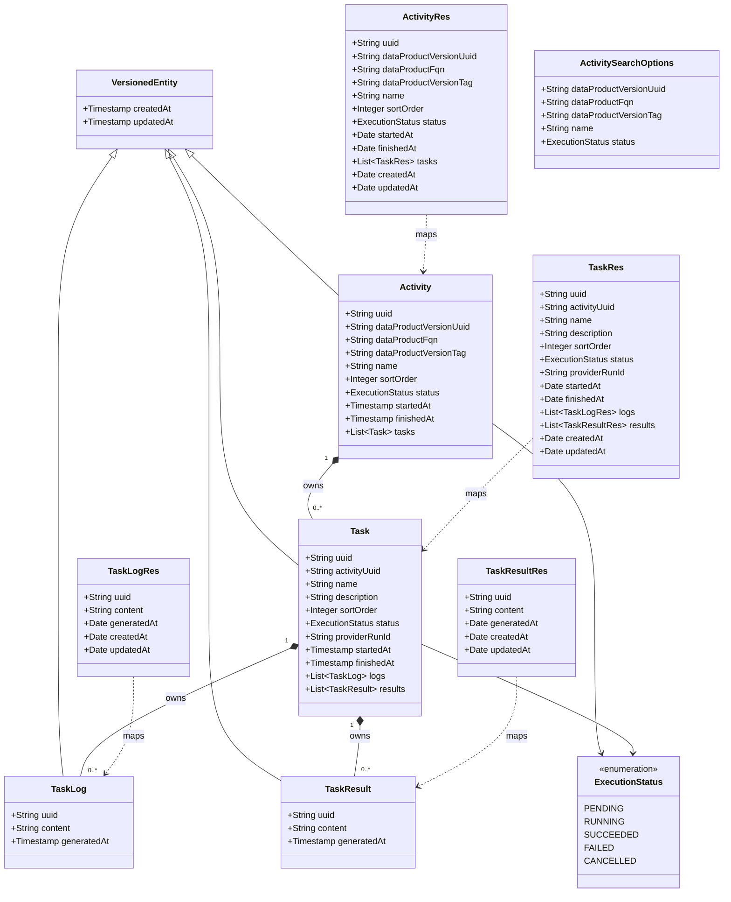

# Anemic CRUD for the Activity aggregate (Task, Logs, Results)

## Requirements

- Persist an Activity as the only root aggregate for a named descriptor activity of a data product version, owning Tasks, each owning Logs and Results.
- Expose anemic HTTP CRUD for that aggregate on one Activity collection. Create, update, and delete tasks, logs, and results only by POST or PUT of the activity, stored as received.
- Enforce model invariants only: required coordinates, the closed status set, cascade delete, and the split between audit, execution, and source timestamps. Do not implement process.

## Entities

**Physical model** (Flyway; Hibernate schema `odm_devops`; **replace** `src/main/resources/db/migration/postgresql/V1__init_schema.sql` with this first schema). Plain `CREATE TABLE IF NOT EXISTS`:

- `activities`: `uuid` PK `varchar(36)`, `data_product_version_uuid` `varchar(36)`, `data_product_fqn` `varchar(255)`, `data_product_version_tag` `varchar(255)`, `name` `varchar(255)`, `sort_order` `integer`, `status` `varchar(255)`, `started_at` timestamp, `finished_at` timestamp, `created_at` timestamp, `updated_at` timestamp. No business `NOT NULL`. Required fields are checked in `validate`.
- `activities_tasks`: `uuid` PK `varchar(36)`, `activity_uuid` `varchar(36)` references `activities(uuid)` **on delete cascade**, `name` `varchar(255)`, `description` text, `sort_order` `integer`, `status` `varchar(255)`, `provider_run_id` `varchar(255)`, `executor_name` `varchar(255)`, `executor_parameters` text, `pipeline_parameters` text, `started_at` timestamp, `finished_at` timestamp, `created_at`, `updated_at`. The last three business columns were added by BDMD-5437 in this same `V1`, before the first deployment.
- `activities_tasks_logs`: `uuid` PK `varchar(36)`, `task_uuid` `varchar(36)` references `activities_tasks(uuid)` **on delete cascade**, `content` text, `generated_at` timestamp, `created_at`, `updated_at`.
- `activities_tasks_results`: `uuid` PK `varchar(36)`, `task_uuid` `varchar(36)` references `activities_tasks(uuid)` **on delete cascade**, `content` text, `generated_at` timestamp, `created_at`, `updated_at`.
- Indexes: `activities (data_product_version_uuid, name, status)`; `activities_tasks (activity_uuid, status)`; `activities_tasks (provider_run_id)` (plain btree, nullable).

Do **not** create tables or entities for Pipeline, Pipeline Run, or a peer task root. Do **not** add a unique constraint on data-product version + name, on task `name` + `provider_run_id`, or on `sort_order`. Do **not** add a foreign key to Registry. `status` is unconstrained `varchar(255)` in the database; the Java enum is the closed set.

## Approach

1. Aggregate and HTTP:
   - One root, Activity, in schema `odm_devops`. Task, TaskLog, and TaskResult are cascaded nested entities (`CascadeType.ALL`, `orphanRemoval = true`, `FetchType.LAZY`). Zero children is valid.
   - One collection, `/api/v2/pp/devops/activities`, in the same shape as a product-plane root controller (`DataProductController`): POST 201, GET `/{uuid}` 200 with the nested graph, GET page 200 without the nested graph, PUT `/{uuid}` 200 overwrite of the whole aggregate, DELETE `/{uuid}` 204. OpenAPI documents GET and search only. POST, PUT, and DELETE carry `@Hidden`.
   - The activity body is the task graph. POST and PUT persist that graph as received. A task, log, or result present in the body is created or updated. One absent from the body is deleted. A null list is an empty list. There is no task controller and no `/tasks` route.
   - No use case, no Registry client, no notification publish, no status transition, no rollup of task status onto the activity.

2. Technical implementation:
   - `ActivityServiceImpl` extends `GenericMappedAndFilteredCrudServiceImpl<ActivitySearchOptions, ActivityRes, Activity, String>` (`spdd/norms/GENERIC-CRUD-GUIDELINES.md`). MapStruct maps resources. Repositories expose static `Specs` combined with `SpecsUtils.combineWithAnd`.
   - Identity is server-generated (`GenerationType.UUID`) unless a PUT body names a task, log, or result that already belongs to that activity. Path uuid wins for the activity. `beforeCreation` clears every client uuid so create cannot merge an existing row. `beforeOverwrite` keeps a nested uuid only when that row already belongs to the activity being written, then applies the incoming collections onto the managed activity so orphan removal deletes what the body omitted.
   - Search overrides `findAllResourcesFiltered` and maps with a graph-free mapper method so the task graph is not loaded. Do not override `afterFindOne`. GET-by-id uses the mapped read path.
   - Errors use `BadRequestException` (400) and `NotFoundException` (404) through the existing `ResponseExceptionHandler`. Invalid enum JSON and invalid sort (`PropertyReferenceException`) are already 400. Do not add a new handler.
   - Replace placeholder Flyway `V1` with the physical model above. Do not add `V2` for this schema. BDMD-5437 later added the task execution columns to this same `V1`, before the first deployment.

3. Business logic:
   - Required on the activity: `dataProductVersionUuid`, `name`. Optional: `dataProductFqn`, `dataProductVersionTag`, `sortOrder`, `startedAt`, `finishedAt`, and the task list.
   - Omitted status on the activity or on a task becomes `PENDING`. Any value in `PENDING`, `RUNNING`, `SUCCEEDED`, `FAILED`, `CANCELLED` may be stored. Reject any other status. Do not check transitions. Do not set activity status from tasks.
   - Task `name`, `description`, `sortOrder`, `providerRunId`, timestamps, logs, and results are optional. A log or result object that is present requires `content`. `generatedAt` is stored as sent and is never copied from `createdAt`.
   - Several activities may share the same data-product version, name, and status. Several tasks may share a name, including a null `providerRunId`. Delete is allowed in every status.
   - Audit timestamps (`VersionedEntity`) are not client-writable. Execution timestamps are client-writable and are not auto-stamped.

## Structure

### Inheritance Relationships

1. `Activity`, `Task`, `TaskLog`, and `TaskResult` extend `VersionedEntity`.
2. `ActivityRes`, `TaskRes`, `TaskLogRes`, and `TaskResultRes` extend `VersionedRes`.
3. `ActivityService` extends `GenericMappedAndFilteredCrudService<ActivitySearchOptions, ActivityRes, Activity, String>`.
4. `ActivityServiceImpl` extends `GenericMappedAndFilteredCrudServiceImpl<ActivitySearchOptions, ActivityRes, Activity, String>`.
5. `ActivitiesRepository` extends `PagingAndSortingAndSpecificationExecutorRepository<Activity, String>`.
6. `BadRequestException` and `NotFoundException` extend `DevOpsApiException`.

### Dependencies

1. `ActivityController` injects `ActivityService` and calls only `*Resource` / `delete` methods.
2. `ActivityServiceImpl` depends on `ActivitiesRepository`, `ActivityMapper`, and `TransactionHandler`.
3. `ActivityMapper` uses `TaskMapper`. `TaskMapper` maps `TaskLog` and `TaskResult`.
4. Nested entities have no repository and no service. The activity repository cascade persists them.
5. `getSpecFromFilters` uses `ActivitiesRepository.Specs` and `SpecsUtils`.

### Layered Architecture

1. Controller layer: `ActivityController` at `/api/v2/pp/devops/activities`. Thin adapter. OpenAPI annotations match `DataProductController`.
2. Service layer: `activity/services/core`. Validate, reconcile the graph, assign identity, persist.
3. Repository layer: `ActivitiesRepository` plus specification helpers. No task, log, or result repository.
4. Persistence: JPA entities in `activity/entities` and Flyway `V1`.
5. Exception handling: existing `ResponseExceptionHandler`. Do not add handlers.

## Operations

### Replace Flyway V1 — `src/main/resources/db/migration/postgresql/V1__init_schema.sql`

1. Responsibility: first product schema for the Activity aggregate.
2. Replace the file contents with `CREATE TABLE IF NOT EXISTS` and `CREATE INDEX` for the four tables and three indexes in **Entities**. No other tables.

### Create enumeration — `ExecutionStatus`

1. Package: `org.opendatamesh.platform.pp.devops.activity.entities`.
2. Values, in order: `PENDING`, `RUNNING`, `SUCCEEDED`, `FAILED`, `CANCELLED`. No `SKIPPED`, `TIMEOUT`, or other aliases.

### Create entity — `Activity`

1. Package: `org.opendatamesh.platform.pp.devops.activity.entities`. `@Entity`, `@Table(name = "activities")`, extends `VersionedEntity`. No Lombok.
2. Attributes:
   - `uuid`: `String` — `@Id`, `@GeneratedValue(strategy = GenerationType.UUID)`, `@Column(name = "uuid", length = 36)`.
   - `dataProductVersionUuid`: `String` — `data_product_version_uuid`, length 36. No `nullable = false`.
   - `dataProductFqn`: `String` — `data_product_fqn`, length 255.
   - `dataProductVersionTag`: `String` — `data_product_version_tag`, length 255.
   - `name`: `String` — length 255. No `nullable = false`.
   - `sortOrder`: `Integer` — `sort_order`.
   - `status`: `ExecutionStatus` — `@Enumerated(EnumType.STRING)`, `status` `varchar(255)`. No `nullable = false`.
   - `startedAt`, `finishedAt`: `Timestamp`.
   - `tasks`: `List<Task>` — `@OneToMany(mappedBy = "activity", cascade = CascadeType.ALL, orphanRemoval = true, fetch = FetchType.LAZY)`, initialized to a new `ArrayList`.
3. Accessors for every field. No lifecycle methods beyond `VersionedEntity`.

### Create entity — `Task`

1. `@Entity`, `@Table(name = "activities_tasks")`, extends `VersionedEntity`.
2. Attributes:
   - `uuid`: `String` — same id mapping as Activity.
   - `activityUuid`: `String` — `@Column(name = "activity_uuid", insertable = false, updatable = false, length = 36)`.
   - `activity`: `Activity` — `@ManyToOne(optional = false)`, `@JoinColumn(name = "activity_uuid", nullable = false)`.
   - `name`: `String` length 255. `description`: `String`, `columnDefinition = "text"`. `sortOrder`: `Integer`. `status`: `ExecutionStatus` as on Activity, no `nullable = false`. `providerRunId`: `String` length 255. `startedAt`, `finishedAt`: `Timestamp`.
   - `logs`: `List<TaskLog>`, `results`: `List<TaskResult>` — `@OneToMany(mappedBy = "task", cascade = CascadeType.ALL, orphanRemoval = true, fetch = FetchType.LAZY)`, each a new `ArrayList`.

### Create entity — `TaskLog` and `TaskResult`

1. Tables `activities_tasks_logs` and `activities_tasks_results`. Both extend `VersionedEntity`.
2. Attributes on each: `uuid` as above; `content` text, no `nullable = false`; `generatedAt` timestamp, column `generated_at`; `task` `@ManyToOne(optional = false)` `@JoinColumn(name = "task_uuid", nullable = false)`.
3. No `taskUuid` Java field. The parent is the association.

### Create repository — `ActivitiesRepository`

1. Package: `org.opendatamesh.platform.pp.devops.activity.repositories`.
2. Extends `PagingAndSortingAndSpecificationExecutorRepository<Activity, String>`.
3. Static nested `Specs`, each returning null when the argument is null or blank (status: null when the enum is null), otherwise `cb.equal` on the attribute:
   - `hasDataProductVersionUuid(String)`
   - `hasDataProductFqn(String)`
   - `hasDataProductVersionTag(String)`
   - `hasName(String)`
   - `hasStatus(ExecutionStatus)`
4. No task repository.

### Create resources and search options

1. Package: `org.opendatamesh.platform.pp.devops.rest.v2.resources.activity`.
2. `ActivityRes`, `TaskRes`, `TaskLogRes`, `TaskResultRes` extend `VersionedRes`. Fields match the class diagram. Java type for timestamps on resources is `Date`, as on `VersionedRes`. Plain getters and setters. No Lombok.
3. `ActivitySearchOptions`: the five filter fields. `status` is `ExecutionStatus`.

### Create mappers — `ActivityMapper`, `TaskMapper`

1. MapStruct, `componentModel = "spring"`. `ActivityMapper` `uses = TaskMapper.class`.
2. `TaskMapper`:
   - `toEntity(TaskRes)` ignores `activity`, `createdAt`, `updatedAt`.
   - `toRes(Task)` maps `activityUuid` from `activity.uuid`.
   - `toEntity` / `toRes` for `TaskLog` and `TaskResult`. `toEntity` ignores `task`, `createdAt`, `updatedAt`.
3. `ActivityMapper`:
   - `toEntity(ActivityRes)` ignores `createdAt` and `updatedAt`. It **maps** `tasks` (the body is the graph).
   - `toRes(Activity)` maps `tasks`.
   - `toResWithoutTasks(Activity)` ignores `tasks`.
4. Do not map `generatedAt` from `createdAt`.

### Implement service — `ActivityService` / `ActivityServiceImpl`

1. Interface in `activity/services/core`: extends `GenericMappedAndFilteredCrudService<ActivitySearchOptions, ActivityRes, Activity, String>`. No extra methods.
2. Class: `@Service`, extends `GenericMappedAndFilteredCrudServiceImpl<ActivitySearchOptions, ActivityRes, Activity, String>`.
3. Dependencies: `ActivitiesRepository`, `ActivityMapper`, `TransactionHandler`. Constructor or field injection consistent with other services in this codebase (`@Autowired` fields).
4. `getRepository()` returns the activities repository.
5. `toRes` / `toEntity` delegate to the mapper. `toRes` is the graph mapping, used by create, get, and overwrite responses.
6. `validate(Activity)`:
   - Trim every string, including activity, task, log, and result `uuid`. Blank optional strings become null (`dataProductFqn`, `dataProductVersionTag`, task `name`, `description`, `providerRunId`, and any uuid that is blank after trim). Uuid trim runs before duplicate-uuid checks and before `beforeOverwrite` indexing so a whitespace-padded owned uuid still matches.
   - `dataProductVersionUuid` required after trim, max 36. Message: `Data product version UUID is required` or `Data product version UUID cannot exceed 36 characters`.
   - `name` required, max 255. Message: `Name is required` / `Name cannot exceed 255 characters`.
   - `dataProductFqn` and `dataProductVersionTag` max 255 when present. Messages: `Data product FQN cannot exceed 255 characters`, `Data product version tag cannot exceed 255 characters`.
   - Each task: `name` and `providerRunId` max 255; `description` max 10000. Messages: `Task name cannot exceed 255 characters`, `Provider run id cannot exceed 255 characters`, `Task description cannot exceed 10000 characters`.
   - A null element in `tasks`, `logs`, or `results` → `BadRequestException` `Task entry cannot be null` / `Log entry cannot be null` / `Result entry cannot be null`.
   - Log or result `content` required, max 1048576. Messages: `Log content is required`, `Result content is required`, `Log content cannot exceed 1048576 characters`, `Result content cannot exceed 1048576 characters`.
   - Duplicate non-null task uuids in one body → `BadRequestException` `Duplicate task uuid in activity`. Duplicate non-null log uuids in one task → `Duplicate log uuid in task`. Duplicate non-null result uuids in one task → `Duplicate result uuid in task`.
   - Do not require task name, sort order, provider run id, generatedAt, or a non-empty task list. Do not check uniqueness of activities or tasks. Do not reject a status because of the previous status.
7. `reconcile(Activity)`:
   - If `status` is null, set `PENDING`. Same for each task.
   - Set `task.activity` to this activity for every task. Set `log.task` / `result.task` to the owning task.
   - Leave `generatedAt` null when the client omitted it.
   - Do not call Registry. Do not roll up status.
8. `beforeCreation(Activity)`:
   - Set the activity uuid to null.
   - Set every task, log, and result uuid to null.
   - Create therefore always inserts new rows, even when the body repeats an existing uuid.
9. `overwriteResource(String uuid, ActivityRes resource)`: set `resource.uuid` from the path, then `super.overwriteResource`. Path wins over the body.
10. `beforeOverwrite(Activity incoming)` — the body replaces the graph:
    - Treat a null `tasks` list as empty. Treat a null `logs` or `results` list on a task as empty.
    - Load the persisted activity by the path uuid (the overwrite transaction already checked that it exists). If the row is missing, throw `NotFoundException` with message `Resource with id={uuid} not found` (same pattern as the generic CRUD base), never an uncaught empty-optional exception.
    - Index that activity's tasks by uuid, and each task's logs and results by uuid.
    - For each incoming task whose uuid is in that index, copy the incoming scalars and child lists onto the managed task, keep its uuid, and keep a child uuid only when that log or result already belongs to that task. Otherwise set the child uuid to null and attach a new child.
    - For each incoming task whose uuid is missing from that index, set its uuid and every child uuid to null and attach it as a new task. This includes a uuid that belongs to a different activity: do not re-parent that other task.
    - `clear()` the managed task list and add only the reconciled tasks, so tasks omitted from the body are orphan-removed. Do the same for logs and results on each kept task.
    - Set `incoming.tasks` to the managed list so the following `save` flushes that collection. Leave incoming scalars (name, status, DPV fields, sort order, execution timestamps) on `incoming` so merge updates them.
    - Do not copy the previous task list back onto the activity unchanged. Do not refuse the write because a status is non-terminal.
11. Do not override `afterFindOne`. GET-by-id uses the mapped read inside `TransactionHandler`.
12. `findAllResourcesFiltered`: override and map with `ActivityMapper.toResWithoutTasks` inside `TransactionHandler.runInTransaction`. Do not initialize the graph. `getSpecFromFilters` AND-combines the five specs; a null filter object yields an empty conjunction.
13. `getSpecFromFilters` skips blank strings and a null status.
14. Transaction boundaries stay in the generic base (`TransactionTemplate` for writes, `TransactionHandler` for reads). Do not add `@Transactional` on the service.

### Create controller — `ActivityController`

1. Package: `org.opendatamesh.platform.pp.devops.rest.v2.controllers`.
2. `@RestController`, `@RequestMapping(value = "/api/v2/pp/devops/activities", produces = MediaType.APPLICATION_JSON_VALUE)`, `@Tag(name = "Activities", description = "Endpoints for managing activities")`.
3. `@Autowired ActivityService`.
4. Methods, mirroring the product-plane root controller:
   - `POST` `createActivity(ActivityRes)` → `createResource`. 201. `@Hidden`.
   - `GET /{uuid}` `getActivity(String uuid)` → `findOneResource`. 200. Returns the nested graph.
   - `GET` `searchActivities(ActivitySearchOptions, @PageableDefault(page = 0, size = 20, sort = "sortOrder", direction = Sort.Direction.ASC) Pageable)` → `findAllResourcesFiltered`. 200. Does not return tasks. Document sort properties: `uuid`, `dataProductVersionUuid`, `dataProductFqn`, `dataProductVersionTag`, `name`, `sortOrder`, `status`, `startedAt`, `finishedAt`, `createdAt`, `updatedAt`.
   - `PUT /{uuid}` `updateActivity(String uuid, ActivityRes)` → `overwriteResource`. 200. The body is the desired aggregate, including tasks. `@Hidden`.
   - `DELETE /{uuid}` `deleteActivity(String uuid)` → `delete`. 204. `@Hidden`.
5. OpenAPI `@Operation`, `@ApiResponses`, and `@Parameter` on each method, same style as `DataProductController`. Document 400, 404, and 500 where they apply. PUT and POST describe that tasks omitted from the body are removed. `@Hidden` on POST, PUT, and DELETE so the public document shows GET and search only.
6. Do not add a task controller, a nested task mapping, or a log/result controller.

### Document the aggregate — `docs/service/README.md`

1. State that the domain is the Activity aggregate: a named activity of a data product version, owning tasks and their logs and results.
2. State that anemic CRUD is this increment, and that process, execute, polling, and notifications are later.
3. Do not name fields, URL paths, or HTTP methods. `docs/` stays free of implementation detail.

### High-level tests (Gherkin)

Implement `ActivityControllerIT` extending `DevOpsApplicationIT`. Use `RoutesV2.ACTIVITIES` (`/api/v2/pp/devops/activities`). Isolate rows in `@BeforeEach` by deleting activities. Each test method's Javadoc is the Scenario below, verbatim. No task-controller test.

Feature: Create an activity
  Scenario: Omitted status defaults to PENDING and the server assigns the uuid
    Given an activity body with dataProductVersionUuid and name and no status and no uuid
    When the client POSTs /api/v2/pp/devops/activities
    Then the response is 201
    And status is PENDING
    And the response uuid is present
    And dataProductVersionUuid and name match the body

Feature: Create an activity with its task graph
  Scenario: POST persists tasks, logs, and results and ignores client uuids
    Given an activity body with one task that has a client uuid, one log, and one result, each with a client uuid and a generatedAt
    And an existing activity whose uuid equals that client activity uuid and that already has a task
    When the client POSTs /api/v2/pp/devops/activities
    Then the response is 201
    And the response uuid is not the client uuid
    And the nested task, log, and result uuids are not the client uuids
    And generatedAt on the log and the result equals the body
    And GET of the pre-existing activity still returns its original task

Feature: Read an activity
  Scenario: GET by id returns the task graph
    Given an activity that has two tasks, one with a log and a result
    When the client GETs /api/v2/pp/devops/activities/{uuid}
    Then the response is 200
    And both tasks are present with their logs and results

Feature: Search activities
  Scenario: Search filters by data product version uuid and does not return tasks
    Given two activities with different dataProductVersionUuid values, one of them with a task
    When the client GETs /api/v2/pp/devops/activities?dataProductVersionUuid={that uuid}
    Then the response is 200
    And the page contains only that activity
    And the tasks field is null or empty

Feature: Replace the task graph
  Scenario: PUT updates the activity and adds, updates, and deletes tasks as sent
    Given an activity with task A and task B
    When the client PUTs /api/v2/pp/devops/activities/{uuid} with task A changed, task B omitted, and a new task C with no uuid
    Then the response is 200
    And a following GET contains task A with the new values and task C
    And task B is absent
    And the activity itself still exists

Feature: Delete an activity
  Scenario: DELETE removes the activity and its tasks, logs, and results
    Given an activity with a task that has a log and a result
    When the client DELETEs /api/v2/pp/devops/activities/{uuid}
    Then the response is 204
    And a following GET of that uuid is 404
    And no rows remain in activities_tasks, activities_tasks_logs, or activities_tasks_results for that activity's former children

Feature: Validation
  Scenario: Missing required fields are rejected
    Given an activity body with a blank name or a blank dataProductVersionUuid
    When the client POSTs /api/v2/pp/devops/activities
    Then the response is 400
    And the error message is "Name is required" or "Data product version UUID is required"

  Scenario: An unknown status is rejected
    Given an activity body whose status is not in the closed set
    When the client POSTs /api/v2/pp/devops/activities
    Then the response is 400
    And the error body includes a message

  Scenario: Oversize log content is rejected
    Given an activity body with a log whose content exceeds 1048576 characters
    When the client POSTs /api/v2/pp/devops/activities
    Then the response is 400
    And the error message is "Log content cannot exceed 1048576 characters"

  Scenario: Oversize task description is rejected
    Given an activity body with a task whose description exceeds 10000 characters
    When the client POSTs /api/v2/pp/devops/activities
    Then the response is 400
    And the error message is "Task description cannot exceed 10000 characters"

  Scenario: Duplicate task uuid is rejected
    Given an activity body with two tasks that share the same non-null uuid
    When the client POSTs /api/v2/pp/devops/activities
    Then the response is 400
    And the error message is "Duplicate task uuid in activity"

  Scenario: Duplicate log uuid is rejected
    Given an activity body with one task that has two logs that share the same non-null uuid
    When the client POSTs /api/v2/pp/devops/activities
    Then the response is 400
    And the error message is "Duplicate log uuid in task"

  Scenario: Duplicate result uuid is rejected
    Given an activity body with one task that has two results that share the same non-null uuid
    When the client POSTs /api/v2/pp/devops/activities
    Then the response is 400
    And the error message is "Duplicate result uuid in task"

Feature: Missing activity
  Scenario: Unknown uuid is not found
    Given no activity with a given uuid
    When the client GETs or PUTs or DELETEs /api/v2/pp/devops/activities/{uuid}
    Then the response is 404

Feature: Search edges
  Scenario: An empty search returns an empty page
    Given no activities
    When the client GETs /api/v2/pp/devops/activities
    Then the response is 200
    And the page is empty

  Scenario: An unknown sort property is rejected
    Given no special precondition
    When the client GETs /api/v2/pp/devops/activities?sort=notAField,asc
    Then the response is 400

Feature: Anemic rules
  Scenario: Duplicate activities are allowed
    Given an existing PENDING activity for a data product version and name
    When the client POSTs another activity with the same dataProductVersionUuid, name, and status PENDING
    Then the response is 201

  Scenario: A non-terminal activity can be deleted
    Given an activity whose status is RUNNING
    When the client DELETEs /api/v2/pp/devops/activities/{uuid}
    Then the response is 204

  Scenario: An empty task list clears tasks
    Given an activity that has a task
    When the client PUTs /api/v2/pp/devops/activities/{uuid} with tasks equal to an empty list
    Then the response is 200
    And a following GET has no tasks
    And the activity still exists

  Scenario: A task uuid from another activity does not move that task
    Given activity A with task T and activity B
    When the client PUTs activity B with a task whose uuid is T
    Then the response is 200
    And GET activity A still returns task T
    And GET activity B does not return uuid T

  Scenario: Two tasks may share a name
    Given an activity body with two tasks with the same name and a null providerRunId
    When the client POSTs /api/v2/pp/devops/activities
    Then the response is 201
    And GET returns both tasks

  Scenario: Whitespace-padded task uuid on PUT still updates the owned task
    Given an activity with task T
    When the client PUTs that activity with task T's uuid padded with spaces and a changed name
    Then the response is 200
    And GET returns the same task uuid T with the new name

Feature: Activity is the only resource
  Scenario: There is no task collection
    Given an existing activity
    When the client GETs /api/v2/pp/devops/activities/{uuid}/tasks
    Then the response is 404

| Feature / Scenario | Test class | Method |
| --- | --- | --- |
| Create an activity / Omitted status defaults to PENDING and the server assigns the uuid | ActivityControllerIT | whenCreateActivityWithoutStatusThenPendingAndServerUuid |
| Create an activity with its task graph / POST persists tasks, logs, and results and ignores client uuids | ActivityControllerIT | whenCreateActivityWithClientUuidsThenNewRowsAndOriginalUntouched |
| Read an activity / GET by id returns the task graph | ActivityControllerIT | whenGetActivityThenReturnTaskGraph |
| Search activities / Search filters by data product version uuid and does not return tasks | ActivityControllerIT | whenSearchByDataProductVersionUuidThenPageWithoutTasks |
| Replace the task graph / PUT updates the activity and adds, updates, and deletes tasks as sent | ActivityControllerIT | whenPutActivityThenReplaceTaskGraph |
| Delete an activity / DELETE removes the activity and its tasks, logs, and results | ActivityControllerIT | whenDeleteActivityThenCascade |
| Validation / Missing required fields are rejected | ActivityControllerIT | whenCreateActivityWithoutRequiredFieldsThenBadRequest |
| Validation / An unknown status is rejected | ActivityControllerIT | whenCreateActivityWithUnknownStatusThenBadRequest |
| Validation / Oversize log content is rejected | ActivityControllerIT | whenCreateActivityWithOversizeLogContentThenBadRequest |
| Validation / Oversize task description is rejected | ActivityControllerIT | whenCreateActivityWithOversizeTaskDescriptionThenBadRequest |
| Validation / Duplicate task uuid is rejected | ActivityControllerIT | whenCreateActivityWithDuplicateTaskUuidThenBadRequest |
| Validation / Duplicate log uuid is rejected | ActivityControllerIT | whenCreateActivityWithDuplicateLogUuidThenBadRequest |
| Validation / Duplicate result uuid is rejected | ActivityControllerIT | whenCreateActivityWithDuplicateResultUuidThenBadRequest |
| Missing activity / Unknown uuid is not found | ActivityControllerIT | whenActivityUuidUnknownThenNotFound |
| Search edges / An empty search returns an empty page | ActivityControllerIT | whenSearchWithNoRowsThenEmptyPage |
| Search edges / An unknown sort property is rejected | ActivityControllerIT | whenSearchWithInvalidSortThenBadRequest |
| Anemic rules / Duplicate activities are allowed | ActivityControllerIT | whenCreateDuplicatePendingActivityThenCreated |
| Anemic rules / A non-terminal activity can be deleted | ActivityControllerIT | whenDeleteRunningActivityThenNoContent |
| Anemic rules / An empty task list clears tasks | ActivityControllerIT | whenPutActivityWithEmptyTasksThenTasksRemoved |
| Anemic rules / A task uuid from another activity does not move that task | ActivityControllerIT | whenPutForeignTaskUuidThenDoNotReparent |
| Anemic rules / Two tasks may share a name | ActivityControllerIT | whenCreateTwoTasksWithSameNameThenBothStored |
| Anemic rules / Whitespace-padded task uuid on PUT still updates the owned task | ActivityControllerIT | whenPutActivityWithPaddedTaskUuidThenUpdateOwnedTask |
| Activity is the only resource / There is no task collection | ActivityControllerIT | whenGetTaskCollectionThenNotFound |

## Norms

1. Follow `spdd/norms/GENERIC-CRUD-GUIDELINES.md` only. This feature does not add a use case; do not apply `spdd/norms/USE_CASE_IMPLEMENTATION.md` and do not add types under a `usecases` package.
2. Use the shallowest generic layer that fits: `GenericMappedAndFilteredCrudServiceImpl`. Do not reimplement create, overwrite, or delete. Put invariants in `validate`, parent links and status default in `reconcile`, identity and graph replacement in `beforeCreation` / `beforeOverwrite`.
3. HTTP adapters call `*Resource` methods. Override `overwriteResource` only to copy the path uuid onto the body before `super`.
4. Controllers use `@Autowired`, OpenAPI annotations, `@PageableDefault`, and `ResponseStatus`, in the style of `DataProductController`.
5. No Lombok. MapStruct `componentModel = "spring"`. JPA associations for nested ownership match the product-plane pattern: parent `@ManyToOne` plus `@OneToMany(mappedBy, cascade = ALL, orphanRemoval = true)`.
6. Throw `BadRequestException` and `NotFoundException`. The existing `ResponseExceptionHandler` maps them. Missing resources use the generic message `Resource with id={id} not found`.
7. Repository specifications are static nested `Specs` and are combined with `SpecsUtils.combineWithAnd`.
8. Tests extend `DevOpsApplicationIT` and address routes through `RoutesV2`.

## Safeguards

1. Functional constraints:
   - The only HTTP resource is `/api/v2/pp/devops/activities`. No task, log, or result route. No `ActivityTaskController` and no task-controller test.
   - POST and PUT store the activity as received. Omitting a task, log, or result deletes it. A null list is empty and clears that collection.
   - GET-by-id returns the graph. Search does not.
   - Create assigns new uuids for the activity and every nested row.
   - PUT keeps a nested uuid only when that row already belongs to the activity in the path. A foreign task uuid does not move the other activity's task.
   - Delete of an activity cascades tasks, logs, and results in every status.
2. Performance constraints: search must not initialize tasks, logs, or results. Default page size is 20. Default sort is `sortOrder` ascending.
3. Security constraints: no Registry call, no credential handling, no notification publish. Error bodies stay on `ErrorRes` and do not add stack traces.
4. Integration constraints: no foreign key to Registry. `dataProductVersionUuid`, `dataProductFqn`, and `dataProductVersionTag` are local columns. The UI filters by `dataProductVersionUuid`.
5. Business-rule constraints, explicitly not enforced here:
   - Uniqueness of activities or of task `name` + `providerRunId`.
   - Delete only when the status is terminal.
   - Status transitions, policy approval, and rolling activity status up from the latest task by `startedAt`.
   - Creating tasks at execute time, re-run copying, and polling logs once at a terminal status.
   - `SKIPPED` and `TIMEOUT`.
6. Exception constraints: validation failures are `BadRequestException` with the messages in Operations. Unknown status JSON is 400. Unknown sort is 400. Unknown activity uuid is 404.
7. Technical constraints: do not edit the generic CRUD base. Do not add Lombok. After the first deployment, do not edit Flyway `V1` again; later changes need a new version. BDMD-5437 added `executor_name`, `executor_parameters`, and `pipeline_parameters` to `activities_tasks` in `V1` before that deployment. Schema `odm_devops` comes from Hibernate configuration, not from a schema prefix in the SQL.
8. Data constraints: `status` column `varchar(255)`. `sort_order` nullable integer with no gap check. `generated_at` nullable and never defaulted from `created_at`. Log and result content max 1048576. Task description max 10000. Other strings max 255, except `data_product_version_uuid` max 36.
9. API constraints: JSON names are the Java bean names (`dataProductVersionUuid`, `dataProductFqn`, `dataProductVersionTag`, `sortOrder`, `providerRunId`, `generatedAt`, `startedAt`, `finishedAt`). Audit fields on the request are ignored. Response includes them.
