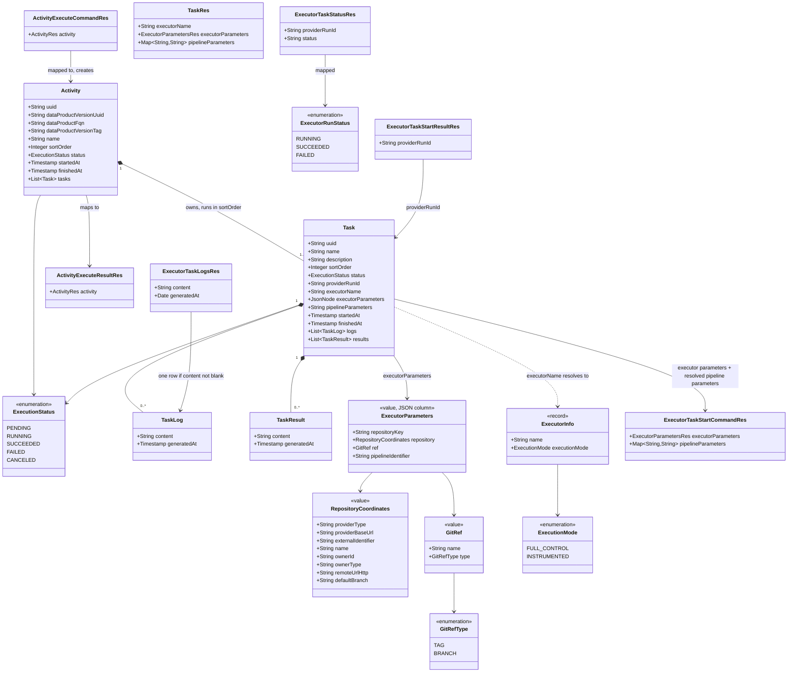

# DevOps 2.0 full-control happy path: execute, auto-approve, run on the executor, advance

## Requirements

- Let the UI execute a named activity of a data product version in **full-control** mode: DevOps creates the activity and its tasks, has each step approved, runs the tasks one after the other on the executor they name, follows each run until it ends, stores its log, and closes the activity as succeeded or failed.
- Auto-approve every execution request while the Policy service is inactive, exactly as the Registry does, so the whole loop closes through Notification without real policies.
- Keep DevOps **specification-agnostic**: it receives an activity with tasks, an executor name, typed executor parameters, and free pipeline parameters, never a descriptor. The one exception is the `${<activityName>.results.<taskName>.<path>}` placeholder in pipeline parameter values, resolved from earlier task results just before a run starts.
- Handle executor secrets the DevOps v1 way: request headers, held in memory per executor and activity, attached to that executor's calls, never stored, logged, returned, or emitted.
- Reach executors over a real HTTP client (executor v2 API), and update `odm-platform-adapter-devops-executor-starter` to that API so the flow runs end to end.
- Out of scope: cancel, error paths, re-run, restart recovery, the instrumented path and the CLI, storing task results, real policies and rejections, real provider executors, the task execute endpoint, descriptor and builder changes.

## Entities



**Physical model.** The three columns are part of `activities_tasks` in `src/main/resources/db/migration/postgresql/V1__init_schema.sql`. The schema has not been deployed, so there is no `V2` migration. No `NOT NULL`:

```sql
executor_name         varchar(255),
executor_parameters   jsonb,
pipeline_parameters   text,
```

`ExecutorParameters`, `RepositoryCoordinates`, and `GitRef` are plain value classes, not JPA entities. `Task.executorParameters` is a `JsonNode` on a `jsonb` column, with `@JdbcTypeCode(SqlTypes.JSON)`, the same shape as Registry `DataProductVersion.content` and Blueprint `BlueprintVersion.content`. `Task.pipelineParameters` is a `String` on a `text` column. `TaskMapper` converts both. There is no `AttributeConverter`. `Activity`, `TaskLog`, and `TaskResult` are unchanged. `provider_run_id` stays `varchar(255)`.

## Approach

1. Process as a chain of atomic use cases (Registry layout, `spdd/norms/USE_CASE_IMPLEMENTATION.md`):
   - Four use-case slices: **ExecuteActivity** (REST), **ApproveActivityExecution** (event), **AdvanceActivity** (called in process), **ExecuteTask** (event). Each has its own command record, presenter, `@Component` factory, package-private use case, and plain `*OutboundPortImpl` classes.
   - Two auto-approve handlers plus small services turn each `*_REQUESTED` event into the matching `*_APPROVED` event when `odm.product-plane.policy-service.active` is false or missing. No use case, no check, no rejection.
   - ApproveActivityExecution and ExecuteTask run AdvanceActivity through a port that builds it with `AdvanceActivityFactory` (Blueprint `EvaluateProtectedResourcesIntegrityInstantiateOutboundPortImpl`). No extra event types.
   - Event handlers only convert the event to a command. Every rule ("only `PENDING`", "only full control") lives in the use case.
   - Chain: `POST /activities/execute` → `ACTIVITY_EXECUTION_REQUESTED` → auto-approve → `ACTIVITY_EXECUTION_APPROVED` → ApproveActivityExecution → AdvanceActivity → `ACTIVITY_TASK_EXECUTION_REQUESTED` → auto-approve → `ACTIVITY_TASK_EXECUTION_APPROVED` → ExecuteTask → AdvanceActivity → next task, or `ACTIVITY_SUCCEEDED` / `ACTIVITY_FAILED`.

2. Technical implementation:
   - **Observer stack ported from the Registry** (`ObserverController`, `ObserverService`, `NotificationEventHandler`, `NotificationDispatchRes`, `NotificationClientEventSubscriber`, `EventTypeRes`, `EventTypeVersion`, `ResourceType`). `@EnableAsync` on `DevOpsApplication` so Notification is answered at once and ExecuteTask can poll on the async thread. Tests stay synchronous with the existing `SyncTaskExecutor` in `TestConfig`.
   - **Executors declared in configuration** (`odm.utility-plane.executor-services.<name>.address` and `.execution-mode`), bound by a typed, validated `@ConfigurationProperties` class. No `active` flag, no callback flag, no service-wide default mode.
   - **One shared executor client** in `client.executor`: `ExecutorClientFactory.getExecutorClient(executorName, activityUuid)` resolves the address and attaches the cached secrets; `ExecutorClientImpl` calls the executor v2 API through `RestUtils` (pattern `NotificationClientConfig` / `NotificationClientImpl`). It lives under `client/**`, so `TestConfig` mocks it in integration tests.
   - **Secrets store**: Caffeine cache, key `<executorName>-ID-<activityUuid>`, `expireAfterWrite` 1 hour, cleared for the whole activity when it closes.
   - **Polling inside ExecuteTask** on its async thread: exponential back-off from `initial-delay` (500 ms) doubling up to `max-delay` (60 s), no attempt limit. No DB-driven poller.
   - **No executor call inside a database transaction**: ExecuteTask commits `RUNNING` (tx 1), starts the run, saves `providerRunId` (tx 2), polls and reads logs outside any transaction, then saves the log and the outcome (tx 3).
   - **Events emitted inside the transaction as its last step** (Registry `DataProductApprover`). Known risk: an approval arriving before commit; fallback emit-after-commit is not implemented now.
   - **Errors**: `BadRequestException` (400), `NotFoundException` (404) through the existing `ResponseExceptionHandler`. `ConcurrencyFailureException` on concurrent executes is already 409. In the observer, `DevOpsApiException` → warn + `processingFailure`; any other exception → error + `processingFailure`. No new exception handler.

3. Business logic:
   - Execute refuses what cannot run: missing DPV uuid, name, or `sortOrder`; no tasks; a task without name, executor name, or executor parameters; executor parameters without `repository.providerType`, `ref.name`, or `ref.type`; a pipeline parameter with a blank key or a null value; an undeclared executor; an instrumented executor. It refuses when an activity with the same DPV uuid and name is `PENDING` or `RUNNING`.
   - Tasks are created `PENDING`, `sortOrder` = list position. The activity `sortOrder` is taken from the body. Status, timestamps, provider run id, logs, and results in the body are reset.
   - Statuses: activity `PENDING → RUNNING → SUCCEEDED | FAILED`; task `PENDING → RUNNING → SUCCEEDED | FAILED`, and `PENDING → CANCELED` when an earlier task failed. Approval sets `startedAt`; ending sets `finishedAt`; a canceled task gets `finishedAt` and no `startedAt`.
   - AdvanceActivity: any task `FAILED` → cancel remaining `PENDING`, activity `FAILED`, emit `ACTIVITY_FAILED`; all `SUCCEEDED` → activity `SUCCEEDED`, emit `ACTIVITY_SUCCEEDED`; a task `RUNNING` → nothing; otherwise request the first `PENDING` task. Secrets are removed after a close commits.
   - Approvals apply only to a `PENDING` item. A duplicate or late approval is `BadRequestException`; the notification is marked failed and the state does not change.
   - Placeholders: resolved in ExecuteTask just before the start call, pipeline parameter values only, from the latest activity per name of the same DPV (by `createdAt`, any status, including the current one), latest task per name inside it (by `createdAt`), results parsed as JSON objects and merged by `generatedAt` (later wins). Scalars as text, objects and arrays as JSON. Unresolved placeholders stay unchanged. Stored values are never modified.
   - Executor contract: DevOps sends only executor parameters, resolved pipeline parameters, and the secret headers (no activity or task identifiers). `providerRunId` is opaque. The executor answers `RUNNING`, `SUCCEEDED`, or `FAILED` only; any other value is treated as `FAILED`.

## Structure

### Inheritance Relationships

1. `ExecuteActivity`, `ApproveActivityExecution`, `AdvanceActivity`, and `ExecuteTask` implement `UseCase` (package-private classes).
2. Each `*OutboundPortImpl` implements its `*OutboundPort` interface (plain classes, package-private).
3. `ActivityExecutionRequestApproverNotificationEventHandler`, `ActivityTaskExecutionRequestApproverNotificationEventHandler`, `ActivityExecutionApprovedNotificationEventHandler`, and `ActivityTaskExecutionApprovedNotificationEventHandler` implement `NotificationEventHandler`.
4. `NotificationClientEventSubscriber` implements `SmartInitializingSingleton`.
5. `ExecutorClientFactoryImpl` implements `ExecutorClientFactory`; `ExecutorClientImpl` implements `ExecutorClient`.
6. `ExecutorSecretsStoreImpl` implements `ExecutorSecretsStore`.
7. `TaskMapper` converts `executorParameters` between `ExecutorParametersRes` and `JsonNode`, and `pipelineParameters` between the map and the stored string. There is no `AttributeConverter`.
8. `BadRequestException` and `NotFoundException` extend `DevOpsApiException` (existing).

### Dependencies

1. `ActivityUseCaseController` → `ActivityUseCasesService` → `ExecuteActivityFactory`.
2. `ObserverController` → `ObserverService` → `List<NotificationEventHandler>` + `NotificationClient`.
3. Auto-approve handlers → `ActivityExecutionRequestApproverService` / `ActivityTaskExecutionRequestApproverService` → `NotificationClient`.
4. Approved-event handlers → `ApproveActivityExecutionFactory` / `ExecuteTaskFactory`.
5. `ApproveActivityExecutionFactory` and `ExecuteTaskFactory` inject `AdvanceActivityFactory` and pass it to their advance port impl.
6. Factories inject `ActivityService`, `ActivityMapper`, `TaskMapper`, `NotificationClient`, `TransactionalOutboundPort`, `ExecutorServicesProperties`, `ExecutorSecretsStore`, `ExecutorClientFactory`, `ExecutorPollingProperties`, as each slice needs.
7. `ExecutorClientFactoryImpl` depends on `ExecutorServicesProperties`, `ExecutorSecretsStore`, and a `RestUtils` built from `RestTemplateBuilder`.
8. The ExecuteTask pipeline-parameters port impl depends on `ActivityService`, `TransactionalOutboundPort`, and `PipelineParameterPlaceholders`.
9. `NotificationClientEventSubscriber` depends on `List<NotificationEventHandler>` and `NotificationClient`.

### Layered Architecture

1. REST layer: `ActivityUseCaseController` (`POST /api/v2/pp/devops/activities/execute`), `ObserverController` (`POST /api/v2/up/observer/notifications`), existing `ActivityController` (CRUD, writes already `@Hidden`).
2. Application layer: `ActivityUseCasesService` (maps `*Res` ↔ entities, holds presenters), event handlers, auto-approve services, `ObserverService`.
3. Use-case layer: `activity.services.usecases.*` slices; business procedure only, all I/O through ports.
4. Core layer: `ActivityService` / `ActivityServiceImpl` (generic CRUD), plus one new query for open activities and one for the DPV's activities.
5. Infrastructure: `executor` package (properties, enums, secrets store), `client.executor` (HTTP client), `client.notification` (existing client + subscriber), `utils.parameters` (placeholder resolution). `executor_parameters` is `jsonb` / `JsonNode`. `pipeline_parameters` is `text` / `String`. `TaskMapper` converts both. There is no JPA converter.
6. Exception handling: existing `ResponseExceptionHandler`; observer failures reported to Notification.

## Operations

Execute the tasks in this order. Packages are relative to `org.opendatamesh.platform.pp.devops` unless stated.

### 1. Rename status — `activity.entities.ExecutionStatus`

1. Rename `CANCELLED` to `CANCELED`. Values: `PENDING`, `RUNNING`, `SUCCEEDED`, `FAILED`, `CANCELED`.
2. Update every reference (entities, tests, docs). No migration: the column is `varchar(255)` and no data holds the old value.

### 2. Create value classes — `activity.entities`

1. `ExecutorParameters`: `repositoryKey` (String, optional, null = main repository), `repository` (`RepositoryCoordinates`, required), `ref` (`GitRef`, required), `pipelineIdentifier` (String, optional, provider-neutral). Empty constructor, getters, setters. No Lombok. Not `@Entity`, not `@Embeddable`.
2. `RepositoryCoordinates`: `providerType`, `providerBaseUrl`, `externalIdentifier`, `name`, `ownerId`, `ownerType`, `remoteUrlHttp`, `defaultBranch`, all `String`. `providerType` and `ownerType` are plain strings with the Registry values (`AZURE | BITBUCKET | GITHUB | GITLAB`, `ORGANIZATION | ACCOUNT`), never DevOps enums.
3. `GitRef`: `name` (String, bare name such as `v1.2.0`), `type` (`GitRefType`).
4. `GitRefType`: enum `TAG`, `BRANCH`.

### 3. Do not add JPA converters — `activity.entities`

1. Do not add `ExecutorParametersJsonConverter` or `StringMapJsonConverter`. An `AttributeConverter` rewrites the column on flush, so a GET updates the task.
2. Store `executorParameters` as `JsonNode` (`jsonb`, `@JdbcTypeCode(SqlTypes.JSON)`). Store `pipelineParameters` as `String` (`text`). Convert both in `TaskMapper` (operation 6). A missing value stays null. A failure to read or write throws `IllegalStateException` with a message that never contains the value.

### 4. Extend entity — `activity.entities.Task`

1. Add:
   - `executorName`: `String`, `@Column(name = "executor_name", length = 255)`.
   - `executorParameters`: `JsonNode`, `@Column(name = "executor_parameters", columnDefinition = "jsonb")`, `@JdbcTypeCode(SqlTypes.JSON)`. No `@Convert`.
   - `pipelineParameters`: `String`, `@Column(name = "pipeline_parameters", columnDefinition = "text")`. No `@Convert`. No default empty map.
2. Getters and setters. No `nullable = false`.

### 5. Extend Flyway V1 — `V1__init_schema.sql`

1. Add the three columns from **Entities** to the existing `activities_tasks` `CREATE TABLE`. Do not add `V2__task_execution_data.sql`. No `NOT NULL`.

### 6. Extend REST resources — `rest.v2.resources.activity`

1. `TaskRes`: add `executorName` (`@Schema(description = "Name of the executor, as declared in DevOps configuration")`), `executorParameters` (`ExecutorParametersRes`, `@Schema(description = "What the executor needs to find and start the pipeline. Not secret: stored, returned, and sent in events.")`), `pipelineParameters` (`Map<String, String>`, `@Schema(description = "Arguments passed to the pipeline run. Values may contain ${…} placeholders. Not secret.")`).
2. Create `ExecutorParametersRes`, `RepositoryCoordinatesRes`, `GitRefRes`, same fields and names as the entity value classes; `GitRefRes.type` is `GitRefType`. JavaBeans, `@Schema` on fields.
3. `ActivityRes.sortOrder`: update its `@Schema` to say it is the activity's position among the DPV's activities and is required by execute.
4. `TaskMapper`: MapStruct maps the new fields. `executorParameters` uses qualified methods: resource → `valueToTree` (null stays null); entity → `treeToValue` into `ExecutorParametersRes` (null or JSON null stays null). `pipelineParameters` uses qualified methods: resource → `writeValueAsString` (null stays null); entity → parse into `LinkedHashMap<String, String>` (null or blank stays null). Keep `ExecutorParameters toEntity(ExecutorParametersRes)` and `ExecutorParametersRes toRes(ExecutorParameters)` for the value classes. Add `TaskRes toResWithoutLogsAndResults(Task)` ignoring `logs` and `results`, with the same conversions. Use cases that need the typed value parse a local copy and do not set the field unless the stored value is meant to change.
5. `ActivityMapper`: add `ActivityRes toEventRes(Activity)` that maps tasks with `TaskMapper.toResWithoutLogsAndResults` (`@Mapping(target = "tasks", qualifiedByName = ...)` or an `@IterableMapping`). Used for every event that embeds the activity.

### 7. Update core CRUD — `ActivityService` / `ActivityServiceImpl` / `ActivitiesRepository`

1. `copyTaskScalars`: also copy `executorName`, `executorParameters`, `pipelineParameters`. Without this, an overwrite drops them.
2. `validate`: trim `executorName` to null; `executorName` max 255 → `BadRequestException("Executor name cannot exceed 255 characters")`. A null `pipelineParameters` string stays null. `copyTaskScalars` copies the executor-parameters `JsonNode` and the pipeline-parameters string.
3. `ActivitiesRepository`: add `List<Activity> findByDataProductVersionUuidAndNameAndStatusIn(String dataProductVersionUuid, String name, Collection<ExecutionStatus> statuses)` and `List<Activity> findByDataProductVersionUuid(String dataProductVersionUuid)`.
4. `ActivityService`: add `List<Activity> findActivitiesInStatus(String dataProductVersionUuid, String name, Set<ExecutionStatus> statuses)` and `List<Activity> findAllOfDataProductVersion(String dataProductVersionUuid)`, delegating to the repository. Callers load lazy collections inside their own transaction.
5. Do not change create, overwrite, delete, or the search behaviour. `ActivityController` write methods already carry `@Hidden`; leave them.

### 8. Add dependency — `pom.xml`

1. Add `com.github.ben-manes.caffeine:caffeine` (version managed by the Spring Boot parent).

### 9. Create executor configuration — `executor`

1. `ExecutionMode`: enum `FULL_CONTROL`, `INSTRUMENTED` (YAML `full-control` / `instrumented` through Spring relaxed enum binding).
2. `ExecutorRunStatus`: enum `RUNNING`, `SUCCEEDED`, `FAILED`.
3. `ExecutorInfo`: `record ExecutorInfo(String name, ExecutionMode executionMode)`.
4. `ExecutorServicesProperties`: `@Component`, `@Validated`, `@ConfigurationProperties(prefix = "odm.utility-plane")`. Field `Map<String, ExecutorServiceProperties> executorServices = new LinkedHashMap<>()` (`@Valid`). Nested static class `ExecutorServiceProperties` with `@NotBlank String address` and `@NotNull ExecutionMode executionMode`. A missing address or mode fails startup. Method `Optional<ExecutorInfo> findExecutor(String name)` and `Optional<String> findAddress(String name)`.
5. `ExecutorPollingProperties`: `@Component`, `@ConfigurationProperties(prefix = "odm.utility-plane.executor-polling")`. Fields `Duration initialDelay = 500ms`, `Duration maxDelay = 60s`. Method `Duration delayForAttempt(int attempt)`: `min(initialDelay × 2^(attempt-1), maxDelay)`, overflow-safe.
6. `ExecutorSecretsStore` interface: `void store(String executorName, String activityUuid, Map<String, String> secretHeaders)`, `Map<String, String> find(String executorName, String activityUuid)` (empty map when absent or expired), `void removeAll(String activityUuid)`.
7. `ExecutorSecretsStoreImpl`: `@Component`. Caffeine `Cache<String, Map<String, String>>`, `expireAfterWrite(Duration.ofHours(1))`. Key `executorName + "-ID-" + activityUuid`. `store` with an empty map does nothing. `removeAll` invalidates every key ending with `"-ID-" + activityUuid`. Values stored as unmodifiable copies. Never logs keys' values.

### 10. Create executor client — `client.executor`

1. `ExecutorClient` interface: `ExecutorTaskStartResultRes startTask(ExecutorTaskStartCommandRes command)`, `ExecutorTaskStatusRes getTaskStatus(String providerRunId)`, `ExecutorTaskLogsRes getTaskLogs(String providerRunId)`.
2. `ExecutorClientFactory` interface: `ExecutorClient getExecutorClient(String executorName, String activityUuid)`.
3. Resources in `client.executor.resources`: `ExecutorTaskStartCommandRes { ExecutorParametersRes executorParameters; Map<String, String> pipelineParameters; }`, `ExecutorTaskStartResultRes { String providerRunId; }`, `ExecutorTaskStatusRes { String providerRunId; String status; }`, `ExecutorTaskLogsRes { String content; Date generatedAt; }`. No activity or task identifiers anywhere.
4. `ExecutorClientImpl` (package-private constructor, like `NotificationClientImpl`): holds `address`, the secret headers as `List<HttpHeader>`, and `RestUtils`.
   - `startTask` → `restUtils.genericPost(address + "/api/v2/up/executor/tasks/start", headers, command, ExecutorTaskStartResultRes.class)`.
   - `getTaskStatus` → `GET address + "/api/v2/up/executor/tasks/status?providerRunId={encoded}"` via `genericGet`, `ExecutorTaskStatusRes.class`.
   - `getTaskLogs` → `GET address + "/api/v2/up/executor/tasks/logs?providerRunId={encoded}"`, `ExecutorTaskLogsRes.class`.
   - Encode `providerRunId` with `UriUtils.encodeQueryParam(..., UTF_8)`.
5. `ExecutorClientFactoryImpl` (package-private): `getExecutorClient` resolves the address from `ExecutorServicesProperties` (`NotFoundException("Executor " + name + " is not declared")` if missing), reads `ExecutorSecretsStore.find(executorName, activityUuid)`, and returns a new `ExecutorClientImpl`.
6. `ExecutorClientConfig`: `@Configuration`, `@Bean ExecutorClientFactory executorClientFactory(RestTemplateBuilder, ExecutorServicesProperties, ExecutorSecretsStore)` building `RestUtilsFactory.getRestUtils(restTemplateBuilder.build())`. No dummy fallback.

### 11. Create event infrastructure (ported from the Registry)

1. `rest.v2.resources.event.EventTypeRes`: `ACTIVITY_EXECUTION_REQUESTED`, `ACTIVITY_TASK_EXECUTION_REQUESTED`, `ACTIVITY_SUCCEEDED`, `ACTIVITY_FAILED`, `ACTIVITY_CANCELED`, `ACTIVITY_EXECUTION_APPROVED`, `ACTIVITY_EXECUTION_REJECTED`, `ACTIVITY_TASK_EXECUTION_APPROVED`, `ACTIVITY_TASK_EXECUTION_REJECTED`; `static EventTypeRes fromString(String)` throwing `IllegalArgumentException` on unknown, as the Registry.
2. `rest.v2.resources.event.EventTypeVersion` (`V2_0_0("V2.0.0")`, `toString` = label, `fromString`) and `ResourceType` (`ACTIVITY`, `fromString`), copied from the Registry.
3. `rest.v2.resources.notification.NotificationDispatchRes`, copied from the Registry: `Long sequenceId`, `NotificationDispatchEventRes event { Long sequenceId, resourceType, resourceIdentifier, type, eventTypeVersion, JsonNode eventContent }`, `NotificationDispatchSubscriptionRes subscription`.
4. `utils.usecases.NotificationEventHandler`: `boolean supportsEventType(EventTypeRes)`, `void handleEvent(NotificationDispatchEventRes)`.
5. `observer.ObserverService`: `@Service`, `@Async public void processNotification(NotificationDispatchRes)`, same body as Registry `ObserverService` with `DevOpsApiException` in place of `RegistryApiException`. Unknown type or no handler → log info and `processingSuccess`.
6. `rest.v2.controllers.ObserverController`: copy of the Registry class. `@RestController`, `@RequestMapping(value = "/api/v2/up/observer", produces = MediaType.APPLICATION_JSON_VALUE)`, `@Tag(name = "Observer", description = "Endpoints for events")`, `@PostMapping("/notifications")`, `@ResponseStatus(HttpStatus.OK)`, calls `observerService.processNotification`. Same `@Operation` / `@ApiResponses` (200, 400, 500) as the Registry.
7. `client.notification.NotificationClientEventSubscriber`: `@Component implements SmartInitializingSingleton`, copied from the Registry (subscribes to every `EventTypeRes` that a mounted handler supports; log text "Subscribing devops to events").
8. `DevOpsApplication`: add `@EnableAsync`.

### 12. Create event resources

1. Common shape of every emitted class (Registry `EmittedEventDataProductInitializationApprovedRes`): `resourceType = ACTIVITY`, `resourceIdentifier` (activity uuid), `type` (fixed `EventTypeRes`), `eventTypeVersion = V2_0_0`, getters returning strings, `eventContent` nested static class.
2. `rest.v2.resources.activity.events.emitted`:
   - `EmittedEventActivityExecutionRequestedRes`: `eventContent.activity` (`ActivityRes` from `toEventRes`).
   - `EmittedEventActivityTaskExecutionRequestedRes`: `eventContent.activity` (`toEventRes`) and `eventContent.task` (`TaskRes` without logs and results).
   - `EmittedEventActivitySucceededRes`, `EmittedEventActivityFailedRes`: `eventContent.activity` (`toEventRes`).
3. `rest.v2.resources.event.autoapprove`:
   - `EmittedEventActivityExecutionApprovedRes`: `eventContent.activity = { uuid, name, sortOrder, dataProductVersionUuid }` (nested static class `Activity`).
   - `EmittedEventActivityTaskExecutionApprovedRes`: `eventContent.activity` as above and `eventContent.task = { uuid, name }`.
4. `rest.v2.resources.activity.events.received`: `ReceivedEventActivityExecutionRequestedRes` (content.activity `ActivityRes`), `ReceivedEventActivityTaskExecutionRequestedRes` (content.activity `ActivityRes`, content.task `TaskRes`), `ReceivedEventActivityExecutionApprovedRes` (content.activity `{ uuid, name, sortOrder, dataProductVersionUuid }`), `ReceivedEventActivityTaskExecutionApprovedRes` (content.activity as above, content.task `{ uuid, name }`). `@JsonIgnoreProperties(ignoreUnknown = true)`.
5. No event ever contains logs, results, or secrets. No event carries the other activities of the DPV.

### 13. Create REST side of execute

1. `rest.v2.resources.activity.usecases.execute.ActivityExecuteCommandRes { ActivityRes activity; }` and `ActivityExecuteResultRes { ActivityRes activity; }` (empty constructor + all-args constructor for the result, `@Schema`).
2. `rest.v2.controllers.ActivityUseCaseController`: `@RestController`, `@RequestMapping(value = "/api/v2/pp/devops/activities", produces = MediaType.APPLICATION_JSON_VALUE)`, `@Tag(name = "Activities")`.
   - `@PostMapping("/execute") @ResponseStatus(HttpStatus.CREATED) ActivityExecuteResultRes executeActivity(@RequestBody ActivityExecuteCommandRes executeCommand, @RequestHeader HttpHeaders headers)` → `useCasesService.executeActivity(executeCommand, headers)`.
   - OpenAPI `@Operation` describing the process and the secret header convention `x-odm-<executorName>-executor-secret-<secretType>`; `@ApiResponses` 201, 400, 409, 500 (pattern Registry `DataProductVersionUseCaseController`).
3. `activity.services.ActivityUseCasesService`: `@Service`.
   - `executeActivity(ActivityExecuteCommandRes commandRes, HttpHeaders headers)`: null command or null activity → `BadRequestException("Activity cannot be null")`; `new ExecuteActivityCommand(activityMapper.toEntity(commandRes.getActivity()))`; `ActivityExecuteResultHolder holder = new ActivityExecuteResultHolder(activityMapper)`; `executeActivityFactory.buildExecuteActivity(command, holder, headers).execute()`; return `new ActivityExecuteResultRes(holder.getResult())`.
   - `ActivityExecuteResultHolder` is a private static inner class implementing `ExecuteActivityPresenter`. It receives the mapper in its constructor and maps the activity to `ActivityRes` inside `presentActivityExecutionRequested`, because the use case presents inside its transaction, while the task graph is still attached.

### 14. Implement use case — `activity.services.usecases.execute` (ExecuteActivity)

1. `record ExecuteActivityCommand(Activity activity)`; `interface ExecuteActivityPresenter { void presentActivityExecutionRequested(Activity activity); }`.
2. Ports:
   - `ExecuteActivityPersistenceOutboundPort`: `List<Activity> findActivities(String dataProductVersionUuid, String activityName, Set<ExecutionStatus> statuses)`, `Activity create(Activity activity)` (→ `activityService.create`).
   - `ExecuteActivityExecutorOutboundPort`: `Optional<ExecutorInfo> findExecutor(String executorName)` (→ `ExecutorServicesProperties`).
   - `ExecuteActivitySecretsOutboundPort`: `void storeExecutorSecrets(Activity activity)`. Impl holds the request `HttpHeaders`. For each distinct task `executorName`, keep headers whose name, compared case-insensitively, starts with `x-odm-<executorName>-executor-secret-` and has a non-empty suffix; rewrite each to `x-odm-<suffix>` (lower case); call `ExecutorSecretsStore.store(executorName, activity.getUuid(), rewritten)`. Other headers are ignored. Never log names with values.
   - `ExecuteActivityNotificationOutboundPort`: `void emitActivityExecutionRequested(Activity activity)` → `EmittedEventActivityExecutionRequestedRes` with `activityMapper.toEventRes(activity)` → `notificationClient.notifyEvent`.
3. `ExecuteActivityFactory` (`@Component`): injects `ActivityService`, `ActivityMapper`, `NotificationClient`, `ExecutorServicesProperties`, `ExecutorSecretsStore`, `TransactionalOutboundPort`. `UseCase buildExecuteActivity(ExecuteActivityCommand, ExecuteActivityPresenter, HttpHeaders)`.
4. `ExecuteActivity.execute()` (composed method):
   - `validateCommand()`:
     - command or activity null → `"Activity cannot be null"`;
     - blank `dataProductVersionUuid` → `"Data product version UUID is required"`; blank `name` → `"Name is required"`; null `sortOrder` → `"Activity sort order is required"`;
     - null or empty `tasks` → `"Activity must have at least one task"`;
     - each task: null → `"Task entry cannot be null"`; blank `name` → `"Task name is required"`; blank `executorName` → `"Task <name>: executor name is required"`; null `executorParameters` node → `"Task <name>: executor parameters are required"`; `treeToValue` that node into `ExecutorParameters` and do not write it back; null `repository` or blank `repository.providerType` → `"Task <name>: executor parameters repository provider type is required"`; null `ref` or blank `ref.name` → `"Task <name>: executor parameters ref name is required"`; null `ref.type` → `"Task <name>: executor parameters ref type is required"`;
     - pipeline parameters: a null or blank string stays null and is not replaced; parse a present string into a map and do not write it back; a blank key → `"Task <name>: pipeline parameter keys cannot be blank"`; a null value → `"Task <name>: pipeline parameter <key> has no value"`.
   - `validateExecutors()`: for each distinct executor name, `findExecutor` empty → `"Executor <name> is not declared"`; mode `INSTRUMENTED` → `"Executor <name> runs in instrumented mode, which is not supported yet"`.
   - `transactionalPort.doInTransactionWithResults(...)`:
     - `refuseIfAnotherExecutionIsOpen()`: `findActivities(dpvUuid, name, {PENDING, RUNNING})` not empty → `BadRequestException("Activity <name> of data product version <dpvUuid> is already PENDING or RUNNING")`;
     - `prepareForExecution()`: activity `uuid = null`, `status = PENDING`, `startedAt = finishedAt = null`, `sortOrder` kept; each task `uuid = null`, `status = PENDING`, `sortOrder = index`, `providerRunId = null`, timestamps null, `logs` and `results` empty lists;
     - `activity = persistencePort.create(activity)`;
     - `secretsPort.storeExecutorSecrets(activity)`;
     - `notificationPort.emitActivityExecutionRequested(activity)` (last step);
     - `presenter.presentActivityExecutionRequested(activity)`.

### 15. Implement auto-approve — `activity.services.usecases.approveexecutionrequest` and `approvetaskexecutionrequest`

1. `ActivityExecutionRequestApproverNotificationEventHandler`: `@Component`, `@ConditionalOnProperty(name = "odm.product-plane.policy-service.active", havingValue = "false", matchIfMissing = true)`. Supports `ACTIVITY_EXECUTION_REQUESTED`. Converts with `ObjectMapper.convertValue` to `ReceivedEventActivityExecutionRequestedRes`; conversion failure, null event, null content, or null activity → `BadRequestException` with the Registry messages adapted ("Missing 'activity' field in event content"). Calls `approverService.emitActivityExecutionApprovedEvent(activityRes)`.
2. `ActivityExecutionRequestApproverService` (`@Service`): builds `EmittedEventActivityExecutionApprovedRes` (`resourceIdentifier` = activity uuid, content activity `{uuid, name, sortOrder, dataProductVersionUuid}`) and calls `notificationClient.notifyEvent`.
3. `ActivityTaskExecutionRequestApproverNotificationEventHandler` (same condition) supports `ACTIVITY_TASK_EXECUTION_REQUESTED`; requires activity and task (`"Missing 'task' field in event content"`); calls `ActivityTaskExecutionRequestApproverService.emitActivityTaskExecutionApprovedEvent(activityRes, taskRes)`, which emits `EmittedEventActivityTaskExecutionApprovedRes` (activity block + `task { uuid, name }`).
4. No use case, no check, no rejection. Pattern: Registry `DataProductInitializationApproverNotificationEventHandler` / `DataProductInitializationApproverService`.

### 16. Implement use case — `activity.services.usecases.approveexecution` (ApproveActivityExecution)

1. `record ApproveActivityExecutionCommand(String activityUuid)`; `interface ApproveActivityExecutionPresenter { void presentActivityExecutionApproved(Activity activity); }`.
2. `ActivityExecutionApprovedNotificationEventHandler` (`@Component`, always mounted): supports `ACTIVITY_EXECUTION_APPROVED`; converts to `ReceivedEventActivityExecutionApprovedRes`; requires `eventContent.activity.uuid` (`"Missing 'uuid' field in activity"`); runs `factory.buildApproveActivityExecution(new ApproveActivityExecutionCommand(uuid), activity -> { }).execute()`.
3. Ports: `ApproveActivityExecutionPersistenceOutboundPort` (`Activity findActivity(String uuid)` → `activityService.findOne`, `Activity save(Activity)` → `activityService.overwrite(uuid, activity)`); `ApproveActivityExecutionAdvanceActivityOutboundPort` (`void advanceActivity(String activityUuid)`, impl runs `advanceActivityFactory.buildAdvanceActivity(new AdvanceActivityCommand(uuid), activity -> { }).execute()`).
4. `ApproveActivityExecutionFactory` (`@Component`): injects `ActivityService`, `TransactionalOutboundPort`, `AdvanceActivityFactory`.
5. `execute()`:
   - `validateCommand()`: blank uuid → `BadRequestException("Activity UUID is required")`.
   - in a transaction: `findActivity`; `requirePending()` → `BadRequestException("Activity <uuid> can be approved only if PENDING")`; `status = RUNNING`, `startedAt = now`; `save`.
   - `presenter.presentActivityExecutionApproved(activity)`.
   - after commit: `advancePort.advanceActivity(uuid)`.

### 17. Implement use case — `activity.services.usecases.advance` (AdvanceActivity)

1. `record AdvanceActivityCommand(String activityUuid)`; `interface AdvanceActivityPresenter { void presentActivityAdvanced(Activity activity); }`.
2. Ports:
   - `AdvanceActivityPersistenceOutboundPort`: `findActivity`, `save`.
   - `AdvanceActivityNotificationOutboundPort`: `emitTaskExecutionRequested(Activity, Task)`, `emitActivitySucceeded(Activity)`, `emitActivityFailed(Activity)` (resources of Operation 12, `toEventRes`).
   - `AdvanceActivitySecretsOutboundPort`: `removeExecutorSecrets(Activity)` → `ExecutorSecretsStore.removeAll(activity.getUuid())`.
3. `AdvanceActivityFactory` (`@Component`): injects `ActivityService`, `ActivityMapper`, `TaskMapper`, `NotificationClient`, `ExecutorSecretsStore`, `TransactionalOutboundPort`. `UseCase buildAdvanceActivity(AdvanceActivityCommand, AdvanceActivityPresenter)`.
4. `execute()`:
   - `validateCommand()`.
   - `outcome = transactionalPort.doInTransactionWithResults(...)` returning a private enum `Outcome { CLOSED, TASK_REQUESTED, NOTHING_TO_DO }` and the activity:
     - `findActivity`; `requireRunning()` → `BadRequestException("Activity <uuid> can be advanced only if RUNNING")`;
     - tasks ordered by `sortOrder`;
     - `anyTaskFailed` → `cancelPendingTasks()` (each `PENDING` → `CANCELED`, `finishedAt = now`), activity `FAILED`, `finishedAt = now`, `save`, `emitActivityFailed` → `CLOSED`;
     - `allTasksSucceeded` → activity `SUCCEEDED`, `finishedAt = now`, `save`, `emitActivitySucceeded` → `CLOSED`;
     - `anyTaskRunning` → `NOTHING_TO_DO`;
     - otherwise → `emitTaskExecutionRequested(activity, firstPendingTask)` → `TASK_REQUESTED`.
   - `CLOSED` → `secretsPort.removeExecutorSecrets(activity)` after commit.
   - `presenter.presentActivityAdvanced(activity)`.

### 18. Implement placeholder resolution — `utils.parameters.PipelineParameterPlaceholders`

1. Plain final utility class, no Spring. Pattern `\$\{([^}]+)\}` (v1 `VariableTemplateUtils`).
2. `static String resolve(String value, Map<String, Map<String, JsonNode>> resultsByActivityAndTask, Consumer<String> onUnresolved)`:
   - For each match, split the inner path on `.`; require at least 3 parts and `parts[1].equals("results")`; `activityName = parts[0]`, `taskName = parts[2]`, the rest is the JSON path.
   - Look up the merged `JsonNode` for (activity, task); walk the remaining parts as object fields. A missing activity, task, field, or a walk through a non-object → unresolved.
   - Replace resolved scalars with `asText()`, objects and arrays with their compact JSON.
   - Unresolved: leave the placeholder text unchanged and call `onUnresolved(path)`.
   - `null` value → `null`; a `$` not matching the pattern is untouched.
3. `static Map<String, String> resolveAll(Map<String, String> parameters, ...)`: new `LinkedHashMap`, same keys and order, resolved values. Keys are never resolved.

### 19. Implement use case — `activity.services.usecases.executetask` (ExecuteTask)

1. `record ExecuteTaskCommand(String activityUuid, String taskUuid)`; `interface ExecuteTaskPresenter { void presentTaskExecuted(Task task); }`.
2. `ActivityTaskExecutionApprovedNotificationEventHandler` (`@Component`, always mounted): supports `ACTIVITY_TASK_EXECUTION_APPROVED`; requires `activity.uuid` and `task.uuid`; runs `factory.buildExecuteTask(new ExecuteTaskCommand(a, t), task -> { }).execute()` on the async observer thread.
3. Ports:
   - `ExecuteTaskPersistenceOutboundPort`: `findActivity`, `save`.
   - `ExecuteTaskPipelineParametersOutboundPort`: `Map<String, String> resolvePipelineParameters(Task task)`. Impl, inside `transactionalPort.doInTransactionWithResults`: `activityService.findAllOfDataProductVersion(dpvUuid)`; keep the latest activity per name by `createdAt`; in each, the latest task per name by `createdAt`; parse each of that task's `TaskResult.content` as a JSON object (non-JSON or non-object rows ignored), deep-merge in `generatedAt` order (null last), later wins; parse `task.getPipelineParameters()` into a map (null or blank → null) and call `PipelineParameterPlaceholders.resolveAll` with that copy. Do not set the field. Never log values.
   - `ExecuteTaskExecutorOutboundPort`: `ExecutionMode findExecutionMode(String executorName)`; `String startRun(Task task, Map<String, String> resolvedPipelineParameters)`; `ExecutorRunStatus readRunStatus(Task task)`; `void waitBeforeNextStatusRead(int attempt)`; `Optional<TaskLog> readRunLog(Task task)`. Impl: `client = executorClientFactory.getExecutorClient(task.getExecutorName(), task.getActivity().getUuid())`; start → `new ExecutorTaskStartCommandRes(taskMapper.jsonNodeToExecutorParameters(task.getExecutorParameters()), resolved)`, returns `providerRunId` (blank → `InternalException("Executor <name> returned no provider run id")`); status → `ExecutorRunStatus.valueOf` of the upper-cased string, anything else `FAILED` with a warn log; wait → `Thread.sleep(pollingProperties.delayForAttempt(attempt))`, restoring the interrupt flag and throwing `InternalException` when interrupted; log → `Optional.empty()` when content is blank, else a `TaskLog` with `content` and `generatedAt` (`Timestamp` from the response, or now).
   - `ExecuteTaskAdvanceActivityOutboundPort`: `advanceActivity(String activityUuid)`.
4. `ExecuteTaskFactory` (`@Component`): injects `ActivityService`, `TaskMapper`, `ExecutorServicesProperties`, `ExecutorClientFactory`, `ExecutorPollingProperties`, `TransactionalOutboundPort`, `AdvanceActivityFactory`.
5. `execute()`:
   - `validateCommand()`: both uuids present.
   - `task = startTaskExecution()` (tx 1): `findActivity`; `requireRunning(activity)` → `BadRequestException("Activity <uuid> is not RUNNING")`; find the task by uuid → `NotFoundException("Task <uuid> not found in activity <uuid>")`; `requirePending(task)` → `BadRequestException("Task <uuid> can be executed only if PENDING")`; task `RUNNING`, `startedAt = now`; `save`.
   - `findExecutionMode != FULL_CONTROL` → `presenter.presentTaskExecuted(task)` and return (not reachable in this story).
   - `resolved = parametersPort.resolvePipelineParameters(task)`.
   - `providerRunId = executorPort.startRun(task, resolved)` (no transaction).
   - `recordProviderRunId(providerRunId)` (tx 2: reload, set on the task, save).
   - `runStatus = followRunUntilItEnds(task)`: read status; while `RUNNING`, `waitBeforeNextStatusRead(++attempt)` then read again.
   - `log = executorPort.readRunLog(task)` (once).
   - `recordRunOutcome(runStatus, log)` (tx 3: reload, add the log if present, status `SUCCEEDED` or `FAILED`, `finishedAt = now`, save).
   - `presenter.presentTaskExecuted(task)`; `advancePort.advanceActivity(activityUuid)` after commit.

### 20. Configuration — `application.yml`, `application-test.yml`

1. `application.yml`: add

   ```yaml
   odm:
     product-plane:
       policy-service:
         active: false
     utility-plane:
       executor-polling:
         initial-delay: 500ms
         max-delay: 60s
       executor-services: {}
   spring:
     task:
       execution:
         pool:
           core-size: 8
           max-size: 32
           queue-capacity: 100
   ```

   Keep existing keys; merge under the existing `odm` and `spring` nodes.
2. `application-test.yml`: `odm.utility-plane.executor-services.starter` (`address: http://localhost:9080`, `execution-mode: full-control`), `odm.utility-plane.executor-services.cli` (`address: http://localhost:9081`, `execution-mode: instrumented`), `executor-polling.initial-delay: 1ms`, `max-delay: 5ms`.
3. `application-dev.yml`: declare `starter` at `http://localhost:9080`, `full-control`.

### 21. Documentation — `docs/`

1. `docs/service/README.md`: replace "later" with the full-control process in business terms: execute, approval of the activity and of each task, sequential tasks, the first failure fails the activity and cancels the rest.
2. `docs/service/policy-service.md` (new, mirroring Registry): Policy inactive means every request is auto-approved without checks; Notification must be active for the loop to close; with Notification inactive the activity stays `PENDING`.
3. `docs/service/events.md` (new, mirroring Registry): the event catalogue (name, emitted by, consumed by, content in words); no logs, results, or secrets in events.
4. `docs/setup/configuration.md`: executor declaration (name, address, execution mode), polling settings, async pool, the secret header convention and the one-hour lifetime, the Policy flag. State that executor and pipeline parameters are not secret.
5. Stay high level (`AGENTS.md`): no class names.

### 22. Update starter executor — repository `odm-platform-adapter-devops-executor-starter`

1. Build: parent Spring Boot `3.5.7`, Java 21 (`pom.xml`, `Dockerfile` base `amazoncorretto:21-alpine-jdk`, `EXPOSE 9080`, both GitHub workflows `java-version: '21'`). Remove `spring-boot-starter-data-jpa`, `h2`, `httpclient`; keep `spring-boot-starter-web`. Do not add `spring-boot-starter-validation`. `jakarta.*` imports. Remove the `spring.datasource` block from `application.yml`. Set `server.error.include-message: always`, as the other product-plane services do, so a `ResponseStatusException` reason is in the JSON body.
2. Delete the v1 code: `DummyController`, `DummyService`, `TaskRun`, `TaskResource`, `TaskResultResource`, `RestTemplateConfig`, `AsyncConfig`, `ObjectMapperFactory` if unused.
3. Package `org.executor`, main class `org.executor.Main` kept.
4. `resources`: `TaskStartCommandRes { ExecutorParametersRes executorParameters; Map<String, String> pipelineParameters; }` (with `RepositoryCoordinatesRes`, `GitRefRes` mirroring DevOps), `TaskStartResultRes { providerRunId }`, `TaskStatusRes { providerRunId, status }`, `TaskLogsRes { content, generatedAt }`, `@JsonIgnoreProperties(ignoreUnknown = true)`.
5. `config.SimulationProperties`: `@ConfigurationProperties(prefix = "executor.simulation")`, `Duration runDuration = 5s`, `String outcome = "SUCCEEDED"`.
6. `services.SimulatedRunStore` (`@Service`): `ConcurrentHashMap<String, SimulatedRun>`; `SimulatedRun` record `(providerRunId, startedAt, plannedDuration, plannedOutcome, TaskStartCommandRes request, List<String> secretHeaderNames)`.
   - `start(request, headerNames)`: `providerRunId = "starter-" + UUID`; duration = `starter.durationSeconds` pipeline parameter if a non-negative integer, else default; outcome = `starter.outcome` if `SUCCEEDED` or `FAILED` (case-insensitive), else default.
   - `status(id)`: `RUNNING` until `startedAt + duration`, then the planned outcome. Unknown id → `ResponseStatusException(NOT_FOUND)`.
   - `logs(id)`: one block listing run id, repository name, `repositoryKey`, ref name and type, pipeline identifier, pipeline parameters as received, secret header **names**, start and end, outcome; `generatedAt` = now. Unknown id → 404.
7. `controller.ExecutorController`: `@RequestMapping("/api/v2/up/executor/tasks")`; `POST /start` (`@RequestBody`, `@RequestHeader HttpHeaders`; no `@Valid` and no `@NotNull` on `TaskStartCommandRes`; missing `executorParameters` → `ResponseStatusException(BAD_REQUEST, "executorParameters is required")`, and that name is in the response body; collects names of headers starting with `x-odm-`); `GET /status?providerRunId=`; `GET /logs?providerRunId=`. Log one info line per call with the run id only. Never log header values.
8. `README.md`: rewrite for v2 (endpoints, simulation defaults and the two reserved pipeline parameters, the DevOps configuration snippet of Operation 20).

### 23. High-level tests (Gherkin)

DevOps integration tests extend `DevOpsApplicationIT`. Add `RoutesV2.ACTIVITIES_EXECUTE("/api/v2/pp/devops/activities/execute")` and `RoutesV2.OBSERVER_NOTIFICATIONS("/api/v2/up/observer/notifications")`. The flow is driven by posting `NotificationDispatchRes` payloads to the observer endpoint and capturing `NotificationClient.notifyEvent` with an `ArgumentCaptor`. `ExecutorClientFactory` and `ExecutorClient` are Mockito mocks (`TestConfig`); each test stubs `executorClientFactory.getExecutorClient("starter", anyString())` to a scripted `ExecutorClient`. Reset mocks and delete activities in `@BeforeEach`. Each test method's Javadoc is its Scenario below, verbatim, in the Blueprint `ProtectedResourcesValidatorPolicySubscriberTest` style, and the class Javadoc names this prompt file.

Feature: Execute an activity
  Scenario: An executable activity is created PENDING and its execution is requested
    Given the executor "starter" is declared in full-control mode
    And no activity "prod" is open for the data product version
    When the UI executes activity "prod" with sortOrder 2 and two tasks on "starter", one with a pipeline parameter containing a placeholder
    Then the response is 201
    And the activity and both tasks are PENDING
    And the tasks have sortOrder 0 and 1 and the activity keeps sortOrder 2
    And executor parameters and pipeline parameters are stored as sent, placeholder included
    And one ACTIVITY_EXECUTION_REQUESTED event is emitted with the activity, its sortOrder, and its tasks without logs or results

  Scenario: Fields reserved to DevOps are ignored
    Given an execute request whose activity and tasks carry a status, a providerRunId, timestamps, logs, and results
    When the UI executes the activity
    Then the response is 201
    And the activity and tasks are PENDING with no providerRunId, no timestamps, no logs, and no results

  Scenario: A request that cannot run is refused
    Given an execute request with no tasks, or without the activity sortOrder, or with a task without executor name or executor parameters
    When the UI executes the activity
    Then the response is 400
    And no activity is stored and no event is emitted

  Scenario: Executor parameters without the provider-neutral required fields are refused
    Given an execute request whose task executor parameters lack repository.providerType, ref.name, or ref.type
    When the UI executes the activity
    Then the response is 400

  Scenario: Provider-specific fields are not checked by DevOps
    Given an execute request on a GitHub repository with no pipelineIdentifier, no ownerId, and no ownerType
    When the UI executes the activity
    Then the response is 201

  Scenario: A pipeline parameter with a blank key or a null value is refused
    Given an execute request with a pipeline parameter whose key is blank or whose value is null
    When the UI executes the activity
    Then the response is 400

  Scenario: An undeclared executor is refused
    Given an execute request whose task names the executor "unknown"
    When the UI executes the activity
    Then the response is 400
    And the error message is "Executor unknown is not declared"

  Scenario: An instrumented executor is refused in this story
    Given the executor "cli" is declared in instrumented mode
    When the UI executes an activity with a task on "cli"
    Then the response is 400

  Scenario: A second execution of the same activity is refused while one is open
    Given activity "prod" of the data product version is PENDING
    When the UI executes activity "prod" again for the same data product version
    Then the response is 400
    And executing activity "dev" for the same data product version returns 201

Feature: Executor secrets
  Scenario: Secret headers of the task executor are kept in memory, rewritten
    Given an execute request with header x-odm-starter-executor-secret-token and header x-odm-other-executor-secret-token
    When the UI executes an activity with tasks on "starter"
    Then the secrets store holds x-odm-token for executor "starter" and the new activity
    And nothing is stored for executor "other"
    And neither the response nor the emitted event contains the secret value

  Scenario: Secrets are removed when the activity ends
    Given an activity with one task on "starter" executed with a secret header
    When the activity and the task are approved and the run succeeds
    Then the secrets store holds nothing for that activity

Feature: Auto-approval while the Policy service is inactive
  Scenario: An activity execution request is approved without checks
    Given the Policy service is inactive
    When DevOps receives ACTIVITY_EXECUTION_REQUESTED for an activity
    Then it emits ACTIVITY_EXECUTION_APPROVED with the activity uuid, name, sortOrder, and data product version uuid
    And the notification is marked processed

  Scenario: A task execution request is approved without checks
    Given the Policy service is inactive
    When DevOps receives ACTIVITY_TASK_EXECUTION_REQUESTED for a task
    Then it emits ACTIVITY_TASK_EXECUTION_APPROVED with the activity block and the task uuid and name

Feature: Approve an activity execution
  Scenario: Approval starts the activity and requests its first task
    Given a PENDING activity with two PENDING tasks
    When DevOps receives ACTIVITY_EXECUTION_APPROVED for it
    Then the activity is RUNNING with a start time
    And ACTIVITY_TASK_EXECUTION_REQUESTED is emitted for the task with sortOrder 0 only

  Scenario: A duplicate approval is refused and changes nothing
    Given a RUNNING activity
    When DevOps receives ACTIVITY_EXECUTION_APPROVED for it again
    Then the notification is marked failed
    And the activity and its tasks are unchanged and no event is emitted

Feature: Execute a task on the executor
  Scenario: Two tasks succeed in order and the activity succeeds
    Given a RUNNING activity with two PENDING tasks on "starter"
    And the executor reports each run RUNNING once and then SUCCEEDED, with a log
    When DevOps receives ACTIVITY_TASK_EXECUTION_APPROVED for the first task, then for the second task when it is requested
    Then both tasks are SUCCEEDED with a providerRunId, a start and an end time, and one log each
    And the activity is SUCCEEDED with an end time
    And ACTIVITY_SUCCEEDED is emitted with the activity
    And the executor start requests carried only executor parameters and pipeline parameters

  Scenario: The status is read until the run ends
    Given the executor reports RUNNING three times and then SUCCEEDED
    When DevOps executes the task
    Then the status is read four times
    And the task is SUCCEEDED

  Scenario: A failed task fails the activity and cancels the remaining tasks
    Given a RUNNING activity with two PENDING tasks
    And the executor reports the first run FAILED
    When DevOps executes the first task
    Then the first task is FAILED
    And the second task is CANCELED with an end time and no start time
    And the activity is FAILED
    And ACTIVITY_FAILED is emitted and no task execution is requested for the second task

  Scenario: An unknown executor status fails the task
    Given the executor reports the status "CANCELLED_BY_USER"
    When DevOps executes the task
    Then the task is FAILED

  Scenario: An empty log stores no log row
    Given the executor returns a blank log content
    When DevOps executes the task and the run succeeds
    Then the task is SUCCEEDED with no log

  Scenario: A duplicate task approval is refused and changes nothing
    Given a task that is already SUCCEEDED
    When DevOps receives ACTIVITY_TASK_EXECUTION_APPROVED for it again
    Then the notification is marked failed
    And the executor is not called

Feature: Pipeline parameter placeholders
  Scenario: A placeholder is resolved from an earlier task result before the run starts
    Given a finished activity "dev" of the same data product version whose task "deploy-infrastructure" has the result {"endpoint":"https://x"}
    And a task with pipeline parameter infraEndpoint = "${dev.results.deploy-infrastructure.endpoint}"
    When DevOps executes the task
    Then the executor start request carries infraEndpoint = "https://x"
    And the stored pipeline parameter is still "${dev.results.deploy-infrastructure.endpoint}"

  Scenario: An unresolved placeholder is sent unchanged
    Given a task with pipeline parameter p = "${dev.results.missing.value}" and no such result
    When DevOps executes the task
    Then the executor start request carries p = "${dev.results.missing.value}"

  Scenario: The latest activity per name is used
    Given two activities "dev" of the same data product version, the newer one with result {"v":"new"} and the older one with result {"v":"old"}
    When DevOps resolves "${dev.results.build.v}"
    Then the value is "new"

  Scenario: Results are merged by generation time and objects are sent as JSON
    Given task "build" has result {"v":"a","o":{"k":1}} generated first and result {"v":"b"} generated later
    When DevOps resolves "${dev.results.build.v}" and "${dev.results.build.o}"
    Then the values are "b" and {"k":1}

Feature: Observer
  Scenario: An event type DevOps does not handle is acknowledged
    Given a notification with type "SOMETHING_ELSE"
    When DevOps receives it on the observer endpoint
    Then the response is 200
    And the notification is marked processed and no event is emitted

  Scenario: DevOps subscribes at startup to the events it handles
    Given the auto-approve handlers and the approved-event handlers are mounted
    When the application starts
    Then DevOps subscribes to ACTIVITY_EXECUTION_REQUESTED, ACTIVITY_EXECUTION_APPROVED, ACTIVITY_TASK_EXECUTION_REQUESTED, and ACTIVITY_TASK_EXECUTION_APPROVED only

Feature: Executor client
  Scenario: The client calls the executor v2 API with the cached secret headers
    Given executor "starter" at address A and the secret x-odm-token cached for an activity
    When the client starts a run, reads its status, and reads its logs
    Then it posts to A/api/v2/up/executor/tasks/start and gets A/api/v2/up/executor/tasks/status and /logs with providerRunId as a query parameter
    And every call carries the header x-odm-token

  Scenario: Secrets expire and are removed per activity
    Given secrets stored for two executors of an activity and for another activity
    When the secrets of the first activity are removed
    Then nothing is found for the first activity and the other activity keeps its secrets

Feature: Starter executor (repository odm-platform-adapter-devops-executor-starter)
  Scenario: A simulated run is running until its duration ends, then reports the planned outcome
    Given the default run duration is 200 ms and the default outcome is SUCCEEDED
    When a run is started and its status is read at once and again after 300 ms
    Then the status is RUNNING and then SUCCEEDED

  Scenario: Reserved pipeline parameters override the defaults
    Given a start request with pipeline parameters starter.outcome = FAILED and starter.durationSeconds = 0
    When its status is read
    Then the status is FAILED

  Scenario: An unknown run id is not found
    When the status or the logs of an unknown providerRunId are read
    Then the response is 404

  Scenario: The log lists header names and never secret values
    Given a start request with the header x-odm-token = "s3cr3t"
    When the logs are read
    Then the log contains "x-odm-token" and does not contain "s3cr3t"

| Feature / Scenario | Test class | Method |
| --- | --- | --- |
| Execute an activity / An executable activity is created PENDING and its execution is requested | ActivityUseCaseControllerIT | whenExecuteActivityThenPendingAndExecutionRequested |
| Execute an activity / Fields reserved to DevOps are ignored | ActivityUseCaseControllerIT | whenExecuteWithReservedFieldsThenReset |
| Execute an activity / A request that cannot run is refused | ActivityUseCaseControllerIT | whenExecuteNotExecutableThenBadRequest |
| Execute an activity / Executor parameters without the provider-neutral required fields are refused | ActivityUseCaseControllerIT | whenExecutorParametersIncompleteThenBadRequest |
| Execute an activity / Provider-specific fields are not checked by DevOps | ActivityUseCaseControllerIT | whenProviderSpecificFieldsMissingThenCreated |
| Execute an activity / A pipeline parameter with a blank key or a null value is refused | ActivityUseCaseControllerIT | whenPipelineParameterInvalidThenBadRequest |
| Execute an activity / An undeclared executor is refused | ActivityUseCaseControllerIT | whenExecutorUndeclaredThenBadRequest |
| Execute an activity / An instrumented executor is refused in this story | ActivityUseCaseControllerIT | whenExecutorInstrumentedThenBadRequest |
| Execute an activity / A second execution of the same activity is refused while one is open | ActivityUseCaseControllerIT | whenSameActivityOpenThenBadRequestAndOtherNameCreated |
| Executor secrets / Secret headers of the task executor are kept in memory, rewritten | ActivityUseCaseControllerIT | whenExecuteWithSecretHeadersThenStoredRewrittenForTaskExecutorOnly |
| Executor secrets / Secrets are removed when the activity ends | ActivityFullControlFlowIT | whenActivityEndsThenSecretsRemoved |
| Auto-approval while the Policy service is inactive / An activity execution request is approved without checks | ActivityFullControlFlowIT | whenActivityExecutionRequestedThenApprovedEmitted |
| Auto-approval while the Policy service is inactive / A task execution request is approved without checks | ActivityFullControlFlowIT | whenTaskExecutionRequestedThenApprovedEmitted |
| Approve an activity execution / Approval starts the activity and requests its first task | ActivityFullControlFlowIT | whenActivityApprovedThenRunningAndFirstTaskRequested |
| Approve an activity execution / A duplicate approval is refused and changes nothing | ActivityFullControlFlowIT | whenActivityApprovedTwiceThenNotificationFailedAndUnchanged |
| Execute a task on the executor / Two tasks succeed in order and the activity succeeds | ActivityFullControlFlowIT | whenAllTasksSucceedThenActivitySucceeded |
| Execute a task on the executor / The status is read until the run ends | ActivityFullControlFlowIT | whenRunStillRunningThenStatusPolledUntilEnd |
| Execute a task on the executor / A failed task fails the activity and cancels the remaining tasks | ActivityFullControlFlowIT | whenTaskFailsThenActivityFailedAndRemainingCanceled |
| Execute a task on the executor / An unknown executor status fails the task | ActivityFullControlFlowIT | whenExecutorStatusUnknownThenTaskFailed |
| Execute a task on the executor / An empty log stores no log row | ActivityFullControlFlowIT | whenLogBlankThenNoLogRow |
| Execute a task on the executor / A duplicate task approval is refused and changes nothing | ActivityFullControlFlowIT | whenTaskApprovedTwiceThenNotificationFailedAndExecutorNotCalled |
| Pipeline parameter placeholders / A placeholder is resolved from an earlier task result before the run starts | ActivityFullControlFlowIT | whenPlaceholderHasResultThenResolvedAndStoredUnchanged |
| Pipeline parameter placeholders / An unresolved placeholder is sent unchanged | ActivityFullControlFlowIT | whenPlaceholderUnresolvedThenSentUnchanged |
| Pipeline parameter placeholders / The latest activity per name is used | ActivityFullControlFlowIT | whenSeveralActivitiesWithNameThenLatestUsed |
| Pipeline parameter placeholders / Results are merged by generation time and objects are sent as JSON | PipelineParameterPlaceholdersTest | whenResultsMergedThenLaterWinsAndObjectsAsJson |
| Observer / An event type DevOps does not handle is acknowledged | ActivityFullControlFlowIT | whenUnknownEventTypeThenProcessed |
| Observer / DevOps subscribes at startup to the events it handles | NotificationClientEventSubscriberTest | whenStartedThenSubscribesToHandledEventsOnly |
| Executor client / The client calls the executor v2 API with the cached secret headers | ExecutorClientImplTest | whenCallingExecutorThenV2PathsAndSecretHeaders |
| Executor client / Secrets expire and are removed per activity | ExecutorSecretsStoreImplTest | whenRemoveAllThenOnlyThatActivityCleared |
| Starter executor / A simulated run is running until its duration ends, then reports the planned outcome | ExecutorControllerIT (starter repo) | whenRunStartedThenRunningThenPlannedOutcome |
| Starter executor / Reserved pipeline parameters override the defaults | ExecutorControllerIT (starter repo) | whenReservedParametersThenOverrideDefaults |
| Starter executor / An unknown run id is not found | ExecutorControllerIT (starter repo) | whenUnknownRunIdThenNotFound |
| Starter executor / The log lists header names and never secret values | ExecutorControllerIT (starter repo) | whenLogsReadThenHeaderNamesWithoutValues |

Test locations: `ActivityUseCaseControllerIT` and `ActivityFullControlFlowIT` under `src/test/java/.../rest/v2/controllers`; `PipelineParameterPlaceholdersTest` under `.../utils/parameters`; `NotificationClientEventSubscriberTest` under `.../client/notification`; `ExecutorClientImplTest` under `.../client/executor` (mock `RestUtils`, like `NotificationClientImplTest`); `ExecutorSecretsStoreImplTest` under `.../executor`; the starter's `ExecutorControllerIT` under `src/test/java/org/executor/controller` (`@SpringBootTest` + `MockMvc`, `executor.simulation.run-duration: 200ms`). Update `ActivityControllerIT` for the `CANCELED` rename and add one assertion that the new task fields round-trip through POST and GET.

## Norms

1. Use cases follow `spdd/norms/USE_CASE_IMPLEMENTATION.md`:
   - `*Res` types never appear in `activity.services.usecases.*` use case classes, commands, presenters, or port interfaces. Port impls may map to `*Res` internally (events, executor client).
   - Commands are records with entities, UUID strings, or small records. Presenters take domain types.
   - The factory is the only `@Component` in a slice; port impls are plain package-private classes built with `new`. Use case classes are package-private, no Spring annotations, no `@Autowired`.
   - `execute()` is a composed method: a short business script of named private steps; parsing, HTTP, JSON walking, header matching, and sleeping stay in adapters or utilities.
   - Transactions go through `TransactionalOutboundPort`; no `@Transactional` in use cases.
2. Persistence follows `spdd/norms/GENERIC-CRUD-GUIDELINES.md`: use cases reach `ActivityService` only through ports; new invariants go in `validate`; no `NOT NULL` in Flyway; no `@Column(nullable = false)` on business columns. The task execution columns are part of Flyway `V1`, because that schema has not been deployed. After the first deployment, later schema changes use a new Flyway version.
3. Annotations: `@RestController` + OpenAPI (`@Tag`, `@Operation`, `@ApiResponses`) on controllers; `@Service` for the use-cases service, observer service, and approver services; `@Component` for factories, handlers, properties, and the secrets store; `@Configuration` + `@Bean` for the executor client factory.
4. Dependency injection: `@Autowired` fields, as in the existing services and Registry factories.
5. Exceptions: throw `BadRequestException` (400), `NotFoundException` (404), `InternalException` (500) from `exceptions`; they extend `DevOpsApiException` and are mapped by the existing `ResponseExceptionHandler`. Do not add handlers or new exception types.
6. Logging: SLF4J. Never log secret header values, executor or pipeline parameter values, or event bodies containing them at info level. Unresolved placeholders log the placeholder path and task uuid only.
7. Naming: verb-style use-case classes (Blueprint `PublishBlueprintVersion`), `*NotificationEventHandler`, `Emitted*Res` / `Received*Res`, `*OutboundPort` / `*OutboundPortImpl`.
8. No Lombok. MapStruct `componentModel = "spring"`. JavaBeans resources with empty constructors.
9. Tests: integration tests extend `DevOpsApplicationIT` and use `RoutesV2`; client interfaces are mocked by `TestConfig`; Javadoc of each test method is its Gherkin Scenario verbatim.

## Safeguards

1. Functional constraints:
   - The only new REST entry point is `POST /api/v2/pp/devops/activities/execute`, plus the observer `POST /api/v2/up/observer/notifications`. No task execute, cancel, or re-run endpoint.
   - Tasks of one activity run strictly one at a time, in `sortOrder`. AdvanceActivity requests only the first `PENDING` task and never while one is `RUNNING`.
   - Execute is refused while an activity with the same DPV uuid and name is `PENDING` or `RUNNING`. Other names may run at the same time.
   - Every approval requires the item to be `PENDING`; a duplicate changes nothing.
   - Rejection events are not handled and not subscribed.
2. Performance constraints: status polling uses exponential back-off from 500 ms to 60 s by default; no attempt limit in this story. The async pool (`spring.task.execution.pool`) is bounded by configuration; each running task holds one thread for its whole run.
3. Security constraints:
   - Secrets arrive only as `x-odm-<executorName>-executor-secret-<type>` headers on execute, are held in memory at most one hour, are sent only to that executor for that activity as `x-odm-<type>`, and are removed when the activity closes.
   - Secrets are never persisted, logged, returned, or emitted. The starter never logs header values.
   - Executor and pipeline parameters are not secret; this is documented in the `TaskRes` schema and in `docs/`.
   - Under auto-approval DevOps runs whatever the UI sends on any declared executor. Accepted for the happy path.
4. Integration constraints:
   - Notification must be active for the loop to close; with it inactive the activity stays `PENDING`.
   - Executor v2 API: `POST {address}/api/v2/up/executor/tasks/start`, `GET .../status?providerRunId=`, `GET .../logs?providerRunId=`. The start body has only `executorParameters` and `pipelineParameters`. Statuses are `RUNNING | SUCCEEDED | FAILED`. `providerRunId` is opaque and at most 255 characters.
   - Event envelope: `resourceType = ACTIVITY`, `resourceIdentifier` = activity uuid, `eventTypeVersion = V2.0.0`. Every event's `eventContent.activity` contains the activity `sortOrder`.
   - No call to the Registry. DevOps never parses a descriptor.
5. Business rule constraints:
   - DevOps never branches on `providerType`, `ownerType`, `pipelineIdentifier`, or pipeline parameter keys. It checks only `repository.providerType`, `ref.name`, and `ref.type`.
   - Placeholders are resolved only in pipeline parameter values, only just before the start call, never written back. Unresolved ones are sent unchanged.
   - The latest activity per name and the latest task per name are chosen by `createdAt`.
   - Execution mode comes only from executor configuration; only `full-control` executors are accepted.
6. Exception handling constraints:
   - Validation and state errors are `BadRequestException` with the messages in Operations; unknown uuids are `NotFoundException`.
   - Observer failures never propagate to Notification's HTTP call: they end in `processingFailure`.
   - A failure of an executor call (client exception) leaves the task `RUNNING` and marks the notification failed; handling it is the errors story. Do not add retries.
   - Error bodies stay on `ErrorRes` and never include secrets or parameter values.
7. Technical constraints:
   - No executor call inside a database transaction. ExecuteTask uses three transactions around the executor calls.
   - Events are emitted as the last step inside the transaction.
   - Do not edit the generic CRUD base classes. Do not add a `V2` migration for the task execution columns; they belong in Flyway `V1`. Do not add a scheduler or a DB-driven poller.
   - The executor client and its factory live under `client/**` so tests mock them.
8. Data constraints: `executor_name` max 255; `executor_parameters` and `pipeline_parameters` are JSON text; a missing pipeline-parameter map is stored as null and read as empty; `ExecutionStatus` spelling is `CANCELED` everywhere.
9. API constraints: JSON field names are the Java bean names (`executorName`, `executorParameters`, `pipelineParameters`, `repositoryKey`, `repository`, `ref`, `pipelineIdentifier`, `providerType`, `providerBaseUrl`, `externalIdentifier`, `ownerId`, `ownerType`, `remoteUrlHttp`, `defaultBranch`, `name`, `type`, `providerRunId`). Execute returns `201` with `{ "activity": ActivityRes }`; validation `400`; concurrent execute commit conflict `409`.
