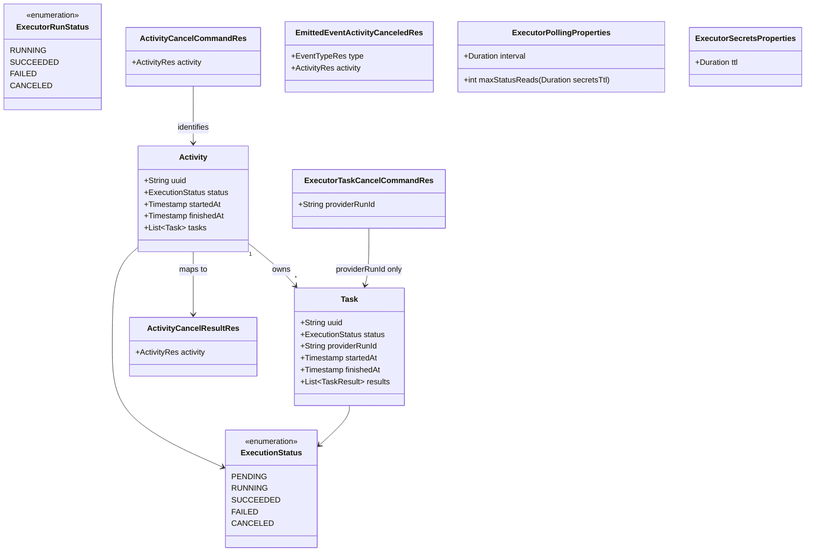

# DevOps 2.0 full-control cancel and error paths

## Requirements

- Let a user cancel an open activity: stop the task that is on the executor, cancel every task that has not started, and return the activity only once it is succeeded, failed, or canceled.
- Let Policy refuse an activity execution or a task execution, and close that activity as failed, without treating the refusal as a user cancel.
- Stop a run that never ends or never starts, using a fixed status poll whose length is the secrets lifetime.
- Keep the running task's executor outcome. A cancel that arrives after the run has already finished does not overwrite that outcome.
- Out of scope: re-run, restart recovery, the result-upload API and the CLI, the policy engine, real provider executors, a `CANCELING` status, and retrying a database transaction.

## Entities

No new status, no cancellation flag, and no rejection-reason field. `Activity` and `Task` stay as they are. `ExecutorRunStatus` gains `CANCELED`.

## Approach

1. Three roles:
   - Cancel Activity is the only caller of `POST /api/v2/up/executor/tasks/cancel`. In one transaction it sets every task that is still `PENDING` to `CANCELED` and does not write a `RUNNING` task. It then calls Advance Activity when no task is `RUNNING`.
   - Execute Task keeps the status loop. It records `SUCCEEDED`, `FAILED`, or `CANCELED` and calls Advance Activity. It does not send the cancel.
   - Advance Activity is the only closer for success, failure, and user cancel. It drops secrets and emits.

2. Advance Activity applies the first matching rule, after an already-terminal activity:
   - The activity is already `SUCCEEDED`, `FAILED`, or `CANCELED`: write nothing. This check is first, so a second call does not emit again.
   - Any task is `FAILED`: cancel tasks still `PENDING`, activity `FAILED`, emit activity failed.
   - Any task is `RUNNING`: write nothing.
   - Any task is `CANCELED`: cancel tasks still `PENDING`, activity `CANCELED`, emit activity canceled.
   - Every task is `SUCCEEDED`: activity `SUCCEEDED`, emit activity succeeded.
   - A task is `PENDING` and the activity is `RUNNING`: emit task execution requested.
   - Otherwise, including a `PENDING` activity that still has a `PENDING` task: write nothing. A `PENDING` activity never has a task requested.
   - `RUNNING` is before `CANCELED` because later tasks are canceled while one task is still on the executor. A `FAILED` task stays ahead of both, so a too-late failure still fails the activity.
   - A running task that then succeeds, with other tasks already `CANCELED`, closes the activity as `CANCELED`. The succeeded task stays `SUCCEEDED`. Activity `SUCCEEDED` happens only when every task is `SUCCEEDED`.

3. Polling and secrets:
   - One fixed interval, `odm.utility-plane.executor-polling.interval`, default 30 seconds. No exponential back-off. Remove `initial-delay` and `max-delay`.
   - Secrets TTL is `odm.utility-plane.executor-secrets.ttl`, default 1 hour. Max status reads = TTL / interval, integer division, at least 1. Defaults are 120 reads. The count is the full TTL, not the time left since execute.
   - Reaching the cap, or a status read that still fails on the last attempt, sets the task `FAILED` and calls Advance Activity.
   - The wait for a missing provider run id is not this poll. It reads about once a second and stops after 300 seconds.
   - After the cancel post, Cancel Activity reads the activity on the poll interval until it is terminal, with the same cap. A 200 always carries `SUCCEEDED`, `FAILED`, or `CANCELED`.

4. Conflicts and HTTP:
   - Serializable isolation stays. A serialization failure is not retried. On the cancel call it is HTTP 409. On an event handler it fails that notification.
   - An activity that is already terminal when cancel starts is HTTP 400: `Activity <uuid> has already terminated with status <status>`.
   - A cancel post the executor answers with a 4xx is "the run has already ended". Execute Task records the real status. A post that cannot be reached is tried 3 times in the executor adapter, then HTTP 500, and the long wait does not start. `PENDING` tasks stay `CANCELED`.
   - A late approval or rejection writes nothing and does not fail the notification.

5. Rejection:
   - No `REJECTED` status and no reason stored.
   - Activity execution rejected while `PENDING`: every task `CANCELED`, activity `FAILED`, emit activity failed, drop secrets. This close does not use Advance Activity's canceled-task rule, which emits activity canceled.
   - Task execution rejected while the task is `PENDING` and the activity is `RUNNING`: that task `FAILED`, then Advance Activity's failure rule.
   - Any other state: no-op.

6. Results:
   - Status writes reload the activity inside the transaction that saves it.
   - Placeholder resolution uses only tasks whose status is `SUCCEEDED`. A newer canceled or failed task does not hide an older succeeded one, and its results are not substituted.

## Structure

### Inheritance Relationships

1. `CancelActivity`, `RejectActivityExecution`, and `RejectTaskExecution` implement `UseCase`. Each is package-private. Each factory is the only `@Component` in its package.
2. `ActivityUseCaseController` already exposes execute. It gains cancel. The same `ActivityUseCasesService` maps the REST body to the command.
3. `EmittedEventActivityCanceledRes` follows `EmittedEventActivityFailedRes`. Received rejection resources follow the existing received approval resources.
4. `BadRequestException` and `InternalException` stay the API exceptions. `ResponseExceptionHandler` already maps `ConcurrencyFailureException` to 409. No new exception type.

### Dependencies

1. `ActivityUseCaseController` calls `ActivityUseCasesService.cancelActivity`.
2. `CancelActivity` calls its persistence, executor, polling, and Advance Activity ports. The executor port calls `ExecutorClient.cancelTask`. Advance Activity is built through `AdvanceActivityFactory`.
3. `RejectActivityExecution` calls its persistence, notification, and secrets ports. It does not call Advance Activity.
4. `RejectTaskExecution` sets the task `FAILED`, then calls Advance Activity.
5. `ExecuteTask` and `ApproveActivityExecution` stay on their events. Their "not in the required state" path returns without throwing.
6. `NotificationClientEventSubscriber` subscribes to a type when a mounted handler supports it. Mounting the two rejection handlers subscribes those events. No change to the subscriber.
7. The starter executor's `ExecutorController` gains `POST /cancel`. `SimulatedRunStore` records the cancel.

### Layered Architecture

1. Controller: `POST /api/v2/pp/devops/activities/cancel`. No business rules.
2. Use cases service: maps `ActivityCancelCommandRes` to the activity uuid, runs the use case, returns `ActivityCancelResultRes`.
3. Use case: the decision table, the waits, and when to call Advance Activity. Sleep, HTTP, and the attempt count live in port adapters.
4. Persistence: existing `ActivityService.findOne` and `overwrite`, through a port, inside `TransactionalOutboundPort`. `DefaultTransactionalOutboundPortImpl` stays the Registry port: serializable, and it does not clear the persistence context. Each activity persistence port's `findActivity` calls `findOne`, then `EntityInitAndDetachService.refresh`, which reloads the activity and, through its task, log, and result collections, each child. The use case does not call `refresh`.
5. Exception handling: existing `ResponseExceptionHandler`. Do not catch `ConcurrencyFailureException` inside the use case.

## Operations

### 1. Extend the executor client — `client.executor`

1. `ExecutorRunStatus` gains `CANCELED`.
2. `ExecutorTaskCancelCommandRes`: one field `providerRunId`, JavaBean, `@JsonIgnoreProperties(ignoreUnknown = true)`.
3. `ExecutorClient.cancelTask(String providerRunId)`: `POST {address}/api/v2/up/executor/tasks/cancel` with that body and the same secret headers as start, status, and logs. No response body is required.
4. `ExecutorClientImpl` uses `restUtils.genericPost`. A `ClientException` propagates to the caller. Do not map it to a run status.

### 2. Replace polling and secrets configuration — `executor`

1. `ExecutorPollingProperties`: remove `initialDelay`, `maxDelay`, and `delayForAttempt`. One field `Duration interval = Duration.ofSeconds(30)`, bound to `odm.utility-plane.executor-polling.interval`.
2. `ExecutorSecretsProperties`: `@Component`, `@ConfigurationProperties(prefix = "odm.utility-plane.executor-secrets")`, field `Duration ttl = Duration.ofHours(1)`.
3. `int maxStatusReads(Duration secretsTtl)` on `ExecutorPollingProperties`: `ttl.toMillis() / interval.toMillis()`, and at least 1. A null duration uses the field default.
4. `@PostConstruct` on both property classes: a null, zero, or negative duration throws `IllegalStateException` naming the property (`odm.utility-plane.executor-polling.interval` or `odm.utility-plane.executor-secrets.ttl`).
5. `ExecutorSecretsStoreImpl` takes `ExecutorSecretsProperties` and builds the Caffeine cache with `expireAfterWrite(ttl)`. Remove the hardcoded hour.
6. `application.yml`: under `odm.utility-plane`, replace the `executor-polling` block with `interval: 30s` and add `executor-secrets.ttl: 1h`. Delete `initial-delay` and `max-delay`.
7. `application-test.yml`: `executor-polling.interval: 1ms`, `executor-secrets.ttl: 1h`. Delete `initial-delay` and `max-delay`.
8. `ExecuteTaskExecutorOutboundPort`: replace `waitBeforeNextStatusRead(int attempt)` with `void waitBeforeNextStatusRead()` and add `int maxStatusReads()`. The impl sleeps `interval` (interrupt restores the flag and throws `InternalException("Interrupted while waiting to read executor status")`). `maxStatusReads()` delegates to the properties with the secrets TTL.
9. `readRunStatus`: `CANCELED` maps to `ExecutorRunStatus.CANCELED`. A blank or unknown string still maps to `FAILED` with the existing warning. Do not add `CANCELING`.

### 3. Ignore results of tasks that are not succeeded — `ExecuteTaskPipelineParametersOutboundPortImpl`

In `latestTaskResults`, a task whose status is not `SUCCEEDED` is not a candidate. The latest `SUCCEEDED` task per name, by `createdAt`, is the one whose results are merged. Stored result rows are not deleted.

### 4. Update Advance Activity — `activity.services.usecases.advance`

1. `AdvanceActivityNotificationOutboundPort` gains `emitActivityCanceled(Activity)`. The impl builds `EmittedEventActivityCanceledRes` the same way `emitActivityFailed` builds `EmittedEventActivityFailedRes`: `resourceIdentifier` is the activity uuid, `eventContent.activity` is `activityMapper.toEventRes(activity)`, type `ACTIVITY_CANCELED`.
2. `EmittedEventActivityCanceledRes` is a copy of `EmittedEventActivityFailedRes` with that type. No logs, results, or secrets.
3. Replace `requireRunning` and the four-way branch. Inside the existing transaction, in this order:
   - `findActivity`. Sort tasks by `sortOrder` as today.
   - Status `SUCCEEDED`, `FAILED`, or `CANCELED`: return `NOTHING_TO_DO`. Do not emit and do not drop secrets again.
   - Any task `FAILED`: existing failure close (`PENDING` → `CANCELED` with `finishedAt` and no change to a start time already set; activity `FAILED`; `finishedAt = now`; save; `emitActivityFailed`). Return `CLOSED`.
   - Any task `RUNNING`: return `NOTHING_TO_DO`.
   - Any task `CANCELED`: same pending-task cancel, activity `CANCELED`, `finishedAt = now`, save, `emitActivityCanceled`. Do not set `startedAt` when it is null. Return `CLOSED`.
   - Every task `SUCCEEDED`: existing success close. Return `CLOSED`.
   - Activity is `RUNNING` and a task is `PENDING`: `emitTaskExecutionRequested` for the first `PENDING` task. Return `TASK_REQUESTED`.
   - Otherwise: return `NOTHING_TO_DO`.
4. `CLOSED` still drops secrets after the transaction commits. `NOTHING_TO_DO` does not.
5. Do not throw `BadRequestException` because the activity is not `RUNNING`.

### 5. Update Execute Task — `activity.services.usecases.executetask`

1. `startTaskExecution`: if the activity is not `RUNNING`, or the task is not `PENDING`, return null from `execute()` immediately. Do not throw, do not call the executor, do not call Advance Activity, do not fail the notification. Remove the throws in `requireRunning` and `requirePending` on this path.
2. `recordRunOutcome`: map `SUCCEEDED` → `SUCCEEDED`, `CANCELED` → `CANCELED`, anything else including a missing status → `FAILED`. In the transaction, reload the task and write the status, `finishedAt`, and the log only when the task is still `RUNNING`. A task that is already terminal is left unchanged, including its results.
3. `followRunUntilItEnds` returns `ExecutorRunStatus`, or finishes the task as failed when the cap is hit:
   - `max = executorPort.maxStatusReads()`.
   - Read once per attempt, from 1 through `max`.
   - A read that returns a non-`RUNNING` status stops the loop and that status is recorded.
   - A read that throws, and attempts remain: `waitBeforeNextStatusRead()`, then read again.
   - The last attempt still `RUNNING`, or still throwing: record `FAILED` and continue to the log read and Advance Activity. Do not leave the task `RUNNING`.
   - If the log read throws, keep the status this loop already returned, record it with an empty log, then call Advance Activity. Log that the log read failed, and do not log the executor response body. A blank log stays `Optional.empty()`.
   - Sleep only between reads, and only while the status is `RUNNING` or the read threw. `waitBeforeNextStatusRead()` takes no attempt number.
4. After `startRun` throws, or returns no provider run id: reload the task in a transaction; if it is still `RUNNING`, set `FAILED` and `finishedAt`; then call Advance Activity. Do not leave the task `RUNNING`. The orphan run whose process died before the id was stored stays out of scope.
5. The outcome write and the failure write reload the activity inside the transaction, so a result row added after the previous load is not replaced by a stale list.

### 6. Update Approve Activity Execution — `activity.services.usecases.approveexecution`

If the activity is not `PENDING`, return without saving and without calling Advance Activity. Do not throw. The notification completes.

### 7. Implement Cancel Activity — `activity.services.usecases.cancel`

Package `activity.services.usecases.cancel`, laid out per `spdd/norms/USE_CASE_IMPLEMENTATION.md`.

1. `record CancelActivityCommand(String activityUuid)`.
2. `interface CancelActivityPresenter { void presentCancelCompleted(Activity activity); }`.
3. REST:
   - `ActivityCancelCommandRes` wraps `ActivityRes`, same shape as `ActivityExecuteCommandRes`. Only `activity.uuid` is read. Missing activity → `BadRequestException("Activity cannot be null")`. Blank uuid → `BadRequestException("Activity UUID is required")`.
   - `ActivityCancelResultRes` wraps the `ActivityRes` returned by the presenter, same shape as `ActivityExecuteResultRes`.
   - `ActivityUseCasesService.cancelActivity(ActivityCancelCommandRes)` builds the command, a result holder, and `cancelActivityFactory.buildCancelActivity(...).execute()`.
   - `ActivityUseCaseController`: `POST /cancel` on the existing `/api/v2/pp/devops/activities` mapping, HTTP 200. OpenAPI summary: cancel an activity and return it when it has finished. Description: tasks that have not started are canceled; a task on the executor is asked to stop; the call returns when the activity is succeeded, failed, or canceled. No secret-header parameter.
   - `RoutesV2.ACTIVITIES_CANCEL("/api/v2/pp/devops/activities/cancel")`.
4. Ports, plain classes constructed by `CancelActivityFactory` (`@Component`):
   - Persistence: `findActivity` → `activityService.findOne`, then `EntityInitAndDetachService.refresh` of the activity graph (tasks, then each task's logs and results), `save` → `activityService.overwrite`. An unknown uuid stays `NotFoundException` from `findOne`. `findDetached` opens its own read-only read-committed transaction (`REQUIRES_NEW`): `findActivity`, then `initializeEntityAndDetach`. It does not clear the persistence context and it does not write. A serializable read here would share Execute Task's snapshot and could abort the outcome write, which is not retried. `findActivity` only refreshes inside the caller's transaction and leaves the activity managed.
   - Advance: `advanceActivity(String activityUuid)` builds Advance Activity with an empty presenter and runs it.
   - Executor: `CancelRunResult cancelRun(Task task)` with `POSTED`, `ALREADY_FINISHED`, `UNREACHABLE`. The impl gets the client from `ExecutorClientFactory` and calls `cancelTask(providerRunId)`. `ClientException` with code 400–499 → `ALREADY_FINISHED`. Any other `ClientException`, and a thrown client failure, is retried up to 3 calls total, then `UNREACHABLE`. Log the attempt and, for a `ClientException`, the HTTP status. Do not log the response body or request headers. The 3 calls are in this adapter, not a database retry.
   - Polling: `int maxStatusReads()`, `void waitOnePollInterval()` (the configured interval), `void waitOneSecond()` (one second, for the id wait only). Interrupt → `InternalException("Interrupted while waiting to read executor status")`.
5. `execute()`:
   - Validate the command.
   - One serializable transaction, not retried: load the activity. If the status is `SUCCEEDED`, `FAILED`, or `CANCELED`, throw `BadRequestException("Activity " + uuid + " has already terminated with status " + status)`. Otherwise set each task that is still `PENDING` to `CANCELED` with `finishedAt = now` and do not set `startedAt`. Do not change a `RUNNING`, `SUCCEEDED`, or `FAILED` task. Save. Return the uuid of the `RUNNING` task, or empty when there is none. Do not catch `ConcurrencyFailureException`. The cancel status write stays in this one serializable transaction and is not retried.
   - No `RUNNING` task: `advanceActivity`, reload, `presentCancelCompleted`, return. The activity is terminal.
   - `RUNNING` and no `providerRunId`: read the task with `findDetached` (read committed, not serializable; `findOne`, refresh, then init-and-detach; no write), about once a second, up to 300 seconds, sleeping through `waitOneSecond()` outside that read. Stop when that task has a provider run id, or its status is no longer `RUNNING`, or 300 seconds have passed.
   - Still `RUNNING` without an id after 300 seconds: throw `InternalException("Activity " + uuid + " running task could not be canceled")`. The `PENDING` updates stay committed. Do not start the long wait.
   - Still `RUNNING` with an id: `cancelRun`. `UNREACHABLE` throws that same `InternalException`. `POSTED` and `ALREADY_FINISHED` continue. Do not change the task status here.
   - The task is no longer `RUNNING` and the activity is not terminal: `advanceActivity`.
   - Then read the activity with `findDetached` up to `maxStatusReads()` times, sleeping `waitOnePollInterval()` between reads, outside that read. When the activity is `SUCCEEDED`, `FAILED`, or `CANCELED`, present it and return. When a read shows no `RUNNING` task and the activity is still `PENDING` or `RUNNING`, call `advanceActivity`, then load the activity again before sleeping or before treating the cap as exhausted. If that load is terminal, present it and return.
   - Cap exhausted and the activity is still not terminal after that load: throw `InternalException("Activity " + uuid + " did not reach a terminal status")`.
6. There is at most one `RUNNING` task. If a second is loaded, apply the id wait and the cancel post to each, then do one activity wait.
7. Do not hold a transaction across a sleep.

### 8. Implement Reject Activity Execution — `activity.services.usecases.rejectexecution`

1. `record RejectActivityExecutionCommand(String activityUuid)`.
2. `ActivityExecutionRejectedNotificationEventHandler` (`@Component`): supports `ACTIVITY_EXECUTION_REJECTED`. Copy the conversion and uuid checks from `ActivityExecutionApprovedNotificationEventHandler`, using `ReceivedEventActivityExecutionRejectedRes` (same content shape as the approved resource: `eventContent.activity.uuid`). Missing uuid messages stay the approved handler's messages (`"Missing 'uuid' field in activity"`, and the matching missing-activity and missing-content messages). Run the use case with an empty presenter.
3. `execute()`: blank uuid → `BadRequestException("Activity UUID is required")`. In one transaction, load the activity. If it is not `PENDING`, return. Otherwise set every task to `CANCELED` with `finishedAt = now` and no `startedAt`, set the activity `FAILED` with `finishedAt = now` and leave `startedAt` null, save, and emit activity failed through a notification port that reuses `EmittedEventActivityFailedRes`. After commit, `ExecutorSecretsStore.removeAll(activityUuid)`. Do not call Advance Activity. Do not emit activity canceled.

### 9. Implement Reject Task Execution — `activity.services.usecases.rejecttaskexecution`

1. `record RejectTaskExecutionCommand(String activityUuid, String taskUuid)`.
2. `ActivityTaskExecutionRejectedNotificationEventHandler` (`@Component`): supports `ACTIVITY_TASK_EXECUTION_REJECTED`. Copy the conversion and the activity and task uuid checks from `ActivityTaskExecutionApprovedNotificationEventHandler`, using `ReceivedEventActivityTaskExecutionRejectedRes`. Run the use case with an empty presenter.
3. `execute()`: either uuid blank → the same `BadRequestException` texts Execute Task uses (`"Activity UUID is required"`, `"Task UUID is required"`). In one transaction, load the activity and the task. If the activity is not `RUNNING`, or the task is not `PENDING`, or the task is missing (`NotFoundException` with Execute Task's message), return without throwing when the task exists but the state does not match. When the task is missing, keep the not-found throw. When the state matches: set that task `FAILED`, `finishedAt = now`, do not set `startedAt`, save. After commit, `advanceActivity`. Do not emit from this use case. Advance Activity emits activity failed.

### 10. Update the starter executor — `odm-platform-adapter-devops-executor-starter`

1. `SimulatedRunStore`: constant `CANCELED`. `cancel(providerRunId)` decides and writes in one `ConcurrentHashMap` update for that id:
   - Unknown id → `ResponseStatusException(NOT_FOUND, "Unknown providerRunId")`.
   - The run's planned end (`startedAt + plannedDuration`) is already past, and it was not canceled → `ResponseStatusException(CONFLICT, "Run has already ended")`. Do not change `plannedOutcome`.
   - Otherwise mark the run canceled. `status` returns `CANCELED` from then on, including before the planned end.
2. `ExecutorController`: `POST /cancel`, body `providerRunId` (a small request type, ignore unknown properties). Log the run id only. Never log header values.
3. `ExecutorControllerIT`: a running run (duration long enough that it is still `RUNNING`) becomes `CANCELED` after cancel. A run that has already reached `SUCCEEDED` or `FAILED` answers 409 and the following status read is unchanged. An unknown id answers 404.

### 11. Reload and detach the activity graph — `utils.services`

`EntityInitAndDetachService` is a `@Component` with an injected `EntityManager`.

1. `refresh(Object entity)`: a null entity returns. Otherwise `entityManager.refresh(entity)`, then each declared collection field is initialized and every element is refreshed the same way. `IllegalAccessException` becomes `InternalException` with that message.
2. `initializeEntityAndDetach(Object entity)`: Hibernate-initialize the entity and its collection graph, then `entityManager.detach(entity)`.
3. Each activity persistence port calls `refresh` from `findActivity`, after `activityService.findOne`. Cancel Activity's `findDetached` calls that, then `initializeEntityAndDetach`, inside its own read-committed transaction. The use case does not call either method. `DefaultTransactionalOutboundPortImpl` does not clear the persistence context.

### 12. Documentation — `docs/`

Stay at the level of `docs/service/README.md`. No class names, no property paths in the service guide. Configuration paths belong in `docs/setup/configuration.md`.

1. `docs/service/README.md`: after the failure sentence, state that a user can cancel an open activity. Tasks that have not started are canceled. A task on the executor is asked to stop, and the call finishes when the activity itself has succeeded, failed, or canceled. If that task has no run id yet, the call waits up to five minutes for it, then fails and can leave the activity running. A pipeline that already finished keeps that result. A refusal from Policy fails the activity and is not a user cancel. Remove the sentence that says to add a guide when further behaviour lands.
2. `docs/service/events.md`: DevOps subscribes to activity execution rejected and task execution rejected. Activity canceled is emitted when a user cancel closes the activity. Activity failed is also emitted when Policy refuses. Replace the three "later story" / "not handled" catalogue rows. The subscription sentence in "How DevOps joins the bus" includes the two rejected messages.
3. `docs/setup/configuration.md`: the status poll is one interval, default 30 seconds, with no back-off. The secrets lifetime is configuration, default one hour. The poll stops after that lifetime divided by the interval. A cancel of a running task holds the HTTP call on that same interval, at most for the secrets lifetime. A missing run id is a separate five-minute wait, about once a second, and is not that interval. Replace the `initial-delay` / `max-delay` example and the hardcoded "at most one hour" sentence so the lifetime is the configured value.
4. `docs/service/policy-service.md`: DevOps does not call Policy. While Policy is active, an approval starts the work and a rejection fails it. A refusal is not a user cancel. While Policy is inactive, DevOps still auto-approves.

### 13. High-level tests (Gherkin)

DevOps tests live in `ActivityCancelAndErrorFlowIT`, same package and harness as `ActivityFullControlFlowIT`: `DevOpsApplicationIT`, `RoutesV2`, observer dispatch, `NotificationClient` captor, `ExecutorClient` mock. `SyncTaskExecutor` stays.

Each test method's Javadoc is its Scenario below, verbatim. The class Javadoc names this prompt file.

`application-test.yml` uses a 1 ms interval, so a cancel that reaches a terminal activity returns without waiting on the 30 second default. The poll-cap scenario is `@TestPropertySource` with `odm.utility-plane.executor-polling.interval=1ms` and `odm.utility-plane.executor-secrets.ttl=3ms` (3 reads). The 300 second wait for a missing provider run id is not an integration test: it holds the HTTP request for five minutes, and the test client gives up at three. A cancel while a task is still running is not an integration test either. The synchronous observer keeps Execute Task on the approval thread, so cancel has to run beside it, and the two serializable writes on the activity row overlap. The call then returns 409. The same overlap rules out two further timings: a running task that reaches `SUCCEEDED` after later tasks were canceled, and a last task that has already succeeded while cancel is still in the call.

Feature: Cancel an activity
  Scenario: Cancel is refused when the activity has already succeeded
    Given an activity whose tasks have succeeded
    When the user cancels that activity
    Then the response is 400 and says the activity has already terminated with status SUCCEEDED
    And the activity and its tasks are unchanged

  Scenario: Cancel closes an activity that is still waiting for approval
    Given an activity and its tasks are PENDING and execution has been requested
    When the user cancels that activity
    Then every task is CANCELED and the activity is CANCELED
    And the activity has a finish time and no start time
    And the executor cancel endpoint was not called
    And ACTIVITY_CANCELED was emitted
    And the response is 200 with that activity

  Scenario: A cancel that conflicts with another update returns 409
    Given a cancel transaction conflicts with a concurrent update of the same activity
    When the user cancels the activity
    Then the response is 409
    And DevOps does not retry the cancel

Feature: Reject an execution
  Scenario: An activity execution rejection fails the activity
    Given an activity and its tasks are PENDING
    When an activity execution rejected event arrives for it
    Then every task is CANCELED and the activity is FAILED
    And ACTIVITY_FAILED was emitted
    And ACTIVITY_CANCELED was not emitted

  Scenario: A task execution rejection fails that task and the activity
    Given the activity is RUNNING and its tasks are PENDING
    When a task execution rejected event arrives for the first task
    Then that task is FAILED
    And every other task is CANCELED
    And the activity is FAILED
    And ACTIVITY_FAILED was emitted

  Scenario: A rejection after the activity was canceled changes nothing
    Given the activity is CANCELED
    When an activity execution rejected event arrives for it
    Then the activity stays CANCELED
    And the notification is processed successfully

Feature: Executor failures
  Scenario: A start call that throws fails the task and the activity
    Given a task has been approved and the executor start call throws
    When the task execution runs
    Then the task is FAILED and the activity is FAILED
    And the task does not stay RUNNING

  Scenario: The status poll stops at the secrets lifetime and fails the task
    Given the poll allows 3 status reads and every read is RUNNING
    When the task execution runs
    Then the task is FAILED and the activity is FAILED

  Scenario: A log read that throws still records the status the poll already decided
    Given the executor reports the run CANCELED and the log read throws
    When the task execution runs
    Then the task is CANCELED and the activity is CANCELED
    And the task does not stay RUNNING

Feature: Placeholder results
  Scenario: Results of a task that is not succeeded are not substituted
    Given a succeeded task and a later canceled task of the same name hold different results
    When the next task starts and its pipeline parameter names the result path
    Then the start request carries the succeeded task's value

| Feature / Scenario | Test class | Method |
| --- | --- | --- |
| Cancel an activity / Cancel is refused when the activity has already succeeded | ActivityCancelAndErrorFlowIT | whenActivityAlreadySucceededThenCancelReturns400 |
| Cancel an activity / Cancel closes an activity that is still waiting for approval | ActivityCancelAndErrorFlowIT | whenActivityPendingThenCancelClosesIt |
| Cancel an activity / A cancel that conflicts with another update returns 409 | ActivityCancelAndErrorFlowIT | whenCancelConflictsThenResponseIs409 |
| Reject an execution / An activity execution rejection fails the activity | ActivityCancelAndErrorFlowIT | whenActivityExecutionRejectedThenActivityFailed |
| Reject an execution / A task execution rejection fails that task and the activity | ActivityCancelAndErrorFlowIT | whenTaskExecutionRejectedThenActivityFailed |
| Reject an execution / A rejection after the activity was canceled changes nothing | ActivityCancelAndErrorFlowIT | whenRejectedAfterCancelThenActivityUnchanged |
| Executor failures / A start call that throws fails the task and the activity | ActivityCancelAndErrorFlowIT | whenStartThrowsThenActivityFailed |
| Executor failures / The status poll stops at the secrets lifetime and fails the task | ActivityCancelAndErrorFlowIT | whenStatusPollReachesCapThenActivityFailed |
| Executor failures / A log read that throws still records the status the poll already decided | ActivityCancelAndErrorFlowIT | whenLogReadThrowsThenCanceledOutcomeIsRecorded |
| Placeholder results / Results of a task that is not succeeded are not substituted | ActivityCancelAndErrorFlowIT | whenCanceledTaskHasResultsThenSucceededValueIsUsed |
| Starter cancel / A running simulated run reports CANCELED after cancel | ExecutorControllerIT | whenRunCanceledThenStatusIsCanceled |
| Starter cancel / Cancel of a finished run conflicts and leaves the status | ExecutorControllerIT | whenRunAlreadyEndedThenCancelConflicts |
| Starter cancel / Cancel of an unknown run is not found | ExecutorControllerIT | whenRunUnknownThenCancelIsNotFound |

Starter scenarios, implemented in `odm-platform-adapter-devops-executor-starter`:

Feature: Starter cancel
  Scenario: A running simulated run reports CANCELED after cancel
    Given a run whose duration has not elapsed
    When the executor is asked to cancel that run
    Then the next status read is CANCELED

  Scenario: Cancel of a finished run conflicts and leaves the status
    Given a run whose status is already SUCCEEDED
    When the executor is asked to cancel that run
    Then the response is 409
    And the next status read is SUCCEEDED

  Scenario: Cancel of an unknown run is not found
    Given no run has that provider run id
    When the executor is asked to cancel it
    Then the response is 404

The 409 scenario in DevOps does not sleep to force a database conflict. It throws `CannotAcquireLockException` (a `ConcurrencyFailureException`) from a stubbed `ActivityService.overwrite` on the cancel save, and asserts HTTP 409 and that the use case was not invoked again.

## Norms

1. Use-case shape, commands, presenters, factories, and ports: `spdd/norms/USE_CASE_IMPLEMENTATION.md`. REST resources stay out of the use case package. Port implementations are plain classes. The use case holds the decision table and the wait policy. The adapter holds HTTP, the 3 cancel-post attempts, and `Thread.sleep`.
2. Persistence goes through `ActivityService` from a port, not from the use case class. Overwrite keeps the existing `beforeOverwrite` reconcile of logs and results. Do not add a Flyway change and do not add `NOT NULL`. `spdd/norms/GENERIC-CRUD-GUIDELINES.md`.
3. Exceptions stay the existing `DevOpsApiException` types. `BadRequestException` is 400. `InternalException` is 500. `NotFoundException` is 404. `ConcurrencyFailureException` is already 409 in `ResponseExceptionHandler`. Do not add a handler and do not retry.
4. Events follow the existing emitted and received resources: activity embedded without logs, results, or secrets. Handlers only build the command. The use case decides.
5. Documentation stays high level in `docs/service/`. Configuration keys are named in `docs/setup/configuration.md`.
6. Tests: each new test method's Javadoc is its Scenario, verbatim.

## Safeguards

1. A 200 from cancel has an activity status of `SUCCEEDED`, `FAILED`, or `CANCELED`. The body is that activity.
2. Cancel of an activity that is already one of those three, before this call writes, is 400 with `Activity <uuid> has already terminated with status <status>`. No write.
3. A serialization failure on the cancel transaction is 409. The use case does not catch it and does not run again. `PENDING` updates from the failed attempt are not committed.
4. Cancel does not set a `RUNNING` task to `CANCELED`. Only Execute Task writes that task's terminal status, and only while it is still `RUNNING`.
5. `POST /tasks/cancel` is called only from Cancel Activity, and only with a stored provider run id. Execute Task does not call it.
6. Advance Activity checks an already-terminal activity before any task rule, and checks `RUNNING` before `CANCELED`.
7. A `FAILED` task closes the activity as `FAILED` even when other tasks are `CANCELED`. A `CANCELED` task closes it as `CANCELED` only when no task is `FAILED` and no task is `RUNNING`.
8. Rejection emits activity failed, never activity canceled. No reason is stored.
9. The status poll has no back-off. The cap is secrets TTL / interval. Defaults are 30 seconds and 1 hour, 120 reads. A non-positive interval or TTL fails startup.
10. The provider-run-id wait is 300 seconds at about one read a second. It does not use the 30 second poll interval. Exhausting it, or failing the cancel post after 3 attempts, is 500 with `Activity <uuid> running task could not be canceled`. The activity may still be `RUNNING`.
11. Exhausting the activity-status wait is 500 with `Activity <uuid> did not reach a terminal status`.
12. No transaction stays open across a sleep.
13. Placeholder substitution ignores every task that is not `SUCCEEDED`. Result rows already stored are not deleted by a status write.
14. Secrets are dropped only when Advance Activity, or Reject Activity Execution, actually closes the activity. They are not dropped when the cancel post is sent.
15. The executor cancel request carries the provider run id and the existing secret headers. It does not carry an activity id or a task id.
16. Hidden activity CRUD is unchanged.
17. Re-run, restart recovery, result upload, and a `CANCELING` status are not implemented.
