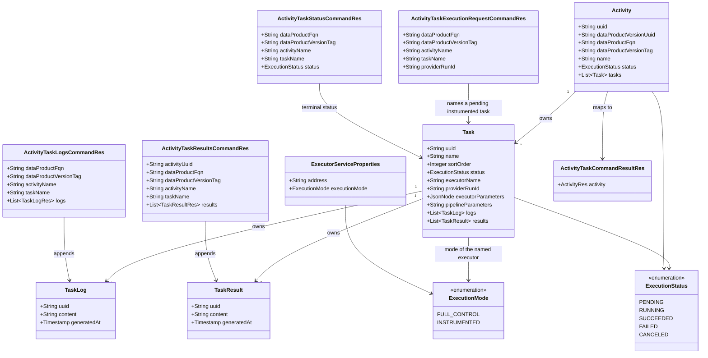

# DevOps 2.0 instrumented path

## Requirements

- Let a CLI register an activity and its tasks, then report each instrumented task's run id, logs, results, and final status, while DevOps keeps the activity lifecycle and does not drive that task's executor.
- Let one activity mix full-control tasks, which DevOps still starts and polls, with instrumented tasks, which stay pending until the CLI asks for them.
- Keep one open activity per data product version and activity name. Policy owns activity order and approval. DevOps enforces task order.
- Out of scope: the CLI image, Registry reads, authorization, real policy evaluation, a timeout for a CLI that never reports, restart recovery, re-run, and a mode where DevOps polls an instrumented task and writes its logs, status, and results.

## Entities

No new table, column, status, or event type. `providerRunId`, logs, and results already exist. `ExecutorServiceProperties.address` stays a string and is no longer required for `INSTRUMENTED`. The four command resources are new. The four calls share one result type, `ActivityTaskCommandResultRes`, holding the activity after the call.

## Approach

1. One lifecycle, mode on the executor:
   - Activity remains the root. Task, logs, and results stay nested. Status values stay `PENDING`, `RUNNING`, `SUCCEEDED`, `FAILED`, `CANCELED`.
   - Execution mode stays on the executor declaration. The task stores the executor name. Each use case that needs the mode reads it from that declaration.
   - An activity may name both a full-control executor and an instrumented executor. Execute Activity accepts that mix.
   - Approve Activity Execution is unchanged: a `PENDING` activity becomes `RUNNING`, then Advance Activity runs.
   - Reject Activity Execution and Reject Task Execution are unchanged. A rejection still fails the activity with no stored reason.

2. Who starts the next task:
   - Advance Activity's close order is unchanged: already terminal, then any `FAILED`, then any `RUNNING`, then any `CANCELED`, then every task `SUCCEEDED`, then request the first `PENDING` task while the activity is `RUNNING`.
   - The request branch loads that first pending task's executor mode. `FULL_CONTROL`: emit `ACTIVITY_TASK_EXECUTION_REQUESTED`, as today. `INSTRUMENTED`: emit nothing. The activity stays `RUNNING` and that task stays `PENDING`.
   - Advance Activity does not skip an instrumented pending task to start a later full-control task. It does not enforce task order. Request Task Execution does.
   - While any task is `RUNNING`, Advance Activity writes nothing. A full-control successor is requested only once no task is `RUNNING` and that successor is the first pending task and is full control. DevOps does not leave two instrumented tasks `RUNNING` together.

3. CLI commands on the existing activity API:
   - `POST /api/v2/pp/devops/activities/tasks/request-execution` — Request Task Execution. Body: data product FQN, version tag, activity name, task name, provider run id. No activity uuid. The call accepts the task only when it is the first `PENDING` task in sort order and no other task is `RUNNING`. It stores the id while the task is `PENDING`, emits the same `ACTIVITY_TASK_EXECUTION_REQUESTED` event Advance Activity emits, and returns the activity with the task still `PENDING`. It does not wait for approval.
   - `POST /api/v2/pp/devops/activities/tasks/logs` — Record Task Logs. Same natural key and task name. Instrumented tasks only. Appends while the task is `RUNNING`.
   - `POST /api/v2/pp/devops/activities/tasks/results` — Record Task Results. Both modes. The body may carry an activity uuid or the natural key, plus the task name and results. An activity uuid that has text selects that activity and the natural key is ignored. Appends while the task is `RUNNING`.
   - `POST /api/v2/pp/devops/activities/tasks/status` — Record Task Status. Same natural key and task name. Instrumented tasks only. Accepts `SUCCEEDED`, `FAILED`, or `CANCELED` from `RUNNING`, then calls Advance Activity. The response is the activity after that advance.
   - The CLI does not have the activity uuid. It addresses the activity by data product FQN, version tag, and activity name, and the task by name. The existing `GET /api/v2/pp/devops/activities/{uuid}` remains the poll for a caller that already has the uuid. No task-only read and no push to the CLI.
   - A repeated request for that same task, while it is still the first `PENDING` task and no other task is `RUNNING`, is accepted: the later provider run id replaces the stored one, and the event is emitted again. A later approval writes nothing once the task is `RUNNING`, which Execute Task already does when the task is no longer `PENDING`.
   - A repeated log or result while `RUNNING` inserts another row. A second terminal status fails because the task is no longer `RUNNING`.

4. Execute Task and Cancel Activity:
   - On task execution approved, Execute Task still sets a `PENDING` task to `RUNNING`. For `INSTRUMENTED` it returns. It does not call the executor and does not call Advance Activity. The provider run id stored by Request Task Execution is left in place.
   - For `FULL_CONTROL`, Execute Task still starts, polls, reads one log, records the outcome, and calls Advance Activity. Its log and status writes stay inside Execute Task.
   - Cancel Activity still sets every `PENDING` task to `CANCELED`, in either mode. A `RUNNING` full-control task stays on the existing executor cancel. A `RUNNING` instrumented task is left `RUNNING`: the call does not post to an executor and does not wait for a provider run id. It then waits until the activity is terminal. Record Task Status calls Advance Activity, which closes the activity. Running tasks are classified before any advance. When any of them is instrumented, this cancel does not call Advance Activity, neither while stopping a task nor while waiting. When every running task was full control, a full-control task that has already left `RUNNING` may advance the activity, and the wait still advances if no task is running and the activity is still open. The 200 body is that terminal activity.
   - The cancel wait keeps the existing poll cap. An activity that is left `RUNNING` because the CLI never reports, and that nobody cancels, still has no cap.

5. Persistence and errors:
   - Writes go through `ActivityService` overwrite, which replaces a task's logs and results with the incoming lists. Each new use case reloads the activity graph inside its transaction before it appends or changes status, so a stale copy does not drop rows already stored.
   - Serializable isolation stays. A serialization failure is HTTP 409 via the existing `ResponseExceptionHandler`. These use cases do not catch it and do not retry.
   - Business refusals are `BadRequestException` (400). A missing activity uuid is the existing not-found from `ActivityService.findOne` (404). A natural key with no `PENDING` or `RUNNING` match is `NotFoundException` (404). More than one open match is `BadRequestException` (400). No new exception type and no new handler.
   - Secrets are stored only for full-control executors named by the activity. An instrumented declaration does not need an address, executor parameters, pipeline parameters, or secrets. A full-control executor still requires an address, and a full-control task still requires executor parameters.

## Structure

### Inheritance Relationships

1. `RequestTaskExecution`, `RecordTaskLogs`, `RecordTaskResults`, and `RecordTaskStatus` implement `UseCase`.
2. Each is package-private. Its factory is the only `@Component` in that package. Port implementations are plain classes.
3. `ExecutorServiceProperties` keeps `@NotNull` on `executionMode`. `@NotBlank` comes off `address`. A class-level constraint requires a non-blank address when `executionMode` is `FULL_CONTROL`.
4. Refusals keep using `BadRequestException`, `NotFoundException`, and `InternalException`, all subtypes of `DevOpsApiException`. `ResponseExceptionHandler` stays the single advice.

### Dependencies

1. `ActivityUseCaseController` calls `ActivityUseCasesService` for the four new posts, plus execute and cancel.
2. `ActivityUseCasesService` maps command resources to domain commands, runs the factory, and maps the presented `Activity` to `ActivityTaskCommandResultRes`.
3. Request Task Execution calls a persistence port, an executor-mode port, a notification port, and `TransactionalOutboundPort`. The notification port builds `EmittedEventActivityTaskExecutionRequestedRes` the same way `AdvanceActivityNotificationOutboundPortImpl` does.
4. Record Task Logs, Record Task Results, and Record Task Status call a persistence port and `TransactionalOutboundPort`. Record Task Status also calls an Advance Activity port after the status transaction commits. Record Task Logs and Record Task Status also call an executor-mode port.
5. Advance Activity gains an executor-mode port used only on the request branch. Cancel Activity's executor port gains `findExecutionMode` beside `cancelRun`.
6. Execute Activity's secrets port stores secrets for the executor names the use case passes. Those names are the full-control executors only.
7. New persistence ports call `ActivityService.findOne`, `EntityInitAndDetachService.refresh`, and `ActivityService.overwrite`, matching `AdvanceActivityPersistenceOutboundPortImpl`. Request, logs, and status also resolve the open activity with `ActivityService.findAllFiltered` on data product FQN, version tag, activity name, and statuses `PENDING` and `RUNNING`, then `findOne` and refresh. Results do that only when the activity uuid is absent.

### Layered Architecture

1. Controller layer: `ActivityUseCaseController` maps HTTP and OpenAPI. No business rules.
2. Application layer: `ActivityUseCasesService` is the only type that sees both `*Res` and the use case command.
3. Use case layer: policy, status gates, and the decision to emit or to call Advance Activity.
4. Port adapters: config lookup, notification payload, and `ActivityService` calls.
5. Core layer: `ActivityService` overwrite and its existing log/result reconcile. No hook changes.
6. Exception layer: existing `ResponseExceptionHandler`.

## Operations

### 1. Make an instrumented executor address optional — `executor.ExecutorServicesProperties`

1. Responsibility: accept a declaration with no address when the mode is instrumented, and keep rejecting a full-control declaration with no address at startup.
2. Attributes: `address` loses `@NotBlank`. `executionMode` keeps `@NotNull`.
3. Methods:
   - Add `@ValidExecutorService` on `ExecutorServiceProperties`, validated by a `ConstraintValidator` in the same package.
   - `isValid`: when `executionMode` is null, return true and let `@NotNull` report it. When `executionMode` is `FULL_CONTROL`, valid only if `StringUtils.hasText(address)`. When `executionMode` is `INSTRUMENTED`, valid whether `address` is absent, blank, or set.
   - Constraint message: `address is required when execution-mode is full-control`.
4. Annotations: `@Constraint`, `@Validated` on `ExecutorServicesProperties` stays, `@Valid` on the map stays.
5. Constraints: `findExecutor` and `findAddress` stay. A blank instrumented address still yields an empty `findAddress`. DevOps never opens a client for an instrumented name.

### 2. Update Execute Activity — `activity.services.usecases.execute`

1. Responsibility: create a mixed or instrumented activity, with today's checks on each full-control task and no parameter or secret requirement on an instrumented task.
2. Methods:
   - `validateTask(Task)`: name and executor name stay required, with the current messages (`Task name is required`, `Task <name>: executor name is required`).
   - Resolve the executor inside the per-task check. Unknown name keeps `Executor <name> is not declared`.
   - `FULL_CONTROL`: keep `validateExecutorParameters` and `validatePipelineParameters` and their current messages.
   - `INSTRUMENTED`: skip executor-parameter and pipeline-parameter validation, including when those fields are absent, null, or present. Do not reject a task for carrying them.
   - Delete the loop that throws `Executor <name> runs in instrumented mode, which is not supported yet`.
   - `createAndRequestExecution`: the concurrency guard, `prepareForExecution`, create, `ACTIVITY_EXECUTION_REQUESTED`, and the presenter stay. `prepareForExecution` still clears `providerRunId`, logs, and results and sets every task `PENDING`.
   - Before storing secrets, collect the distinct executor names whose mode is `FULL_CONTROL`.
3. Secrets port: change `storeExecutorSecrets(Activity)` to `storeExecutorSecrets(Activity activity, Set<String> executorNames)`. The implementation stores headers only for those names, using the existing prefix rewrite. An empty set stores nothing. Headers for an instrumented executor are ignored.
4. Constraints: one open activity per data product version and name, with the current message. Update the class Javadoc so the procedure says an instrumented task is accepted and is not requested by this class.

### 3. Update Advance Activity — `activity.services.usecases.advance`

1. Responsibility: request the first pending task only when that task's executor is full control.
2. Methods:
   - Add `AdvanceActivityExecutorOutboundPort.findExecutionMode(String executorName): ExecutionMode`. The impl reads `ExecutorServicesProperties`. A missing declaration throws `InternalException` with `Executor <name> is not declared`.
   - In `advanceRunningActivity`, leave the terminal, failed, running, canceled, and all-succeeded branches as they are.
   - Replace the unconditional `emitTaskExecutionRequested(firstPendingTask)` with `requestNextTaskIfFullControl`: load the first pending task; when its mode is `FULL_CONTROL`, emit and return `TASK_REQUESTED`; when its mode is `INSTRUMENTED`, return `NOTHING_TO_DO`.
3. Dependency injection: factory constructs the new port impl with `new` and passes `ExecutorServicesProperties`.
4. Transaction: the mode read and the emit stay inside the existing transaction.
5. Constraints: do not skip an instrumented pending task to request a later full-control task. This class does not enforce task order. Request Task Execution does. Update the class Javadoc so a request is emitted only when the next task is full control.

### 4. Implement Request Task Execution — `activity.services.usecases.requesttaskexecution`

1. Responsibility: let the CLI ask for the next pending instrumented task by name, store the provider run id, and emit task execution requested. Policy enforces order for activities only. DevOps enforces task order.
2. Command: `RequestTaskExecutionCommand(String dataProductFqn, String dataProductVersionTag, String activityName, String taskName, String providerRunId)`. No activity uuid.
3. Presenter: `presentTaskExecutionRequested(Activity activity)`.
4. Ports: persistence (`findOpenActivity`, `save`), executor mode (`findExecutionMode`), notification (`emitTaskExecutionRequested`), `TransactionalOutboundPort`. `findOpenActivity` builds `ActivitySearchOptions` with data product FQN, version tag, activity name, and statuses `PENDING` and `RUNNING`, calls `activityService.findAllFiltered(Pageable.unpaged(), options)`, then `findOne` and `EntityInitAndDetachService.refresh`. No match: `NotFoundException` `No PENDING or RUNNING activity <activityName> for data product <fqn> version <tag>`. More than one: `BadRequestException` `More than one open activity <activityName> for data product <fqn> version <tag>`.
5. `execute()`:
   - Trim the five command strings. Blank data product FQN: `Data product FQN is required`. Blank version tag: `Data product version tag is required`. Blank activity name: `Activity name is required`. Blank task name: `Task name is required`. Blank provider run id: `Provider run id is required`.
   - In one transaction: `findOpenActivity`. Activity status other than `RUNNING`: `Activity <uuid> is not RUNNING`.
   - Resolve the task by name. No match: `Task <name> not found in activity <uuid>`. More than one match: `Task <name> matches more than one task in activity <uuid>`.
   - If any task other than the named task is `RUNNING`, refuse. Names are in sort order, nulls last, the same comparator as Advance Activity. One other task: `Task <name> cannot be requested while task <other> is RUNNING`. Several: `Task <name> cannot be requested while tasks <a>, <b> are RUNNING`.
   - Else if the named task is not the first task in that sort order whose status is `PENDING`: `Task <name> is not the next task. Task <firstPendingName> is still PENDING`.
   - Else keep the existing checks. Mode other than `INSTRUMENTED`: `Task <name> is not instrumented`. Status other than `PENDING`: `Task <name> is not PENDING`.
   - Set `providerRunId` to the trimmed value. Save. Emit `EmittedEventActivityTaskExecutionRequestedRes` with the same shape as Advance Activity: activity without task logs and results on the activity resource, task without logs and results. Resource identifier is the activity uuid.
   - Present the saved activity. The task is still `PENDING`.
6. Annotations: factory `@Component`. Use case and ports package-private, no Spring stereotypes on the use case or the port impls.
7. Constraints: do not set `RUNNING`, do not call Advance Activity, do not call an executor. A second call for that same task, while it is still the first `PENDING` task and no other task is `RUNNING`, overwrites `providerRunId` and emits again.

### 5. Implement Record Task Logs — `activity.services.usecases.recordtasklogs`

1. Responsibility: append log rows to one instrumented task while it is `RUNNING`.
2. Command: `RecordTaskLogsCommand(String dataProductFqn, String dataProductVersionTag, String activityName, String taskName, List<TaskLog> logs)`. Entries carry `content` and `generatedAt` only. Uuids are null. No activity uuid.
3. Presenter: `presentTaskLogsRecorded(Activity activity)`.
4. `execute()`:
   - Blank data product FQN: `Data product FQN is required`. Blank version tag: `Data product version tag is required`. Blank activity name: `Activity name is required`. Blank task name: `Task name is required`. Null or empty list: `At least one task log is required`.
   - Each content is trimmed. Blank content: `Task log content is required`. Null `generatedAt` becomes `new Timestamp(System.currentTimeMillis())`.
   - In one transaction: `findOpenActivity` with the same search, messages, and refresh as Request Task Execution, then resolve the task by name with the same two messages.
   - Mode other than `INSTRUMENTED`: `Task <name> is not instrumented`.
   - Status other than `RUNNING`: `Task <name> is not RUNNING`.
   - Append every entry to the task's existing logs, set the task reference, save, present the activity.
5. Constraints: do not call Advance Activity. A second call while `RUNNING` adds more rows and keeps the earlier ones.

### 6. Implement Record Task Results — `activity.services.usecases.recordtaskresults`

1. Responsibility: append result rows to a running task of either mode.
2. Command: `RecordTaskResultsCommand(String activityUuid, String dataProductFqn, String dataProductVersionTag, String activityName, String taskName, List<TaskResult> results)`. No provider run id.
3. Presenter: `presentTaskResultsRecorded(Activity activity)`.
4. `execute()`:
   - Trim the identity strings. If the activity uuid has text, load that activity with `findOne` and refresh, and ignore the natural key. If it does not, require the three natural-key fields with `Data product FQN is required`, `Data product version tag is required`, and `Activity name is required`, then `findOpenActivity` as Request Task Execution does. If neither the uuid nor any natural-key field is present: `Activity UUID or data product FQN, version tag, and activity name are required`.
   - Blank task name: `Task name is required`. Null or empty list: `At least one task result is required`. Blank content: `Task result content is required`.
   - Do not check execution mode. The `RUNNING` check uses `Task <name> is not RUNNING`. Name lookup uses the same two messages. Do not add an activity-status check that results did not already have.
5. Constraints: refresh before append, inside the transaction, then overwrite. Do not call Advance Activity. A result for a task that Execute Task has already moved off `RUNNING` fails the `RUNNING` check and does not append.

### 7. Implement Record Task Status — `activity.services.usecases.recordtaskstatus`

1. Responsibility: record the last status of an instrumented task and then advance the activity.
2. Command: `RecordTaskStatusCommand(String dataProductFqn, String dataProductVersionTag, String activityName, String taskName, ExecutionStatus status)`. No activity uuid.
3. Presenter: `presentTaskStatusRecorded(Activity activity)`.
4. Ports: persistence, executor mode, `RecordTaskStatusAdvanceActivityOutboundPort.advanceActivity(String activityUuid)`, `TransactionalOutboundPort`.
5. `execute()`:
   - Blank data product FQN, version tag, activity name, or task name: the same required messages as Record Task Logs.
   - Status other than `SUCCEEDED`, `FAILED`, or `CANCELED`: `Task status must be SUCCEEDED, FAILED, or CANCELED`.
   - In one transaction: `findOpenActivity`, resolve by name, require `INSTRUMENTED` (`Task <name> is not instrumented`), require `RUNNING` (`Task <name> is not RUNNING`). Set status and `finishedAt` to now. Leave `providerRunId`, logs, and results on the reloaded graph. Save. The activity uuid used for Advance Activity is the uuid of that saved activity.
   - After that transaction commits, `advanceActivity`. Then load the activity again and present it.
6. Constraints: this is the only new caller of Advance Activity. A task that is already terminal fails the `RUNNING` check when the activity is still `PENDING` or `RUNNING`, and Advance Activity is not called. Once the activity has left those statuses, the natural-key lookup is the 404 no-match message and the task check is not reached. Full-control outcome writes stay in Execute Task.

### 8. Keep Execute Task's instrumented return — `activity.services.usecases.executetask`

1. Responsibility: on approval, set the task `RUNNING`; for an instrumented task, stop there.
2. Methods: keep `startTaskExecution` as the move from `PENDING` to `RUNNING` with `startedAt`. It must not clear `providerRunId`.
   - Keep the branch that returns when `findExecutionMode` is not `FULL_CONTROL`, after `startTaskExecution`. That branch presents the task and returns. It does not call the executor port's start, poll, or log methods, and it does not call `advancePort`.
   - A task that is no longer `PENDING`, including a second approval, still returns without writing.
3. Constraints: do not add an instrumented poll and do not move logs, results, or the terminal status into this class. Update the class Javadoc so the instrumented path is the return after `RUNNING`.

### 9. Update Cancel Activity — `activity.services.usecases.cancel`

1. Responsibility: cancel every pending task, cancel a running full-control task through its executor, and wait while a running instrumented task is closed by the CLI.
2. Methods:
   - `cancelTasksThatHaveNotStarted` stays: every `PENDING` task becomes `CANCELED` with `finishedAt`, and every `RUNNING` task uuid is collected. An already terminal activity still throws `Activity <uuid> has already terminated with status <status>`.
   - Add `findExecutionMode(String executorName)` to `CancelActivityExecutorOutboundPort`. A missing declaration throws `InternalException` with `Executor <name> is not declared`.
   - Classify every running task before any advance. An instrumented running task is left `RUNNING` and is not sent to an executor. A full-control running task keeps the provider-run-id wait and the cancel post. A full-control task that has already left `RUNNING` may advance the activity only when no running task in this cancel is instrumented.
   - When the running-task list is empty, `closeAndPresent` stays. When it is not empty, stop each classified task, then `waitUntilActivityIsTerminal`. That wait is what returns the terminal activity after the CLI posts a status. If any running task is instrumented, do not call Advance Activity in the per-task stop or in the wait. Record Task Status does, after its status transaction commits. When every running task is full control, the existing branch that advances an open activity with no running task stays.
   - Do not encode "instrumented" as the true value of a boolean. A private enum or a small result type names the outcomes.
3. Constraints: a `RUNNING` instrumented task is not set to `CANCELED` by this use case. The existing messages stay: `Activity <uuid> running task could not be canceled` and `Activity <uuid> did not reach a terminal status`. The poll cap is unchanged. No transaction stays open across a sleep.

### 10. Expose the four commands — REST and `ActivityUseCasesService`

1. Responsibility: HTTP adapter and DTO mapping for the four commands.
2. Resources, under `rest.v2.resources.activity.usecases.task`, JavaBeans with `@Schema`:
   - `ActivityTaskExecutionRequestCommandRes`: `dataProductFqn`, `dataProductVersionTag`, `activityName`, `taskName`, `providerRunId`.
   - `ActivityTaskLogsCommandRes`: `dataProductFqn`, `dataProductVersionTag`, `activityName`, `taskName`, `logs` as `List<TaskLogRes>`.
   - `ActivityTaskResultsCommandRes`: `activityUuid`, `dataProductFqn`, `dataProductVersionTag`, `activityName`, `taskName`, `results` as `List<TaskResultRes>`.
   - `ActivityTaskStatusCommandRes`: `dataProductFqn`, `dataProductVersionTag`, `activityName`, `taskName`, `status`.
   - `ActivityTaskCommandResultRes`: `activity` as `ActivityRes`.
3. `ActivityUseCasesService`: one method per command. Do not call a required-activity-uuid check for these four. A null body is passed through and fails in the use case with the required-field messages, not a `NullPointerException`. Map logs and results to entities with null uuid. Use `ActivityMapper.toRes` for the presented activity. Inner result holders follow `ActivityCancelResultHolder`.
4. `ActivityUseCaseController`, same class and base path:
   - `POST /tasks/request-execution`, `POST /tasks/logs`, `POST /tasks/results`, `POST /tasks/status`.
   - Status 200. Document 400, 404, 409, and 500 with `@Operation` and `@ApiResponses`. These endpoints are public, not `@Hidden`.
   - Descriptions state that request, logs, and status address the activity by data product, version tag, and activity name; that results accept an activity uuid or that natural key; that logs and results are accepted only while the task is `RUNNING`; that status is the last write; and that request-execution does not start an executor and accepts only the next pending task while no other task is running.
   - The cancel description states that a running instrumented task is left running until the caller records a terminal status.
5. `RoutesV2`: `ACTIVITIES_TASKS_REQUEST_EXECUTION`, `ACTIVITIES_TASKS_LOGS`, `ACTIVITIES_TASKS_RESULTS`, `ACTIVITIES_TASKS_STATUS` with those paths.
6. Constraints: no secret headers on these four calls. No authorization check.

### 11. Documentation — `docs/`

1. `docs/service/README.md`: describe the instrumented path beside full control. The CLI sends the activity and its tasks, polls the activity until it is `RUNNING` or `FAILED`, and addresses later calls by data product, version tag, and activity name. It requests an instrumented task only when that task is the next pending task and no other task is running, and it gives the provider run id. It polls that task name until `RUNNING` or `FAILED`, sends logs and results, then a terminal status. DevOps does not call an instrumented executor. One activity may contain both modes. Advance Activity requests a task only when it is full control. Cancel sets every pending task to canceled and, when a running task is instrumented, finishes after the CLI records a terminal status.
2. `docs/setup/configuration.md`: remove the sentence that this service runs only full-control executors. State that `address` is required for `full-control` and optional for `instrumented`, and that DevOps does not call an instrumented address. Keep the `cli` example able to show `execution-mode: instrumented` with or without an address. The status poll applies to a full-control executor only. The sentence must not read as if DevOps polls an instrumented task.
3. `docs/service/events.md`: state that `ACTIVITY_TASK_EXECUTION_REQUESTED` is emitted both by Advance Activity for a full-control task and by Request Task Execution for an instrumented task. No new event type.

### 12. High-level tests (Gherkin)

Add the scenarios below. Each test method's Javadoc is its Feature and Scenario block, verbatim, in the same shape as `ActivityUseCaseControllerIT`. Flow tests follow `ActivityFullControlFlowIT`: `NotificationClient` is mocked, and the test posts approval to the observer. Assert `executorClientFactory.getExecutorClient` is never called with `cli`.

Replace `ActivityUseCaseControllerIT.whenExecutorInstrumentedThenBadRequest`. The scenario "An instrumented executor is refused in this story" is withdrawn. The full-control parameter test and the open-activity test stay.

The full-control results scenario holds the executor's first status read on a latch so the results call runs while the task is `RUNNING`, then releases `SUCCEEDED`. The cancel-while-running scenario posts the terminal status from another thread while `POST /cancel` is blocked in the activity-status wait. Test polling interval is already 1ms.

Feature: Execute an instrumented activity
  Scenario: An instrumented task is created without executor parameters
    Given the executor "cli" is declared in instrumented mode
    And the task names "cli" and has no executor parameters and no pipeline parameters
    When the CLI executes the activity
    Then the response is 201
    And the activity and the task are PENDING
    And one ACTIVITY_EXECUTION_REQUESTED event is emitted
    And no secrets are stored for "cli"

Feature: Execute a mixed activity
  Scenario: A mixed activity stores secrets only for full-control executors
    Given one task names "starter" with executor parameters and a secret header
    And another task names "cli" with no executor parameters
    When the CLI executes the activity
    Then the response is 201
    And both tasks are PENDING
    And secrets are stored for "starter" only

Feature: Approve an instrumented activity
  Scenario: Activity approval does not request an instrumented task
    Given an activity whose only task is instrumented and PENDING
    When activity execution is approved
    Then the activity is RUNNING
    And the task is PENDING
    And no ACTIVITY_TASK_EXECUTION_REQUESTED event is emitted

  Scenario: Activity approval does not request a later full-control task
    Given the activity tasks are instrumented, then instrumented, then full control
    When activity execution is approved
    Then no ACTIVITY_TASK_EXECUTION_REQUESTED event is emitted for the full-control task

Feature: Request an instrumented task
  Scenario: Requesting an instrumented task stores the provider run id and approval sets it RUNNING
    Given the activity is RUNNING and its instrumented task "deploy" is PENDING
    When the CLI requests "deploy" with provider run id "run-1"
    Then the response is 200
    And "deploy" is PENDING and its providerRunId is "run-1"
    And one ACTIVITY_TASK_EXECUTION_REQUESTED event is emitted
    When that task execution is approved
    Then "deploy" is RUNNING and its providerRunId is still "run-1"
    And the executor client is not opened for "cli"

  Scenario: A task request before the activity is RUNNING is refused
    Given the activity and its instrumented task are PENDING
    When the CLI requests that task
    Then the response is 400
    And the message is "Activity <uuid> is not RUNNING"

  Scenario: A request for a full-control task is refused
    Given the activity is RUNNING and a PENDING task names "starter"
    When the CLI requests that task by name
    Then the response is 400
    And the message is "Task <name> is not instrumented"

  Scenario: A task name that matches no task is refused
    Given the activity is RUNNING
    When the CLI requests the task name "missing"
    Then the response is 400
    And the message is "Task missing not found in activity <uuid>"

  Scenario: A task name that matches two tasks is refused
    Given the activity is RUNNING and two tasks are named "deploy"
    When the CLI requests "deploy"
    Then the response is 400
    And the message is "Task deploy matches more than one task in activity <uuid>"

  Scenario: A second request while the task is PENDING replaces the provider run id
    Given an instrumented task is PENDING with providerRunId "run-1"
    When the CLI requests it again with provider run id "run-2"
    Then the response is 200
    And the providerRunId is "run-2"
    And a second ACTIVITY_TASK_EXECUTION_REQUESTED event is emitted
    When the first approval is delivered after the task is already RUNNING
    Then the providerRunId stays "run-2" and the status stays RUNNING

  Scenario: Requesting a later pending task while an earlier one is still PENDING is refused
    Given the activity is RUNNING
    And an earlier instrumented task is PENDING
    And a later instrumented task is PENDING
    When the CLI requests the later task
    Then the response is 400
    And the message is "Task <later> is not the next task. Task <earlier> is still PENDING"
    And the later task has no providerRunId
    And no ACTIVITY_TASK_EXECUTION_REQUESTED event is emitted

  Scenario: Requesting the next task while another task is RUNNING is refused
    Given an instrumented task is RUNNING
    And the next task is PENDING
    When the CLI requests the next task
    Then the response is 400
    And the message is "Task <next> cannot be requested while task <running> is RUNNING"
    And the next task has no providerRunId
    And no ACTIVITY_TASK_EXECUTION_REQUESTED event is emitted

Feature: Report an instrumented task
  Scenario: Logs and results are stored while the task is RUNNING and the terminal status closes the activity
    Given the instrumented task "deploy" is RUNNING
    When the CLI appends a log and a result
    Then the response of each call is 200
    And "deploy" is still RUNNING and holds that log and that result
    When the CLI records SUCCEEDED
    Then the response is 200
    And "deploy" and the activity are SUCCEEDED
    And an activity succeeded event is emitted

  Scenario: Logs, results, and status are refused when the task is not RUNNING
    Given the instrumented task is PENDING
    When the CLI sends a log, a result, and status SUCCEEDED
    Then each response is 400
    And each message is "Task <name> is not RUNNING"

  Scenario: A second terminal status is refused
    Given the instrumented task is already SUCCEEDED
    When the CLI records SUCCEEDED again
    Then the response is 400
    And the message is "Task <name> is not RUNNING"

  Scenario: A repeated log while the task is RUNNING stores another row
    Given the instrumented task is RUNNING and already has one log
    When the CLI appends a log with the same content
    Then the response is 200
    And the task has two logs

  Scenario: A FAILED status on an instrumented task fails the activity and cancels tasks still PENDING
    Given the first task is an instrumented task RUNNING and a later task is PENDING
    When the CLI records FAILED for the running task
    Then that task is FAILED
    And the later task is CANCELED
    And the activity is FAILED

  Scenario: A CANCELED status on an instrumented task cancels the activity
    Given the instrumented task is RUNNING
    When the CLI records CANCELED
    Then the task is CANCELED
    And the activity is CANCELED

Feature: Hand off between modes
  Scenario: After an instrumented task succeeds, the following full-control task is requested
    Given the activity has an instrumented task and then a full-control task
    And the instrumented task is RUNNING
    When the CLI records SUCCEEDED
    Then an ACTIVITY_TASK_EXECUTION_REQUESTED event is emitted for the full-control task
    And the full-control task is still PENDING on that response

  Scenario: After a full-control task ends, the following instrumented task stays PENDING
    Given the activity has a full-control task and then an instrumented task
    When the full-control task reaches SUCCEEDED
    Then the instrumented task is PENDING
    And Advance Activity does not emit ACTIVITY_TASK_EXECUTION_REQUESTED for it

Feature: Results on a full-control task
  Scenario: Results uploaded while a full-control task is RUNNING are still there after it succeeds
    Given a full-control task is RUNNING and its status read is held
    When the caller appends a result for that task
    And the executor then reports SUCCEEDED
    Then the task is SUCCEEDED
    And the result is still stored

Feature: Cancel an activity that has instrumented tasks
  Scenario: Cancel sets every PENDING task to CANCELED
    Given an activity is RUNNING and its instrumented tasks are PENDING
    When the user cancels the activity
    Then the response is 200
    And the activity and every task are CANCELED
    And the executor client is not opened

  Scenario: Cancel waits for the CLI to close a RUNNING instrumented task and does not call its executor
    Given an instrumented task is RUNNING and another task is PENDING
    When the user cancels the activity
    Then the PENDING task becomes CANCELED and the RUNNING task stays RUNNING
    When the CLI records CANCELED for the running task while the cancel call is waiting
    Then the cancel response is 200
    And the activity is CANCELED
    And the executor client is not opened for "cli"

Feature: Several instrumented tasks
  Scenario: After the earlier instrumented task has a terminal status, the next instrumented task can be requested
    Given two instrumented tasks and the earlier one has a terminal status
    And the next task is PENDING
    And no other task is RUNNING
    When the CLI requests the next task with a provider run id
    Then the response is 200
    And that task is PENDING and stores the provider run id
    And one ACTIVITY_TASK_EXECUTION_REQUESTED event is emitted

Feature: Reject an instrumented task
  Scenario: A rejected instrumented task fails the activity
    Given the CLI has requested an instrumented task and it is still PENDING
    When task execution is rejected
    Then that task is FAILED
    And the activity is FAILED

Feature: Executor address
  Scenario: An instrumented executor may omit its address
    Given a declaration whose execution-mode is instrumented and whose address is absent
    When the declaration is validated
    Then it is valid

  Scenario: A full-control executor still requires an address
    Given a declaration whose execution-mode is full-control and whose address is blank
    When the declaration is validated
    Then it is invalid
    And the message is "address is required when execution-mode is full-control"

| Feature / Scenario | Test class | Method |
| --- | --- | --- |
| Execute an instrumented activity / An instrumented task is created without executor parameters | ActivityUseCaseControllerIT | whenExecutorInstrumentedThenPendingAndExecutionRequested |
| Execute a mixed activity / A mixed activity stores secrets only for full-control executors | ActivityUseCaseControllerIT | whenMixedActivityThenSecretsStoredForFullControlOnly |
| Approve an instrumented activity / Activity approval does not request an instrumented task | ActivityInstrumentedFlowIT | whenActivityApprovedThenInstrumentedTaskStaysPending |
| Approve an instrumented activity / Activity approval does not request a later full-control task | ActivityInstrumentedFlowIT | whenApprovedThenLaterFullControlTaskIsNotRequested |
| Request an instrumented task / Requesting an instrumented task stores the provider run id and approval sets it RUNNING | ActivityInstrumentedFlowIT | whenRequestTaskExecutionThenApprovalSetsRunningWithoutExecutor |
| Request an instrumented task / A task request before the activity is RUNNING is refused | ActivityInstrumentedFlowIT | whenRequestBeforeActivityRunningThenBadRequest |
| Request an instrumented task / A request for a full-control task is refused | ActivityInstrumentedFlowIT | whenRequestFullControlTaskThenBadRequest |
| Request an instrumented task / A task name that matches no task is refused | ActivityInstrumentedFlowIT | whenTaskNameMissingThenBadRequest |
| Request an instrumented task / A task name that matches two tasks is refused | ActivityInstrumentedFlowIT | whenTaskNameDuplicatedThenBadRequest |
| Request an instrumented task / A second request while the task is PENDING replaces the provider run id | ActivityInstrumentedFlowIT | whenRequestRepeatedWhilePendingThenProviderRunIdReplaced |
| Request an instrumented task / Requesting a later pending task while an earlier one is still PENDING is refused | ActivityInstrumentedFlowIT | whenLaterPendingTaskRequestedThenNextTaskRefused |
| Request an instrumented task / Requesting the next task while another task is RUNNING is refused | ActivityInstrumentedFlowIT | whenNextTaskRequestedWhileAnotherIsRunningThenRefused |
| Report an instrumented task / Logs and results are stored while the task is RUNNING and the terminal status closes the activity | ActivityInstrumentedFlowIT | whenReportsThenTerminalStatusClosesTheActivity |
| Report an instrumented task / Logs, results, and status are refused when the task is not RUNNING | ActivityInstrumentedFlowIT | whenReportWhileNotRunningThenBadRequest |
| Report an instrumented task / A second terminal status is refused | ActivityInstrumentedFlowIT | whenSecondTerminalStatusThenBadRequest |
| Report an instrumented task / A repeated log while the task is RUNNING stores another row | ActivityInstrumentedFlowIT | whenLogRepeatedWhileRunningThenAnotherRowStored |
| Report an instrumented task / A FAILED status on an instrumented task fails the activity and cancels tasks still PENDING | ActivityInstrumentedFlowIT | whenInstrumentedTaskFailsThenLaterPendingTasksCanceled |
| Report an instrumented task / A CANCELED status on an instrumented task cancels the activity | ActivityInstrumentedFlowIT | whenInstrumentedTaskCanceledThenActivityCanceled |
| Hand off between modes / After an instrumented task succeeds, the following full-control task is requested | ActivityInstrumentedFlowIT | whenInstrumentedThenFullControlThenSecondTaskRequested |
| Hand off between modes / After a full-control task ends, the following instrumented task stays PENDING | ActivityInstrumentedFlowIT | whenFullControlThenInstrumentedThenSecondTaskStaysPending |
| Results on a full-control task / Results uploaded while a full-control task is RUNNING are still there after it succeeds | ActivityInstrumentedFlowIT | whenFullControlTaskRunningThenResultsRemainAfterSuccess |
| Cancel an activity that has instrumented tasks / Cancel sets every PENDING task to CANCELED | ActivityInstrumentedFlowIT | whenCancelPendingInstrumentedThenActivityCanceled |
| Cancel an activity that has instrumented tasks / Cancel waits for the CLI to close a RUNNING instrumented task and does not call its executor | ActivityInstrumentedFlowIT | whenCancelRunningInstrumentedThenWaitsForCliStatus |
| Several instrumented tasks / After the earlier instrumented task has a terminal status, the next instrumented task can be requested | ActivityInstrumentedFlowIT | whenEarlierInstrumentedTaskTerminalThenNextTaskCanBeRequested |
| Reject an instrumented task / A rejected instrumented task fails the activity | ActivityInstrumentedFlowIT | whenTaskExecutionRejectedThenActivityFailed |
| Executor address / An instrumented executor may omit its address | ExecutorServicesPropertiesTest | whenInstrumentedAddressMissingThenValid |
| Executor address / A full-control executor still requires an address | ExecutorServicesPropertiesTest | whenFullControlAddressMissingThenInvalid |

## Norms

1. Use-case shape, commands, presenters, factories, and ports: `spdd/norms/USE_CASE_IMPLEMENTATION.md`. REST resources stay out of the use case package. The use case holds the mode and status policy. The adapter holds notification mapping, configuration lookup, and `ActivityService` calls. Port implementations are plain classes constructed with `new` in the factory.
2. Persistence goes through `ActivityService` from a port, using the existing overwrite reconcile of logs and results. Do not add a Flyway change, a `NOT NULL`, or a new CRUD hook. `spdd/norms/GENERIC-CRUD-GUIDELINES.md`.
3. Exceptions stay the existing `DevOpsApiException` types, handled by `ResponseExceptionHandler`. `BadRequestException` is 400. `NotFoundException` is 404. `InternalException` is 500. `ConcurrencyFailureException` is already 409. Do not add a handler and do not retry.
4. `ACTIVITY_TASK_EXECUTION_REQUESTED` reuses `EmittedEventActivityTaskExecutionRequestedRes`. Handlers stay as they are: they build the command, and Execute Task decides from the mode.
5. Documentation stays high level in `docs/service/`. Configuration keys and the address rule are named in `docs/setup/configuration.md`.
6. Tests: each new test method's Javadoc is its Feature and Scenario, verbatim.

## Safeguards

1. `POST /api/v2/pp/devops/activities/execute` accepts an instrumented executor and a mix of modes. The message `Executor <name> runs in instrumented mode, which is not supported yet` is gone. An unknown executor is still 400 with `Executor <name> is not declared`.
2. A full-control task still requires executor parameters, with the current messages. An instrumented task does not. A full-control task in the same activity still does.
3. Secrets are stored for full-control executors named by that activity. An instrumented executor stores none. Secret header names and the in-memory rewrite are unchanged.
4. One open activity per data product version and activity name. The current message stays.
5. After activity approval, an instrumented first task stays `PENDING` and no `ACTIVITY_TASK_EXECUTION_REQUESTED` is emitted. The activity is `RUNNING`.
6. Request Task Execution returns 200 with the task still `PENDING` and the trimmed provider run id stored. It emits `ACTIVITY_TASK_EXECUTION_REQUESTED`. It does not set `RUNNING` and does not call an executor.
7. Request Task Execution refuses with 400 and these messages, and writes nothing:
   - `Activity <uuid> is not RUNNING`
   - `Task <name> not found in activity <uuid>`
   - `Task <name> matches more than one task in activity <uuid>`
   - `Task <name> is not instrumented`
   - `Task <name> is not PENDING`
   - `Data product FQN is required`, `Data product version tag is required`, `Activity name is required`, `Task name is required`, `Provider run id is required`
   - `Task <name> cannot be requested while task <other> is RUNNING`
   - `Task <name> cannot be requested while tasks <a>, <b> are RUNNING`
   - `Task <name> is not the next task. Task <firstPendingName> is still PENDING`
   - `No PENDING or RUNNING activity <activityName> for data product <fqn> version <tag>` is 404
   - `More than one open activity <activityName> for data product <fqn> version <tag>` is 400
8. A second request for the same task, while it is still the first `PENDING` task and no other task is `RUNNING`, returns 200, replaces `providerRunId`, and emits again. A later pending task is refused while an earlier one is still `PENDING`.
9. Execute Task on an instrumented approval sets `RUNNING`, keeps `providerRunId`, and returns. It does not call Advance Activity and does not open an executor client. A second approval writes nothing.
10. Logs and status require an instrumented task. Otherwise 400 `Task <name> is not instrumented`. Results accept both modes.
11. Logs, results, and status require `RUNNING`. Otherwise 400 `Task <name> is not RUNNING`. Status also requires `SUCCEEDED`, `FAILED`, or `CANCELED`, or 400 `Task status must be SUCCEEDED, FAILED, or CANCELED`.
12. A log or result call appends. Existing rows remain. A repeated call may store another row with the same content. Empty content is 400 `Task log content is required` or `Task result content is required`. An empty list is 400 `At least one task log is required` or `At least one task result is required`.
13. Record Task Status is the last successful write. It then calls Advance Activity. The 200 body is the activity after that call. When the next pending task is full control, that response still shows it `PENDING` and the task-execution-requested event has been emitted. When the next task is instrumented, no such event is emitted.
14. A `FAILED` instrumented status fails the activity and cancels tasks still `PENDING`. A `CANCELED` instrumented status cancels the activity. A last `SUCCEEDED` succeeds the activity. These are Advance Activity's existing close rules.
15. The results write and Execute Task's outcome write both reload the graph before overwrite. A result stored while the full-control task is `RUNNING` is still present after the outcome save. A result that arrives after the task has left `RUNNING` is 400 and is not appended.
16. Cancel sets every `PENDING` task to `CANCELED`. A `RUNNING` full-control task uses the existing executor cancel. A `RUNNING` instrumented task stays `RUNNING` until Record Task Status, and Cancel Activity does not open an executor client for it. The cancel 200 is a terminal activity. The existing 400 and 500 messages and the poll cap stay. Running tasks are classified before any advance. When one of them is instrumented, Cancel does not call Advance Activity in the per-task stop or in the wait. Record Task Status does.
17. DevOps accepts a request only for the next pending task, and only when no other task is `RUNNING`. Two instrumented tasks are not `RUNNING` together. Advance Activity does not request a full-control successor until none are `RUNNING`, and it does not skip an instrumented pending task. Policy owns activity order and approval. DevOps owns task order.
18. A task-execution rejection still sets that task `FAILED` and fails the activity. No reason is stored.
19. `address is required when execution-mode is full-control` fails startup for a full-control declaration with a blank address. An instrumented declaration with no address starts.
20. Hidden activity CRUD is unchanged. No new event type, status, table, or authorization check. The CLI image, a timeout for a silent CLI outside the existing cancel wait, restart recovery, and re-run are not implemented.
